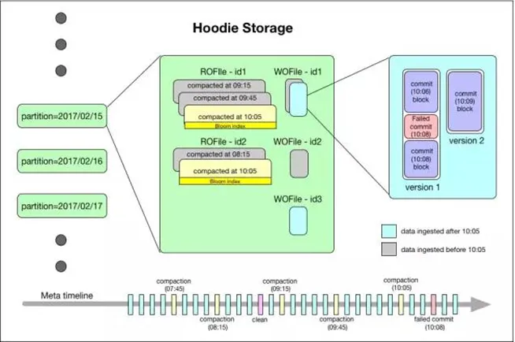

# 数据

## 数据

Hudi 以两种不同的存储格式存储所有摄取的数据，用户可选择满足下列条件的任意数据格式：

1. 读优化的列存格式（ROFormat）：缺省值为 Apache Parquet；
2. 写优化的行存格式（WOFormat）：缺省值为 Apache Avro；

## 数据存储

Hudi 数据集的组织目录结构与 Hive 表示非常相似，一份数据集对应这一个根目录。数据集被 **打散为多个分区，分区字段以文件夹形式存在，该文件夹包含该分区的所有文件**。

在根目录下，每个分区都有唯一的分区路径，每个分区数据存储在多个文件中。

每个文件都有唯一的 fileId 和生成文件的 commit 标识。如果发生更新操作时，多个文件共享相同的 fileId，但会有不同的 commit。