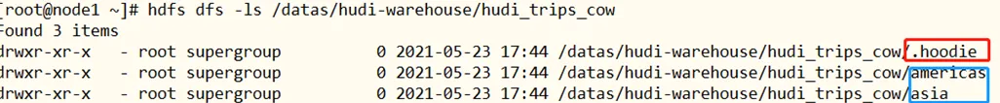
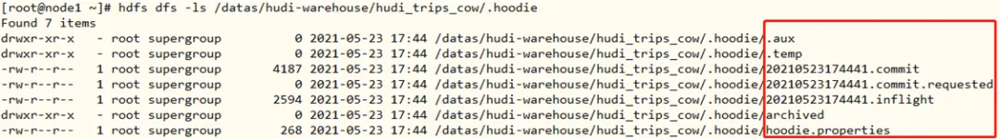
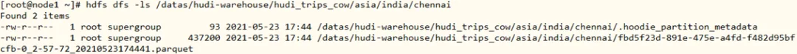

# Hudi 表数据结构

Hudi 表的数据文件，可以使用操作系统的文件系统存储，也可以使用 HDFS 这种分布式的文件系统存储。为了后续分析性能和数据的可靠性，一般使用 HDFS 进行存储。以 HDFS 存储来看，一个 Hudi 表的存储文件分为两类。

1. `.hoodie` 文件：由于 CRUD 的零散性，每一次的操作都会生成一个文件，这些小文件越来越多后，会严重影响 HDFS 的性能，Hudi 设计了一套文件合并机制。`.hoodie` 文件夹中存放了对应的 **文件合并操作** 相关的日志文件。
2. amricas 和 asia 相关的路径是实际的数据文件，按分区存储，分区的路径 key 是可以指定的。

## `.hoodie` 文件

Hudi 把随着时间流逝，对表的一系列 CRUD 操作叫做 Timeline，Timeline 中某一次的操作，叫做 Instant。

Hudi 的核心是维护 **Timeline** 在不同时间对表执行的所有操作，instant 这有助于提供表的即时视图，同时还有效地支持按到达顺序检索数据。Hudi Instant 由以下组件组成：

- Instant Action: 记录本次操作是一次操作类型 数据提交（COMMITS），还是文件合并（COMPACTION），或者是文件清理（CLEANS）；
- Instant Time，本次操作发生的时间，通常是时间戳（例如：20190117010349），它按照动作开始时间的顺序单调递增；
- lState，操作的状态，发起(REQUESTED)，进行中(INFLIGHT)，还是已完成(COMPLETED)；

`.hoodie` 文件夹中存放对应操作的状态记录：

## 数据文件

Hudi 真实的数据文件使用 Parquet 文件格式存储

其中包含一个 metadata 元数据文件和数据文件 parquet 列式存储。

Hudi 为了实现数据的 CRUD，需要能够唯一标识一条记录，Hudi 将把数据集中的 **唯一字段(record key) + 数据所在分区 (partitionPath)** 联合起来当做 **数据的唯一键**。