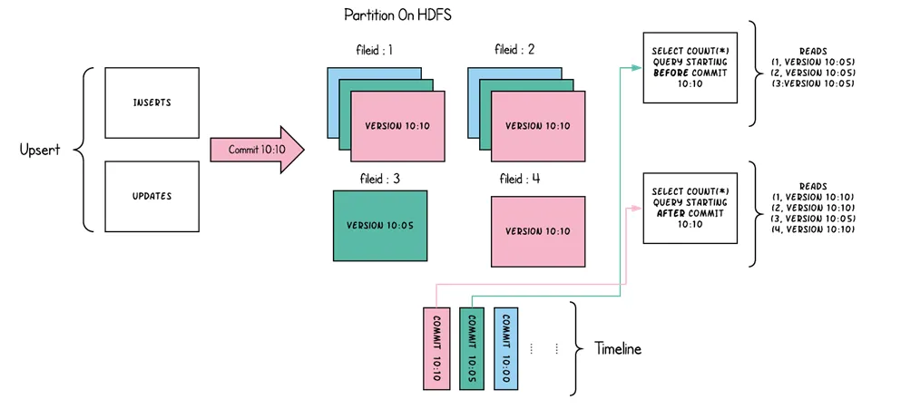
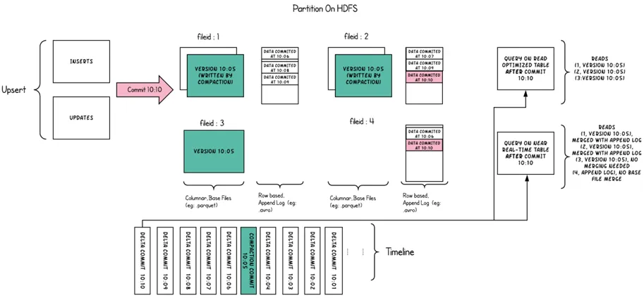
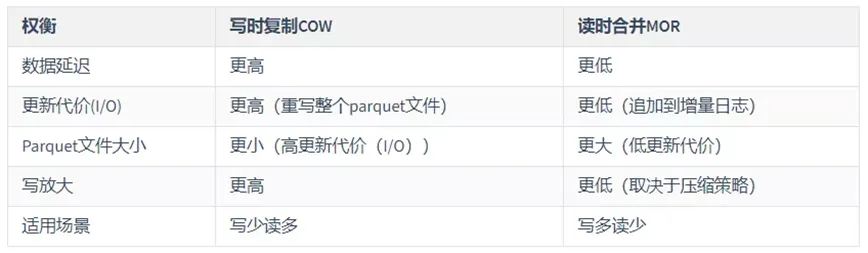

# Hudi 表类型

Hudi提供两类型表：**写时复制(Copy On Write,COW)表** 和 **读时合并(Merge On Read,MOR)表**。

- 对于 Copy-On-Write Table，用户的 update 会重写数据所在的文件，所以是一个写放大很高，但是读放大为 0，适合写少读多的场景。
- 对于 Merge-On-Read Table，整体的结构有点像 LSM-Tree，用户的写入先写入到 delta data 中，这部分数据使用行存，这部分 delta data 可以手动 merge 到存量文件中，整理为 parquet 的列存结构。

## Copy On Write (COW)

Copy On Write 简称 COW，顾名思义，它是在数据写入的时候，复制一份原来的拷贝，在其基础上添加新数据。

正在读数据的请求，读取的是最近的完整副本，这类似 MySQL 的 MVCC 的思想。

- 优点：读取时，只读取对应分区的一个数据文件即可，较为高效；
- 缺点：数据写入的时候，需要复制一个先前的副本再在其基础上生成新的数据文件，这个过程比较耗时

COW 表主要使用列式文件格式（Parquet）存储数据，在写入数据过程中，执行同步合并，更新数据版本并重写数据文件，类似RDBMS中的B-Tree更新。

- 更新：在更新记录时，Hudi 会先找到包含更新数据的文件，然后再使用更新值（最新的数据）重写该文件，包含其他记录的文件保持不变。当突然有大量写操作时会导致重写大量文件，从而导致极大的 I/O 开销。
- 读取：在读取数据时，通过读取最新的数据文件来获取最新的更新，此存储类型适用于少量写入和大量读取的场景

## Merge On Read (MOR)

Merge On Read 简称 MOR，新插入的数据存储在 delta log 中，定期再将 delta log 合并进 parquet 数据文件。

读取数据时，会将 delta log 跟老的数据文件做 merge，得到完整的数据返回。下图演示了MOR的两种数据读写方式:

- 优点：由于写入数据先写 delta log，且 delta log 较小，所以写入成本较低；
- 缺点：需要定期合并整理 compact，否则碎片文件较多。读取性能较差，因为需要将 delta log 和老数据文件合并；

MOR 表是 COW 表的升级版，它使用列式（parquet）与行式（avro）文件混合的方式存储数据。在更新记录时，类似NoSQL中的LSM-Tree更新。

- 更新：在更新记录时，仅更新到增量文件（Avro）中，然后进行异步（或同步）的 compaction，最后创建列式文件（parquet）的新版本。此存储类型适合频繁写的工作负载，因为新记录是以追加的模式写入增量文件中。
- 读取：在读取数据集时，需要先将增量文件与旧文件进行合并，然后生成列式文件成功后，再进行查询。

## COW VS MOR

