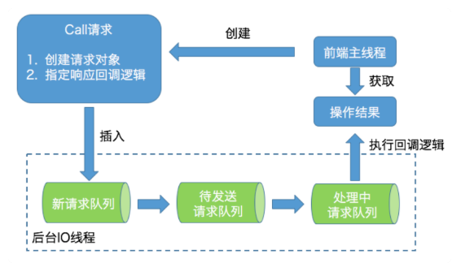

### 引入依赖

```xml
<dependency>
    <groupId>org.apache.kafka</groupId>
    <artifactId>kafka-clients</artifactId>
    <version>2.3.0</version>
</dependency>
```

### 功能

注：社区在不断的完善 AdminClient 的功能，所以需要实可关注不同版本的发布说明，看看是否有新的运维操作被加入进来。

在 2.3.0 版本中，AdminClient 提供的功能有 9 大类：

1. 主题管理：包括主题的创建、删除、查询
2. 权限管理：包括具体权限的配置与删除
3. 配置参数管理：包括 Kafka 各种资源的参数设置、详情查询。所谓的 Kafka 资源，主要有 Broker、主题、用户、Client-id 等
4. 副本日志管理：包括副本底层日志的路径的变更和详情查询
5. 分区管理：即创建额外的主题分区
6. 消息删除：即删除指定位移之前的分区信息
7. Delegation Token 管理：包括 Delegation Token 的创建、更新、过期和详情查询
8. 消费者组管理：包括消费者组的查询、位移查询和删除
9. Preferred 领导者选举：推选指定主题分区的 Preferred Broker 为领导者

### 工作原理

从设计上来看，AdminClient 是一个双线程的设计：前端主线程和后端 I/O 线程。前端线程负责将用户要执行的操作转换成对应的请求，然后再将请求发送到后端 I/O 线程的队列中；而后端 I/O 线程从队列中读取相应的请求，然后发觉送到对应的 Broker 节点上，之后执行结果保存起来，以便等待前端线程的获取。

AdminClient 在内部大量使用生产者-消费者模式将请求生成与处理解耦。它的工作原理大致如下图：



如图所示，前端主线程会创建名为 Call 的请求对象实例。该实例有两个主要的任务：

1. 构建对应的请求对象。比如，如果要创建主题，那么就创建 CreateTopicsRequest；如果查询消费者组位移，就创建 OffsetFetchRequest
2. 指定响应的回调逻辑。比如从 Broker 端接收到 CreateTopicsResponse 之后要执行的动作。

一旦创建好 Call 实例，前端主线程会将其放入到新请求队列（New Call Queue）中，此时前端主线程的任务就算完成了，它只需要等待结果返回即可。剩下的所有事情就都是后端 I/O 线程的工作了。就像上图所展示的那样，该线程使用了 3 个队列来承载不同时期的请求对象，它们分别是新请求队列、待发送请求队列和处理中请求队列。

> 为什么要使用 3 个队列呢？
>
> 原因是目前新请求队列的线程安全是由 Java 的 monitor 锁来保证的。**为了确保前端主线程不会因为 monitor 锁被阻塞，后端 I/O 线程会定期地将新请求队列中地所有 Call 实例全部搬移到待发送请求队列中进行处理**。

图中的待发送请求队列和处理中请求队列只由后端 I/O 线程处理，因此无需任何锁机制来保证线程安全

当 I/O 线程在处理某个请求时，它会显式地将该请求保存在处理中请求队列。一旦处理完成，I/O 线程会自动地调用 Call 对象中地回调逻辑完成最后地处理。把这些都做完之后，I/O 线程会通知前端主线程说结果已经准备完毕，这样前端主线程能够及时获取到执行操作地结果。

AdminClient 是使用 Java Object 对象地 wait 和 notify 实现地这种通知机制。

### 构造和销毁 AdminClient 实例

如果正确地引入了 `kafka-clients` 依赖，那么可以在编写 Java 程序时获取 AdminClient 对象。【注：该类的完整路径是 

`org.apache.kafka.clients.admin.AdminClient`，而不是 `kafka.admin.AdminClient`，后者是服务器端的 AdminClient，它已经不被推荐使用了】

创建 AdminClient 实例和创建 KafkaProducer 或 KafkaConsumer 实例的方法是类似的，需要手动构造一个 Properties 对象或 Map 对象，然后传给对应的方法。社区专门为 AdminClient 提供了几十种专属参数，详细见[官网]( http://kafka.apachecn.org/documentation.html#adminapi )。如果要销毁 AdminClient 实例，需要显式调用 AdminClient 的 close 方法。

示例：

```java
// AdminClient实例的创建与销毁
Properties props = new Properties();
props.put(AdminClientConfig.BOOTSTRAP_SERVERS_CONFIG, "kafka-host:port");
props.put("request.timeout.ms", 600000);

try (AdminClient client = AdminClient.create(props)) {
         // 执行你要做的操作……
}
```

### 常见的 AdminClient 应用实例

#### 创建主题

```java
String newTopicName = "test-topic";
try (AdminClient client = AdminClient.create(props)) {
    // NewTopic 构造主题的类，它接收主题名称、分区数和副本数三个字段
    NewTopic newTopic = new NewTopic(newTopicName, 10, (short) 3);
    CreateTopicsResult result = client.createTopics(Arrays.asList(newTopic));
    result.all().get(10, TimeUnit.SECONDS);
}
```

注：目前 AdminClient 各个方法的返回类型都是名为 `***Result` 的对象，这类对象会将结果以 Java Future 的形式封装起来，如果要获取运行结果，需要调用相应的方法来获取对应的 Future 对象，然后再调用相应的 get 方法来取得执行结果。

#### 查询消费者组位移

```java
String groupID = "test-group";
try (AdminClient client = AdminClient.create(props)) {
    // 获取指定消费者组的位移数据
    ListConsumerGroupOffsetsResult result = client.listConsumerGroupOffsets(groupID);
    // 返回展昭分区分组的位移数据，可以调用 OffsetAndMetadata 对象的 offset() 方法拿到实际的位移数据
    Map<TopicPartition, OffsetAndMetadata> offsets = 
        result.partitionsToOffsetAndMetadata().get(10, TimeUnit.SECONDS);
    System.out.println(offsets);
}
```

#### 获取 Broker 磁盘占用

```java
try (AdminClient client = AdminClient.create(props)) {
    // 获取指定 Broker 上所有分区主题的日志路径信息，然后把它们累积在一起，得出总的磁盘占用量
    DescribeLogDirsResult ret = client.describeLogDirs(Collections.singletonList(targetBrokerId)); // 指定 Broker id
    long size = 0L;
    for (Map<String, DescribeLogDirsResponse.LogDirInfo> logDirInfoMap : ret.all().get().values()) {
        size += logDirInfoMap.values().stream().map(logDirInfo -> logDirInfo.replicaInfos).flatMap(
            topicPartitionReplicaInfoMap ->
            topicPartitionReplicaInfoMap.values().stream().map(replicaInfo -> replicaInfo.size))
            .mapToLong(Long::longValue).sum();
    }
    System.out.println(size);
}
```


