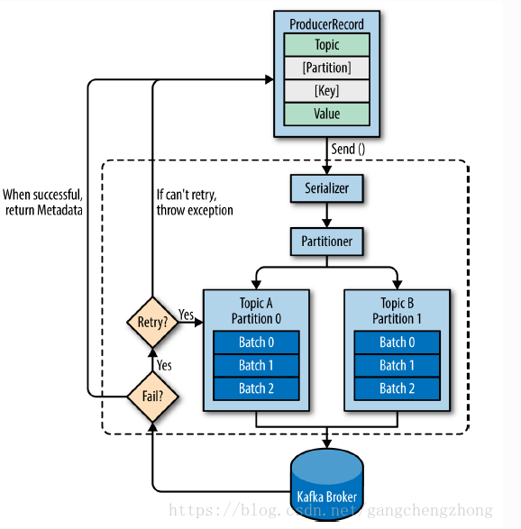

在 Kafka 系统中，**生产者**（Producer）创建消息。

一般情况下，一个消息会被发布到一个特定的主题上。生产者在默认情况下把消息均衡地分布到主题的所有分区上，而不关心特定消息会被写到哪个分区。不过，在某些情况下，生产者会把消息直接写到指定的分区，这通常是通过消息键和分区器来实现的，分区器为键生成一个散列值，并将其映射到指定的分区上，这样可以保证包含同一个键的消息会被写到同一个分区上。生产者可以使用自定义的分区器，根据不同的业务规则将消息映射到分区。

## 生产者客户端

### 概览

Producer API 发送消息的主要步骤：



1. 首先创建一个 ProducerRecord 对象，ProducerRecord 对象需要包含目标主题和要发送的内容，还可以指定键和分区。在发送 ProducerRecord 对象时，生产者要先把键和值对象序列化成字节数组，这样才能够在网络上传输
2. 接下来，数据被传给分区器。如果之前在 ProducerRecord 对象里指定了分区，那么分区器就不会再做任何事情，直接把指定的分区返回。如果没有指定分区，那么分区器会根据 ProducerRecord 对象的键来选择一个分区。选好分区后，生产者就知道该往哪个主题和分区发送这条记录了。紧接着，这条记录被添加到一个记录批次里，这个批次里的所有消息会被发送到相同的主题和分区上。有一个独立的线程负责把这些记录批次发送到相应的 broker 上
3. 服务器在收到这些消息时会返回一个响应。如果消息成功写入 Kafka，就返回一个 RecordMetaData 对象，它包含了主题和分区信息，以及记录在分区里的偏移量。如果写入失败，则会返回一个错误。生产者在收到错误之后会尝试重新发送消息，几次之后如果还是失败，就返回错误信息。

### 创建 Kafka 生产者

Kafka 生产者有 3 个必选的属性：

- `bootstrap.server`：该属性指定 broker 的地址清单，地址的格式为 `host:port`。清单里不需要包含所有的 broker 地址，生产者会从给定的 broker 里查找到其他 broker 的信息。不过建议至少要提供两个 broker 的信息，一旦其中一个宕机，生产者仍然能够连接到集群上。
- `key.serializer`：指定的类将键序列化。Kafka 客户端默认提供了 ByteArraySerializer、StringSerializer 和 IntegerSerizlizer;若需要自定义序列化器，则必须实现 `org.apache.kafka.common.serialization.Serializer` 接口。
- `value.serializer`：与`key.serializer`一样，指定的类将值序列化。

示例：【创建一个新的生产者，只指定了必要的属性，其他使用默认设置】

```java
Properties props = new Properties();
props.put("bootstrap.servers", "localhost:9092");
props.put("key.serializer", "org.apache.kafka.common.serialization.StringSerializer");
props.put("value.serializer", "org.apache.kafka.common.serialization.StringSerializer");

Producer<String, String> producer = new KafkaProducer<>(props);
```

实例化生产者对象后，就可以开始发送消息了。发送消息主要有以下 3 种方式：

- 发送并忘记（fire-and-forget）

  把消息发送给服务器，但并不关心它是否正常到达。大多数情况下，消息会正常到达，因为 Kafka 是高可用的，而且生产者会自动尝试重发。不过这种方式有时候也会丢失一些消息。

- 同步发送

  使用 `send()` 方法发送消息，它会返回一个 Future 对象，调用 `get()` 方法进行等待，就可以知道消息是否发送成功

- 异步发送

  调用 `send()` 方法，并指定一个回调函数，服务器在返回响应时调用该函数

### 发送消息到 Kafka

示例：【简单的消息发送】

```java
ProducerRecord<String,String> record = new ProducerRecord<>("CustomerCountry","Precision Products","France");
try{
    producer.send(record);
}catch(Exception e){
    e.printStackTrace();
}
```

#### 同步发送消息

```java
ProducerRecord<String,String> record = new ProducerRecord<>("CustomerCountry","Precision Products","France");
try{
    producer.send(record).get();
}catch(Exception e){
    e.printStackTrace();
}
```

同步发送消息，在调用 `send()` 方法后获取一个 Future 对象，然后调用 Future 对象的 `get()` 方法等待 Kafka 响应。

#### 异步发送消息

```java
ProducerRecord<String,String> record = new ProducerRecord<>("CustomerCountry","Precision Products","France");
producer.send(record, new Callback()
            {
                @Override
                public void onCompletion(RecordMetadata recordMetadata, Exception e) {
                    if (null != e) {
                        e.printStackTrace();
                    }
                    else {
                        System.out.println("The offset of the record we just sent is:" + recordMetadata.offset());
                    }
                }
            });
```

为了在异步发送消息的同时能够对异常情况进行处理，生产者提供了回调支持。

### 生产者的配置

[Producer配置](Kafka/Kafka配置/Producer配置.md) 

生产者有很多可配置的参数，在 Kafka 文档里都有说明，它们大部分都有合理的默认值，所以一般不需要修改它们。不过有几个参数在内存使用、性能和可靠性方面对生产者影响比较大，如下所示：

- `acks`

  > 指定了必须要有多少个分区副本收到消息，生产者才会认为消息写入是成功的。

- `buffer.memory`

  > 该参数用来设置生产者内存缓冲区的大小，生产者用它缓冲要发送到服务器的消息。如果应用程序发送消息的速度超过发送到服务器的速度，会导致生产者空间不足。这个时候，`send()` 方法调用要么阻塞，要么抛出异常，取决于如何设置 ~~`block.on.buffer.full`~~ 参数（在 0.9.0.0 版本里被替换成了 `max.block.ms`，表示在抛出异常之前可以阻塞一段时间）

- `compression.type`

- `retries`

  > 生产者从服务器收到的错误有可能是临时性的错误（比如分区找不到首领）。在这种情况下，retries 参数的值决定了生产者可以重发消息的次数，如果达到这个次数，生产者会放弃重试并返回错误。

- `batch.size`

  > 当有多个消息需要被发送到同一个分区时，生产者会把它们放在同一个批次里。该参数指定了一个批次可以使用的内存大小，按照字节数计算（而不是消息的个数）。当批次被填满，批次里的所有消息会被发送出去。不过生产者并不一定都会等到批次被填满才发送，半满的批次，甚至只包含一个消息的批次也有可能被发送。所以就算把批次大小设置的很大，也不会造成延迟，只是会占用更多的内存而已。但如果设置的太小，因为生产者需要更加频繁地发送消息，会增加一些额外地开销。

- `linger.ms`

  > 该参数指定了生产者在发送批次之前等待更多消息加入批次地时间。KafkaProducer 会在批次填满或 `linger.ms` 达到上限时把批次发送出去。默认情况下，只要有可用地线程，生产者就会把消息发送出去，就算批次里只有一个消息。把 `linger.ms` 设置成比 0 大的数，让生产者在发送批次之前等待一会儿，使更多的消息加入到这个批次。虽然这样会增加延迟，但也会提升吞吐量（因为一次性发送更多的消息，每个消息的开销变小了）

- `client.id`

  > 该参数可以是任意的字符串，服务器会用它来识别消息的来源，还可以用在日志和配额指标里

- `max.in.flight.requests.per.connection`

- `timeout.ms`、`request.timeout.ms`和`metadata.fetch.timeout.ms`

- `max.block.ms`

- `max.request.size`

- `receive.buffer.bytes`和`send.buffer.bytes`

### 序列化

[TODO]

### 分区

Kafka 的消息是一个个键值对，ProducerRecord 对象可以只包含目标主题和值，键可以设置为默认的 null，不过大多数应用程序会用到键。键有两个用途：**可以作为消息的附加信息，也可以用来决定消息该被写到主题的哪个分区**。**拥有相同键的消息将被写到同一个分区**；也就是说，如果一个进程只从一个主题的分区读取数据，那么具有相同键的所有记录都会被该进程读取。

如果键值为null，并且使用了默认的分区器，那么记录将被随机地发送到主题内各个可用地分区上。分区器使用轮询（Round Robin）算法将小欧希均衡地分布到各个分区上。如果键值不为null，并且使用了默认的分区器，那么 Kafka 会对键进行散列（使用 Kafka 自己地散列算法，即使升级 Java 版本，散列值也不会发生变化），然后根据散列值把消息映射到特定地分区上。

