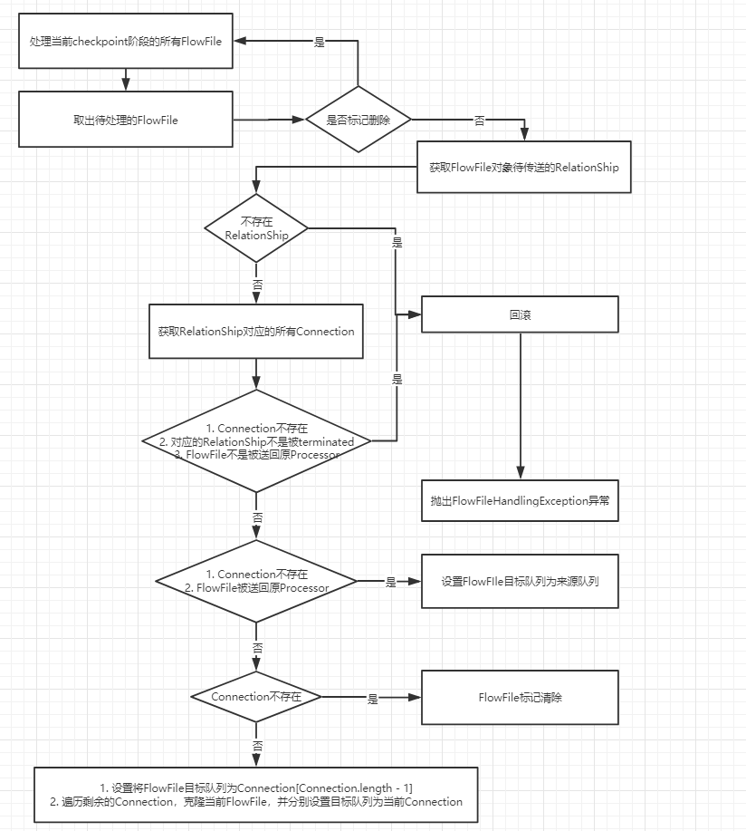
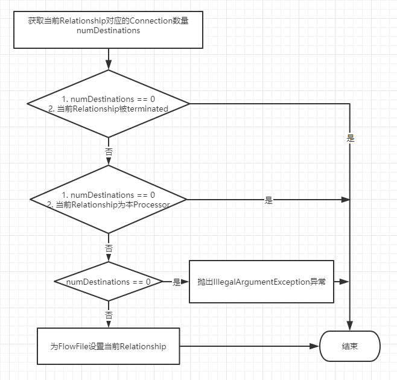

# StandardProcessSession关键问题解析

我们主要剖析StandardProcessSession类中commit、rollback、transfer三个重要过程。

## commit过程

### 第一步：检查当前task所在线程是否被terminated，如果terminated则rollback

### 第二步：生成当前状态的checkpoint

- 将FlowFile的content物化到ContentRepository，并关闭所有的Stream。

- 处理本次ProcessSession持有的FlowFile对象集合，为每个合法的FlowFile对象**设置**目标Connection，由于某个Relationship可能对应下游多个Processor，所以会出现FlowFile复制的场景。



``` Java
        // validate that all records have a transfer relationship for them and if so determine the destination node and clone as necessary
        final Map<Long, StandardRepositoryRecord> toAdd = new HashMap<>();
        for (final StandardRepositoryRecord record : records.values()) {
            if (record.isMarkedForDelete()) {
                continue;
            }
            final Relationship relationship = record.getTransferRelationship();
            if (relationship == null) {
                rollback();
                throw new FlowFileHandlingException(record.getCurrent() + " transfer relationship not specified");
            }
            final List<Connection> destinations = new ArrayList<>(context.getConnections(relationship));
            if (destinations.isEmpty() && !context.getConnectable().isAutoTerminated(relationship)) {
                if (relationship != Relationship.SELF) {
                    rollback();
                    throw new FlowFileHandlingException(relationship + " does not have any destinations for " + context.getConnectable());
                }
            }

            if (destinations.isEmpty() && relationship == Relationship.SELF) {
                record.setDestination(record.getOriginalQueue());
            } else if (destinations.isEmpty()) {
                record.markForDelete();

                if (autoTerminatedEvents == null) {
                    autoTerminatedEvents = new ArrayList<>();
                }

                final ProvenanceEventRecord dropEvent;
                try {
                    dropEvent = provenanceReporter.generateDropEvent(record.getCurrent(), "Auto-Terminated by " + relationship.getName() + " Relationship");
                    autoTerminatedEvents.add(dropEvent);
                } catch (final Exception e) {
                    LOG.warn("Unable to generate Provenance Event for {} on behalf of {} due to {}", record.getCurrent(), connectableDescription, e);
                    if (LOG.isDebugEnabled()) {
                        LOG.warn("", e);
                    }
                }
            } else {
                final Connection finalDestination = destinations.remove(destinations.size() - 1); // remove last element
                record.setDestination(finalDestination.getFlowFileQueue());
                incrementConnectionInputCounts(finalDestination, record);

                for (final Connection destination : destinations) { // iterate over remaining destinations and "clone" as needed
                    incrementConnectionInputCounts(destination, record);
                    final FlowFileRecord currRec = record.getCurrent();
                    final StandardFlowFileRecord.Builder builder = new StandardFlowFileRecord.Builder().fromFlowFile(currRec);
                    builder.id(context.getNextFlowFileSequence());

                    final String newUuid = UUID.randomUUID().toString();
                    builder.addAttribute(CoreAttributes.UUID.key(), newUuid);

                    final FlowFileRecord clone = builder.build();
                    final StandardRepositoryRecord newRecord = new StandardRepositoryRecord(destination.getFlowFileQueue());
                    provenanceReporter.clone(currRec, clone, false);

                    final ContentClaim claim = clone.getContentClaim();
                    if (claim != null) {
                        context.getContentRepository().incrementClaimaintCount(claim);
                    }
                    newRecord.setWorking(clone, Collections.<String, String> emptyMap());

                    newRecord.setDestination(destination.getFlowFileQueue());
                    newRecord.setTransferRelationship(record.getTransferRelationship());
                    // put the mapping into toAdd because adding to records now will cause a ConcurrentModificationException
                    toAdd.put(clone.getId(), newRecord);

                    createdFlowFiles.add(newUuid);
                }
            }
        }
```

- 记录以下信息：

> 本次处理时间

> FlowFile事件

> 生成、销毁的FlowFile的UUID

> 销毁的FlowFile个数、大小

> 读/写FlowFile对应的文件字节数

> 交换的FlowFile个数、大小

### 第三步：commit当前checkpoint

- 更新FlowFileRepository，将FlowFile**真正**放入到对应的Connection中，并记录相关处理时间等信息。

``` Java
            // Update the FlowFile Repository
            try {
                final Collection<StandardRepositoryRecord> repoRecords = checkpoint.records.values();
                context.getFlowFileRepository().updateRepository((Collection) repoRecords);
            } catch (final IOException ioe) {
                // if we fail to commit the session, we need to roll back
                // the checkpoints as well because none of the checkpoints
                // were ever committed.
                rollback(false, true);
                throw new ProcessException("FlowFile Repository failed to update", ioe);
            }

            // transfer the flowfiles to the connections' queues.
            final Map<FlowFileQueue, Collection<FlowFileRecord>> recordMap = new HashMap<>();
            for (final StandardRepositoryRecord record : checkpoint.records.values()) {
                if (record.isMarkedForAbort() || record.isMarkedForDelete()) {
                    continue; // these don't need to be transferred
                }
                // record.getCurrent() will return null if this record was created in this session --
                // in this case, we just ignore it, and it will be cleaned up by clearing the records map.
                if (record.getCurrent() != null) {
                    Collection<FlowFileRecord> collection = recordMap.get(record.getDestination());
                    if (collection == null) {
                        collection = new ArrayList<>();
                        recordMap.put(record.getDestination(), collection);
                    }
                    collection.add(record.getCurrent());
                }
            }

            for (final Map.Entry<FlowFileQueue, Collection<FlowFileRecord>> entry : recordMap.entrySet()) {
                entry.getKey().putAll(entry.getValue()); // 将FlowFile对象放入到目标Connection中
            }

    ## org.apache.nifi.controller.queue.StandardFlowFileQueue
        @Override
        public void putAll(final Collection<FlowFileRecord> files) {
            queue.putAll(files);
    
            eventListener.triggerDestinationEvent();
        }
    
    ## org.apache.nifi.controller.queue.SwappablePriorityQueue
        public void putAll(final Collection<FlowFileRecord> flowFiles) {
            final int numFiles = flowFiles.size();
            long bytes = 0L;
            for (final FlowFile flowFile : flowFiles) {
                bytes += flowFile.getSize();
            }
    
            writeLock.lock();
            try {
                if (swapMode || activeQueue.size() >= swapThreshold - numFiles) {
                    swapQueue.addAll(flowFiles);
                    incrementSwapQueueSize(numFiles, bytes, 0);
                    swapMode = true;
                    writeSwapFilesIfNecessary();
                } else {
                    incrementActiveQueueSize(numFiles, bytes);
                    activeQueue.addAll(flowFiles);
                }
    
                logger.trace("{} put to {}", flowFiles, this);
            } finally {
                writeLock.unlock("putAll");
            }
        }
```

## rollback过程

### 第一步：清空资源，包括清空待删除文件队列、关闭所有输入输出流、重置FlowFile content的写缓存。

### 第二步：回滚FlowFile已修改的content

    ```Java
        @Override
        public void rollback() {
            rollback(false);
        }
    
        @Override
        public void rollback(final boolean penalize) {
            rollback(penalize, false);
            verifyTaskActive();
        }
    
        private synchronized void rollback(final boolean penalize, final boolean rollbackCheckpoint) {
            ...
            for (final StandardRepositoryRecord record : recordsToHandle) {
                // remove the working claims if they are different than the originals.
                removeTemporaryClaim(record);
            }
            ...
        }
    
        /**
         * Checks if the ContentClaim associated with this record should be removed,
         * since the record is about to be updated to point to a new content claim.
         * If so, removes the working claim.
         *
         * This happens if & only if the content of this FlowFile has been modified
         * since it was last committed to the FlowFile repository, because this
         * indicates that the content is no longer needed and should be cleaned up.
         *
         * @param record record
         */
        private void removeTemporaryClaim(final StandardRepositoryRecord record) {
            final boolean contentModified = record.getWorkingClaim() != null && record.getWorkingClaim() != record.getOriginalClaim();
    
            // If the working claim is not the same as the original claim, we have modified the content of
            // the FlowFile, and we need to remove the newly created content (the working claim). However, if
            // they are the same, we cannot just remove the claim because record.getWorkingClaim() will return
            // the original claim if the record is "working" but the content has not been modified
            // (e.g., in the case of attributes only were updated)
            //
            // In other words:
            // If we modify the attributes of a FlowFile, and then we call record.getWorkingClaim(), this will
            // return the same claim as record.getOriginalClaim(). So we cannot just remove the working claim because
            // that may decrement the original claim (because the 2 claims are the same), and that's NOT what we want to do
            // because we will do that later, in the session.commit() and that would result in decrementing the count for
            // the original claim twice.
            if (contentModified) {
                // In this case, it's ok to decrement the claimant count for the content because we know that the working claim is going to be
                // updated and the given working claim is referenced only by FlowFiles in this session (because it's the Working Claim).
                // Therefore, we need to decrement the claimant count, and since the Working Claim is being changed, that means that
                // the Working Claim is a transient claim (the content need not be persisted because no FlowFile refers to it). We cannot simply
                // remove the content because there may be other FlowFiles that reference the same Resource Claim. Marking the Content Claim as
                // transient, though, will result in the FlowFile Repository cleaning up as appropriate.
                context.getContentRepository().decrementClaimantCount(record.getWorkingClaim());
                record.addTransientClaim(record.getWorkingClaim());
            }
        }    
    ```

### 第三步：将content-missing类的FlowFile对象重新加入到FlowFileRepository中；将待传输到其他RelationShip中的FlowFile对象放回到原始输入队列中；清理当前checkkpoint阶段生成的临时content。

``` Java
        final Set<RepositoryRecord> abortedRecords = new HashSet<>();
        final Set<StandardRepositoryRecord> transferRecords = new HashSet<>();
        for (final StandardRepositoryRecord record : recordsToHandle) {
            if (record.isMarkedForAbort()) {
                decrementClaimCount(record.getWorkingClaim());
                abortedRecords.add(record);
            } else {
                transferRecords.add(record);
            }
        }

        // Put the FlowFiles that are not marked for abort back to their original queues
        for (final StandardRepositoryRecord record : transferRecords) {
            if (record.getOriginal() != null) {
                final FlowFileQueue originalQueue = record.getOriginalQueue();
                if (originalQueue != null) {
                    if (penalize) {
                        final long expirationEpochMillis = System.currentTimeMillis() + context.getConnectable().getPenalizationPeriod(TimeUnit.MILLISECONDS);
                        final FlowFileRecord newFile = new StandardFlowFileRecord.Builder().fromFlowFile(record.getOriginal()).penaltyExpirationTime(expirationEpochMillis).build();
                        originalQueue.put(newFile);
                    } else {
                        originalQueue.put(record.getOriginal());
                    }
                }
            }
        }

        if (!abortedRecords.isEmpty()) {
            try {
                context.getFlowFileRepository().updateRepository(abortedRecords);
            } catch (final IOException ioe) {
                LOG.error("Unable to update FlowFile repository for aborted records due to {}", ioe.toString());
                if (LOG.isDebugEnabled()) {
                    LOG.error("", ioe);
                }
            }
        }

        // If we have transient claims that need to be cleaned up, do so.
        final List<ContentClaim> transientClaims = recordsToHandle.stream()
            .flatMap(record -> record.getTransientClaims().stream())
            .collect(Collectors.toList());

        if (!transientClaims.isEmpty()) {
            final RepositoryRecord repoRecord = new TransientClaimRepositoryRecord(transientClaims);
            try {
                context.getFlowFileRepository().updateRepository(Collections.singletonList(repoRecord));
            } catch (final IOException ioe) {
                LOG.error("Unable to update FlowFile repository to cleanup transient claims due to {}", ioe.toString());
                if (LOG.isDebugEnabled()) {
                    LOG.error("", ioe);
                }
            }
        }
```

### 第四步：更新FlowFileEventRepository

``` Java
        final Connectable connectable = context.getConnectable();
        final StandardFlowFileEvent flowFileEvent = new StandardFlowFileEvent();
        flowFileEvent.setBytesRead(bytesRead);
        flowFileEvent.setBytesWritten(bytesWritten);
        flowFileEvent.setCounters(immediateCounters);

        // update event repository
        try {
            context.getFlowFileEventRepository().updateRepository(flowFileEvent, connectable.getIdentifier());
        } catch (final Exception e) {
            LOG.error("Failed to update FlowFileEvent Repository due to " + e);
            if (LOG.isDebugEnabled()) {
                LOG.error("", e);
            }
        }
```

## transfer过程

### 第一步：检查当前task所在线程是否被terminated以及待transfer的FlowFile状态是否正确

### 第二步：根据当前FlowFile待转移的RelationShip的情况，决定FlowFile的Relationship：不存在 or 待transfer的RelationShip or 抛出异常。所以，transfer动作只是为合法的FlowFile设置对应的Relationship，真正转移在commit阶段。



    ```Java
            final int numDestinations = context.getConnections(relationship).size();
            final int multiplier = Math.max(1, numDestinations);
    
            boolean autoTerminated = false;
            boolean selfRelationship = false;
            if (numDestinations == 0 && context.getConnectable().isAutoTerminated(relationship)) {
                // auto terminated.
                autoTerminated = true;
            } else if (numDestinations == 0 && relationship == Relationship.SELF) {
                selfRelationship = true;
            } else if (numDestinations == 0) {
                // the relationship specified is not known in this session/context
                throw new IllegalArgumentException("Relationship '" + relationship.getName() + "' is not known");
            }
            final StandardRepositoryRecord record = getRecord(flowFile);
            record.setTransferRelationship(relationship);
            updateLastQueuedDate(record);
    ```

### 第三步：更新统计信息