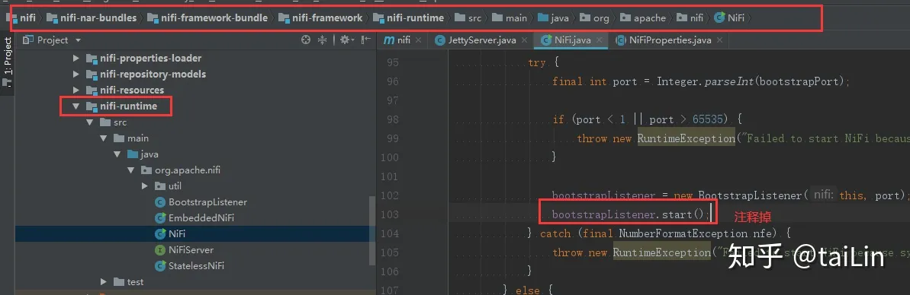

# 开发调试

## 本地调试[未通过]

1. 下载源码，导入到 IDEA
2. 注释 `NiFi.java` 部分代码：




3. 编译整个工程，进入 `nifi-assembly`，获取 bin lib conf docs extensions 所在路径
4. idea 添加启动类，配置如下：

```
-Xmx512m -Xms512m -Djavax.security.auth.useSubjectCredsOnly=true -Djava.security.egd=file:/dev/urandom -Dsun.net.http.allowRestrictedHeaders=true -Djava.net.preferIPv4Stack=true -Djava.awt.headless=true -Djava.protocol.handler.pkgs=sun.net.www.protocol -Dzookeeper.admin.enableServer=false -Dnifi.properties.file.path=E:\source\nifi-http\nifi\conf\nifi.properties -Dnifi.bootstrap.listen.port=61884 -Dapp=NiFi -Dorg.apache.nifi.bootstrap.config.log.dir=E:\source\nifi-http\nifi\logs
```


## 远程调试

修改 NiFi 主目录 `/conf/bootstrap.conf` 配置文件，打开如下配置：

```conf

# Enable Remote Debugging
java.arg.debug=-agentlib:jdwp=transport=dt_socket,server=y,suspend=n,address=8000
```

> address 表示远程调试端口，可以自行指定。

**IDEA 配置远程调试模式**

选择 `Remote JVM Debug`，进行如下配置：

