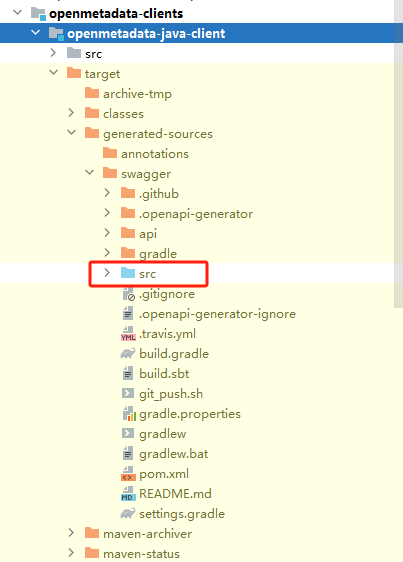

# 开发环境配置

**下载源码且进入源码目录**

```shell
git clone https://github.com/open-metadata/OpenMetadata
cd openmetadata
```

## Ingestion Framework

### 创建 Python 虚拟环境

```shell
python3 -m venv env

# Windows
## cmd
## env/Script/activate.bat
## PowerShell
.\env\Scripts\Activate.ps1
# Linux
source env/bin/activate
```

### 执行生成代码

#### Ingestion

> 前提：
> 
> 创建生成代码文件夹：`mkdir -p ingestion/src/metadata/generated`
>
> 重新生成代码需要删除已有文件夹再新建文件夹：`rm -rf ingestion/src/metadata/generated`

**1. `datamodel_generation.py`**

```sh
# 安装依赖包
pip install datamodel-code-generator==0.22.0
# 执行生成代码
python scripts/datamodel_generation.py
```

**2. py_antlr**

> 前提：`antlr4` 已安装部署到环境中
>
> antlr4 下载地址：<https://www.antlr.org/download/antlr-4.9.2-complete.jar>

```
java -jar /d/soft/antlr4/antlr-4.9.2-complete.jar -Dlanguage=Python3 -o ingestion/src/metadata/generated/antlr ./openmetadata-spec/src/main/antlr4/org/openmetadata/schema/*.g4
```

<!--
### 安装包

```shell
# Windows
python -m pip install "ingestion[dev]/"

# Linux
make install_dev
```

### 执行生成代码

**Windows**

```shell
# 需提前创建空文件夹 ingestion/src/metadata/generated
python scripts/datamodel_generation.py

java -jar /d/soft/antlr4/antlr-4.9.2-complete.jar -Dlanguage=Python3 -o ingestion/src/metadata/generated/antlr ./openmetadata-spec/src/main/antlr4/org/openmetadata/schema/*.g4

python -m pip install ingestion/
```

**Linux**

```shell
make generate
```
-->

### 安装

```sh
pip install -e ".[dev]" 
```

## 前端开发环境

> 使用 nvm 创建 nodejs 环境，当前开发环境配置使用 `nodejs==18.0.0`
>
> nvm 地址：<https://github.com/coreybutler/nvm-windows>

```shell
nvm install 18.0.0
npm i yarn -g
```

**注意**：需要使用 `yarn>=3.0.0` 以上版本，不然编译不通过

### 执行生成代码

> 前提：`antlr4` 已安装部署到环境中
>
> antlr4 下载地址：<https://www.antlr.org/download/antlr-4.9.2-complete.jar>

**从 Json Schema 生成 TypeScript 类型代码**

```shell
# 进入如下目录下：
cd openmetadata-ui/src/main/resources/ui/

yarn run json2ts
antlr4 -Dlanguage=JavaScript -o openmetadata-ui/src/main/resources/ui/src/generated/antlr ${PWD}/openmetadata-spec/src/main/antlr4/org/openmetadata/schema/*.g4
node parseConnectionSchema && rm -rf connTemp
```

> Windows系统下，生成代码会缺失，造成编译失败，待修复

**暂时解决方案**

在 Linux 环境下执行生成代码，将生成的代码拷贝到 Windows 环境下，生成代码所在路径 `generated` 和 `jsons`。【备注：借助 WSL 来生成，该方案待验证！！！】

## OpenMetadata Server：后端开发环境

**配置 JDK 版本**

不同版本使用的 JDK 版本是不同的：

- `1.1.x`: JDK11
- `1.2.0`: JDK17

**执行编译**

```shell
# openmetadata[platform]
mvn clean install -DskipTests

# 也可每一个模块进行执行，但需要了解模块的依赖关系
## 对于父模块单独打包使用如下命令
mvn clean install -N
```

**注意**

1. openmetadata server 使用了生成代码插件，需要先对工程执行编译，但 idea 默认是对 target 目录的代码是进行排除的，需要将 `target/generated-source` 设置为 `Generated Source Root` 目录，如下图所示：


<!--
**备注**

Windows 环境下，执行到 `openmetadata-ui` 直接执行会报错，需要将 `package.json` 中的 `"postinstall": "yarn run build-check",` 删除，并在 `pom.xml` 中对 yarn 更新到 yarn3，在 `frontend-maven-plugin` 插件中添加如下执行步骤：

```xml
<execution>
    <id>yarn upgrade</id>
    <goals>
        <goal>yarn</goal>
    </goals>
    <phase>prepare-package</phase>
    <configuration>
        <arguments>set version stable</arguments>
    </configuration>
</execution>
```
-->

## OpenMetadata Client：客户端

**FAQ**

1. 需先对工程执行编译 `mvn compile` 来自动生成代码，将 `target/generated-source/swagger/src` 目录设置为 `Generated Source Root`，这样可解决 Idea 依赖的类找不到的问题：



