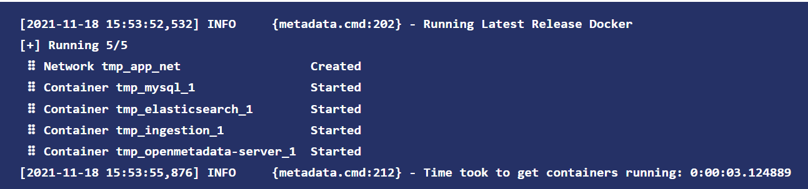

# 元数据管理选型对比

|              | 数据血缘 | 支持数据源 |
|--------------|:--------:|------------|
| DataHub      |    √     |            |
| OpenMetaData |          |            |

## 启动容器情况

### OpenMetaData

