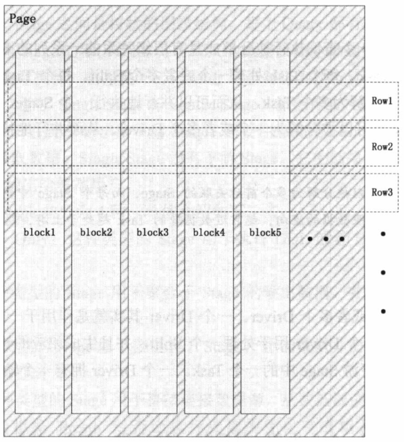
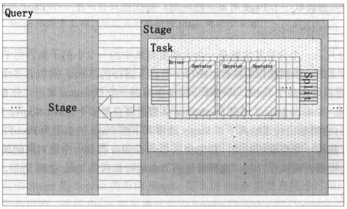
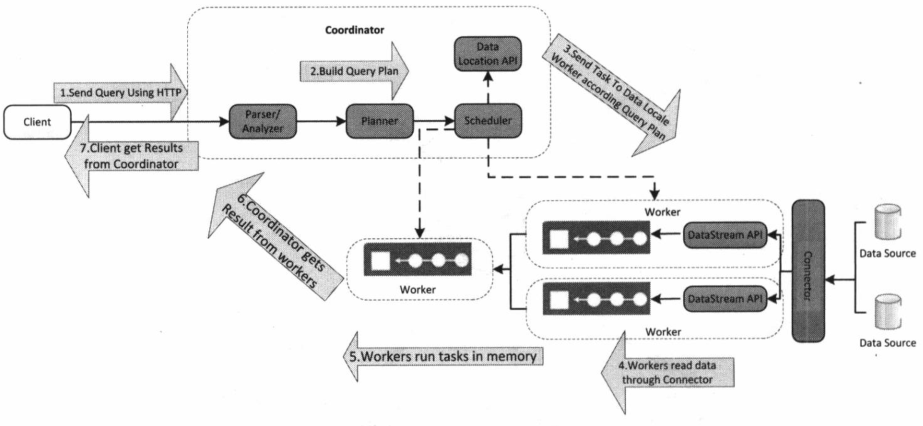

# Presto

## 简介

Apache Presto 是一个分布式并行查询执行引擎，针对低延迟和交互式查询分析进行了优化。 Presto 可以轻松运行查询，甚至无需停机就能从 GB 级(千兆字节)扩展到 PB 级(千万亿字节)。

单个 Presto 查询可以处理来自多个来源的数据，如 HDFS，MySQL，Cassandra，Hive 等。 Presto 采用 Java 构建，容易与其他数据基础架构组件集成。 Presto 功能强大，因此 Airbnb，DropBox，Groupon 和 Netflix 等行业领先的公司正在采用它。

## 概念

### Presto 服务进程

Presto 集群中一共有两种服务器进程：Coordinator 服务进程和 Worker 服务进程，其中 Coordinator 服务进程的主要作用是：*接收查询请求*、*解析查询语句*、*生成查询执行计划*、*任务调度*和 *Worker 管理*；Worker 服务进程则执行被分解后的查询执行任务：*Task*。

#### Coordinator

Coordinator 服务进程部署于集群中一个单独的节点上，是整个 Presto 集群的管理节点。Coordinator 服务进程主要用于接收客户端提交的查询，查询语句解析，生成查询执行计划、Stage 和 Task 并对生成的 Task 进行调度。除此之外，Coordinator 还对集群中的所有 Worker 进行管理。Coordinator 进程是整个 Presto 集群的 Master 进程，该进程既与 Worker 进行通信从而获得最新的 Worker 信息，又与 Client 进行通信，从而接受查询请求，而所有的这些工作都是通过 Coordinator 上的 StatementResource 类提供的 RESTful 服务来完成的。

#### Worker

在 Presto 集群中，存在一个 Coordinator 节点和多个 Worker 节点。Coordinator 节点是管理节点，而 Worker 节点就是工作节点。在每个 Worker 节点上都会存在一个 Worker 服务进程，该服务进程主要进行数据的处理以及 Task 的执行。Worker 服务进程每隔一定时间都会向 Coordinator 上的 RESTful 服务发送心跳，从而告知 Coordinator 当前的 Worker 节点是存活的，并接受 Coordinator 的调度。

当客户端提交一个查询的时候，Coordinator 则会从当前存活的 Worker 列表中选择出合适的 Worker 节点去运行 Task。而 Worker 在执行每个 Task 的时候又会进一步对当前 Task 读入的每个 Spit 进行一系列的操作和处理。

### Presto 模型

#### Connector

Presto 支持多种 Connector 来访问多种不同的数据源。

#### Catalog

Presto 中的 Catalog 类似于 MySQL  中的一个数据库实例。

#### Schema

Presto 中的 Schema 类似于 MySQL 中的一个 Database。

#### Table

Presto 中的 Table 与传统数据库中的 Table 的含义是一样的。

### Presto 查询执行模型

Presto 在执行 SQL 语句时，将这些 SQL 语句解析为相应的查询，并在分布式集群中执行这些查询。

#### Statement

Statement 语句就是用户输入的 SQL 语句。Presto 支持符合 ANSI 标准的 SQL 语句。这种语句由子句（Cause）、表达式（Expression）和断言（Predicate）组成。

在 Presto 中将语句（Statement）和查询（Query）的概念是分开的，因为在 Presto 中，语句指的是终端用户输入的用文字表示的 SQL 语句；当 Presto 执行输入的 SQL 语句时，会根据 SQL 语句生成查询执行计划，进而生成可以执行的查询（Query），而查询代表的是分布到所有的 Worker 之间执行的实际查询操作。

#### Query

Query 即查询执行。当 Presto 接收一个 SQL 语句并执行时，会解析该 SQL 语句，将其转变成一个查询执行和相关的查询执行计划。一个查询执行代表可以在 Presto 集群中运行的查询，是由运行在各个 Worker 上且各自之间相互关联的阶段（Stage）组成的。

查询执行是为了完成 SQL 语句所表述的查询而实例化的配置信息、组件、查询执行计划和优化信息等。一个查询执行由 Stage、Task、Driver、Split、Operator 和 DataSource 组成。这些组件之间通过内部联系共同组成了一个查询执行，从而得到 SQL 语句表述的查询，并得到相应的结果集。

#### Stage

Stage 即查询执行阶段。当 Presto 运行 Query 时，Presto 会将一个 Query 拆分成具有层级关系的多个 Stage，一个 Stage 就代表查询执行计划的一部分。

通常情况下，Stage 之间是树状的层级结构。每个 Query 都有一个 Root Stage。该 Stage 用于聚集所有其他 Stage 的输出数据，并将最终的数据反馈给终端用户。

注意：Stage 并不会在集群中实际执行，它只是 Coordinator 用于对查询执行计划进行管理和建模的逻辑概念。每个 Stage（除了 Single Stage 和 Source Stage）都会有输入和输出，都从上游 Stage 读取数据，然后将产生结果输出给下游 Stage 。Source Stage 没有上游 Stage，它从 Connector 获取数据。Single Stage 没有下游 Stage，它的结果直接输出给 Coordinator ，并由 Coordinator 输出给终端用户。

Presto 中的 Stage 共分为 4 种，具体介绍如下：

| Stage 类型       | 描述                                                                                                                                                                    |
| ---------------- | ----------------------------------------------------------------------------------------------------------------------------------------------------------------------- |
| Coordinator_Only | 这种类型的 Stage 用于执行 DDL 或者 DML 语句中最终的表结构创建或者更改                                                                                                   |
| Single           | 这种类型的 Stage 用于聚合子 Stage 的输出数据，并将最终数据输出给终端用户                                                                                                |
| Fixed            | 这种类型的 Stage 用于接受其子 Stage 产生的数据并在集群中对这些数据进行分布式的聚合或者分组计算                                                                          |
| Source           | 这种类型的 Stage 用于直接连接数据源，从数据源读取数据，在读取数据的时候，该阶段也会根据 Presto 对查询执行计划的优化完成相关的断言下发（Predicate PushDown）和条件过滤等 |

#### Exchange

Presto 的 Stage 是通过 Exchange 来连接另一个 Stage 的。Exchange 用于完成有上下游关系的 Stage 之间的数据交换。在 Presto 中有两种 Exchange：Output Buffer 和 Exchange Client。生产数据的 Stage 通过名为 Output Buffer 的 Exchange 将数据传送给其下游的 Stage 。消费数据的 Stage 通过名为 Exchange Client 的 Exchange 从上游 Stage 读取数据。

#### Task

Stage 在逻辑上又被分为一系列的 Task，这些 Task 则是需要实际运行在 Presto 的各个 Worker 节点上的。

在 Presto 集群中，一个查询执行被分解成具有层次关系的一系列的 Stage，一个 Stage 又被拆分为一系列的 Task。每个 Task 处理一个或者多个 Split。每个 Task 都有对应的输入和输出。一个 Stage 被分解为多个 Task，从而可以并行地执行一个 Stage。Task 也采用了相同的机制：一个 Task 也可以被分解为一个或者多个 Driver，从而并行地执行一个 Task。

#### Driver

一个 Task 包含一个或者多个 Driver。一个 Driver 其实就是作用于一个 Split 的一系列 Operator 的集合。因此一个 Driver 用于处理一个 Split，并且生成相应的输出，这些输出由 Task 收集并且传送给其下游 Stage 中的一个 Task。一个 Driver 拥有一个输入和一个输出。

#### Operator

一个 Operator 代表对一个 Split 的一种操作，例如过滤、加权、转换等。一个 Operator 依次读取一个 Split 中的数据，将 Operator 所代表的计算和操作作用于 Split 的数据上，并产生输出。每个 Operator 均会以 Page 为最小处理单位分别读取输入数据和产生输出数据。Operator 每次只会读取一个 Page 对象，相应地，每次也只会产生一个 Page 对象。

#### Split

Split 即分片。一个分片其实就是一个大的数据集中的一个小的子集。而 Driver 则是作用于一个分片上的一系列操作的集合，而每个节点上运行的 Task，又包含多个 Driver，从而一个 Task 可以处理多个 Split。

#### Page

Page 是 Presto 中处理的最小数据单元。一个 Page 对象包含多个 Block 对象，而每个 Block 对象是一个字节数组，存储一个字段的若干行。多个 Block 横切的一行是真实的一行数据。一个 Page 最大为 1MB，最多 `16*1024` 行数据。

Page 的结构如下图所示：

综上所述，Presto 执行查询的模型关系如下图所示：

从上图可以看到，在 Presto 中一次查询执行会被分解为多个 Stage，Stage 与 Stage之间是有前后依赖关系的。每个 Stage 内部又会进一步地被分解为多个 Task，属于每个 Stage 的 Task 被均分在每个 Worker 上并行执行。在每个 Task 内部又会被分解为多个 Driver，每个 Driver 负责处理一个 Split，而且每个 Driver 由一系列前后相连的 Operator 组成，这里的每个 Operator 都代表针对于一个 Split 的一种操作。

## Presto 架构

由上图可知，在 Presto 中执行一个查询一共分为 7 步：

1. 客户端通过 HTTP 协议发送一个查询语句给 Presto 集群的 Coordinator；
2. Coordinator 接到客户端传递过来的查询语句，会对该查询语句进行解析，生成查询计划，并根据查询执行计划依次生成 SqlQueryExecution、SqlStageExecution、HttpRemoteTask。Coordinator 会根据数据本地性生成对应的 HttpRemoteTask；
3. Coordinator 将每个 Task 都分发到其所需要处理的数据所在的 Worker 上进行执行。这个过程是通过 HttpRemoteTask 中的 HttpClient 将创建或者更新 Task 的请求发送给数据所在节点上 TaskResource 所提供的 RESTful 接口，TaskResource 接收到请求之后最终会在对应的 Worker 上启动一个 SqlTaskExecution 对象或者更新对应的 SqlTaskExecution 对象需要处理的 Split；
4. 执行处于上游的 Source Stage 中的 Task，这些 Task 通过各种 Connector 从相应的数据源中读取所需要的数据；
5. 处于下游 Stage 中的 Task 会读取上游 Stage 产生的输出结果，并在该 Stage 每个 Task 所在 Worker 的内存中进行后续的计算和处理；
6. Coordinator 从分发 Task 之后，就会一直持续不断地从 Single Stage 中的 Task 获取计算结果，并将计算结果缓存到 Buffer 中，直到所有计算结束；
7. Client 从提交查询语句之后，就会不停地从 Coordinator 中获取本次查询的计算结果，直到获得了所有的计算结果。并不是等到所有的查询结果都产生完毕之后一次全部显示出来，而是每产生一部分，就会显示一部分，直到所有的查询结果都显示完毕。