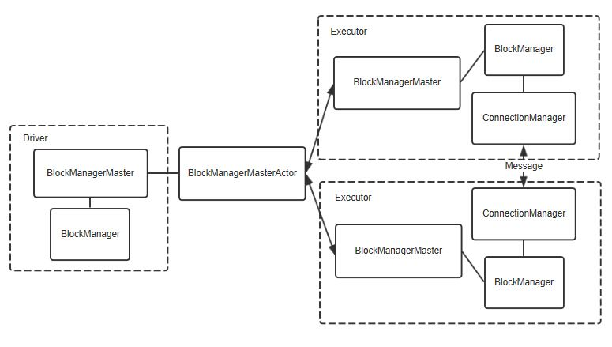
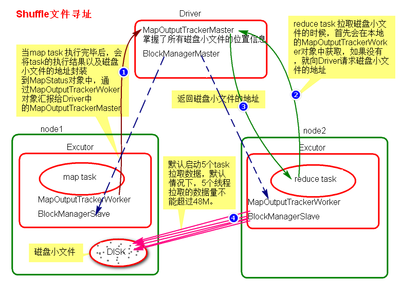

# Spark 的分布式存储系统-BlockManager

**管理范围：**

1. 广播变量
2. RDD持久化的数据
3. shuffle数据拉取

**BlockManager 也是主从架构：**

      **主： BlockManagerMaster**

            位于 Driver 中

            统筹管理所有数据的存储，BlockManagerMaster会在集群中有用到广播变量和缓存数据或者删除缓存数据的时候，通知BlockManagerSlave传输或者删除数据。

      **从： BlockManagerSlaves**  

            位于 Executor 中

            负责真正将数据写入到内存或磁盘，BlockManagerSlave会与BlockManagerSlave之间通信。

**BlockManager 的组成部分：**

      1、**DiskStore**：管理磁盘

      2、**MemoryStore**：管理内存

      3、**ConnectionManager**：管理连接，负责连接其他的BlockManagerSlave

      4、**BlockTransferService**：负责数据的传输

    

**详解 shuffle 时的数据拉取过程**

    MaskTask 执行完成后会产生很多磁盘小文件

    这时 ***task\*** 会将 *task的执行状态与结果*  以及 ***这些磁盘文件的地址*** 封装到 ***mapStatus\*** 对象中，通过本地的 ***MapOutputTrackerWorker*** 向 Driver 的 DAGScheduler 里的 ***MapOutputTrackerMaster*** 汇报。

    **ReduceTask** 执行前，首先会向本地 ***MapOutputTrackerWorker***  这些磁盘小文件的 ***地址***  ，如果没有就会向 ***MapOutputTrackerMaster 申请*** 。

    得到地址后，ReduceTask 会 通过 ***Executor*** 中的 ***BlockManagerSlave*** 的 ***ConnectionManager***  向 MapTask 所在的 Executor 中的 ***BlockManagerSlave*** 的 ***ConnectionManager*** ***建立连接***。

    后通过 ***BlockTransferService拉取数据*** ， BlockTransforService 会创建 ***5 个线程*** 去 map 端拉取，这 5 个线程 拉取的数据总共***不能超过 48 M  。***

    拉取的数据存储再 ***Executor*** 的 ***shuffle 聚合内存*** 里

**这其中的 shuffle 优化点**

1. 增加MapTask写磁盘的 ***buffer缓冲大小（默认32K）
2. 增加 用于 shuffle 聚合的内存比例，可以适当降低其他 区域 的比例  (默认20% )
3. 增加 Reduce Task 最大拉取的数据量 （默认48M）
4. 增加 拉取数据失败的 重试次数 （默认3次） ， 可虑副作用。
5. 增大 拉取数据失败的 每次重试的间隔 （默认）
6. 选择 shuffle 的种类 （默认 SortShuffleManager）
7. 开启SortShuffleManager 的 合并机制 （默认 false）
8. SortShuffleManager 的 bypass 机制 （默认200）