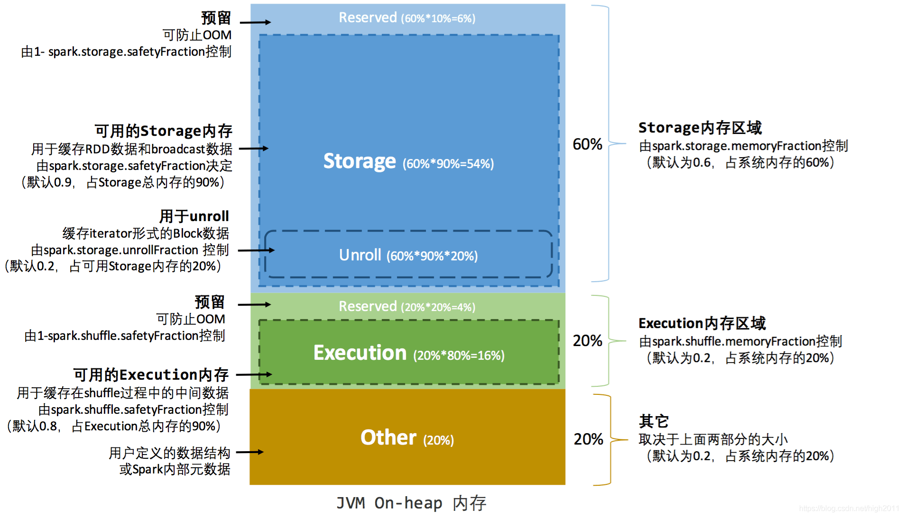
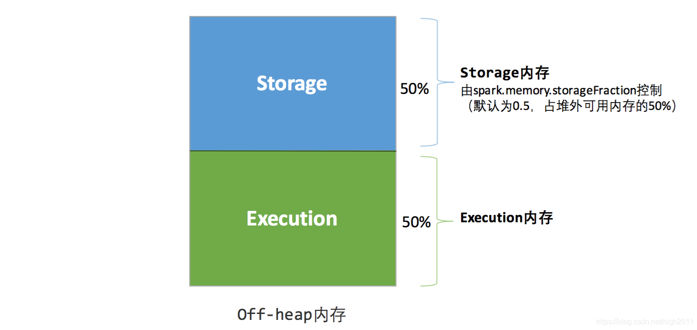
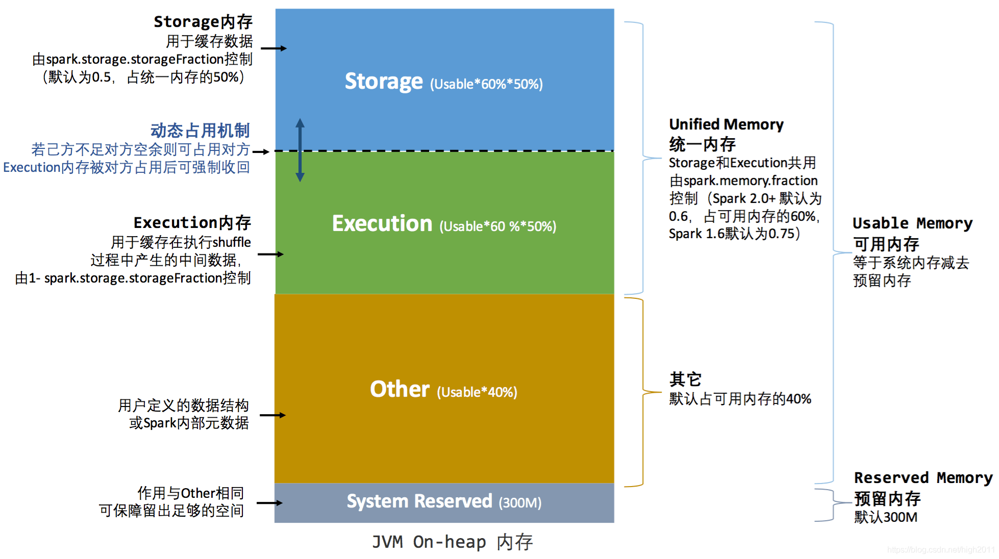
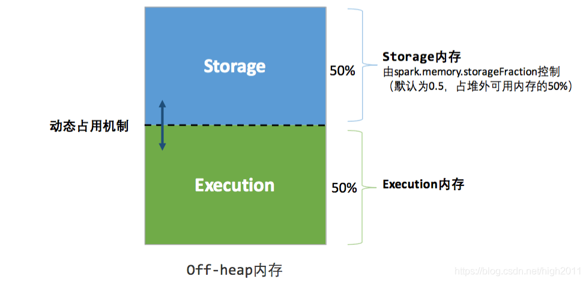

静态内存管理（Spark 1.6.x版本前的策略）

静态内存管理图示——堆内

静态内存管理图示——堆外

统一内存管理（Spark 1.6.x以后的策略）

统一内存管理图示——堆内

统一内存管理图示——堆外

其中最重要的优化在于动态占用机制，其规则如下：

1. 设定基本的存储内存和执行内存区域（spark.storage.storageFraction 参数），该设定确定了双方各自拥有的空间的范围
   双方的空间都不足时，则存储到硬盘；若己方空间不足而对方空余时，可借用对方的空间;（存储空间不足是指不足以放下一个完整的 Block）
2. 执行内存的空间被对方占用后，可让对方将占用的部分转存到硬盘，然后"归还"借用的空间
3. 存储内存的空间被对方占用后，无法让对方"归还"，因为需要考虑 Shuffle 过程中的很多因素，实现起来较为复杂