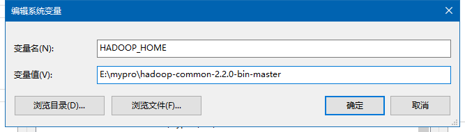

# FAQ

## `java.io.IOException: Could not locate executable null\bin\winutils.exe in the Hadoop binaries.`

`winutils.exe` 是在 Windows 系统上需要的 Hadoop 调试环境工具，里面包含一些在 Windows 系统下调试 Hadoop、Spark 所需要的基本的工具类。

`winutils.exe` 下载地址：

```md
1. https://github.com/steveloughran/winutils
2. https://github.com/cdarlint/winutils
```

根据上面的下载地址，需要配置环境变量：

