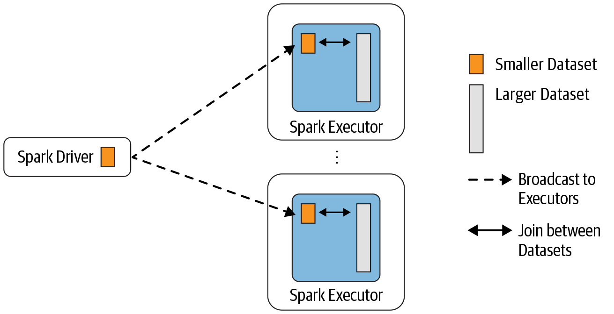
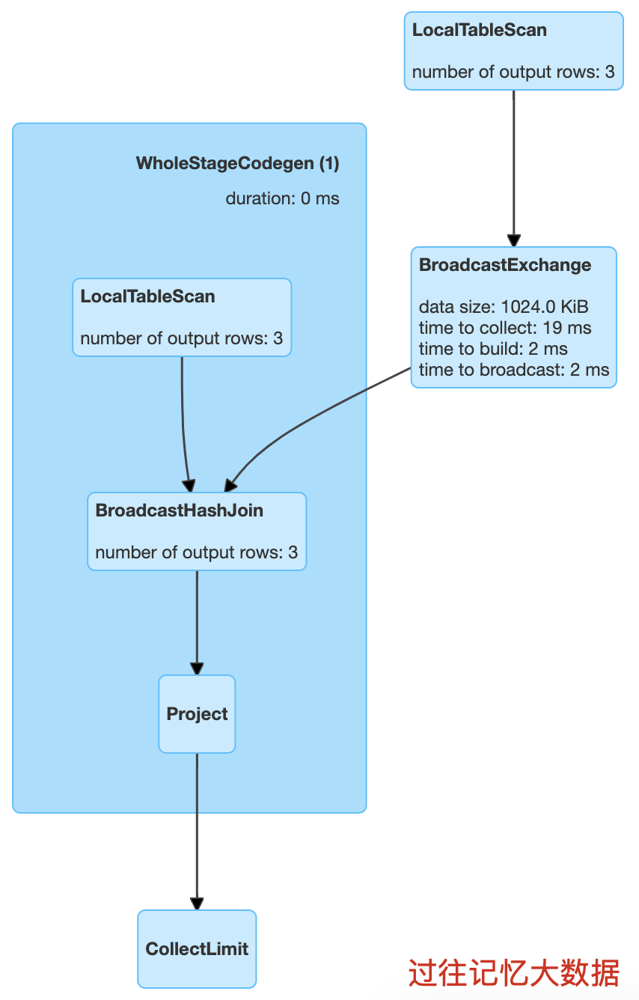
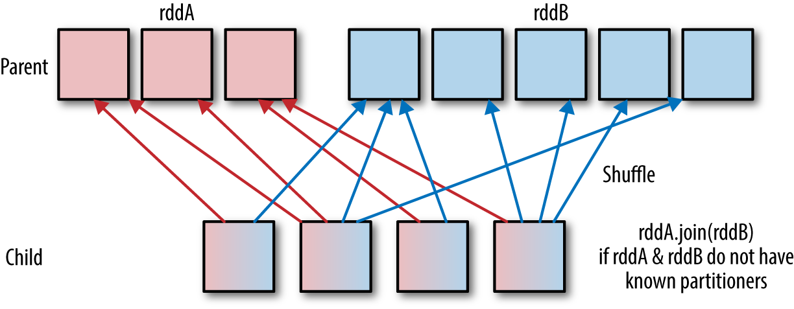
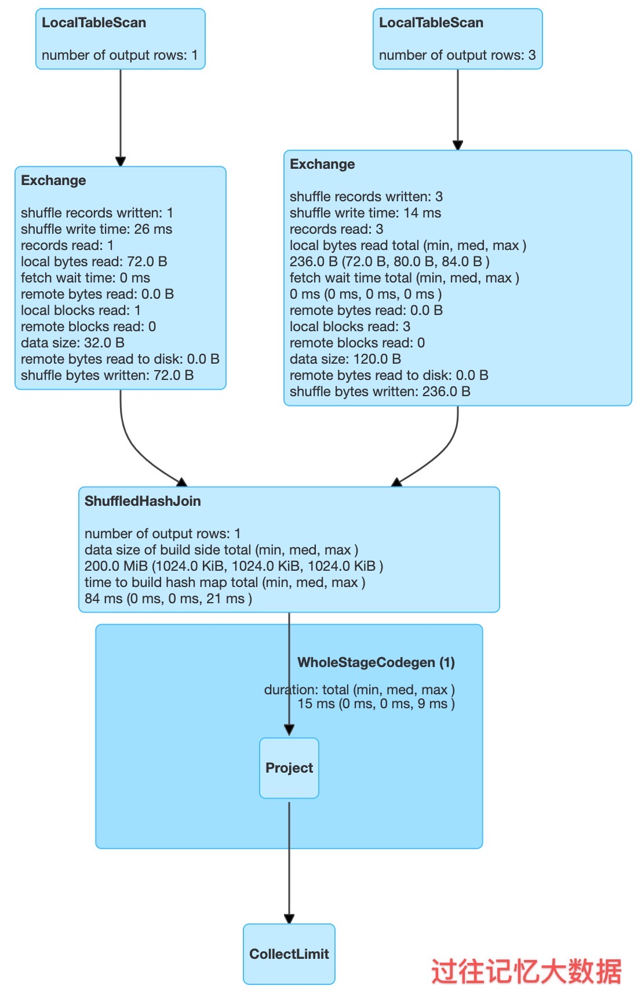
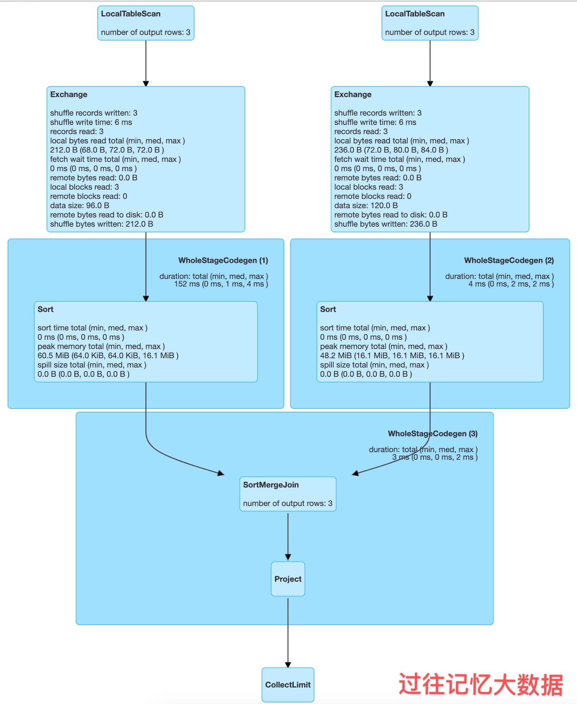
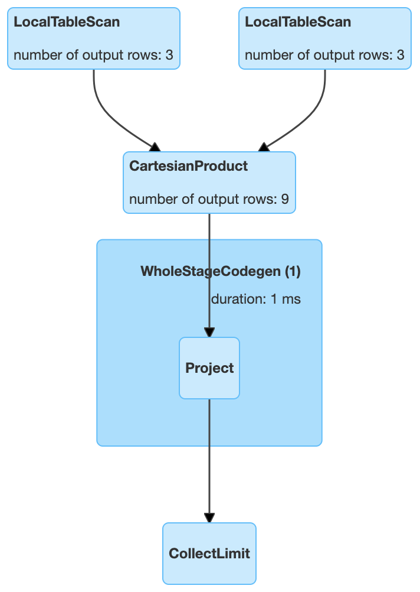
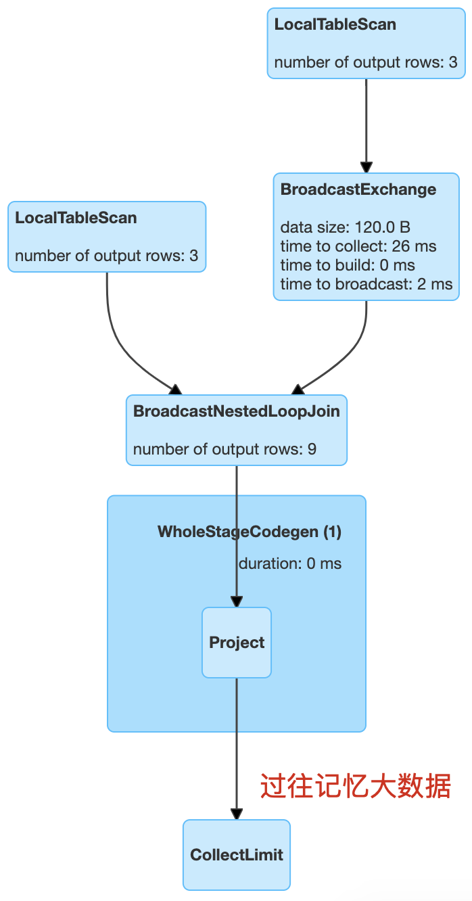

# Join 策略

在日常工作中将两个数据集进行 Join 操作是很常见的场景，在 Spark 的 Physical Plan 阶段，Spark 的 JoinSelection 类会根据 Join hints 策略、Join 表的大小、Join 是等值 Join（equi-join）还是不等值（non-equi-join）以及参与 Join 的 key 是否可以排序等条件来选择最终的 Join 策略（join-strategies），最后 Spark 会利用选择好的 Join 策略执行最终的计算。目前 Spark【3.0 版本】一共支持五种 Join 策略：

- Broadcast Hash Join (BHJ)
- Shuffle Hash Join (SHJ)
- Shuffle Sort Merge Join (SMJ)
- Shuffle-and-replicate nested loop join，又称笛卡尔积(Cartesian product join)
- Broadcast nested loop join (BNLJ)

其中 BHJ 和 SMJ 这两种 Join 策略是运行 Spark 作业最常见的。JoinSelection 会先根据 Join 的 Key 为等值 Join 来选择 Broadcast Hash Join、Shuffle Hash Join 以及 Shuffle sort merge join 中的一个；如果 Join 的 Key 为不等值 Join 或者没有指定 Join 条件，则会选择 Broadcast nested loop join 或 Shuffle-and-replicate nested loop join。

## Broadcast Hash Join (BHJ)

BHJ 又称 map-side-only join，从名字可以看出，Join 是在 map 端进行的。这种 Join 要求一张表很小，小到足以将表的数据全部放到 Driver 和 Executor 端的内存中，而另外一张表很大。

Broadcast Hash Join 的实现是将小表的数据广播（broadcast）到 Spark 所有的 Executor 端，这个广播过程和用户自己去广播数据没什么区别，先利用 collect 算子将小表的数据从 Executor 端拉到 Driver 端，然后在 Driver 端调用 sparkContext.broadcast 广播到所有 Executor 端；然后在 Executor 端这个广播出去的数据会和大表进行 Join 操作，这种 Join 策略避免了 Shuffle 操作。



**Broadcast Hash Join 的适用条件**

使用这个 Join 策略必须满足以下条件：

- 小表的数据必须很小，可以通过 `spark.sql.autoBroadcastJoinThreshold` 参数来配置，默认是 10MB，如果用户的内存比较大，可以将这个阈值适当加大；如果将 `spark.sql.autoBroadcastJoinThreshold` 参数设置为 -1，可以关闭 BHJ；
- 只能用于等值 Join，不要求参与 Join 的 keys 可排序；
- 除了 full outer joins ，支持所有的 Join 类型。

**Broadcast Hash Join 使用例子**

```scala
val iteblogDF = Seq(
    (0, "https://www.iteblog.com"),
    (1, "iteblog_hadoop"),
    (2, "iteblog")
    ).toDF("id", "info")
val r = iteblogDF.join(iteblogDF, Seq("id"), "inner")
r.explain
/**
== Physical Plan ==
*(1) Project [id#7, info#8, info#12]
+- *(1) BroadcastHashJoin [id#7], [id#11], Inner, BuildRight
   :- *(1) LocalTableScan [id#7, info#8]
   +- BroadcastExchange HashedRelationBroadcastMode(List(cast(input[0, int, false] as bigint))), [id=#15]
      +- LocalTableScan [id#11, info#12]
*/
```

从 `r.explain` 结果就可以看出，里面使用了 BroadcastHashJoin，物理计划如下：



Spark 中 Broadcast Hash Join 是在 BroadcastHashJoinExec 类里面实现的。

## Shuffle Hash Join (SHJ)

Shuffle Hash Join 同样是在大表和小表进行 Join 的时候选择的一种策略，它的计算思想是：把大表和小表按照相同的分区算法和分区数进行分区（根据参与 Join 的 keys 进行分区），这样就保证了 hash 值一样的数据都分发到同一个分区中，然后在同一个 Executor 中两张表 hash 值一样的分区就可以在本地进行 hash Join 了。在进行 Join 之前，还会对小表 hash 完的分区构建 hash map。 Shuffle Hash Join 利用了分治思想，把大问题拆解成小问题去解决。



**Shuffle Hash Join 的适用条件**

要启用 Shuffle Hash Join 必须满足以下几个条件：

- 仅支持等值 Join，不要求参与 Join 的 Keys 可排序；
- `spark.sql.join.preferSortMergeJoin` 参数必须设置为 false，参数是从 Spark 2.0.0 版本引入的，默认值为 true，也就是默认情况下选择 Sort Merge Join；
- 小表的大小（`plan.stats.sizeInBytes`）必须小于 `spark.sql.autoBroadcastJoinThreshold * spark.sql.shuffle.partitions`；而且小表大小（`stats.sizeInBytes`）的三倍必须小于等于大表的大小（`stats.sizeInBytes`），也就是 `a.stats.sizeInBytes * 3 < = b.stats.sizeInBytes`

**Shuffle Hash Join 使用例子**

```scala
// 因为下面测试数据都很小，所以先把 BroadcastJoin 关闭
spark.conf.set("spark.sql.autoBroadcastJoinThreshold", -1)
// 为了启用 Shuffle Hash Join 必须将 spark.sql.join.preferSortMergeJoin 设置为 false
spark.conf.set("spark.sql.join.preferSortMergeJoin", false)
val iteblogDF1 = Seq(
    (2, "iteblog")
    ).toDF("id", "info")
val iteblogDF2 = Seq(
    (0, "https://www.iteblog.com"),
    (1, "iteblog_hadoop"),
    (2, "iteblog")
    ).toDF("id", "info")
val r = iteblogDF1.join(iteblogDF, Seq("id"), "inner")
r.explain
/*
== Physical Plan ==
*(1) Project [id#52, info#53, info#37]
+- ShuffledHashJoin [id#52], [id#36], Inner, BuildLeft
   :- Exchange hashpartitioning(id#52, 200), true, [id=#172]
   :  +- LocalTableScan [id#52, info#53]
   +- Exchange hashpartitioning(id#36, 200), true, [id=#173]
      +- LocalTableScan [id#36, info#37]
 */
```

从 `r.explain` 结果就可以看出，里面使用了 ShuffledHashJoin，物理计划如下



从上图可以看出，在进行 ShuffledHashJoin 的时候 Spark 构建了 build hash map，所以如果小表分区后的数据还比较大，可能会参数 OOM 的问题。在 Spark 中，ShuffledHashJoin 的实现在 ShuffledHashJoinExec 类里面。

## Shuffle Sort Merge Join (SMJ)

Shuffle Sort Merge Join 的实现思想：也是对两张表参与 Join 的 Keys 使用相同的分区算法和分区数进行分区，目的就是保证相同的 Keys 都落到相同的分区里面。分区完之后再对每个分区按照参与 Join 的 Keys 进行排序，最后 Reduce 端获取两张表相同分区的数据进行 Merge Join，也就是 Keys 相同说明 Join 上了。

**Shuffle Sort Merge Join 的适用条件**

Shuffle Sort Merge Join 并不是一定就使用的，也需要满足以下条件：

- 仅支持等值 Join，并且要求参与 Join 的 Keys 可排序

**Shuffle Sort Merge Join 使用例子**

```scala
// 因为下面测试数据都很小，所以先把 BroadcastJoin 关闭
spark.conf.set("spark.sql.autoBroadcastJoinThreshold", -1)
val iteblogDF1 = Seq(
    (0, "111"),
    (1, "222"),
    (2, "333")
    ).toDF("id", "info")
val iteblogDF2 = Seq(
    (0, "https://www.iteblog.com"),
    (1, "iteblog_hadoop"),
    (2, "iteblog")
    ).toDF("id", "info")
val r = iteblogDF1.join(iteblogDF2, Seq("id"), "inner")
r.explain
/*
== Physical Plan ==
*(3) Project [id#119, info#120, info#131]
+- *(3) SortMergeJoin [id#119], [id#130], Inner
   :- *(1) Sort [id#119 ASC NULLS FIRST], false, 0
   :  +- Exchange hashpartitioning(id#119, 200), true, [id=#335]
   :     +- LocalTableScan [id#119, info#120]
   +- *(2) Sort [id#130 ASC NULLS FIRST], false, 0
      +- Exchange hashpartitioning(id#130, 200), true, [id=#336]
         +- LocalTableScan [id#130, info#131]
 */
```

从 `r.explain` 结果就可以看出，里面使用了 SortMergeJoin，物理计划如下



Spark 里面的大表 Join 基本上都可以使用 SortMergeJoin 来实现，对应的类为 SortMergeJoinExec 。

> 可以对参与 Join 的表按照 Keys 进行 Bucket 来避免 Shuffle Sort Merge Join 的 Shuffle 操作，因为 Bucket 的表事先已经按照 Keys 进行分区排序，所以做 Shuffle Sort Merge Join 的时候就无需再进行分区和排序了。

## Cartesian product join

和 MySQL 一样，如果 Spark 中两张参与 Join 的表没指定 where 条件（ON 条件）那么会产生 Cartesian product join，这个 Join 得到的结果其实就是两张行数的乘积。

**Cartesian product join 的适用条件**

- 必须是 inner Join，其支持等值和不等值 Join。

**Cartesian product join 使用例子**

```scala
// 因为下面测试数据都很小，所以先把 BroadcastJoin 关闭
spark.conf.set("spark.sql.autoBroadcastJoinThreshold", -1)
val iteblogDF1 = Seq(
    (0, "111"),
    (1, "222"),
    (2, "333")
    ).toDF("id", "info")
val iteblogDF2 = Seq(
    (0, "https://www.iteblog.com"),
    (1, "iteblog_hadoop"),
    (2, "iteblog")
    ).toDF("id", "info")
// 这里也可以使用 val r = iteblogDF1.crossJoin(iteblogDF2)
val r = iteblogDF1.join(iteblogDF2, Nil, "inner")
r.explain
/*
== Physical Plan ==
CartesianProduct
:- LocalTableScan [id#157, info#158]
+- LocalTableScan [id#168, info#169]
 */
```



从上面结果可以看出，Cartesian product join 产生数据的行数是两表的乘积，当 Join 的表很大时，其效率是非常低下的，所以我们尽量不要使用这种 Join。在 Spark 中 Cartesian product join 的实现可以参见 CartesianProductExec 类。

## Broadcast nested loop join (BNLJ)

可以把 Broadcast nested loop join 的执行看做下面的计算：

```scala
for record_1 in relation_1:
  for record_2 in relation_2:
    # join condition is executed
```

可以看出 Broadcast nested loop join 在某些情况会对某张表重复扫描多次，可见效率非常低下。从名字可以看出，BNLJ 会根据相关条件对小表进行广播，以减少表的扫描次数。触发广播的需要满足以下三个条件之一：

- right outer join 是会广播左表；
- left outer, left semi, left anti 或者 existence join 是会广播右表；
- inner join 的时候两张表都会广播。

**Broadcast nested loop join 的适用条件**

Broadcast nested loop join 支持等值和不等值 Join，支持所有的 Join 类型。

**Broadcast nested loop join 使用例子**

```scala
// 因为下面测试数据都很小，所以先把 BroadcastJoin 关闭
spark.conf.set("spark.sql.autoBroadcastJoinThreshold", -1)
val iteblogDF1 = Seq(
    (0, "111"),
    (1, "222"),
    (2, "333")
    ).toDF("id", "info")
val iteblogDF2 = Seq(
    (0, "https://www.iteblog.com"),
    (1, "iteblog_hadoop"),
    (2, "iteblog")
    ).toDF("id", "info")
val r = iteblogDF1.join(iteblogDF2, Nil, "leftouter")
r.explain
/*
== Physical Plan ==
BroadcastNestedLoopJoin BuildRight, LeftOuter
:- LocalTableScan [id#157, info#158]
+- BroadcastExchange IdentityBroadcastMode, [id=#516]
   +- LocalTableScan [id#168, info#169]
 */
```



上面由于是 LeftOuter Join，所以会对右表进行广播。Broadcast nested loop join 的实现可以参见 BroadcastNestedLoopJoinExec。

## Join 策略的选择

Spark 的 Join 策略选择是在 JoinSelection 类里面实现的，关键代码如下：

```scala
def apply(plan: LogicalPlan): Seq[SparkPlan] = plan match {
    case ExtractEquiJoinKeys(joinType, leftKeys, rightKeys, condition, left, right, hint) =>

        def createJoinWithoutHint() = {
            createBroadcastHashJoin(
            canBroadcast(left) && !hint.leftHint.exists(_.strategy.contains(NO_BROADCAST_HASH)),
            canBroadcast(right) && !hint.rightHint.exists(_.strategy.contains(NO_BROADCAST_HASH)))
            .orElse {
                if (!conf.preferSortMergeJoin) {
                createShuffleHashJoin(
                    canBuildLocalHashMap(left) && muchSmaller(left, right),
                    canBuildLocalHashMap(right) && muchSmaller(right, left))
                } else {
                None
                }
            }
            .orElse(createSortMergeJoin())
            .orElse(createCartesianProduct())
            .getOrElse {
                // This join could be very slow or OOM
                val buildSide = getSmallerSide(left, right)
                Seq(joins.BroadcastNestedLoopJoinExec(
                planLater(left), planLater(right), buildSide, joinType, condition))
            }
        }

        createBroadcastHashJoin(hintToBroadcastLeft(hint), hintToBroadcastRight(hint))
            .orElse { if (hintToSortMergeJoin(hint)) createSortMergeJoin() else None }
            .orElse(createShuffleHashJoin(hintToShuffleHashLeft(hint), hintToShuffleHashRight(hint)))
            .orElse { if (hintToShuffleReplicateNL(hint)) createCartesianProduct() else None }
            .getOrElse(createJoinWithoutHint())

    case logical.Join(left, right, joinType, condition, hint) =>

        def createJoinWithoutHint() = {
            createBroadcastNLJoin(canBroadcast(left), canBroadcast(right))
            .orElse(createCartesianProduct())
            .getOrElse {
                // This join could be very slow or OOM
                Seq(joins.BroadcastNestedLoopJoinExec(
                planLater(left), planLater(right), desiredBuildSide, joinType, condition))
            }
        }

        createBroadcastNLJoin(hintToBroadcastLeft(hint), hintToBroadcastRight(hint))
            .orElse { if (hintToShuffleReplicateNL(hint)) createCartesianProduct() else None }
            .getOrElse(createJoinWithoutHint())

    // --- Cases where this strategy does not apply ---------------------------------------------
    case _ => Nil
}
```

由于 Spark 的计算引擎优化器不是万能的，有些场景下会选择错误的 Join 策略，所以 Spark 2.4 & Spark 3.0 引入了 Join hint，也就是用户可以自己选择 Join 策略。上面的代码可以看出，用户指定的 Join hint 优先级最高。从代码中可以看出 Spark 3.0 是按照下面下面顺序来选择 Join 策略的：

先判断是不是等值 Join，那么是按照下面顺序选择 Join 策略：

- 用户是不是指定了 BROADCAST hint （BROADCAST、BROADCASTJOIN 以及 MAPJOIN 中的一个），如果指定了，那就用 Broadcast Hash Join；
- 用户是不是指定了 SHUFFLE MERGE hint （SHUFFLE_MERGE、MERGE 以及 MERGEJOIN 中的一个），如果指定了，那就用 Shuffle sort merge join；
- 用户是不是指定了 Shuffle Hash Join hint （SHUFFLE_HASH），如果指定了，那就用 Shuffle Hash Join；
- 用户是不是指定了 shuffle-and-replicate nested loop join hint （SHUFFLE_REPLICATE_NL），如果指定了，那就用 Cartesian product join；
- 如果用户没有指定任何 Join hint，那根据 Join 的适用条件按照 Broadcast Hash Join -> Shuffle Hash Join -> Sort Merge Join ->Cartesian Product Join -> Broadcast Nested Loop Join 顺序选择 Join 策略

如果是不等值 Join，那么是按照下面顺序选择 Join 策略：

- 用户是不是指定了 BROADCAST hint （BROADCAST、BROADCASTJOIN 以及 MAPJOIN 中的一个），如果指定了，那就广播对应的表，并选择 Broadcast Nested Loop Join；
- 用户是不是指定了 shuffle-and-replicate nested loop join hint （SHUFFLE_REPLICATE_NL），如果指定了，那就用 Cartesian product join；
- 如果用户没有指定任何 Join hint，那根据 Join 的适用条件按照 Broadcast Nested Loop Join ->Cartesian Product Join -> Broadcast Nested Loop Join 顺序选择 Join 策略