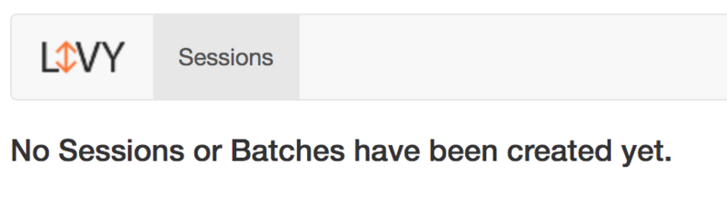

<!--
 * @Github       : https://github.com/superzhc/BigData-A-Question
 * @Author       : SUPERZHC
 * @CreateDate   : 2020-10-09 09:22:28
 * @LastEditTime : 2021-02-05 16:34:22
 * @Copyright 2021 SUPERZHC
-->
# Livy 安装部署

## 下载livy

下载地址：<https://livy.incubator.apache.org/download/>

## 配置livy

安装livy之前需要先安装hadoop和spark。livy要求spark的版本是1.6+，支持scala2.10和scala2.11。

Livy在配置目录下使用一些配置文件，默认情况下是Livy安装目录下的`conf`目录，启动Livy时，可以通过设置`LIVY_CONF_DIR`环境变量来指定配置文件目录。

Livy的一些配置文件如下：

- `livy.conf`：包含服务器配置。Livy发行版都会附带一个默认配置文件模板，其中列出了配置型及默认值
- `spark-blacklist.conf`：列出了不允许用户覆盖的Spark配置项。这些配置项将被限制为其默认值或Livy使用的Spark配置中设置的值
- `log4j.properties`：Livy日志记录的配置。定义日志级别以及日志消息将写入的位置。默认配置模板将打印日志消息到 **`stderr`**

在`livy.conf`中可以进行一些配置，一般使用默认项就可以了

```properties
# 默认使用hiveContext
livy.repl.enableHiveContext = true
# 开启用户代理
livy.impersonation.enabled = true
# 设置session空闲过期时间
livy.server.session.timeout = 1h
# 本地模式或者yarn模式
livy.server.session.factory = yarn/local
```

## 运行livy

进入到livy的安装目录下，输入下面命令启动livy

```sh
./bin/livy-server
```

Livy默认使用`SPARK_HOME`下的Spark配置。用户也可以通过在启动Livy之前设置`SPARK_CONF_DIR`环境变量，使用此配置路径下的Spark配置

> ***注意***：
>
> 若 Hadoop 开启了kerberos认证，需要配置一下Kerberos，否则会报错：
>
> ```bash
> cp conf/livy.conf.template conf/livy.conf
> vi conf/livy.conf
> # 增加如下两行
> livy.server.launch.kerberos.principal=spark1@xxxxx.COM
> livy.server.launch.kerberos.keytab=/var/keytab/spark1.keytab
> ```

Livy启动后，默认监听端口为8998，通过web访问这个端口：



