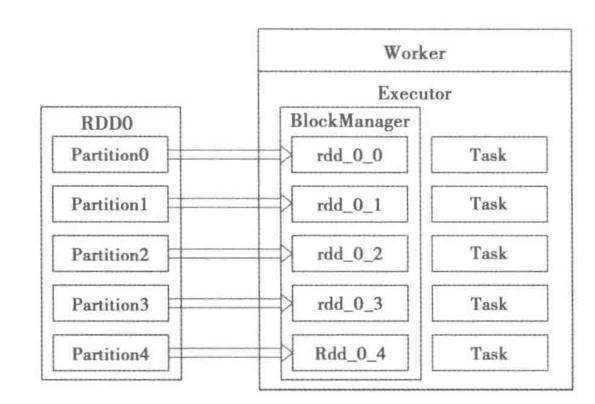

# RDD 分区

数据集是由一组分区（Partition）组成的。对于 RDD 来说，每个分区都会被一个计算任务处理，并决定并行计算的粒度。用户可以在创建 RDD 时指定 RDD 的分区个数，如果没有指定，那么就会采用默认值。默认值就是程序所分配到的 CPU Core 核数。如下图描述了分区存储的计算模型，每个分配的存储是由 BlockManager 实现的。每个分区都会被逻辑映射成 BlockManager 的一个 Block，而这个 Block 会被一个 Task 负责计算。

## 决定分区数量的因素

Partition 数量可以在初始化 RDD 时指定，不指定的话则读取 `spark.default.parallelism` 配置，不同类型资源管理器取值不同，如下：

| 参数                        | 默认值                                                                                                                                                                                                                                                                                                                                                                        | 描述                                                                                                                           |
| --------------------------- | ----------------------------------------------------------------------------------------------------------------------------------------------------------------------------------------------------------------------------------------------------------------------------------------------------------------------------------------------------------------------------- | ------------------------------------------------------------------------------------------------------------------------------ |
| `spark.default.parallelism` | For distributed shuffle operations like reduceByKey and join, the largest number of partitions in a parent RDD. For operations like parallelize with no parent RDDs, it depends on the cluster manager: Local mode: number of cores on the local machine Mesos fine grained mode: 8 Others: total number of cores on all executor nodes or 2, whichever is larger | Default number of partitions in RDDs returned by transformations like join, reduceByKey, and parallelize when not set by user. |

相关算子的 Partition 数量的设定：

| 算子/API                                                       | 分区数量                                                                                                                                                                                                                                                                        |
| -------------------------------------------------------------- | ------------------------------------------------------------------------------------------------------------------------------------------------------------------------------------------------------------------------------------------------------------------------------- |
| **RDD 初始化相关**                                             |                                                                                                                                                                                                                                                                                 |
| `sc.parallelize(…)`                                            | `sc.default.parallelism`                                                                                                                                                                                                                                                        |
| `sc.textFile(…)`                                               | `max(传参, block数)`                                                                                                                                                                                                                                                            |
| `val hbaseRDD = sc.newAPIHadoopRDD(…)`                         | `max(传参, block数)`                                                                                                                                                                                                                                                            |
| `val jdbcRDD = new JdbcRDD(…)`                                 | 传参                                                                                                                                                                                                                                                                            |
| **通用 Transformation**                                        |                                                                                                                                                                                                                                                                                 |
| `filter()`,`map()`,`flatMap()`,`distinct()`                    | 和父RDD相同                                                                                                                                                                                                                                                                     |
| `rdd.union(otherRDD)`                                          | `rdd.partitions.size + otherRDD.partitions.size`                                                                                                                                                                                                                                |
| `rdd.intersection(otherRDD)`                                   | `max(rdd.partitions.size, otherRDD.partitions.size)`                                                                                                                                                                                                                            |
| `rdd.subtract(otherRDD)`                                       | `rdd.partitions.size`                                                                                                                                                                                                                                                           |
| `rdd.cartesian(otherRDD)`                                      | `rdd.partitions.size * otherRDD.partitions.size`                                                                                                                                                                                                                                |
| **Key-based Transformation**                                   |                                                                                                                                                                                                                                                                                 |
| `reduceByKey()`,`foldByKey()`,`combineByKey()`, `groupByKey()` | 和父RDD相同                                                                                                                                                                                                                                                                     |
| `sortByKey()`                                                  | 同上                                                                                                                                                                                                                                                                            |
| `mapValues()`,`flatMapValues()`                                | 同上                                                                                                                                                                                                                                                                            |
| `cogroup()`, `join()` ,`leftOuterJoin()`, `rightOuterJoin()`   | 所有父 RDD 按照其 partition 数降序排列，从 partition 数最大的 RDD 开始查找是否存在 partitioner，存在则 partition 数由此 partitioner 确定，否则所有 RDD 不存在 partitioner，由 `spark.default.parallelism` 确定，若还没设置，最后 partition 数为所有 RDD 中 partition 数的最大值 |

## Partition数量影响及调整

**Partition数量的影响**

- Partition数量太少 
    太少的影响显而易见，就是资源不能充分利用，例如local模式下，有16core，但是Partition数量仅为8的话，有一半的core没利用到。
- Partition数量太多 
    太多，资源利用没什么问题，但是导致task过多，task的序列化和传输的时间开销增大。

那么多少的partition数是合适的呢，这里我们参考spark doc给出的建议：*Typically you want 2-4 partitions for each CPU in your cluster*。

**Partition调整**

- repartition 
    reparation 是 `coalesce(numPartitions, shuffle = true)`，repartition 不仅会调整 Partition 数，也会将 Partitioner 修改为 hashPartitioner ，产生 shuffle 操作。
- coalesce 
    coalesce 函数可以控制是否 shuffle，但当 shuffle 为 false 时，只能减小 Partition 数，无法增大。