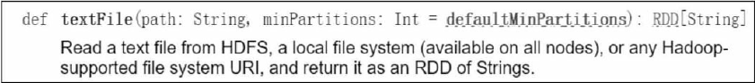

# RDD 创建

Spark 提供了两种常见的创建 RDD 的方式：

- 调用 SparkContext 的 `parallelize()` 方法将数据并行化生成 RDD
- 从外部存储系统（如 HDFS、共享文件系统、HBase 或提供 Hadoop InputFormat 的任何数据源）中引用数据生成 RDD

### 程序内部数据作为数据源

把程序中一个已有的集合传给 SparkContext 的 `parallelize()` 方法，对集合并行化，从而创建 RDD。

通过调用 SparkContext 的 parallelize 方法将驱动程序已经存在的数据集转化为 **并行化集合（Parallelize Collections）**。集合的元素被复制以形成可并行操作的分布式数据集。

例如，下面创建一个包含数字 1~5 的并行集合：

```scala
val data = Array(1,2,3,4,5)
val distData = sc.parallelize(data)
```

一旦创建，分布式数据集（distData）就可以进行并行操作。例如，可以调用 `distData.reduce((a,b)=>a+b)`将数组的元素相加。

并行集合一个很重要的参数是 **切片数**(*slices*)，表示一个数据集切分的份数。Spark 为集群的每个 RDD 分区进行一个计算任务，即 RDD 每一个分区是计算任务的基本分配单位，而非整个 RDD。通常，Spark 会根据集群实际情况自动设置分区数。但是，也可以通过将其作为第二个参数传递给 parallelize 来手动设置，如下实例将 data 数据集切分为 10 个分区：

```scala
sc.parallelize(data,10)
```

**Java 版本**

```java
List<String> data = Arrays.asList("Learn","Apache","Spark","with","Tutorial Kart");
JavaRDD<String> items = jsc.parallelize(data);   // 不指定分区数
JavaRDD<String> items = jsc.parallelize(data,2); // 指定分区数
```

### 外部数据源

Spark 支持多种数据源，比如 HDFS、Cassandra、HBase、Amazon S3 或者其他支持 Hadoop 的数据源。Spark 支持多种文件格式，比如普通文本文件、SequenceFiles、Parquet、CSV、JSON、对象文件、Hadoop 的输入输出文件等。

> 小技巧：对于结构化的数据，可以考虑先通过生成 DataFrame 在直接转换成 RDD，此种方式比较简单

文本文件可以使用 SparkContext 的 `textFile(path:String,minPartitions:Int=defaultMinPartitions)` 方法创建 RDD。此方法需要一个文件的 URI（本地路径的机器上，或一个 `hdfs://`、`s3n://`等 URI），另外可以通过第二个参数 minPartitions 设置 RDD 分区数，返回值为由 String 对象组成的 `RDD[String]`。

示例：从一个本地文件系统读取文本文件作为外部数据源

> 注意：要加载本地文件，必须采用`file://`开头的格式

**Scala 版本**

```scala
val distFile = sc.textFile("file:///usr/local/data.txt",10)
```

注：`sc.textFile("hdfs://localhost:9000/user/hadoop/test.txt")`中的`hdfs://localhost:9000`是服务器上安装的Hadoop确定下来的端口地址。实际上，也可以省略不写，如下三条语句都是等价的：

```scala
val textFile=sc.textFile("hdfs://localhost:9000/user/hadoop/test.txt")
val textFile=sc.textFile("/user/hadoop/test.txt")
val textFile=sc.textFile("test.txt")
```

**Java 版本**

```java
JavaRDD<String> lines = jsc.textFile("file:///usr/local/data.txt");

// 支持一次性读取多个文件到一个RDD中，使用英文逗号(,)进行分割
JavaRDD<String> lines = sc.textFile("data/rdd/input/file1.txt, data/rdd/input/file2.txt, data/rdd/input/file3.txt");

// 读取整个目录下的所有txt文件
JavaRDD<String> lines = sc.textFile("data/rdd/input");

// 支持读取多个目录下的所有txt文件到一个RDD中，使用英文逗号(,)进行分割
JavaRDD<String> lines = sc.textFile("data/rdd/input,data/rdd/anotherFolder");

// 支持通配符的模式读取文件到RDD中
JavaRDD<String> lines = sc.textFile("data/rdd/input/file[0-3].txt,data/rdd/anotherFolder/file*");
```

#### **`textFile()`**



参数分析：

- `path:String`，path 用来表示 RDD 外部数据源路径信息的 URI，这个 URI 可以是 HDFS、本地文件系统，以及任何一个 Hadoop 支持的文件系统的 URI
- `minPartitions:Int=defaultMinPartitions`，minPartitions 参数用来指定生成的 RDD 的分区（partition）数，需要注意的是 RDD 的 partition 个数其实是在逻辑上将数据集进行划分，RDD 各分区的实质是记录着数据源的各个文件块（block）在 HDFS 位置的信息集合，并不是数据源本身的集合，因此 RDD partitions 数目也受 HDFS 的 split size 影响，HDFS 默认文件块（block）大小为 128M，这就意味着当数据源文件小于 128M 时，RDD 分区数并不会按照 minPartitions 进行指定分区，而只有一个分区。

注意事项：

- 如果需要从本地文件系统读取文件作为外部数据源，则文件必须确保集群上的所有工作节点可访问。可以将文件复制到所有工作节点或使用集群上的共享文件系统
- Spark 所有的基于文件的读取方法，包括 textFile 支持读取某个目录下多个指定文件，支持部分的压缩文件和通配符
- textFile 方法还采用可选的第二个参数来控制文件的分区数。默认情况下，Spark 为文件的每个块创建一个分区，但也可以通过传递更大的值来请求更高数量的分区。注意，***不能设置一个小于文件块数目的切片值***。

#### **Spark 的 Scala API 还支持其他几种数据格式**

除了文本文件，Spark 的 Scala API 支持其他几种数据格式：

- `SparkContext.wholeTextFiles` 可用于读取包含多个小文本文件的目录，并将其作为 `(filename,content)`表示的 `(文件名，文件内容)`键值对组成的 RDD 返回。这与 textFile 每个文件中的每行返回一条记录不同。
- 对于 [SequenceFiles](http://hadoop.apache.org/docs/current/api/org/apache/hadoop/mapred/SequenceFileInputFormat.html)，可以使用 SparkContext 的 `sequenceFile[K, V]` 方法创建，K 和 V 分别对应的是 key 和 values 的类型。像 [IntWritable](http://hadoop.apache.org/docs/current/api/org/apache/hadoop/io/IntWritable.html) 与 [Text](http://hadoop.apache.org/docs/current/api/org/apache/hadoop/io/Text.html) 一样，它们必须是 Hadoop 的 [Writable](http://hadoop.apache.org/docs/current/api/org/apache/hadoop/io/Writable.html) 接口的子类。另外，对于几种通用的 Writables，Spark 允许你指定原声类型来替代。例如： `sequenceFile[Int, String]` 将会自动读取 IntWritables 和 Text。
- 对于其他的 Hadoop InputFormats，你可以使用 `SparkContext.hadoopRDD` 方法，它可以指定任意的 `JobConf`，输入格式(InputFormat)，key 类型，values 类型。你可以跟设置 Hadoop job 一样的方法设置输入源。你还可以在新的 MapReduce 接口(org.apache.hadoop.mapreduce)基础上使用 `SparkContext.newAPIHadoopRDD`(译者注：老的接口是 `SparkContext.newHadoopRDD`)。
- `RDD.saveAsObjectFile` 和 `SparkContext.objectFile` 支持保存一个RDD，保存格式是一个简单的 Java 对象序列化格式。这是一种效率不高的专有格式，如 Avro，它提供了简单的方法来保存任何一个 RDD。

### 读写 HBase 数据

**读取HBase**

> 在开始编程操作HBase之前，需要将HBase的lib目录下的一些jar包拷贝到Spark中，这些都是编程时需要引入的jar包，需要拷贝的jar包包括：所有`hbase开头`的jar包、`guava-12.0.1.jar`、`htrace-core-3.1.0-incubating.jar`和`protobuf-java-2.5.0.jar`

如果要让Spark读取HBase，就需要使用SparkContext提供的`newAPIHadoopRDD API`将表的内容以RDD的形式加载到Spark中。

```scala
import org.apache.hadoop.conf.Configuration
import org.apache.hadoop.hbase._
import org.apache.hadoop.hbase.client._
import org.apache.hadoop.hbase.mapreduce.TableInputFormat
import org.apache.hadoop.hbase.util.Bytes
import org.apache.spark.SparkContext
import org.apache.spark.SparkContext._
import org.apache.spark.SparkConf

object SparkOperateHBase {
  def main(args: Array[String]) {

      val conf = HBaseConfiguration.create()
      val sc = new SparkContext(new SparkConf())
      //设置查询的表名
      conf.set(TableInputFormat.INPUT_TABLE, "student")
      val stuRDD = sc.newAPIHadoopRDD(conf, classOf[TableInputFormat], classOf[org.apache.hadoop.hbase.io.ImmutableBytesWritable], classOf[org.apache.hadoop.hbase.client.Result])
      val count = stuRDD.count()
      println("Students RDD Count:" + count)
      stuRDD.cache()

      //遍历输出
      stuRDD.foreach({ case (_,result) =>
          val key = Bytes.toString(result.getRow)
          val name = Bytes.toString(result.getValue("info".getBytes,"name".getBytes))
          val gender = Bytes.toString(result.getValue("info".getBytes,"gender".getBytes))
          val age = Bytes.toString(result.getValue("info".getBytes,"age".getBytes))
          println("Row key:"+key+" Name:"+name+" Gender:"+gender+" Age:"+age)
      })
  }
}
```

**写入HBase**

```scala
import org.apache.hadoop.hbase.HBaseConfiguration  
import org.apache.hadoop.hbase.mapreduce.TableOutputFormat  
import org.apache.spark._  
import org.apache.hadoop.mapreduce.Job  
import org.apache.hadoop.hbase.io.ImmutableBytesWritable  
import org.apache.hadoop.hbase.client.Result  
import org.apache.hadoop.hbase.client.Put  
import org.apache.hadoop.hbase.util.Bytes  

object SparkWriteHBase {  
  def main(args: Array[String]): Unit = {  
    val sparkConf = new SparkConf().setAppName("SparkWriteHBase").setMaster("local")  
    val sc = new SparkContext(sparkConf)        
    val tablename = "student"        
    sc.hadoopConfiguration.set(TableOutputFormat.OUTPUT_TABLE, tablename)  

    val job = new Job(sc.hadoopConfiguration)  
    job.setOutputKeyClass(classOf[ImmutableBytesWritable])  
    job.setOutputValueClass(classOf[Result])    
    job.setOutputFormatClass(classOf[TableOutputFormat[ImmutableBytesWritable]])    

    val indataRDD = sc.makeRDD(Array("3,Rongcheng,M,26","4,Guanhua,M,27")) //构建两行记录
    val rdd = indataRDD.map(_.split(',')).map{arr=>{  
      val put = new Put(Bytes.toBytes(arr(0))) //行健的值 
      put.add(Bytes.toBytes("info"),Bytes.toBytes("name"),Bytes.toBytes(arr(1)))  //info:name列的值
      put.add(Bytes.toBytes("info"),Bytes.toBytes("gender"),Bytes.toBytes(arr(2)))  //info:gender列的值
      put.add(Bytes.toBytes("info"),Bytes.toBytes("age"),Bytes.toBytes(arr(3).toInt))  //info:age列的值
      (new ImmutableBytesWritable, put)   
    }}        
    rdd.saveAsNewAPIHadoopDataset(job.getConfiguration())  
  }    
}
```