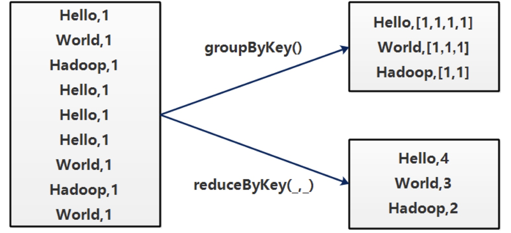

## Transformation

### `filter`：过滤

**Scala 版本**

```scala
val rdd = sc.makeRDD(Array("hello","hello","hello","world"))
rdd.filter(!_.contains("hello")).foreach(println)
// 结果：
// world
```

**Java 版本**

```java
List<Integer> data = Arrays.asList(1, 2, 3, 4, 5, 6, 7, 8, 9, 10); 
JavaRDD<Integer> rdd = jsc.parallelize(data,1);

Function<Integer, Boolean> filter = k -> ( k % 3 == 0);//过滤函数

JavaRDD<Integer> rddf = rdd.filter(filter);
```

**Python 版本**

```python
words = sc.parallelize(["scala","java","hadoop","spark","pyspark","pyspark and spark"])
words_filter = words.filter(lambda x: 'spark' in x)
```

### `map` 和 `flatMap`


**Java 版本**

```java
// map操作
JavaRDD<Integer> numbers = jsc.parallelize(Arrays.asList(14,21,88,99,455));
JavaRDD<Double> log_values = numbers.map(x -> Math.log(x));

// flatMap 操作
String path = "data/rdd/input/sample.txt";
JavaRDD<String> lines = jsc.textFile(path);
JavaRDD<String> words = lines.flatMap(s -> Arrays.asList(s.split(" ")).iterator()); 
```

### `sample` ：随机抽样

`sample(withReplacement: Boolean, fraction: Double, seed: Long)`

**参数**：

- withReplacement : 是否是放回式抽样

  - true代表如果抽中A元素，之后还可以抽取A元素

  - false代表如果抽住了A元素，之后都不在抽取A元素
- fraction : 抽样的比例
- seed : 抽样算法的初始值

```scala
val rdd = sc.makeRDD(Array(
  "hello1","hello2","hello3","hello4","hello5","hello6",
  "world1","world2","world3","world4"
))
rdd.sample(false, 0.3).foreach(println)

// 结果：
// hello4
// world1
// 在数据量不大的时候，不会很准确
```

### `groupByKey` 和 `reduceByKey`



**groupByKey**

在一个PairRDD或 `(k,v)` 二元组RDD上调用，返回一个 `(k,Iterable<v>)`。主要作用是将相同的所有的键值对分组到一个集合序列当中，其顺序是不确定的。groupByKey 是把所有的键值对集合都加载到内存中存储计算，若一个键对应值太多，则易导致内存溢出。

### `sortByKey`：按key进行排序

```scala
val rdd = sc.makeRDD(Array(
  (5,"Tom"),(10,"Jed"),(3,"Tony"),(2,"Jack")
))
rdd.sortByKey().foreach(println)
结果：
(2,Jack)
(3,Tony)
(5,Tom)
(10,Jed)
说明：
sortByKey(fasle)：倒序
```

### `sortBy`：自定义排序规则

```scala
object SortByOperator {
  def main(args: Array[String]): Unit = {
   val conf = new SparkConf().setAppName("TestSortBy").setMaster("local")
    val sc = new SparkContext(conf)
    val arr = Array(
        Tuple3(190,100,"Jed"),
        Tuple3(100,202,"Tom"),
        Tuple3(90,111,"Tony")
    )
    val rdd = sc.parallelize(arr)
    rdd.sortBy(_._1).foreach(println)
    /* (90,111,Tony)
       (100,202,Tom)
       (190,100,Jed)
     */
    rdd.sortBy(_._2).foreach(println)
    /*(190,100,Jed)
       (90,111,Tony)
       (100,202,Tom)
     */
    rdd.sortBy(_._3).foreach(println)
    /*
       (190,100,Jed)
       (100,202,Tom)
       (90,111,Tony)
     */
    sc.stop();
  }
}
```

### `distinct`：去掉重复数据

distinct算子实际上经过了以下步骤：


**Scala 版本**

```scala
val rdd = sc.makeRDD(Array(
      "hello",
      "hello",
      "hello",
      "world"
))
val distinctRDD = rdd
      .map {(_,1)}
      .reduceByKey(_+_)
      .map(_._1)
distinctRDD.foreach {println}
// 等价于：
rdd.distinct().foreach {println}
```

**Java 版本**

```java
List<String> data = Arrays.asList("Learn", "Apache", "Spark", "Learn", "Spark", "RDD", "Functions");
JavaRDD<String> words = jsc.parallelize(data, 1);
JavaRDD<String> rddDistinct = words.distinct();
```

### `join`

先看看SQL中的join，假设有如下两张表：table A是左表，table B是右表


不同join方式会有不同的结果

**1.Inner join**

产生的结果集是A和B的交集


执行SQL：

```sql
SELECT * FROM TableA
INNER JOIN TableB
ON TableA.name = TableB.name
```

结果：


**2.Left outer join**

产生表A的完全集，而B表中匹配的则有值，没有匹配的则以null值取代


执行SQL：

```sql
SELECT * FROM TableA
LEFT OUTER JOIN TableB
ON TableA.name = TableB.name
```

结果：


**3.Right outer join**

产生表B的完全集，而A表中匹配的则有值，没有匹配的则以null值取代

执行SQL：

```sql
SELECT * FROM TableA
RIGHT OUTER JOIN TableB
ON TableA.name = TableB.name
```

结果：


**4.Full outer join（MySQL不支持）**

产生A和B的并集，但是需要注意的是，对于没有匹配的记录，则会以null做为值


执行SQL：

```sql
SELECT * FROM TableA
FULL OUTER JOIN TableB
ON TableA.name = TableB.name
```

结果：


在Spark的算子中，对两个RDD进行join有着类似的作用
假设有两个RDD：

```scala
val nameList = List(
      (1,"Jed"),
      (2,"Tom"),
      (3,"Bob"),
      (4,"Tony")
)
   
val salaryArr = Array(
      (1,8000),
      (2,6000),
      (3,5000)
)

/*
 * parallelize(Seq[T],Int num)
 * 使用指定的集合(可以是List、Array等)来创建RDD
 * num 指定RDD的分区数，默认为1
 * 这个方法经常用于测试环境
 * join产生的RDD的分区数由分区数最多的父RDD决定
 */
val nameRDD = sc.parallelize(nameList,2)
val salaryRDD = sc.parallelize(salaryArr,3)
```

分别对4种join做测试：

```scala
val joinRDD = nameRDD.join(salaryRDD)
joinRDD.foreach( x => {
    val id = x._1
    val name = x._2._1
    val salary = x._2._2
    println(id + "\t" + name + "\t" + salary)
})
// 结果：
// 1 Jed 8000
// 2 Tom 6000
// 3 Bob 5000

val leftOuterJoinRDD = nameRDD.leftOuterJoin(salaryRDD)
leftOuterJoinRDD.foreach( x => {
      val id = x._1
      val name = x._2._1
      val salary = x._2._2
      println(id + "\t" + name + "\t" + salary)
}
// 结果
// 1 Jed Some(8000)
// 2 Tom Some(6000)
// 3 Bob Some(5000)
// 4 Tony None

val rightOuterJoinRDD = nameRDD.rightOuterJoin(salaryRDD)
rightOuterJoinRDD.foreach( x => {
      val id = x._1
      val name = x._2._1
      val salary = x._2._2
      println(id + "\t" + name + "\t" + salary)
})
// 结果：
// 1 Some(Jed) 8000
// 2 Some(Tom) 6000
// 3 Some(Bob) 5000

val fullOuterJoinRDD = nameRDD.fullOuterJoin(salaryRDD)
fullOuterJoinRDD.foreach( x => {
      val id = x._1
      val name = x._2._1
      val salary = x._2._2
      println(id + "\t" + name + "\t" + salary)
})
// 1 Some(Jed) Some(8000)
// 2 Some(Tom) Some(6000)
// 3 Some(Bob) Some(5000)
// 4 Some(Tony) None
```

### `cogroup`：同 fullOuterJoin

### `union`：把两个RDD进行逻辑上的合并

union这个算子关联的两个RDD必须类型一致

```scala
val rdd1 =sc.makeRDD(1 to 10)
val rdd2 = sc.parallelize(11 until 20)
rdd1.union(rdd2).foreach {println}
```

### `map` 和 `mapPartitions`

`map()` 会一条记录为单位进行操作

```scala
val arr = Array("Tom","Bob","Tony","Jerry")
//把4条数据分到两个分区中
val rdd = sc.parallelize(arr,2)
   
/*
 * 模拟把RDD中的元素写入数据库的过程
 */
rdd.map(x => {
  println("创建数据库连接...")
  println("写入数据库...")
  println("关闭数据库连接...")
}).count()

// 结果：
// 创建数据库连接...
// 写入数据库...
// 关闭数据库连接...

// 创建数据库连接...
// 写入数据库...
// 关闭数据库连接...

// 创建数据库连接...
// 写入数据库...
// 关闭数据库连接...

// 创建数据库连接...
// 写入数据库...
// 关闭数据库连接...
```

`mapPartitions` 以分区为单位进行操作

```scala
/*
 * 将RDD中的数据写入到数据库中，绝大部分使用mapPartitions算子来实现
 */
rdd.mapPartitions(x => {
  println("创建数据库")
  val list = new ListBuffer[String]()
  while(x.hasNext){
    //写入数据库
    list += x.next()+":写入数据库"
  }
  //执行SQL语句  批量插入
  list.iterator
}).foreach(println)

// 结果：
// 创建数据库
// Tom:写入数据库
// Bob:写入数据库 
// 创建数据库
// Tony:写入数据库
// Jerry:写入数据库
```

### `mapPartitionsWithIndex`

```scala
val dataArr = Array("Tom01","Tom02","Tom03"
                  ,"Tom04","Tom05","Tom06"
                  ,"Tom07","Tom08","Tom09"
                  ,"Tom10","Tom11","Tom12")
val rdd = sc.parallelize(dataArr, 3);
val result = rdd.mapPartitionsWithIndex((index,x) => {
    val list = ListBuffer[String]()
    while (x.hasNext) {
      list += "partition:"+ index + " content:" + x.next
    }
    list.iterator
})
println("分区数量:" + result.partitions.size)
val resultArr = result.collect()
for(x <- resultArr){
  println(x)
}

// 结果：
// 分区数量:3
// partition:0 content:Tom01
// partition:0 content:Tom02
// partition:0 content:Tom03
// partition:0 content:Tom04
// partition:1 content:Tom05
// partition:1 content:Tom06
// partition:1 content:Tom07
// partition:1 content:Tom08
// partition:2 content:Tom09
// partition:2 content:Tom10
// partition:2 content:Tom11
// partition:2 content:Tom12
```

### `coalesce`：改变RDD的分区数

```scala
/*
 * false:不产生shuffle
 * true:产生shuffle
 * 如果重分区的数量大于原来的分区数量,必须设置为true,否则分区数不变
 * 增加分区会把原来的分区中的数据随机分配给设置的分区个数
 */
val coalesceRdd = result.coalesce(6,true)
   
val results = coalesceRdd.mapPartitionsWithIndex((index,x) => {
  val list = ListBuffer[String]()
  while (x.hasNext) {
      list += "partition:"+ index + " content:[" + x.next + "]"
  }
  list.iterator
})
   
println("分区数量:" + results.partitions.size)
val resultArr = results.collect()
for(x <- resultArr){
  println(x)
}

结果：
分区数量:6
partition:0 content:[partition:1 content:Tom07]
partition:0 content:[partition:2 content:Tom10]
partition:1 content:[partition:0 content:Tom01]
partition:1 content:[partition:1 content:Tom08]
partition:1 content:[partition:2 content:Tom11]
partition:2 content:[partition:0 content:Tom02]
partition:2 content:[partition:2 content:Tom12]
partition:3 content:[partition:0 content:Tom03]
partition:4 content:[partition:0 content:Tom04]
partition:4 content:[partition:1 content:Tom05]
partition:5 content:[partition:1 content:Tom06]
partition:5 content:[partition:2 content:Tom09]

val coalesceRdd = result.coalesce(6,fasle)的结果是：
分区数量:3
partition:0 content:[partition:0 content:Tom01]
partition:0 content:[partition:0 content:Tom02]
partition:0 content:[partition:0 content:Tom03]
partition:0 content:[partition:0 content:Tom04]
partition:1 content:[partition:1 content:Tom05]
partition:1 content:[partition:1 content:Tom06]
partition:1 content:[partition:1 content:Tom07]
partition:1 content:[partition:1 content:Tom08]
partition:2 content:[partition:2 content:Tom09]
partition:2 content:[partition:2 content:Tom10]
partition:2 content:[partition:2 content:Tom11]
partition:2 content:[partition:2 content:Tom12]

val coalesceRdd = result.coalesce(2,fasle)的结果是：
分区数量:2
partition:0 content:[partition:0 content:Tom01]
partition:0 content:[partition:0 content:Tom02]
partition:0 content:[partition:0 content:Tom03]
partition:0 content:[partition:0 content:Tom04]
partition:1 content:[partition:1 content:Tom05]
partition:1 content:[partition:1 content:Tom06]
partition:1 content:[partition:1 content:Tom07]
partition:1 content:[partition:1 content:Tom08]
partition:1 content:[partition:2 content:Tom09]
partition:1 content:[partition:2 content:Tom10]
partition:1 content:[partition:2 content:Tom11]
partition:1 content:[partition:2 content:Tom12]

val coalesceRdd = result.coalesce(2,true)的结果是：
分区数量:2
partition:0 content:[partition:0 content:Tom01]
partition:0 content:[partition:0 content:Tom03]
partition:0 content:[partition:1 content:Tom05]
partition:0 content:[partition:1 content:Tom07]
partition:0 content:[partition:2 content:Tom09]
partition:0 content:[partition:2 content:Tom11]
partition:1 content:[partition:0 content:Tom02]
partition:1 content:[partition:0 content:Tom04]
partition:1 content:[partition:1 content:Tom06]
partition:1 content:[partition:1 content:Tom08]
partition:1 content:[partition:2 content:Tom10]
partition:1 content:[partition:2 content:Tom12]
```

### `repartition`：改变RDD分区数

`repartition(int n) = coalesce(int n, true)`

### `partitionBy`：通过自定义分区器改变RDD分区数

```java
JavaPairRDD<Integer, String> partitionByRDD = nameRDD.partitionBy(new Partitioner() {
              
    private static final long serialVersionUID = 1L;
    
    //分区数2
    @Override
    public int numPartitions() {
        return 2;
    }
    //分区逻辑
    @Override
    public int getPartition(Object obj) {
        int i = (int)obj;
        if(i % 2 == 0){
            return 0;
        }else{
            return 1;
        }
    }
});
​```  

#### `glom`：把分区中的元素封装到数组中


​```scala
val rdd = sc.parallelize(1 to 10,2) 
/**
 *  rdd有两个分区
 *   partition0分区里面的所有元素封装到一个数组
 *   partition1分区里面的所有元素封装到一个数组
 */
val glomRDD = rdd.glom()
glomRDD.foreach(x => {
  println("============")
  x.foreach(println)
  println("============")
})
println(glomRDD.count())

// 结果：
// ============
// 1
// 2
// 3
// 4
// 5
// ============
// ============
// 6
// 7
// 8
// 9
// 10
// ============
// 2
```

### `randomSplit`：拆分RDD

```scala
/**
 * randomSplit:
 *   根据传入的 Array中每个元素的权重将rdd拆分成Array.size个RDD
 *  拆分后的RDD中元素数量由权重来决定，数据量不大时不一定准确
 */
val rdd = sc.parallelize(1 to 10)
rdd.randomSplit(Array(0.1,0.2,0.3,0.4)).foreach(x => {println(x.count)})

// 理论结果：
// 1
// 2
// 3
// 4
// 实际结果不一定准确
```

## Actions

### `count`：统计RDD中元素的个数

**Scala 版本**

```scala
val rdd = sc.makeRDD(Array("hello","hello","hello","world"))
val num = rdd.count()
println(num)
结果：
4
```

**Python 版本**

```python
words = sc.parallelize(["scala","java","hadoop","spark","pyspark","pyspark and spark"])
counts = words.count()
print(counts)
```

### `foreach`：遍历RDD中的元素

**Scala 版本**

```scala
val rdd = sc.makeRDD(Array("hello","hello","hello","world"))
rdd.foreach(println)

// 结果：
// hello
// hello
// hello
// world
```

**Java 版本**

```java
List<String> data = Arrays.asList("Learn","Apache","Spark","with","Tutorial Kart"); 
JavaRDD<String> items = jsc.parallelize(data,1);

// apply a function for each element of RDD
items.foreach(new VoidFunction<String>(){ 
    public void call(String item) {
        System.out.println("* "+item); 
    }
});

// Java8的lambda写法如下：
items.foreach(item -> {
    System.out.println("* "+item); 
});
```

**Python 版本**

```python
words = sc.parallelize(["scala","java","hadoop","spark","pyspark","pyspark and spark"])
words.foreach(lambda x : print(x) )
```

### `foreachPartition`

`foreach`以一条记录为单位来遍历RDD；`foreachPartition`以分区为单位遍历RDD

`foreach` 和 `foreachPartition` 都是actions算子；`map` 和 `mapPartition` 可以与它们做类比，但`map` 和 `mapPartition` 是transformations算子

```scala
//设置rdd的分区数为2
val rdd = sc.parallelize(1 to 6, 2)
rdd.foreachPartition(x => {
  println("data from a partition:")
  while(x.hasNext) {
    println(x.next())
  }
})

// 结果：
// data from a partition:
// 1
// 2
// 3
// data from a partition:
// 4
// 5
// 6
```

### `collect`：把运行结果拉回到Driver端

**Scala 版本**

```
val rdd = sc.makeRDD(Array(
  (5,"Tom"),(10,"Jed"),(3,"Tony"),(2,"Jack")
))
val resultRDD = rdd.sortByKey()
val list = resultRDD.collect()
list.foreach(println)
结果：
(2,Jack)
(3,Tony)
(5,Tom)
(10,Jed)
```

**Python 版本**

```python
words = sc.parallelize(["scala","java","hadoop","spark","pyspark","pyspark and spark"])
coll = words.collect()
print("Elements in RDD -> %s" % coll)
```

### `take(n)`：取RDD中的前n个元素

```scala
val rdd = sc.makeRDD(Array("hello","hello","hello","world"))
rdd.take(2).foreach(println)
// 结果：
// hello
// hello
```

### `first` ：相当于 `take(1)`

```scala
val rdd = sc.makeRDD(Array("hello","hello","hello","world"))
println(rdd.first)
// 结果：
// Hello
```

### `reduce`：按照指定规则聚合RDD中的元素

**Scala 版本**

```scala
val numArr = Array(1,2,3,4,5)
val rdd = sc.parallelize(numArr)
val sum = rdd.reduce(_+_)
println(sum)
// 结果：
// 15
```

**Java 版本**

```java
JavaRDD<Integer> numbers = jsc.parallelize(Arrays.asList(14,21,88,99,455));
int sum = numbers.reduce((a,b)->a+b);
```

### `countByKey`：统计出 KV 格式的 RDD 中相同的 K 的个数

```
val rdd = sc.parallelize(Array(
  ("销售部","Tom"), ("销售部","Jack"),("销售部","Bob"),("销售部","Terry"),
  ("后勤部","Jack"),("后勤部","Selina"),("后勤部","Hebe"),
  ("人力部","Ella"),("人力部","Harry"),
  ("开发部","Allen")
))
val result = rdd.countByKey();
result.foreach(println)
结果：
(后勤部,3)
(开发部,1)
(销售部,4)
(人力部,2)
```

### `countByValue`：统计出 RDD 中每个元素的个数

```
val rdd = sc.parallelize(Array(
  "Tom","Jed","Tom",
  "Tom","Jed","Jed",
  "Tom","Tony","Jed"
))
val result = rdd.countByValue();
result.foreach(println)
结果：
(Tom,4)
(Tony,1)
(Jed,4)
```