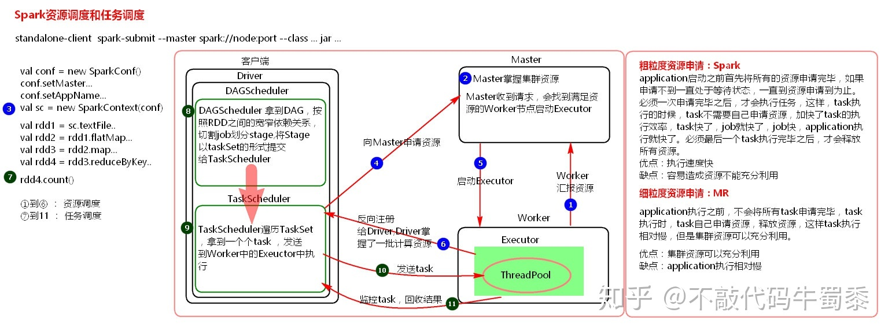

## 概述

Spark 最初由美国加州大学伯克利分校（UC Berkeley）的 AMP 实验室于 2009 年开发，是**基于内存计算的大数据并行计算框架，可用于构建大型的、低延迟的数据分析应用程序**。

Spark 具有如下几个主要特点：

- **运行速度快**：Spark 使用先进的 **有向无环图（Directed Acyclic Graph，DAG）** 执行引擎，以支持循环数据流与内存计算，基于内存计算的执行速度比 MapReduce 快上百倍，基于磁盘的执行速度也能快上十倍【备注:[Spark比MapReduce快的原因](hadoop/spark/Spark比MapReduce快的原因.md)】
- **容易使用**：Spark 支持使用 Scala、Java、Python 和 R 语言进行编程，简洁的 API 设计有助于用户轻松构建并行程序，并且可以通过 Spark Shell 进行交互式编程
- **通用性**：Spark 提供了完整而强大的技术栈，包括 SQL 查询、流式计算、机器学习和图算法组件，这些组件可以无缝整合在同一个应用中，足以应对复杂的计算
- **运行模式多样**：Spark 可运行于独立的集群模式中，或者运行于 Hadoop 中，也可运行在云环境中，并且可以访问 HDFS、Cassandra、HBase、Hive 等多种数据源

## Spark 生态系统

Spark 的设计遵循“*一个软件栈满足不同应用场景*” 的理念，逐渐形成了一套完整的生态系统，即能够提供内存计算框架、也可以支持 SQL 即席查询、实时流式计算、机器学习和图计算等。Spark 可以部署在资源管理器 YARN 之上，提供一站式的大数据解决方案。

Spark 的生态系统主要包含了 `Spark Core`、`Spark SQL`、`Spark Streaming`、`MLlib` 和 `GraphX` 等组件，各个组件的具体功能如下：

- `Sprak Core`：Spark Core  包含 Spark 最基础和最核心的功能，如内存计算、任务调度、部署模式、故障恢复、存储管理等，主要面向批数据处理。Spark Core 建立在统一的抽象 RDD 之上，使其可以以基本一致的方式应对不同的大数据处理场景；需要注意的是，Spark Core 通常被简称为 Spark
- `Spark SQL`：Spark SQL 是用于结构化数据处理的组件，允许开发人员直接处理 RDD，同时也可以查询 Hive、HBase 等外部数据源。Spark SQL 的一个重要特点是其能够统一处理关系表和 RDD，使得开发人员不需要自己编写 Spark 应用程序，开发人员可以轻松地使用 SQL 命令进行查询，并进行更复杂的数据分析
- `Spark Streaming`：Spark Streaming 是一种流计算框架，可以支持高吞吐量、可容错处理的实时流数据处理，其核心思路是将流数据分解成一系列短小的批处理作业，每个短小的批处理作业都可以使用 Spark Core 进行快速处理。Spark Streaming 支持多种数据输入源，如 Kafka、Flume 和 TCP 套接字等
- `MLlib`：MLlib 提供了常用机器学习算法的实现，包括聚类、分类、回归、协同过滤等，降低了机器学习的门槛，开发人员只要具备一定的理论知识就能进行机器学习方面的工作
- `GraphX`（图计算）：GraphX 是 Spark 中用于图计算的 API，可认为是 Pregel 在 Spark 上的重写及优化，GraphX 性能良好，拥有丰富的功能和运算符，能在海量数据上自如地运行复杂的图算法

注：无论是 Spark SQL、Spark Streaming、MLlib 还是 GraphX，都可以使用 Spark Core 的 API 处理问题，它们的方法几乎是通用的，处理的数据也可以共享，不同应用之间的数据可以无缝集成。

**Spark 的应用场景**

|         应用场景         |   时间跨度   |       其他框架        | Spark 生态系统中的组件 |
| :----------------------: | :----------: | :-------------------: | :--------------------: |
|    复杂的批量数据处理    |    小时级    |    MapReduce、Hive    |       Spark Core       |
| 基于历史数据的交互式查询 | 分钟级、秒级 | Impala、Dremel、Drill |       Spark SQL        |
| 基于实时数据流的数据处理 | 毫秒级、秒级 |       Storm、S4       |    Spark Streaming     |
|  基于历史数据的数据挖掘  |      -       |        Mahout         |         MLlib          |
|     图结构数据的处理     |      -       |     Pregel、Hama      |         GraphX         |

## Spark 基本概念

**`Application`**

用户编写的 Spark 程序，通过一个有 main 方法的类执行，完成一个计算任务的处理。它是由一个 Driver 程序和一组运行于 Spark 集群上的 Executor 组成。

**`RDD`**

弹性分布式数据集是 Spark 框架中的核心概念。通过一系列算子进行操作，当 RDD 遇到 Action 算子时，将之前的所有算子形成一个有向无环图（DAG），再在Spark中转化为Job，提交到集群执行。

**`SparkContext`**

SparkContext 是 Spark 的入口，负责连接 Spark 集群，申请计算资源、创建 RDD、累积量和广播量等。从本质上来说，SparkContext 是 Spark 的对外接口，负责向调用者提供 Spark 的各种功能。

Driver program 通过 SparkContext 连接到集群管理器来实现对集群中任务的控制。Spark 配置参数的设置以及对 ~~SQLContext、HiveContext~~ SparkSession（包含了 SQLContext 和 HiveContext） 和 StreamingContext 的控制也要通过 SparkContext 进行。

> Only one SparkContext may be active per JVM.  You must stop() the active SparkContext before creating a new one.  This limitation may eventually be removed; see SPARK-2243 for more details.
>
> 每个 JVM 只有一个 SparkContext,一台服务器可以启动多个 JVM。

**`Driver`**

运行 main 方法的 Java 虚拟机进程，负责监听 Application 的 Executor 进程发来的通信和连接，将工程 jar 发送到所有的 Executor 进程中

Driver 与 Master、Worker 协作完成 Application 进程的启动、DAG划分、计算任务封装、分配 task 到 Executor上、计算资源的分配等调度执行作业等

Driver 调度 Task 给 Executor 执行，所以 Driver 最好和 Spark 集群在一片网络内，以便通信

Driver 进程通常在 Worker 节点中，和 Cluster Manager 不在同一个节点上

Cluster Manager 作用对象是整个 Spark 集群(集群资源分配)所有应用，而 Driver 是作用于某一个应用(协调已经分配给 Application 的资源)，管理层面不一样

**`Worker`**

集群中的工作节点，启动并运行 Executor 进程，运行作业代码的节点

- standalone 模式下：Worker 进程所在节点
- yarn 模式下：yarn 的 NodeManager 进程所在的节点
- 
**`Executor`**

运行在 Worker 节点上，负责执行作业的任务，并将数据保存在内存或磁盘中

每个 Spark Application，都有属于自己的 Executor 进程，Spark Application 不会共享一个 Executor 进程

> 在启动参数中有 `executor-cores`、`executor-memory`，每个 Executor 都会占用 cpu core 和内存，又 Spark Application 间不会复用 Executor，则很容易导致 Worker 资源不足

Executor 在整个 Spark Application 运行的生命周期内可以动态增加/释放

Executor 使用多线程运行 SparkContext 分配过来的 task，来一批 task 就执行一批

**`Job`**

一个 Spark Application 可能会被分为多个 Job，每次调用 Action 时，逻辑上会生成一个 Job，一个 Job 包含了一个或多个 Stage。

> 在每个 Spark Application 内部，多个 Job 可以并行执行。

**`Stage`**

每个 Job 都会划分为一个或多个 Stage（阶段），每个 Stage 都会有对应的一批 task(即一个 taskset)，分配到 Executor 上去执行

Stage 包括两类：`ShuffleMapStage` 和 `ResultStage`，如果用户程序中调用了需要进行 Shuffle 计算的 Operator，如 groupByKey 等，就会以 Shuffle 为边界分成 ShuffleMapStage 和 ResultStage。

如果一次 Shuffle 都没执行，那就只有一个 Stage

**`TaskSet`**

一组关联的，但相互之间没有 Shuffle 依赖关系的 Task 集合，Stage 可以直接映射为 TaskSet，一个 TaskSet 封装了一次需要运算的、具有相同处理逻辑的 Task，这些 Task 可以并行计算，粗粒度的调度是以 TaskSet 为单位的。

> 一个 Stage 对应一个 Taskset

**`Task`**

Driver 发送到 Executor 上执行的计算单元，每个 task 负责在一个阶段(Stage)，处理一小片数据，计算出对应的结果

Task 是在物理节点上运行的基本单位，Task 包含两类：`ShuffleMapTask` 和 `ResultTask`，分别对应于 Stage 中 ShuffleMapStage 和 ResultStage 中的一个执行基本单元。

InputSplit-task-partition 有一一对应关系，Spark 会为每一个 partition 运行一个 task 来进行处理

手动设置 task 数量：`spark.default.parallelism`

**`Cluster Manager`**

集群管理器，为每个 Spark Application 在集群中调度和分配资源的组件，如 Spark Standalone、YARN、Mesos 等

Cluster Manager 一般采用 Master-Slave 结构。

以 Yarn 为例，部署 ResourceManager 服务的节点为 Master，负责集群中所有计算资源的统一管理和分配；部署 NodeManager 服务的节点为 Slave，负责在当前节点创建一个或多个具备独立计算能力的 JVM 实例，在 Spark 中，这些节点也叫做 Worker。另外还有一个 Client 节点的概念，是指用户提交 Spark Application 时所在的节点。

## Spark 运行架构

Spark 运行架构指的也就是 Spark Core 的运行架构。

- [Spark运行架构](hadoop/spark/Spark运行架构.md) 

## Spark 安装部署

 [Spark安装和使用](hadoop/spark/Spark安装和使用.md) 

 [Spark的部署模式](hadoop/spark/Spark的部署模式.md) 

 [Spark和Hadoop的统一部署](hadoop/spark/Spark和Hadoop的统一部署.md) 

## Spark 开发

> 应用开发者可以用标准的 API 接口创建基于 Spark 的应用，目前 Spark 提供了 Scala,Java,Python 三种程序设计语言的 API。

 [Spark引入](hadoop/spark/Spark引入.md) 

## Spark 解析

### Spark 的资源调度和任务调度

Spark资源调度流程图：

流程详解如下：

集群启动之后，Worker 节点会向 Master 节点汇报资源情况，Master 就掌握了集群资源情况。

当 Spark 提交一个 Application 后，会根据 RDD 之间的依赖关系将 Application 形成一个 DAG 有向无环图。任务提交之后，Spark 会在 Driver 端创建两个对象：DAGScheduler 和 TaskScheduler。

DAGScheduler 是任务调度的高层调度器，是一个对象。DAGScheduler 的主要作用就是将 DAG 根据 RDD 之间的宽窄依赖关系划分为一个个的 Stage，然后将这些 Stage 以 TaskSet 的形式提交给 TaskScheduler(TaskScheduler 是任务调度的低层调度器，这里 TaskSet 其实就是一个集合，里面封装的就是一个个的 task 任务，也就是 stage 中的并行度 task 任务)。

TaskSchedule 会遍历 TaskSet 集合，拿到每个 task 后会将 task 发送到计算节点 Executor 中去执行（其实就是发送到 Executor 中的线程池 ThreadPool 去执行）。

task 在 Executor 线程池中的运行情况会向 TaskScheduler 反馈，当 task 执行失败时，则由 TaskScheduler 负责重试，将 task 重新发送给 Executor 去执行，默认重试 3 次。如果重试 3 次依然失败，那么这个 task 所在的 stage 就失败了。stage 失败了则由 DAGScheduler 来负责重试，重新发送 TaskSet 到 TaskSchdeuler，Stage 默认重试 4 次。如果重试 4 次以后依然失败，那么这个 job 就失败了。job 失败了，Application 就失败了。因此一个 task 默认情况下重试 `3*4=12` 次。

TaskScheduler 不仅能重试失败的 task，还会重试 straggling（落后，缓慢）task（也就是执行速度比其他 task 慢太多的task）。如果有运行缓慢的 task 那么 TaskScheduler 会启动一个新的 task 来与这个运行缓慢的 task 执行相同的处理逻辑。两个 task 哪个先执行完，就以哪个 task 的执行结果为准。这就是 Spark 的推测执行机制。在 Spark 中推测执行默认是关闭的。推测执行可以通过 `spark.speculation` 属性来配置。

注意：

1. 对于ETL类型要入数据库的业务要关闭推测执行机制，这样就不会有重复的数据入库
2. 如果遇到数据倾斜的情况，开启推测机制则有可能导致一直会有task重新启动处理相同的逻辑，任务可能一直处于处理不完的状态

~~**粗粒度资源申请和细粒度资源申请**~~

粗粒度资源申请（Spark）：

在Applicatioin执行之前，将所有的资源申请完毕，当资源申请成功后，才会进行任务的调度，当所有的task执行完成后，才会释放这部分资源。

优点：在Application执行之前，所有的资源都申请完毕，每一个task直接使用资源就可以了，不需要task在执行前自己去申请资源，task启动就快了，stage执行就快了，job就快了，application执行就快了

缺点：直到最后一个task执行完成才会释放资源，集群的资源无法充分利用

细粒度资源申请（MapReduce）：

Application执行之前不需要先去申请资源，而是直接执行，让job中的每一个task在执行前自己去申请资源，task执行完成后，就释放资源

优点：集群资源可以充分利用

缺点：task自己去申请资源，task启动变慢，Application的运行就相应的变慢了。