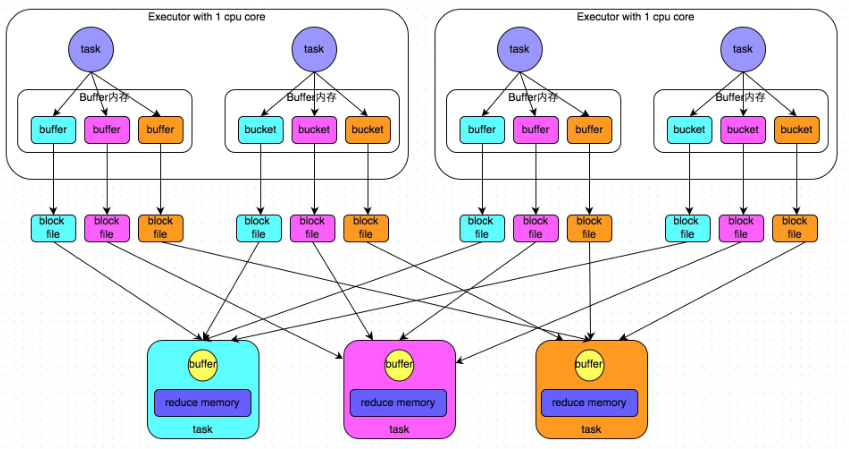
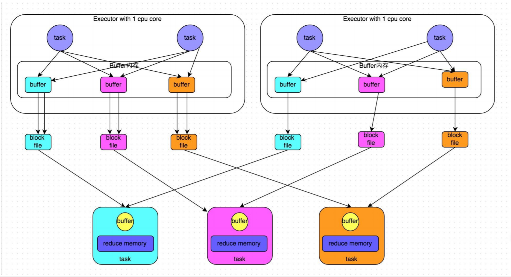
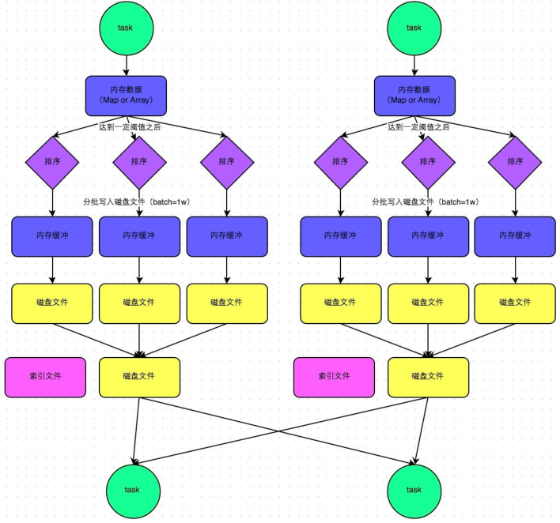
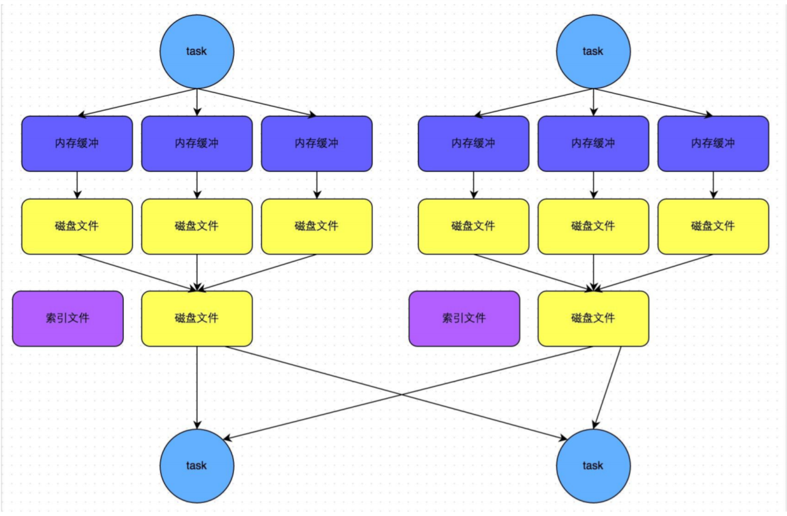

# Spark Shuffle

Spark Shuffle 分为两个步骤：`Shuffle Write` 和 `Shuffle Read`。

- `Shuffle Write`：上一个 stage 的每个 map task 就必须保证将自己处理的当前分区中的数据相同的 key 写入一个分区文件中，可能会写入多个不同的分区文件中
- `Shuffle Read`：reduce task 就会从上一个 stage 的所有 task 所在的机器上寻找属于自己的那些分区文件，这样就可以保证每一个 key 所对应的 value 都会汇聚到同一个节点上去处理和聚合

> Spark 中有两种 Shuffle 类型，HashShuffle 和 SortShuffle
> 
> Spark1.1 之前是 HashShuffle 默认的分区器是 HashPartitioner，Spark1.1 引入 SortShuffle，默认的分区器是 RangePartitioner

## HashShuffle

> HashShuffleManager 适合小数据量

如图，会产生 4*3 个小文件：

​     每一个map task将 ***不同结果写到不同的buffer*** 中，每个buffer的大小为 ***32K*** 。*buffer起到数据缓存的作用* 

​     Map task会根据 ***分区器（默认是hashPartitioner）\***算出当前key需写入的 ***partition***，然后经过对应的缓存***写入单独的文件***，所以 buffer缓存的个数即小文件的个数由 下一个Stage的并行度（ ReduceTask个数）决定，使得 ***每一个task*** 产生 ***R个文件 （***ReduceTask个数***）***。

​     如果有 ***m个MapTask*** ，则 有 ***M\*R 个小文件*** 。

​     然后Reduce Task来拉取对应的磁盘小文件。

**开启：**

​    ***spark.shuffle.manager=hash\***

***产生的磁盘小文件过多，会导致以下问题：***

​    *a)	在Shuffle Write过程中会产生很多写磁盘小文件的对象。*

​    *b)	在Shuffle Read过程中会产生很多读取磁盘小文件的对象。*

​    *c)	在JVM堆内存中对象过多会造成频繁的gc,gc还无法解决运行所需要的内存 的话，就会OOM。*

​    *d)	在数据传输过程中会有频繁的网络通信，频繁的网络通信出现通信故障的可能性大大增加，一旦网络通信出现了故障会导致shuffle file cannot find 由于这个错误导致的task失败，TaskScheduler不负责重试，由DAGScheduler负责重试Stage。*

**HashShuffler Consolidate合并机制**

如图 会产生 2*3 个小文件：

​     每个 Executor 里的 MapTask ***共用*** ***一个Buffer写缓存*** 。

​     也就是 ***一个Excutor*** 才有 ***R个小文件*** 。

​     所有小文件数量会减少到 ***C\*R*** 个 （C指 ***在Mapper端能够使用的Core数 ，有多少个Core就可以设置多少个Executor***）

**开启方法：**

​     ***spark.shuffle.consolidateFiles=true***

## SortShuffle

 ***SortShuffleManager 适合大数据量***

  

如图：

​    ***MapTask\*** 处理 Partition 里的数据时，会向一个大小为 ***5M*** 的 ***内存数据结构*** 里写数据。

​    每 ***插入32次*** 数据，就会 ***检查一次*** 内存大小，如果内存大小 ***size*** 超过 ***5M*** 就会***申请*** ***（size\*2 - 5）M\***  的空间，如果申请成功不会进行溢写，如果申请不成功，这时候会发生溢写磁盘。

​    溢写会先 ***排序 与 分区***，再以每个 batch 为 ***1万条*** 数据溢写到 ***32k*** 的内存缓存区，然后再***溢写到磁盘***（产生大量磁盘小文件）。

​    MapTask结束后，会将将这些 ***小文件\*** ***合并*** 成 ***一个大文件*** 和 ***一个索引文件*** 。

​    ***ReduceTask\*** 从MapTask拉取数据时（***最大***  可以拉取 ***48M***），首先解析索引文件，根据索引文件再去拉取对应的数据。

​    后会将这些文件放到 Executor 的 ***shuffle聚合内存***（为Executor内存的 ***20%***）聚合。

​    所以所以SortShuffler会产生 ***2\*M*** 个文件  （2为 *一个大文件一个索引文件* ，M为 *MapTask个数*  ）

开启：

​    ***spark.shuffle.manager=sort   sort为1.6默认\***

**bypass运行机制**

​    当数据量比较小，或者 不需要要对数据进行排序，这是SortShuffler中的排序就没有用了。

​    **触发 不进行排序** 的条件：

​         **·** 当 shuffle ***ReduceTask*** 的个数 ***小于*** 参数值时，***spark.shuffle.sort.bypassMergeThreshold\*** ***默认值 200***。

​         **·** ***不是***  聚合类shuffle算子时

​    

## Shuffle Read

Reduce 去拖 map 的输出数据，Spark 提供了两套不同的拉取数据框架：

1. 通过 socket 连接去取数据；
2. 使用 netty 框架去取数据。

每个节点的 Executor 会创建一个 BlockManager，其中会创建一个 BlockManagerWorker 用于响应请求。当 reduce 的 GET_BLOCK 的请求过来时，读取本地文件将这个 blockId 的数据返回给 reduce。如果使用的是 Netty 框架，BlockManager 会创建 ShuffleSender 用于发送 shuffle 数据。

并不是所有的数据都是通过网络读取，对于在本地节点的 map 数据，reduce 直接去磁盘上读取而不再通过网络框架。

## Shuffle 调优

### 配置参数的三种方式

1. 在程序中硬编码，例如 `sparkConf.set("spark.shuffle.file.buffer","64k")`
2. 提交 application 时在命令行指定，例如 `spark-submit --conf spark.shuffle.file.buffer=64k --conf 配置信息=配置值 ...`；推荐该种方式
3. 修改 `SPARK_HOME/conf/spark-default.conf` 配置文件

| 参数                                    | 默认值 | 参数说明                                                                                                                                                                                                                                                                                  | 调优建议                                                                                                                                                                                                                                                                                                                                                   |
| --------------------------------------- | ------ | ----------------------------------------------------------------------------------------------------------------------------------------------------------------------------------------------------------------------------------------------------------------------------------------- | ---------------------------------------------------------------------------------------------------------------------------------------------------------------------------------------------------------------------------------------------------------------------------------------------------------------------------------------------------------- |
| spark.shuffle.file.buffer               | 32K    | 该参数用于设置shuffle write task的BufferedOutputStream的buffer缓冲大小。将数据写到磁盘文件之前，会先写入buffer缓冲中，待缓冲写满之后，才会溢写到磁盘。                                                                                                                                    | 如果作业可用的内存资源较为充足的话，可以适当增加这个参数的大小（比如64k），从而减少shuffle write过程中溢写磁盘文件的次数，也就可以减少磁盘IO次数，进而提升性能。在实践中发现，合理调节该参数，性能会有1%~5%的提升。                                                                                                                                        |
| spark.reducer.maxSizeInFlight           | 48M    | 该参数用于设置shuffle read task的buffer缓冲大小，而这个buffer缓冲决定了每次能够拉取多少数据。                                                                                                                                                                                             | 如果作业可用的内存资源较为充足的话，可以适当增加这个参数的大小（比如96M），从而减少拉取数据的次数，也就可以减少网络传输的次数，进而提升性能。在实践中发现，合理调节该参数，性能会有1%~5%的提升。                                                                                                                                                           |
| spark.shuffle.io.maxRetries             | 3      | shuffle read task从shuffle write task所在节点拉取属于自己的数据时，如果因为网络异常导致拉取失败，是会自动进行重试的。该参数就代表了可以重试的最大次数。如果在指定次数之内拉取还是没有成功，就可能会导致作业执行失败。                                                                     | 对于那些包含了特别耗时的shuffle操作的作业，建议增加重试最大次数（比如60次），以避免由于JVM的full gc或者网络不稳定等因素导致的数据拉取失败。在实践中发现，对于针对超大数据量（数十亿~上百亿）的shuffle过程，调节该参数可以大幅度提升稳定性。                                                                                                                |
| spark.shuffle.io.retryWait              | 5s     | 具体解释同上，该参数代表了每次重试拉取数据的等待间隔，默认是5s。                                                                                                                                                                                                                          | 建议加大间隔时长（比如60s），以增加shuffle操作的稳定性。                                                                                                                                                                                                                                                                                                   |
| spark.shuffle.memoryFraction            | 0.2    | 该参数代表了Executor内存中，分配给shuffle read task进行聚合操作的内存比例，默认是20%。                                                                                                                                                                                                    | 在资源参数调优中讲解过这个参数。如果内存充足，而且很少使用持久化操作，建议调高这个比例，给shuffle read的聚合操作更多内存，以避免由于内存不足导致聚合过程中频繁读写磁盘。在实践中发现，合理调节该参数可以将性能提升10%左右。                                                                                                                                |
| spark.shuffle.manager                   | sort   | 该参数用于设置ShuffleManager的类型。Spark 1.5以后，有三个可选项：hash、sort和tungsten-sort。HashShuffleManager是Spark 1.2以前的默认选项，但是Spark 1.2以及之后的版本默认都是SortShuffleManager了。tungsten-sort与sort类似，但是使用了tungsten计划中的堆外内存管理机制，内存使用效率更高。 | 由于SortShuffleManager默认会对数据进行排序，因此如果你的业务逻辑中需要该排序机制的话，则使用默认的SortShuffleManager就可以；而如果你的业务逻辑不需要对数据进行排序，那么建议参考后面的几个参数调优，通过bypass机制或优化的HashShuffleManager来避免排序操作，同时提供较好的磁盘读写性能。这里要注意的是，tungsten-sort要慎用，因为之前发现了一些相应的bug。 |
| spark.shuffle.sort.bypassMergeThreshold | 200    | 当ShuffleManager为SortShuffleManager时，如果shuffle read task的数量小于这个阈值（默认是200），则shuffle write过程中不会进行排序操作，而是直接按照未经优化的HashShuffleManager的方式去写数据，但是最后会将每个task产生的所有临时磁盘文件都合并成一个文件，并会创建单独的索引文件。         | 当你使用SortShuffleManager时，如果的确不需要排序操作，那么建议将这个参数调大一些，大于shuffle read task的数量。那么此时就会自动启用bypass机制，map-side就不会进行排序了，减少了排序的性能开销。但是这种方式下，依然会产生大量的磁盘文件，因此shuffle write性能有待提高。                                                                                   |
| spark.shuffle.consolidateFiles          | false  | 如果使用HashShuffleManager，该参数有效。如果设置为true，那么就会开启consolidate机制，会大幅度合并shuffle write的输出文件，对于shuffle read task数量特别多的情况下，这种方法可以极大地减少磁盘IO开销，提升性能。                                                                           | 如果的确不需要SortShuffleManager的排序机制，那么除了使用bypass机制，还可以尝试将spark.shffle.manager参数手动指定为hash，使用HashShuffleManager，同时开启consolidate机制。在实践中尝试过，发现其性能比开启了bypass机制的SortShuffleManager要高出10%~30%。                                                                                                   |
