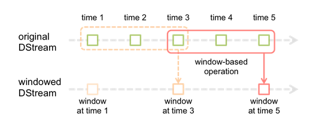

# DStream

DStream（离散数据流） 是 Spark Streaming 提供的基本的抽象，它代表了连续的数据流。与 RDD 类似，DStream 有两种产生方式，一种是从源中获取的输入流，另一种则是输入流通过转换算子生成的处理后的数据流。

在内部，DStreams 由一系列连续的 RDD 组成。

DStreams 中的每个 RDD 都包含确定时间间隔内的数据，如下图所示：


任何对 DStream 的操作都转换成了对 DStream 隐含的 RDD 的操作。

## 输入 DStream

输入 DStream 表示从数据源获取输入数据流的 DStream。每一个输入流 DStream 和一个 Receiver 相关联，这个 Receiver 从源中获取数据，并将数据存入内存中用于处理。

输入 DStream 表示从数据源获取的原始数据流，Spark Streaming 拥有两类数据源：

- 基本源（Basic sources）：这些源在 StreamingContext API 中直接可用，例如文件系统、套接字连接、Akka 的 actor 等；
- 高级源（Advanced sources）：这些源包括 Kafka、Flume、Kinesis、Twitter 等等，它们需要通过额外的类来使用。

注意：可以在一个流应用中并行地创建多个输入 DStream 来接收多个数据流，这将创建多个 Receiver 同时接收多个数据流。但是，Receiver 作为一个长期运行的任务运行在 executor 中。因此，它占有一个核，这个核是分配给 Spark Streaming 应用程序的所有核中的一个。所以为 Spark Streaming 应用程序分配足够的核（如果是本地运行，那么是线程）用以处理接收的数据并且运行 Receiver 是非常重要的。

几点需要注意的地方：

- 如果分配给应用程序的核的数量少于或者等于输入 DStream 或者 Receiver 的数量，系统只能够接收数据而不能处理它们；
- 当运行在本地，如果用户的 master URL 被设置成了 local，这样就只有一个核运行任务。这对程序来说是不足的，因为作为 Receiver 的输入 DStream 将会占用这个核，这样就没有剩余的核来处理数据了。

### socketTextStream

**Scala 版本**

```scala
// 创建一个将要连接到 hostname:port 的 DStream，如 localhost:9999 
val lines = ssc.socketTextStream("localhost", 9999)
```

**Java 版本**

```java
// Create a DStream that will connect to hostname:port, like localhost:9999
JavaReceiverInputDStream<String> lines = jssc.socketTextStream("localhost", 9999);
```

## DStream 的 transformation 操作

Dstream 的转化操作分为**无状态的(stateless)**和**有状态的(stateful)**：

- 无状态转化：每个批次处理都不依赖于先前批次的数据，如 `map()`、`filter()`、`reduceByKey()` 等均属于无状态的
- 有状态转化：依赖之前的批次数据或者中间结果来计算当前批次的数据，包括 `updateStatebyKey()` 和 `window()`

### 无状态操作

> 每个批次处理都不依赖于先前批次的数据，只关注当前的 DStream 中的实时数据。每个 DStream 在内部是由许多个 RDD（也叫批次）组成，且无状态转化操作是分别应用到每个 RDD上 的。

无状态转化操作的算子 map、filter 等等，操作都是每个批次中的数据，但是 DStream 如果使用 join、union 等基于键的操作的话，那么所传的 RDD 就必须同样也是 DStream 才行。

Spark Streaming 中无状态操作的算子：

|                方法                | 描述                                                                                                                                                                                                                                                    |
| :--------------------------------: | ------------------------------------------------------------------------------------------------------------------------------------------------------------------------------------------------------------------------------------------------------- |
|             `map(fun)`             | 由源 DStream 中的每个元素经过 func 计算后得到一个新的DStream。                                                                                                                                                                                          |
|          `flatMap(func)`           | 与 map 类似，但是每个输入项可以映射到 0 或者多个输出项。                                                                                                                                                                                                |
|           `filter(func)`           | 返回一个新的 DStream，其仅仅包含源 DStream 中通过 func 返回 true 的元素。                                                                                                                                                                               |
|    `repartition(numPartitions)`    | 通过创建或者减少 partition 的数量，来改变 DStream 的并行度（这个函数在 Spark Streaming 调优的时候经常用到，我们可以通过改变 partition 的数量充分利用集群资源，增大并行度）。                                                                            |
|        `union(otherStream)`        | 将源 DStream 和另一个 DStream 内的元素联合，生成一个新的 DStream 并返回。                                                                                                                                                                               |
|             `count()`              | 计算源 DStream 中每个 RDD 包含的元素数量，并返回以单元素为内容的 RDDs 的新 DStream。                                                                                                                                                                    |
|           `reduce(func)`           | 将源 DStream 中的每个 RDD 利用传入的函数 func 进行聚合，生成一个包含单元素 RDDs 的新 DStream。其中 func 函数接受两个参数并返回一个值（就像一个序列两两合并，最后合并成一个单一值作为输出一样），并且应当是独立可交换的，这样可以并行执行。              |
|          `countByValue()`          | 对于元素类型为键值对（K, V）的 DStream，统计每个 RDD 中的每个 Key 出现的频率，构成 (K, Long) 新DStream并返回。                                                                                                                                          |
|  `reduceByKey(func, [numTasks])`   | 该操作需用在一个以键值对（K, V）为类型的 DStream 上，reduceByKey 操作会将 Key 相同的 Value，利用传入的 func 函数聚合起来，生成一个同样以 (K, V) 为类型聚合过后的 DStream。另外，参数中可以通过传入任务数来指定该操作的并发任务数，默认按照 Spark 配置。 |
|  `join(otherStream, [numTasks])`   | 该操作应用于两个键值对类型的 DStream，只不过 Key 类型一致但 Value 类型不同（一个包含（K, V）对，一个包含 (K, W) 对），会新生成一个包含 (K, (V, W)) 对的新 DStream，同样可以传入任务数。                                                                 |
| `cogroup(otherStream, [numTasks])` | 与 join 操作类似，也是应用于键一致但值不同的两个 DStream（一个包含（K, V）对，一个包含(K, W)对），不同的是会将两者的 Value 组成 Seq，新生成一个包含 (K, Seq[V], Seq[W]) 的 DStream，同样可以传入任务数。                                                |
|         `transform(func)`          | 该操作允许直接操作 DStream 内部的 RDD，通过对源 DStream 中的 RDD 应用 func（RDD到RDD）函数，创建一个新的 DStream。注意这里可以直接对 DStream 内部的每个 RDD 进行操作，我们可以直接使用一些 DStream 没有暴露出来的 RDD 接口，在某些场景非常有用。        |

#### transform

transform 操作，应用在 DStream 上时，可以用于执行任意的 RDD 到 RDD 的转换操作。可以用于实现 DStream API 中所没有提供的操作

**Scala 版本**

```scala
val transformedDStream = DStream.transform(xxxRDD => {
  //当做rdd使用
  ...
})
```

**Java 版本**

```java
import org.apache.spark.streaming.api.java.*;

JavaPairDStream<String, Integer> cleanedDStream = wordCounts.transform(rdd -> {
  ...
});
```

### 有状态操作

> 依赖之前的批次数据或者中间结果来计算当前批次的数据

状态管理函数：

- updateStateByKey
- mapWithState

Spark Streaming 中状态管理函数包括 updateStateByKey 和 mapWithState，都是用来统计全局 key 的状态的变化的。它们以 DStream 中的数据进行按 key 做 reduce 操作，然后对各个批次的数据进行累加，在有新的数据信息进入或更新时，能够让用户保持想要的不论任何状态。

#### updateStateByKey

**概念**

会统计全局的 key 的状态，不管有没有数据输入，它会在每一个批次间隔返回之前的 key 的状态。会对已存在的 key 进行 state 的状态更新，同时还会对每个新出现的 key 执行相同的更新函数操作。如果通过更新函数对 state 更新后返回值为 none，此时 key 对应的 state 状态会被删除（state 可以是任意类型的数据的结构）.

`updateStateByKey(func)` 的结果会是一个新的 DStream，其内部的 RDD 序列是由每个时间区间对应的（键，状态）对组成的。updateStateByKey 操作使得用户可以在用新信息进行更新时保持任意的状态。

**条件**

1. 定义状态，状态可以是一个任意的数据类型；
2. 定义状态更新函数，用此函数阐明如何使用之前的状态和来自输入流的新值对状态进行更新；
3. 使用 updateStateByKey 需要对检查点目录进行配置，会使用检查点来保存状态。

**适用场景**

updateStateByKey 可以用来统计历史数据，每次输出所有的 key 值。例如统计不同时间段用户平均消费金额，消费次数，消费总额，网站的不同时间段的访问量等指标。

**代码**

Scala 版本：

```scala
package com.atguigu.bigdata.spark.streaming
import org.apache.spark.SparkConf
import org.apache.spark.streaming.dstream.{DStream, ReceiverInputDStream}
import org.apache.spark.streaming.kafka.KafkaUtils
import org.apache.spark.streaming.{Seconds, StreamingContext}
 
// 有状态数据统计
object SparkStreaming_UpdateState {
 
    def main(args: Array[String]): Unit = {
 
        // 使用SparkStreaming完成WordCount
 
        // Spark配置对象
        val sparkConf = new SparkConf().setMaster("local[*]").setAppName("SparkStreaming01_WordCount")
 
        // 实时数据分析环境对象
        // 采集周期：以指定的时间为周期采集实时数据
        val streamingContext = new StreamingContext(sparkConf, Seconds(5))
 
        // 保存数据的状态，需要设定检查点路径
        streamingContext.sparkContext.setCheckpointDir("cp")
 
        // 从Kafka中采集数据
        //streamingContext.receiverStream(new MyReceiver("linux1", 9999))
        val kafkaDStream: ReceiverInputDStream[(String, String)] = KafkaUtils.createStream(
            streamingContext,
            "linux1:2181",
            "atguigu",
            Map("atguigu" -> 3)
        )
 
        // 将采集的数据进行分解（扁平化）
        val wordDStream: DStream[String] = kafkaDStream.flatMap(t=>t._2.split(" "))
 
        // 将数据进行结构的转换方便统计分析
        val mapDStream: DStream[(String, Int)] = wordDStream.map((_, 1))
 
        // 将转换结构后的数据进行聚合处理，无状态处理
        val wordToSumDStream: DStream[(String, Int)] = mapDStream.reduceByKey(_+_)
        // 有状态处理
        val stateDStream: DStream[(String, Int)] = mapDStream.updateStateByKey {
            case (seq, buffer) => {
                val sum = buffer.getOrElse(0) + seq.sum
                Option(sum)
            }
        }
 
        // 将结果打印出来
        wordToSumDStream.print()
        stateDStream.print()
 
        // 不能停止采集程序
        //streamingContext.stop
 
        // 启动采集器
        streamingContext.start()
        // Drvier等待采集器的执行
        streamingContext.awaitTermination()
    }
}
```

Java 版本：

```java
Function2<List<Integer>, Optional<Integer>, Optional<Integer>> updateFunction =
  (values, state) -> {
    Integer newSum = ...  // add the new values with the previous running count to get the new count
    return Optional.of(newSum);
  };

JavaPairDStream<String, Integer> runningCounts = pairs.updateStateByKey(updateFunction);
```

#### mapWithState

**概念**

也会统计全局的 key 的状态，但是如果没有数据输入，便不会返回之前的 key 的状态，只会返回 batch 中存在的 key 值统计，类似于增量的感觉。

**条件**

1. 如果有初始化的值得需要，可以使用 `initialState(RDD)` 来初始化 key 的值
2. 还可以指定 timeout 函数，该函数的作用是，如果一个 key 超过 timeout 设定的时间没有更新值，那么这个 key 将会失效。这个控制需要在 func 中实现，必须使用 `state.isTimingOut()` 来判断失效的 key 值。如果在失效时间之后，这个 key 又有新的值了，则会重新计算。如果没有使用 isTimingOut，则会报错。
3. checkpoint 不是必须的

**适用场景**

mapWithState 可以用于一些实时性较高，延迟较少的一些场景，例如你在某宝上下单买了个东西，付款之后返回你账户里的余额信息。

**代码**

```scala
object SparkStreamingMapWithState {

  Logger.getLogger("org.apache.spark").setLevel(Level.ERROR)

  def main(args: Array[String]) {

    val spark = SparkSession.builder()
      .master("local[2]")
      .appName("UpdateStateByKeyDemo")
      .getOrCreate()

    val ssc = new StreamingContext(spark.sparkContext, Seconds(10))

    val initialRDD = ssc.sparkContext.parallelize(List[(String, Int)]())


    // 可以不设置checkpoint
    ssc.checkpoint("file:\\D:\\workspace\\idea\\silent\\src\\main\\resources\\checkpoint")

    val wordCount: MapWithStateDStream[String, Int, Int, Any] =
      ssc.textFileStream("file:\\D:\\workspace\\idea\\silent\\src\\main\\resources\\stream")
        .map((_, 1))
        .mapWithState(StateSpec.function(func).initialState(initialRDD).timeout(Seconds(30)))

    wordCount.print()

    ssc.start()
    ssc.awaitTermination()

  }

  /*
   * word : 代表统计的单词
   * option:代表的是历史数据（使用option是因为历史数据可能有，也可能没有，如第一次进来的数据就没有历史记录）
   * state:代表的是返回的状态
   */
  val func = (word: String, option: Option[Int], state: State[Int]) => {
    if (state.isTimingOut()) {
      println(word + "is timeout")
    } else {
      // getOrElse(0)不存在赋初始值为零
      val sum = option.getOrElse(0) + state.getOption().getOrElse(0)
      // 单词和该单词出现的频率/ 获取历史数据，当前值加上上一个批次的该状态的值
      val wordFreq = (word, sum)
      state.update(sum)
      wordFreq
    }
  }
}
```

#### updateStateByKey 和 mapWithState 的区别

- updateStateByKey 可以在指定的批次间隔内返回之前的全部历史数据，包括新增的，改变的和没有改变的。由于 updateStateByKey 在使用的时候一定要做checkpoint，当数据量过大的时候，checkpoint 会占据庞大的数据量，会影响性能，效率不高。
- mapWithState 只返回变化后的 key 的值，这样做的好处是，可以只是关心那些已经发生的变化的 key，对于没有数据输入，则不会返回那些没有变化的 key 的数据。这样的话，即使数据量很大，checkpoint 也不会像 updateStateByKey 那样，占用太多的存储，效率比较高（再生产环境中建议使用这个）。

### 窗口操作

Spark Streaming 提供了基于窗口的计算，允许在滑动窗口数据上进行 Transformation 操作，如下图所示：



由上图可以看出，在原始 DStream 上，窗口每滑动一次，在窗口范围内的 RDDs 进行聚合操作，形成一个新的基于窗口的 DStream（windowed DStream），这个过程涉及下面两个参数：

- 窗口长度（window length）：窗口的持续时长
- 滑动间隔（sliding interval）：执行窗口操作的时间间隔

上面两个参数都必须是 DStream 的批间隔的整数倍。

**Scala 版本**

```scala
//每隔10s，将最近60s的数，执行reduceByKey操作
val searchWordCountsDSteram = searchWordPairsDStream.reduceByKeyAndWindow(
    (v1: Int, v2: Int) => v1 + v2, 
    Seconds(60), 
    Seconds(10))  
```

**Java 版本**

```java
// Reduce last 30 seconds of data, every 10 seconds
JavaPairDStream<String, Integer> windowedWordCounts = pairs.reduceByKeyAndWindow((i1, i2) -> i1 + i2, Durations.seconds(30), Durations.seconds(10));
```

| Transform             | 意义                                     |
| --------------------- | ---------------------------------------- |
| window                | 对每个滑动窗口的数据执行自定义的计算     |
| countByWindow         | 对每个滑动窗口的数据执行count操作        |
| reduceByWindow        | 对每个滑动窗口的数据执行reduce操作       |
| reduceByKeyAndWindow  | 对每个滑动窗口的数据执行reduceByKey操作  |
| countByValueAndWindow | 对每个滑动窗口的数据执行countByValue操作 |

## DStream 的 output 操作

| Output                             | Meaning                                                                                                                                                                                                       |
| ---------------------------------- | ------------------------------------------------------------------------------------------------------------------------------------------------------------------------------------------------------------- |
| print                              | 打印每个batch中的**前10个元素**，主要用于测试，或者是用于简单触发一下 Job。                                                                                                                                   |
| `saveAsTextFile(prefix, [suffix])` | 将 DStream 中的内容保存为一个文本文件。每个批间隔生成的文件基于传入的 prefix 和 suffix 来确定名字，形如 `prefix-TIME_IN_MS[.suffix]`。                                                                        |
| `saveAsObjectFile`                 | 将 DStream 中的内容以 Java 序列化对象的序列化文件进行存储，每个批间隔生成的文件基于传入的 prefix 和 suffix 而确定，形如 `prefix-TIME_IN_MS[.suffix]`（由于用到了 Java 序列化，Python 中是不支持该操作的）中。 |
| `saveAsHadoopFile`                 | 将 DStream 中的内容保存为一个 Hadoop 文件，输出到 HDFS 上。每个批间隔生成的文件基于 prefix 和 suffix 来确定名字，形如 `prefix-TIME_IN_MS[.suffix]`（该操作Python API中不可用）中                              |
| foreachRDD                         | 最常用的output操作，遍历 DStream 中的每个产生的 RDD，进行处理。可以将每个 RDD 中的数据写入外部存储，比如文件、数据库、缓存等。通常在其中，是针对 RDD 执行 action 操作的，比如 foreach。                       |

**DStream中的所有计算，都是由 output 操作触发的**，比如 `print()`。如果没有任何 output 操作，就不会执行定义的计算逻辑。

此外，即使使用了foreachRDD output 操作，也必须在里面对 RDD 执行 action 操作，才能触发对每一个 batch 的计算逻辑。否则，光有 foreachRDD output 操作，在里面没有对 RDD 执行 action 操作，也不会触发任何逻辑。

### foreachRDD

> 需求:在 foreachRDD 中，创建一个 Connection，然后通过 Connection 将数据写入外部存储。

- 误区一：在 RDD 的 foreach 操作外部，创建 Connection
    这种方式是错误的，因为它会导致 Connection 对象被序列化后传输到每个 Task 中。而这种 Connection 对象，实际上一般是不支持序列化的，也就无法被传输。
    ```scala
    dstream.foreachRDD { rdd =>
        //connection应该放在foreach代码内部
        val connection = createNewConnection() 
        rdd.foreach {
            record => connection.send(record)
        }
    }
    ```
- 误区二：在 RDD 的 foreach 操作内部，创建 Connection
    这种方式是可以的，但是效率低下。因为它会导致对于 RDD 中的每一条数据，都创建一个 Connection 对象。
    ```scala
    dstream.foreachRDD { rdd =>
        rdd.foreach { record =>
            val connection = createNewConnection()
            connection.send(record)
            connection.close()
        }
    }
    ```
- 合理方式一：使用 RDD 的 foreachPartition 操作，并且在该操作内部，创建 Connection 对象，这样就相当于是，为 RDD 的每个 partition 创建一个 Connection 对象，节省资源的多了。
    
    **Scala 版本**

    ```scala
    dstream.foreachRDD { rdd =>
        rdd.foreachPartition { partitionOfRecords =>
            //Partition内存创建
            val connection = createNewConnection()
            //遍历每个RDD
            partitionOfRecords.foreach(record => connection.send(record))
            connection.close()
        }
    }
    ```

    **Java 版本**

    ```java
    dstream.foreachRDD(rdd -> {
        rdd.foreachPartition(partitionOfRecords -> {
            Connection connection = createNewConnection();
            while (partitionOfRecords.hasNext()) {
                connection.send(partitionOfRecords.next());
            }
            connection.close();
        });
    });
    ```

- 合理方式二：手动封装一个静态连接池，使用 RDD 的 foreachPartition 操作，并且在该操作内部，从静态连接池中，通过静态方法，获取到一个连接，使用之后再还回去。这样的话，甚至在多个 RDD 的 partition 之间，也可以**复用连接**了。而且可以让连接池采取懒创建的策略，并且空闲一段时间后，将其释放掉。
    
    **Scala 版本**
    
    ```scala
    dstream.foreachRDD { rdd =>
        rdd.foreachPartition { partitionOfRecords =>
            val connection = ConnectionPool.getConnection()
            partitionOfRecords.foreach(record => connection.send(record))
            ConnectionPool.returnConnection(connection)  
        }
    }
    ```

    **Java 版本**

    ```java
    dstream.foreachRDD(rdd -> {
        rdd.foreachPartition(partitionOfRecords -> {
            // ConnectionPool is a static, lazily initialized pool of connections
            Connection connection = ConnectionPool.getConnection();
            while (partitionOfRecords.hasNext()) {
                connection.send(partitionOfRecords.next());
            }
            ConnectionPool.returnConnection(connection); // return to the pool for future reuse
        });
    });
    ```