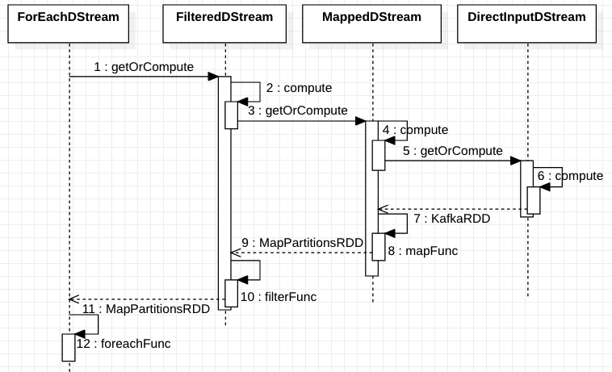
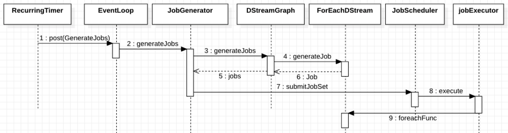

## DStream 的构建

在定义一个流的处理逻辑时，首先从一个数据的流入源开始，这个数据源使用 InputDStream 定义，它是 DStream 的一个子类，之后会在其上调用一些 tranform 类型算子，像 map,reduce,filter 等等，每调用一个算子，都会创建一个新的 DStream，每一个新创建的 DStream 都保留着当前节点所依赖的上一个节点和当前节点的执行逻辑这两个部分，这样，多个 DStream 节点就构成了一个逻辑执行链。

**比如如下代码会生成图 1 的执行链**：

```scala
stream.map(...).filter(...).foreachRDD(...)
```


虚线箭头描述的是依赖关系

最后当调用 action 类型的算子时，所有 action 类型的算子，底层都是通过 ForEachDStream 实现的。

**ForEachDStream 的源码**：

```scala
private[streaming] class ForEachDStream[T: ClassTag] (
    parent: DStream[T],
    foreachFunc: (RDD[T], Time) => Unit,
    displayInnerRDDOps: Boolean
  ) extends DStream[Unit](parent.ssc)  {
 
  override def dependencies: List[DStream[_]] = List(parent)
 
  override def slideDuration: Duration = parent.slideDuration
 
  override def compute(validTime: Time): Option[RDD[Unit]] = None
 
  override def generateJob(time: Time): Option[Job] = {
    parent.getOrCompute(time) match {
      case Some(rdd) =>
        val jobFunc = () => createRDDWithLocalProperties(time, displayInnerRDDOps) {
          foreachFunc(rdd, time)
        }
        Some(new Job(time, jobFunc))
      case None => None
    }
  }
}
```

这里关注 generateJob 方法，这里调用了它依赖的父 DStream 的 getOrCompute 来生成一个需要它来处理的 RDD，然后对该 RDD 做该节点本身需要做的一些操作，即 foreachFunc 闭包，其实所有 DStream 的 getOrCompute 方法底层都会调用 compute 方法，该方法会返回 RDD，即所有的 DStream 的 compute 方法中，要么其本身能够从外部拉取数据，即 InputDStream 作为 DStream 链的第一个节点，要么其本身调用依赖的上游 DStream 的 compute 方法，再对生成的 RDD 做其本节点所定义的一些操作作为其返回值。

如此，当 DStream 链的最后一个节点被调用了 compute 方法时，它能够依次递归的调用逐节点的 compute 方法，最后调用第一个 InputDStream 节点的 compute 方法生成一个能够拉取外部数据的 RDD。

**其调用的时序图如下**：



以上只是为了直观的理解 DStream 链是如何工作的，具体体现在分布式环境上时，是由 RDD 来定义操作，切分成 task 后由 Executor 来执行。

另外需要说的是如果在单个流上定义一系列除 window 外的操作，其和直接调用 InputDStream 的 foreachRDD 后，在 rdd 上定义操作是等效的。

## DStream 的运行

除了上面介绍的 DStream 之外，在 Spark-Streaming 内部还有一些保存作业处理逻辑的模块和用于根据时间生成和管理每个批次数据的模块。下面是在 SparkStreaming 中一些比较核心的类，他们是构成一个流式作业，和使其运行起来的框架。

1. InputDStream 管理流的数据源的通用抽象类
2. JobGenerator 作业生成器
3. JobScheduler 作业调度器，用于提交作业到集群运行
4. DStreamGraph 管理创建的所有 InputDStream 的初始化和启动，但不负责 InputDStream 间依赖关系的管理，InputDStream 间依赖关系由其子类实现管理

**首先看一下这四个类交互的时序图**：



图中只画了一些比较重要和核心的类和逻辑。JobGenerator 每隔设定的时间间隔会生成一个 JobGeneratorEvent 事件用于触发生成一个作业。其内部是通过 RecurringTimer 类和 EventLoop 实现的。

**代码如下：初始化 timer 和 eventLoop**

```scala
  private val timer = new RecurringTimer(clock, ssc.graph.batchDuration.milliseconds, longTime => eventLoop.post(GenerateJobs(new Time(longTime))), "JobGenerator")
 
  def start(): Unit = synchronized {
    if (eventLoop != null) return // generator has already been started
 
    // Call checkpointWriter here to initialize it before eventLoop uses it to avoid a deadlock.
    // See SPARK-10125
    checkpointWriter
 
    eventLoop = new EventLoop JobGeneratorEvent  {
      override protected def onReceive(event: JobGeneratorEvent): Unit = processEvent(event)
 
      override protected def onError(e: Throwable): Unit = {
        jobScheduler.reportError("Error in job generator", e)
      }
    }
    eventLoop.start()
 
    if (ssc.isCheckpointPresent) {
      restart()
    } else {
      startFirstTime()
    }
  }
```

这里 processEvent 方法用来做消息分发，根据消息的不同类型调用不同的函数进行处理。

```scala
  private def processEvent(event: JobGeneratorEvent) {
    logDebug("Got event " + event)
    event match {
      case GenerateJobs(time) => generateJobs(time)
      case ClearMetadata(time) => clearMetadata(time)
      case DoCheckpoint(time, clearCheckpointDataLater) =>
        doCheckpoint(time, clearCheckpointDataLater)
      case ClearCheckpointData(time) => clearCheckpointData(time)
    }
  }
```

startFirstTime 中调用了 timer 和 DStreamGraph 的 start 方法，将二者内部的事件循环线程启动起来。

到这里我们知道当 timer 根据时间生成 GenerateJobs 事件时，会触发 generateJobs 函数的调用。

**generateJobs 的代码**：

```scala
  private def generateJobs(time: Time) {
    // Checkpoint all RDDs marked for checkpointing to ensure their lineages are
    // truncated periodically. Otherwise, we may run into stack overflows (SPARK-6847).
    ssc.sparkContext.setLocalProperty(RDD.CHECKPOINT_ALL_MARKED_ANCESTORS, "true")
    Try {
      jobScheduler.receiverTracker.allocateBlocksToBatch(time) // allocate received blocks to batch
      graph.generateJobs(time) // generate jobs using allocated block
    } match {
      case Success(jobs) =>
        val streamIdToInputInfos = jobScheduler.inputInfoTracker.getInfo(time)
        jobScheduler.submitJobSet(JobSet(time, jobs, streamIdToInputInfos))
      case Failure(e) =>
        jobScheduler.reportError("Error generating jobs for time " + time, e)
        PythonDStream.stopStreamingContextIfPythonProcessIsDead(e)
    }
    eventLoop.post(DoCheckpoint(time, clearCheckpointDataLater = false))
  }
```

其内部又调用了 DStreamGraph 的 generateJobs 方法用来生成多个 Job，之后通过 JobScheduler 对这些 Job 进行提交。

DStreamGraph 底层生成作业的过程是 DStreamGraph 实现的，它会遍历所有注册过的 ForEachDStream，并分别调用他们的 generateJob 方法，返回一个 Job 对象，这就跟我们上面讲过的 ForEachDStream 部分关联上了。

Job 里面包含了一个需要在其上执行计算的 RDD，包括所有计算逻辑的闭包，而这个闭包真正执行，是在 JobScheduler 将这个 Job 对象提交到一个线程池之后，其会在线程池内执行这个 Job 对象内的闭包逻辑，将其转换成分布式计算的 task 分发到不同的节点上去执行。

**JobScheduler.submitJobSet 的如下代码**：

```scala
  def submitJobSet(jobSet: JobSet) {
    if (jobSet.jobs.isEmpty) {
      logInfo("No jobs added for time " + jobSet.time)
    } else {
      listenerBus.post(StreamingListenerBatchSubmitted(jobSet.toBatchInfo))
      jobSets.put(jobSet.time, jobSet)
      jobSet.jobs.foreach(job => jobExecutor.execute(new JobHandler(job)))
      logInfo("Added jobs for time " + jobSet.time)
    }
  }
```

jobExecutor 就是那个线程池，其队列长度可通过 spark.streaming.concurrentJobs 进行配置，默认等于 1。该参数决定了能够并发执行的 Job 数量。

JobHandler 是 Job 的封装，会在执行 Job 的逻辑前后分别发布 JobStarted 和 JobCompleted 事件。而 Job 对象真正执行的逻辑就是在 ForEachDStream 类中的创建 Job 时 foreachFunc 闭包。