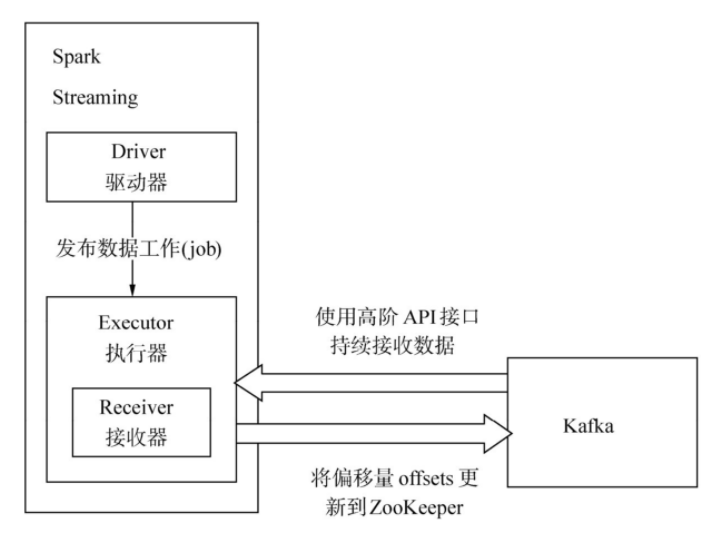
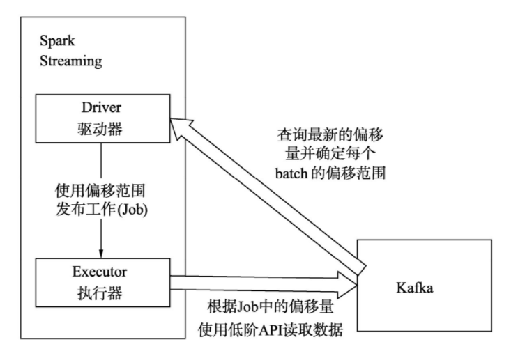

# Receiver

## 数据源

### 实时读取 HDFS 文件流

> 监控一个 HDFS 目录，只要其中有新文件出现，就实时处理，相当于处理实时的文件流。

Spark Streaming 会监视指定的 HDFS 目录，并且处理出现在目录中的文件：

1. 所有放入 HDFS 目录中的文件，都必须有相同的格式；
2. 必须使用移动或者重命名的方式，将文件移入目录；
3. 一旦处理之后，文件的内容即使改变，也不会再处理了；
4. 基于 HDFS 文件的数据源是没有 Receiver 的，因此不会占用一个cpu core。

### Receiver-Kafka 数据源

默认 Receiver 从 Kafka 中获取的数据都是存储在 Spark Executor 的内存中的，然后 Spark Streaming 启动的 Job 会去处理数据。如下图所示：

这种方式可能会因为底层的失败而丢失数据，启用高可靠机制，让数据零丢失，可以启用 Spark Streaming 的预写日志机制（Write Ahead Log，WAL）。该机制会同步地将接收到的 Kafka 数据写入分布式文件系统（比如 HDFS）上的预写日志中。

1. *Kafka 中的 topic 的 partition，与 Spark 中的 RDD 的 partition 是没有关系的*。所以在 `KafkaUtils.createStream()` 中，提高 partition 的数量，只会增加一个 Receiver 中读取 partition 的线程的数量，不会增加 Spark 处理数据的并行度。
2. 可以创建多个 Kafka 输入 DStream，使用不同的 Consumer Group 和 topic，来通过多个 Receiver 并行接收数据。
3. 如果基于容错的文件系统，比如 HDFS，启用了预写日志机制，接收到的数据都会被复制一份到预写日志中。因此，在 `KafkaUtils.createStream()` 中，设置的持久化级别是 `StorageLevel.MEMORY_AND_DISK_SER`。

### Direct-Kafka 数据源

这种方式会周期性地查询 Kafka，来获得每个 topic+partition 的最新的 offset，从而定义每个 batch 的 offset 的范围。当处理数据的 Job 启动时，就会使用 Kafka 的简单 consumer api 来获取 Kafka 指定 offset 范围的数据，如下图所示：

优点:

1. 简化并行读取
    如果要读取多个 partition，不需要创建多个输入 DStream 然后对它们进行 union 操作。Spark 会创建跟 Kafka partition 一样多的 RDD partition，并且会并行从 Kafka 中读取数据。所以在 Kafka partition 和 RDD partition 之间，有一个**一对一的映射关系**
    
    > 如果不使用 Direct 数据源,那么一个 partition 对应一个 DStream，一个 DStream 对应一个 Receiver，一个 Receiver 对应一个 cpu core。数据源通常会在多个 partition 中，就会使用多个 Receiver，消耗多个 cpu core
2. 高性能
    如果要保证零数据丢失，在基于 Receiver 的方式中，需要开启 WAL 机制。这种方式其实效率低下，因为数据实际上被复制了两份，Kafka 自己本身就有高可靠的机制，会对数据复制一份，而这里又会复制一份到 WAL 中
    基于 Direct 的方式，不依赖 Receiver，不需要开启 WAL 机制，只要 Kafka 中作了数据的复制，那么就可以通过 Kafka 的副本进行恢复。
   
   > 避免重复备份
2. 一次且仅一次的事务机制
    - 基于 Receiver 的方式，是使用 Kafka 的高阶 API 来在 ZooKeeper 中保存消费过的 offset 的。这是消费 Kafka 数据的传统方式。这种方式配合着 WAL 机制可以保证数据零丢失的高可靠性，但是却无法保证数据被处理一次且仅一次，可能会**处理两次**。因为**Spark 和 ZooKeeper 之间可能是不同步的**
    - 基于 Direct 的方式，使用 Kafka 的简单 api，Spark Streaming 自己就负责追踪消费的 offset，并保存在 Checkpoint 中。Spark 自己一定是同步的，因此可以**保证数据是消费一次且仅消费一次**

### 自定义 Receiver

实现以下两个方法：`onStart()`、`onStop()` `onStart()` 和 `onStop()` 方法必须不能阻塞数据，`onStart()` 方法会启动负责接收数据的线程，`onStop()` 方法会确保之前启动的线程都已经停止了。

负责接收数据的线程可以调用 `isStopped()` 方法来检查它们是否应该停止接收数据。

一旦数据被接收，就可以调用 `store(data) `方法将数据存储在 Spark 内部。可以将数据每次一条进行存储，或是每次存储一个集合或序列化的数据。

接收线程中的任何异常都应该被捕获以及正确处理，从而避免 Receiver 的静默失败。`restart()` 方法会通过异步地调用 `onStop()` 和 `onStart()` 方法来重启Receiver；`stop()` 方法会调用 `onStop()` 方法来停止 Receiver；`reportError()` 方法会汇报一个错误消息给 Driver，但是不停止或重启 Receiver。

官方说明：[Spark Streaming Custom Receivers](http://spark.apache.org/docs/latest/streaming-custom-receivers.html)

## 设置 Receiver 接收速度

Receiver 可以被设置一个最大接收限速，以每秒接收多少条单位来限速

- 普通 Receiver：`spark.streaming.receiver.maxRate`
- Kafka Direct
  1. `spark.streaming.kafka.maxRatePerPartition`
  2. backpressure 机制(推荐)：`spark.streaming.backpressure.enabled=true`
      不需要设置 Receiver 的限速，Spark 可以自动估计 Receiver 最合理的接收速度，并根据情况动态调整
