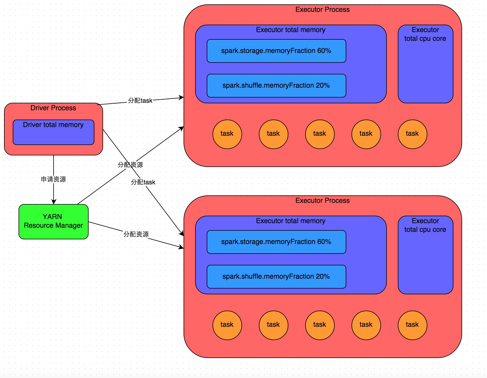

详细原理见上图。我们使用 spark-submit 提交一个 Spark 作业之后，这个作业就会启动一个对应的 Driver 进程。根据你使用的部署模式（deploy-mode）不同，Driver 进程可能在本地启动，也可能在集群中某个工作节点上启动。Driver 进程本身会根据我们设置的参数，占有一定数量的内存和CPU core。而 Driver 进程要做的第一件事情，就是向集群管理器（可以是Spark Standalone集群，也可以是其他的资源管理集群，美团•大众点评使用的是YARN作为资源管理集群）申请运行 Spark 作业需要使用的资源，这里的资源指的就是 Executor 进程。YARN 集群管理器会根据我们为 Spark 作业设置的资源参数，在各个工作节点上，启动一定数量的 Executor 进程，每个Executor 进程都占有一定数量的内存和 CPU core。

在申请到了作业执行所需的资源之后，Driver 进程就会开始调度和执行我们编写的作业代码了。Driver 进程会将我们编写的 Spark 作业代码分拆为多个 stage，每个 stage 执行一部分代码片段，并为每个 stage 创建一批 task，然后将这些 task 分配到各个 Executor 进程中执行。task 是最小的计算单元，负责执行一模一样的计算逻辑（也就是我们自己编写的某个代码片段），只是每个 task 处理的数据不同而已。一个 stage 的所有 task 都执行完毕之后，会在各个节点本地的磁盘文件中写入计算中间结果，然后 Driver 就会调度运行下一个stage。下一个stage的task的输入数据就是上一个stage输出的中间结果。如此循环往复，直到将我们自己编写的代码逻辑全部执行完，并且计算完所有的数据，得到我们想要的结果为止。

Spark是根据shuffle类算子来进行stage的划分。如果我们的代码中执行了某个shuffle类算子（比如reduceByKey、join等），那么就会在该算子处，划分出一个stage界限来。可以大致理解为，shuffle算子执行之前的代码会被划分为一个stage，shuffle算子执行以及之后的代码会被划分为下一个stage。因此一个stage刚开始执行的时候，它的每个task可能都会从上一个stage的task所在的节点，去通过网络传输拉取需要自己处理的所有key，然后对拉取到的所有相同的key使用我们自己编写的算子函数执行聚合操作（比如reduceByKey()算子接收的函数）。这个过程就是shuffle。

当我们在代码中执行了cache/persist等持久化操作时，根据我们选择的持久化级别的不同，每个task计算出来的数据也会保存到Executor进程的内存或者所在节点的磁盘文件中。

因此Executor的内存主要分为三块：第一块是让task执行我们自己编写的代码时使用，默认是占Executor总内存的20%；第二块是让task通过shuffle过程拉取了上一个stage的task的输出后，进行聚合等操作时使用，默认也是占Executor总内存的20%；第三块是让RDD持久化时使用，默认占Executor总内存的60%。

task的执行速度是跟每个Executor进程的CPU core数量有直接关系的。一个CPU core同一时间只能执行一个线程。而每个Executor进程上分配到的多个task，都是以每个task一条线程的方式，多线程并发运行的。如果CPU core数量比较充足，而且分配到的task数量比较合理，那么通常来说，可以比较快速和高效地执行完这些task线程。