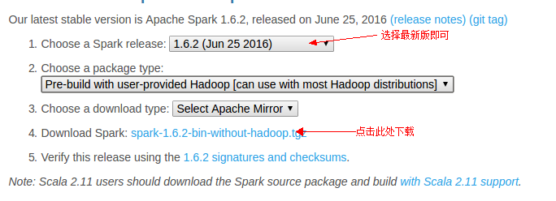
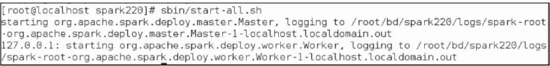

Spark 可以独立安装使用，也可以和 Hadoop 一起安装使用。

## 安装 Spark

访问[Spark官方下载地址](http://spark.apache.org/downloads.html)，按照如下图下载



`Choose a package type`的选项：

- `Source code`: Spark 源码，需要编译才能使用；
- `Pre-build with user-provided Hadoop`: 属于“Hadoop free”版，可应用到任意Hadoop 版本；
- `Pre-build for Hadoop 2.6 and later`: 基于Hadoop 2.6的预先编译版，需要与本机安装的Hadoop版本对应，可选的还有Hadoop 2.6、Hadoop 2.4、Hadoop 2.3、Hadoop1.x、CDH4。

### Spark 的部署模式

Spark 部署模式主要有四种：

- Local 模式（单机模式）
- Standalone 模式（使用 Spark 自带的简单集群管理器）
- YARN 模式（使用 YARN 作为集群管理器）
- Mesos 模式（使用 Mesos 作为集群管理器）

#### 单机模式的安装

```bash
sudo tar -zxf ~/下载/spark-1.6.2-bin-without-hadoop.tgz -C /usr/local/
cd /usr/local
sudo mv ./spark-1.6.2-bin-without-hadoop/ ./spark
sudo chown -R hadoop:hadoop ./spark          # 此处的 hadoop 为你的用户名
```

安装后，修改 Spark 的配置文件 `spark-env.sh`

```bash
cd /usr/local/spark
cp ./conf/spark-env.sh.template ./conf/spark-env.sh
```

编辑 `spark-env.sh` 文件(`vim ./conf/spark-env.sh`)，在第一行添加以下配置信息:

```bash
export SPARK_DIST_CLASSPATH=$(/usr/local/hadoop/bin/hadoop classpath)
```

有了上面的配置信息以后，Spark就可以把数据存储到Hadoop分布式文件系统HDFS中，也可以从HDFS中读取数据。如果没有配置上面信息，Spark就只能读写本地数据，无法读写HDFS数据。

配置完成后就可以直接使用，不需要像Hadoop运行启动命令。

通过运行Spark自带的示例，验证Spark是否安装成功。

```bash
cd /usr/local/spark
bin/run-example SparkPi
```

## 3、启动 Spark，运行 Spark-Shell

运行 Spark 根目录下 sbin 文件夹中的 `start-all.sh`，如下图所示：



在浏览器中运行 `http://localhost:xxxx` 即可查看 Web UI（不同端口的 Web UI 作用不一样）

### 使用 Spark Shell 编写代码

  [Spark-Shell.md](Spark/Spark工具/Spark-Shell.md) 