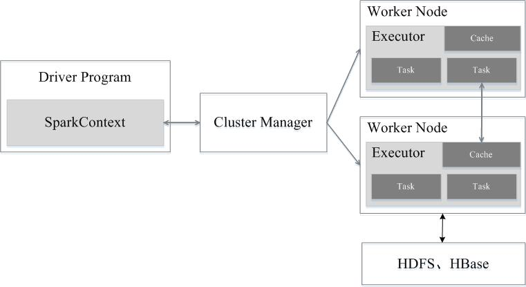

Spark 的架构如下图所示：

Spark 运行架构包括 **集群资源管理器（Cluster Manager）**、**工作节点（Worker Node）**、**任务驱动程序（Driver Program，或简称为Driver）** 和 **执行器（Executor）**。其中，Driver 是用户编写的数据处理逻辑，这个逻辑中包含用户创建的 SparkContext。SparkContext 是用户逻辑与 Spark 集群主要的交互接，它会和 Cluster Manager 交互，包括向它申请计算资源等。Cluster Manager 负责集群的资源管理和调度，现在支持 Standalone、Mesos 和 YARN。Worker Node 是集群中可以执行计算任务的节点。Executor 是在一个 Worker Node 上为某应用启动的一个进程，该进程负责运行任务，并且负责将数据存在内存或者磁盘上。Task 是被送到某个 Executor 上的计算单元。每个应用都有各自独立的 Executor，计算最终在计算节点的 Executor 中执行。

同时可以看出，就系统框架而言，Spark 采用 **主/从架构**，包含一个 Master（即 Driver）和若干个 Worker

用户程序从最开始的提交到最终的计算执行，需要经历以下几个阶段：

1. 用户程序创建 SparkContext 时，新创建的 SparkContext 实例会连接到 Cluster Manager。Cluster Manager 会根据用户提交时设置的 CPU 和内存等信息为本次提交分配计算资源，启动 Executor。
2. Driver 会将用户程序划分为不同的执行阶段，每个执行阶段由一组完全相同的 Task 组成，这些 Task 分别作用于待处理数据的不同分区。在阶段划分完成和 Task 创建后，Driver 会向 Executor 发送 Task。
3. Executor 在接收到 Task 后，会下载 Task 的运行时依赖，在准备好 Task 的执行环境后，会开始执行 Task，并且将 Task 的运行状态汇报给 Driver。
4. Driver 会根据收到的 Task 的运行状态来处理不同的状态更新。Task 分为两种：一种是 Shuffle Map Task，它实现数据的重新洗牌，洗牌的结果保存到 Executor 所在节点的文件系统中；另一种是 Result Task，它负责生成结果数据。
5. Driver 会不断地调用 Task，将 Task 发送到 Executor 执行，在所有的 Task 都正确执行或者超过执行次数的限制仍然没有执行成功时停止。

总体而言，在 Spark 中，一个应用（Application）由一个任务驱动程序（Driver）和若干个作业（Job）构成，一个作业由多个阶段（Stage）构成，一个阶段由多个任务（Task）组成。当执行一个应用时，Driver 会向集群管理器（Cluster Manager）申请资源，启动 Executor，并向 Executor 发送应用程序代码和文件，然后在 Executor 上执行任务，运行结束后，执行结果会返回给 Driver 或者写到 HDFS 或者其他数据库中，如下图所示：

