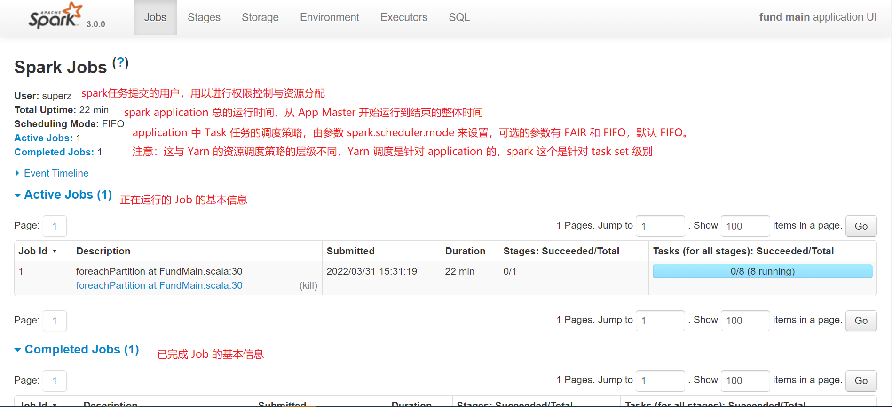
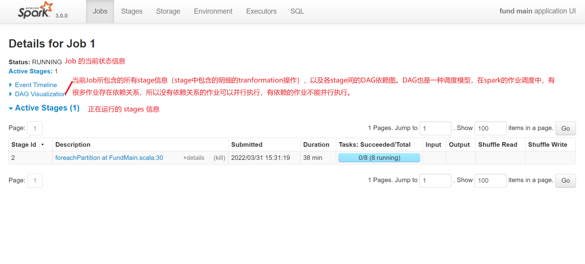

# Web UI

## 界面的基本介绍

每一个 Spark 应用程序都会启动一个 webUI，默认端口是 4040 端口，用于展示对应用程序有用的信息。包括以下信息：

- stages 和 tasks 列表。

- RDD 大小的总概和内存使用。

- 运行环境信息。

- 运行的 Executors 状态。

在浏览器输入：`http://<driver-node>:4040` 访问该界面。如果多个 SparkContext 在同一台主机上运行，则它们将以 4040（4041，4042 等）开始绑定到连续的端口。请注意，默认情况下，这些信息只会在程序运行期间可以查看。在程序运行结束后查看 webUI，需要在启动应用程序前设置 `spark.eventLog.enabled` 为 true。这配置 spark 会将显示在 webUI上的 spark events 存储到存储系统中去。

### Jobs



**Job Detail**



### Stages

### Storage

### Environment

> 包含有关 Spark 应用程序的配置等相关信息

### Executors

> 提供应用程序的每个执行器的详细信息

### SQL

> 对应用户提交的结构化 API 查询（包括 SQL 和 DataFrame），若用户提交的不是 Spark-SQL 程序，则 WebUI 上不会显示此标签

## Spark 的 historyServer

> Spark History Server 功能依赖于 Yarn 的日志聚合功能，它会去 Yarn 日志聚合所配置的 HDFS 存储目录中读取任务的所有 Container 日志信息，包括 Driver 和 Executor 日志。
> 
> 除此之外，为了 Spark 任务结束后能重构 Web UI 信息，需要记录任务运行中的 Event 日志信息。

只要应用程序的事件日志存在，仍然可以通过 Spark 的历史记录服务器构建应用程序的 UI。通过执行下面的命令，启动历史服务器：

```bash
./sbin/start-history-server.sh
```

默认情况下，这将在 `http:// <server-url>:18080` 创建一个 Web 界面，列出未完成和已完成的应用程序和尝试。当使用文件系统提供程序类（请参见下面的 `spark.history.provider`）时，基本日志记录目录必须在 `spark.history.fs.logDirectory` 配置选项中提供，并且应包含每个表示应用程序事件日志的子目录。必须将 Spark 作业本身配置为记录事件，并将其记录到相同的共享可写目录。例如，server 的 log 目录为：`hdfs://namenode/shared/spark-logs`，那么客户端的配置如下：

- `spark.eventLog.enabled`：true
- `spark.eventLog.dir`：`hdfs://namenode/shared/spark-logs`

### historyServer 的配置

#### 环境变量

| 环境变量名             | 默认值 | 含义                                                  |
| ---------------------- | ------ |-----------------------------------------------------|
| SPARK_DAEMON_MEMORY    | 1g     | historyServer 默认内存                                  |
| SPARK_DAEMON_JAVA_OPTS | none   | historyServer 的 JVM 参数                              |
| SPARK_PUBLIC_DNS       | none   | 历史服务器的公共地址。如果没有设置，那么到应用程序历史记录的链接可能会使用服务器的内部地址，导致链接断开 |
| SPARK_HISTORY_OPTS     | none   | historyServer 的 `spark.history.*` 配置项                 |

#### Spark 的配置选项

| 属性名                             | 默认值                                            | 含义                                                                                    |
| ---------------------------------- | ------------------------------------------------- |---------------------------------------------------------------------------------------|
| spark.history.provider             | org.apache.spark.deploy.history.FsHistoryProvider | 历史服务器的实现类。目前仅仅只有当前一个实现，spark 默认自带的，会从系统文件中查找程序日志                                      |
| spark.history.fs.logDirectory      | file:/tmp/spark-events                            | 应用日志存储的位置，可以是本地文件或者 hdfs，`file://path` 或者 `hdfs://namenode/shared/path`               |
| spark.history.fs.update.interval   | 10s                                               | Provider 扫描日志目录，查看有误新的或者更新的日志信息的周期                                                    |
| spark.history.retainedApplications | 50                                                | 在缓存中保留 UI 数据的应用程序数量。 如果超出此上限，则最早的应用程序将从缓存中删除。 如果应用程序不在缓存中，则如果应用程序从UI访问，则必须从磁盘加载该应用程序。 |
| spark.history.ui.maxApplications   | Int.MaxValue                                      | 在历史页面展示的最大应用程序的数目。即使没有在页面展示也照样可以通过他们的URLs访问。                                          |
| spark.history.ui.port              | 18080                                             | 历史服务器端口。                                                                              |

这里只配置了常用的，还有更多配置请参考官网。

<http://spark.apache.org/docs/latest/monitoring.html>

通过页面可以很容易发现慢任务和数据倾斜。

注释：

- historyserver 会展示完成的任务和未完成的任务。如果一个任务失败之后重试了很多次，失败尝试会展示，正在运行的未完成的尝试，最终成功的尝试都会展示。
- 不完整的应用程序仅间歇更新。更新之间的时间由更改文件的检查间隔（spark.history.fs.update.interval）定义。在较大的集群上，更新间隔可能设置为较大的值。查看正在运行的应用程序的方式实际上是查看应用自己的Web UI。