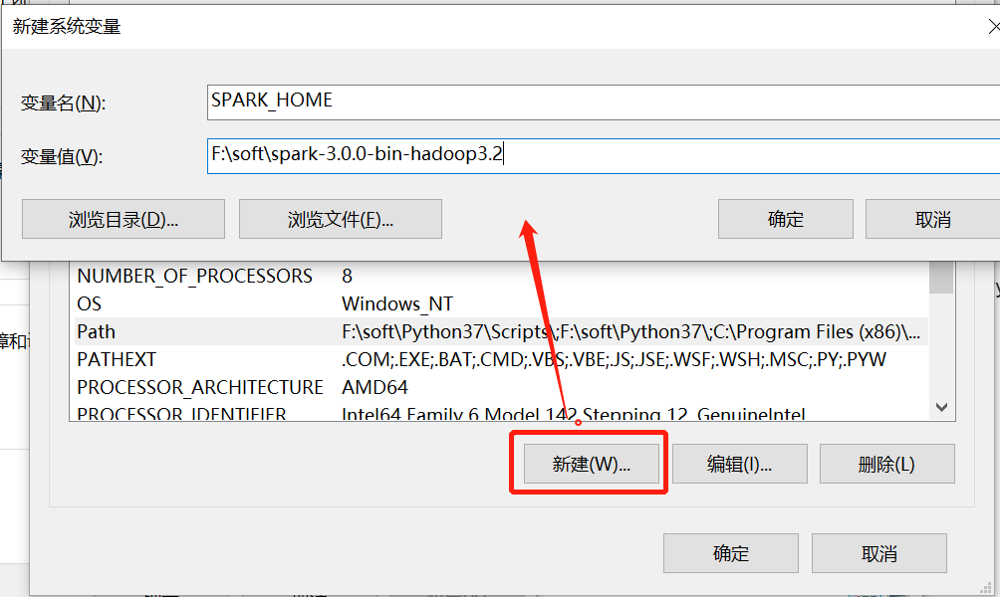

# PySpark 开发环境搭建

## Windows 版本

1. 配置 Python 环境
2. 配置 Spark 环境
    下载 Spark 安装包，如 `spark-3.0.0-bin-hadoop3.2.tgz`，进行解压并配置 `SPARK_HOME`
    
3. Python 中安装 py4j 模块
4. Python 中安装 PySpark 模块

**PySpark 相关模块安装**

有两种方式：

1. 直接通过 pip 进行安装，若是虚拟环境，则进入 `<venv_path>\Scripts` 调用 pip 进行安装
    ```shell
    pip install py4j
    pip install pyspark
    ```
2. 从 Spark 安装包中将相关模块拷贝到 `<Python_path>\Lib\site-packages` 中
    ```text
    py4j : $SPARK_HOME/python/lib/py4j，注意 Spark 提供的是压缩包，需要进行解压
    pyspark: $SPARK_HOME/python/pyspark
    ```