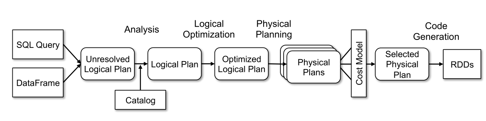

# Catalyst 流程解析



主要流程分为以下几步：

1. Sql 语句经过 Antlr4 解析，生成 Unresolved Logical Plan；
2. analyzer 与 catalog 进行绑定（catlog 存储元数据），生成 Logical Plan；
3. optimizer 对 Logical Plan 优化，生成 Optimized LogicalPlan；
4. SparkPlan 将 Optimized Logical Plan 转换成 Physical Plan；
5. `execute()` 执行可执行物理计划，得到 RDD。

上述流程多数是在 `org.apache.spark.sql.execution.QueryExecution` 这个类里面，代码如下：

```scala
class QueryExecution(val sparkSession: SparkSession, val logical: LogicalPlan) {

  ......其他代码
  
  //analyzer阶段
  lazy val analyzed: LogicalPlan = {
    SparkSession.setActiveSession(sparkSession)
    sparkSession.sessionState.analyzer.executeAndCheck(logical)
  }


  //optimizer阶段
  lazy val optimizedPlan: LogicalPlan = sparkSession.sessionState.optimizer.execute(withCachedData)
  
  //SparkPlan阶段
  lazy val sparkPlan: SparkPlan = {
    SparkSession.setActiveSession(sparkSession)
    // TODO: We use next(), i.e. take the first plan returned by the planner, here for now,
    //       but we will implement to choose the best plan.
    planner.plan(ReturnAnswer(optimizedPlan)).next()
  }

  //prepareForExecution阶段
  // executedPlan should not be used to initialize any SparkPlan. It should be
  // only used for execution.
  lazy val executedPlan: SparkPlan = prepareForExecution(sparkPlan)

  //execute阶段
  /** Internal version of the RDD. Avoids copies and has no schema */
  lazy val toRdd: RDD[InternalRow] = executedPlan.execute()

  ......其他代码
}
```