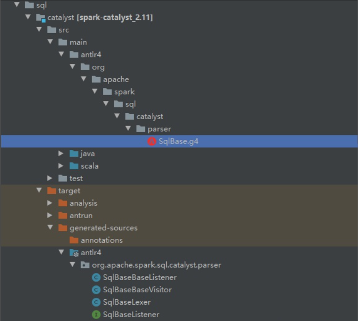

# Antlr4 解析 Sql 并生成树

## 初始流程

当调用 `spark.sql()` 的时候，会调用如下的方法：

```scala
def sql(sqlText: String): DataFrame = {
    Dataset.ofRows(self, sessionState.sqlParser.parsePlan(sqlText))
}
```

解析 SQL 阶段主要是 `parsePlan(sqlText)` 这部分，该部分会调用 `org.apache.spark.sql.catalyst.parser.AbstractSqlParser` 类里面的 parse 方法，关键代码如下：

```scala
protected def parse[T](command: String)(toResult: SqlBaseParser => T): T = {
    logDebug(s"Parsing command: $command")

    val lexer = new SqlBaseLexer(new UpperCaseCharStream(CharStreams.fromString(command)))
    lexer.removeErrorListeners()
    lexer.addErrorListener(ParseErrorListener)
    lexer.legacy_setops_precedence_enbled = SQLConf.get.setOpsPrecedenceEnforced

    val tokenStream = new CommonTokenStream(lexer)
    val parser = new SqlBaseParser(tokenStream)
    parser.addParseListener(PostProcessor)
    parser.removeErrorListeners()
    parser.addErrorListener(ParseErrorListener)
    parser.legacy_setops_precedence_enbled = SQLConf.get.setOpsPrecedenceEnforced

    try {
      try {
        // first, try parsing with potentially faster SLL mode
        parser.getInterpreter.setPredictionMode(PredictionMode.SLL)
        toResult(parser)
      }
      catch {
        case e: ParseCancellationException =>
          // if we fail, parse with LL mode
          tokenStream.seek(0) // rewind input stream
          parser.reset()

          // Try Again.
          parser.getInterpreter.setPredictionMode(PredictionMode.LL)
          toResult(parser)
      }
    }
    catch {
      case e: ParseException if e.command.isDefined =>
        throw e
      case e: ParseException =>
        throw e.withCommand(command)
      case e: AnalysisException =>
        val position = Origin(e.line, e.startPosition)
        throw new ParseException(Option(command), e.message, position, position)
    }
  }
```

## Antlr4 生成语法树

Spark 提供了一个 `.g4` 文件，编译的时候会使用 Antlr 根据这个 `.g4` 生成对应的词法分析类和语法分析类，同时还使用了访问者模式，用以构建 Logical Plan （语法树）。



## 生成 Logical Plan

```scala
class AstBuilder(conf: SQLConf) extends SqlBaseBaseVisitor[AnyRef] with Logging {
  ......其他代码

  override def visitQuerySpecification(ctx: QuerySpecificationContext): LogicalPlan = withOrigin(ctx) {
    val from = OneRowRelation().optional(ctx.fromClause) {  //如果有FROM语句，生成对应的Logical Plan
      visitFromClause(ctx.fromClause)
    }
    withQuerySpecification(ctx, from)
  }

  ......其他代码
}
```

代码中会先判断是否有 FROM 子语句，有的话会去生成对应的 Logical Plan，再调用 `withQuerySpecification()` 方法，而 `withQuerySpecification()` 方法是比较核心的一个方法。它会处理包括 SELECT、FILTER、GROUP BY、HAVING 等子语句的逻辑；该方法通过使用 scala 的匹配模式，匹配不同的子语句生成不同的 Logical Plan。

> Logical Plan 其实是继承自 TreeNode，所以本质上 Logical Plan 就是一颗树。

通过 SQL Parse 生成的树，叫做 Unresolved Logical Plan，这里的 Unresolved 主要体现的是查询的 SQL 语句还未对其 Schema 进行验证，如 `spark.sql(select a,b from c)` 中未验证表 c 是否存在、字段 a、b 等元数据是否正确。 