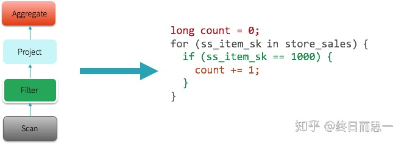

# SparkPlan 准备和执行阶段

## SparkPlan 准备阶段

在生成可执行的 SparkPlan 后，并不会立即执行，在真正执行之前，还需要做一些准备工作，包括在必要的地方插入一些shuffle作业，在需要的地方进行数据格式转换等等。

该部分的调用在 `org.apache.spark.sql.execution.QueryExecution` 类中，代码如下：

```scala
class QueryExecution(val sparkSession: SparkSession, val logical: LogicalPlan) {
  ......其他代码
  lazy val executedPlan: SparkPlan = prepareForExecution(sparkPlan)
  
  //调用下面的preparations，然后使用foldLeft遍历preparations中的Rule并应用到SparkPlan
  protected def prepareForExecution(plan: SparkPlan): SparkPlan = {
    preparations.foldLeft(plan) { case (sp, rule) => rule.apply(sp) }
  }

  /** A sequence of rules that will be applied in order to the physical plan before execution. */
  //定义各个Rule
  protected def preparations: Seq[Rule[SparkPlan]] = Seq(
    PlanSubqueries(sparkSession),
    EnsureRequirements(sparkSession.sessionState.conf),
    CollapseCodegenStages(sparkSession.sessionState.conf),
    ReuseExchange(sparkSession.sessionState.conf),
    ReuseSubquery(sparkSession.sessionState.conf))
  ......其他代码
}
```

通过 prepartitions 中的规则对 SparkPlan 执行一番，这些规则如下：

**PlanSubqueries(sparkSession)**

生成子查询，在比较早的版本，Spark SQL还是不支持子查询的，不过现在加上了，这条Rule其实是对子查询的SQL新生成一个QueryExecution（就是我们一直分析的这个流程），还记得QueryExecution里面的变量基本都是懒加载的吧，这些不会立即执行，都是到最后一并执行的，说白了就有点递归的意思。

**EnsureRequirements(sparkSession.sessionState.conf)**

这条是比较重要的，代码量也多。主要就是验证输出的分区（partition）和我们要的分区是不是一样，不一样那自然需要加入shuffle处理重分区，如果有排序需求还会排序。

**CollapseCodegenStages**

这个是和一个优化相关的，先介绍下相关背景。Whole stage Codegen在一些MPP数据库被用来提高性能，主要就是将一串的算子，转换成一段代码（Spark sql转换成java代码），从而提高性能。比如下图，一串的算子操作，可以转换成一个java方法，这一一来性能会有一定的提升。




这一步就是在支持Codegen的SparkPlan上添加一个WholeStageCodegenExec，不支持Codegen的SparkPlan则会添加一个InputAdapter。这一点在下面看preparations阶段结果的时候能看到，还有这个优化是默认开启的。

**ReuseExchange和ReuseSubquery**

这两个都是大概同样的功能就放一块说了。首先Exchange是对shuffle如何进行的描述，可以理解为就是shuffle吧。

这里的ReuseExchange是一个优化措施，去找有重复的Exchange的地方，然后将结果替换过去，避免重复计算。

ReuseSubquery也是同样的道理，如果一条SQL语句中有多个相同的子查询，那么是不会重复计算的，会将计算的结果直接替换到重复的子查询中去，提高性能。

## SparkPlan 执行生成 RDD 阶段

调用逻辑依旧是在 `org.apache.spark.sql.execution.QueryExecution` 中，代码如下：

```scala
class QueryExecution(val sparkSession: SparkSession, val logical: LogicalPlan) {
  ......其他代码
  lazy val toRdd: RDD[InternalRow] = executedPlan.execute()
  ......其他代码
}
```

这里实际调用的是每个 SparkPlan 的 `execute()` 方法，这个方法最终会再调用它的 `doExecute()` 方法，这个方法在各子类中都有相应的实现，换言之，不同的 SparkPlan 执行的 `doExecute()` 是不一样的。