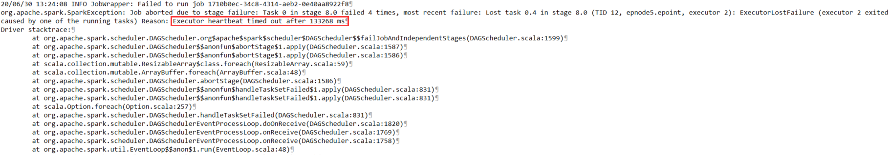
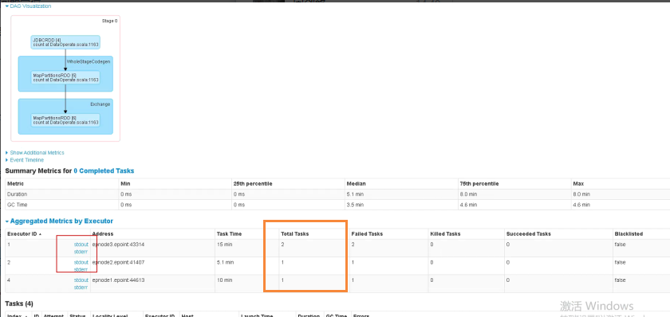
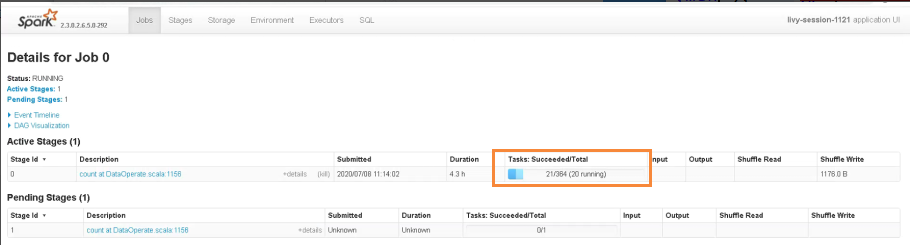
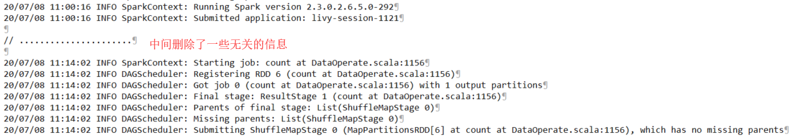
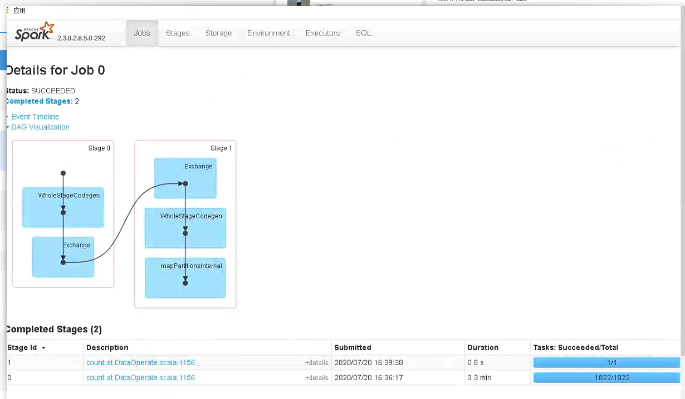

> 滨州数据治理项目在数据量为1.8亿的情况下质检失败问题

在出现这样的问题的时候，首先要查询日志，获取 `yarn.log` 日志，获取到的错误信息如下：



根据上面的错误，可以推测出*Executor的内存不够*。

对于这种情况，可以对Executor进行调优，进行了如下参数配置调优：

1. 减少分区数，通过增大单个执行器的内存，也就是增加了每个分区处理的数据量：`spark.executor.memory=16g`
2. 增加执行器内核，提高处理分区的效率：`spark.executor.cores=2`
3. 开启多个执行器，默认是只有 2 个执行器，提高并行度：`spark.executor.instances=5`
4. 修改spark中的任务数：`spark.default.parallelism=30`

上述的参数调整完成后，在进行 3600w 数据的情况下，测试将原来耗时 10h 的任务缩短到 40m 就执行完成了。

后又上 1.8 亿数据上进行测试，但这次测试没有通过。继续查看 `yarn.log` 日志，发现错误还是 *Executor的内存不够*，以为是分区分的太大了，继续对参数配置进行了修改，同时也将分区的数量给减少了，继续测试，但错误依旧没发生改变。考虑到可能单条数据太大了，直接使用 `select *` 其实没太大的必要，优化了读取的字段数，减少读取的数据，继续进行测试，但错误还是一样的。根据读取的字段，理论上内存是完全够用的，在这种情况下，可以通过查看Spark Web UI 来查看任务情况，如下图所示：



可以明显的看到，总共的任务数量才 4 个，根据我们定义的数据分区来说，我们定义的数据分区是无效的。

经代码排查，发现通过 JDBC 的`ResultSet#getLong` 获取时间戳的最大值（MAX）、最小值（MIN）都是年份，这样 `MAX-MIN` 小于设定的分区数量，造成分区数不为设定的分区数量，而是 `MAX-MIN`，对代码进行修改，获取完整的时间戳，以满足 `MAX-MIN>numPartitions`，保证设定的分区是有效的。

将修改后的代码更新到系统上，继续进行测试，查看Spark Web UI，如下图所示：



由上面可以看出来，任务分区是没啥问题了，但耗时4.3h仅执行了21个Task，且经过一晚上，任务最终以挂掉而告终。

考虑可能是单次读取 50w 条数据太耗时，将单次读取的数据量减少，但增加了Executor的数量，提高并行度来提高任务执行的效率，经测试任务执行效率依旧没得到提升，初步猜测是数据库服务器的问题。

在上述操作中，查看 `yarn.log` 的过程中，发现一个问题，如下所示：



SparkContext的创建和Spark Job的创建之间耗时 14m，查询我们的代码，发现中间只有一个读取数据库的操作，因此，定位出查询数据库获取最大值、最小值的耗时问题。

为了确认是否是查询耗时的问题，直接使用数据库客户端工具来执行 SQL 语句 `select * from <表名> where 分区字段>时间戳a and 分区字段<(时间戳a+10万)`，发现响应时间很长；由此可以定位是读取数据库的问题。

既然读取数据效率低，那通过创建索引来实现提高性能，对分区字段进行索引的创建，但时间戳用整型(如：`timestamp1<15987032432`)来查询并不会走索引，猜测可能是时间戳使用整型来查询中间经过了一次转换，我们知道索引字段经过函数是不会走索引的，因此考虑创建一个新的列，值为函数计算后字段，如 `column1,fun(column) as column2`，再对新创建的列创建索引，但这样操作存在一个问题，新增的数据无法自动计算或需要再添加一个触发器来完成计算，后经过网上搜索，发现 MySQL8.0 支持函数创建索引，可是我们当前的数据库版本是 5.7，不能直接使用函数创建索引，再次网上搜索，发现 MySQL5.7 可以通过虚拟列来创建索引，操作如下：

```sql
-- 创建虚拟列
alter table t_rk_baseinfo_5kw add column SYNC_Date2 int generated always as (unix_timestamp(SYNC_Date)*1000);
-- 创建索引
alter table t_rk_baseinfo_5kw add index SYNC_Date_IDX(SYNC_Date);
```

当执行如上的操作，MySQL报错了，因为 MySQL 不支持对不确定的函数值创建虚拟列。

后经过多个函数测试，发现一个函数可以实现 `unix_timstamp()` 函数相同的功能，并且可创建虚拟列，如下：

```sql
alter table t_rk_baseinfo_5kw add column SYNC_Date6 int generated always as (timestampdiff(second ,'1970-01-01 00:00:00',SYNC_Date));
alter table t_rk_baseinfo_5kw add index sync_date6_idx(SYNC_Date6);
```

就此索引创建成功，使用 `timestamp1<15987032432` 来查询，经过 explain 分析，走了索引，查询性能上去了，至此，Spark 完成了 1.8 亿数据的计算，效果如下：



