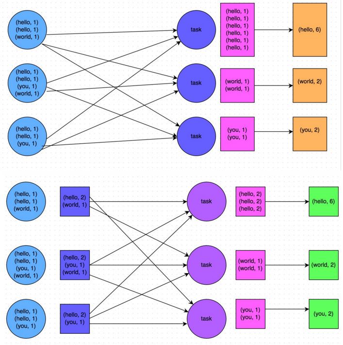

# 开发调优

在开发 Spark 作业的过程中需要注意核应用一些性能优化的基本原则，开发调优就是列举了一些 Spark 的基本开发原则，包括：RDD lineage 设计、算子的合理使用、特殊操作的优化等。

在开发过程中，时时刻刻都应该注意以下原则，并将这些原则根据具体的业务以及实际的应用场景，灵活地运用到自己的 Spark 作业中。

## 原则一：避免创建重复的 RDD

通常来说，在开发一个 Spark 作业时，首先是基于某个数据源（比如 Hive 表或 HDFS 文件）创建一个初始的 RDD；接着对这个 RDD 执行某个算子操作，然后得到下一个 RDD；以此类推，循环往复，直到计算出最终需要的结果。在这个过程中，多个 RDD 会通过不同的算子操作（比如 map、reduce 等）串起来，这就是 RDD lineage，也就是 RDD的血缘关系链。

在开发过程中需要注意：*对于同一份数据，只应该创建一个 RDD，不能创建多个 RDD 来代表同一份数据*。

示例：

```scala
//需要对名为“hello.txt”的HDFS文件进行一次map操作，再进行一次reduce操作。
//也就是说，需要对一份数据执行两次算子操作。
//错误的做法：对于同一份数据执行多次算子操作时，创建多个RDD。
//这里执行了两次textFile方法，针对同一个HDFS文件，创建了两个RDD出来，
//然后分别对每个RDD都执行了一个算子操作。
//这种情况下，Spark需要从HDFS上两次加载hello.txt文件的内容，并创建两个单独的RDD；
//第二次加载HDFS文件以及创建RDD的性能开销，很明显是白白浪费掉的。

val rdd1 = sc.textFile("hdfs://192.168.0.1:9000/hello.txt")
rdd1.map(...)
val rdd2 = sc.textFile("hdfs://192.168.0.1:9000/hello.txt")
rdd2.reduce(...)


//正确的用法：对于一份数据执行多次算子操作时，只使用一个RDD。
//这种写法很明显比上一种写法要好多了，因为我们对于同一份数据只创建了一个RDD，
//然后对这一个RDD执行了多次算子操作。
//但是要注意到这里为止优化还没有结束，由于rdd1被执行了两次算子操作，第二次执行reduce操作的时候，
//还会再次从源头处重新计算一次rdd1的数据，因此还是会有重复计算的性能开销。
//要彻底解决这个问题，必须结合“原则三：对多次使用的RDD进行持久化”，
//才能保证一个RDD被多次使用时只被计算一次。

val rdd1 = sc.textFile("hdfs://192.168.0.1:9000/hello.txt")
rdd1.map(...)
rdd1.reduce(...)
```

## 原则二：尽可能复用同一个 RDD

除了要避免在开发过程中对一份完全相同的数据创建多个 RDD 之外，在对不同的数据执行算子操作时还要尽可能地复用一个 RDD。比如说，有一个 RDD 的数据格式是 `key-value` 类型的，另一个是单 value 类型的，这两个 RDD 的 value 数据是完全一样的。那么此时可以只使用 `key-value` 类型的那个 RDD，因为其中已经包含了另一个的数据。对于类似这种多个 RDD 的数据有重叠或者包含的情况，应该尽量复用一个 RDD，这样可以尽可能地减少 RDD 的数量，从而尽可能减少算子执行的次数。

```scala
// 错误的做法。
 
// 有一个<long , String>格式的RDD，即rdd1。
// 接着由于业务需要，对rdd1执行了一个map操作，创建了一个rdd2，
//而rdd2中的数据仅仅是rdd1中的value值而已，也就是说，rdd2是rdd1的子集。
 
JavaPairRDD</long><long , String> rdd1 = ...
JavaRDD<string> rdd2 = rdd1.map(...)
 
// 分别对rdd1和rdd2执行了不同的算子操作。
rdd1.reduceByKey(...)
rdd2.map(...)


// 正确的做法。
 
// 上面这个case中，其实rdd1和rdd2的区别无非就是数据格式不同而已，
//rdd2的数据完全就是rdd1的子集而已，却创建了两个rdd，并对两个rdd都执行了一次算子操作。
// 此时会因为对rdd1执行map算子来创建rdd2，而多执行一次算子操作，进而增加性能开销。
 
// 其实在这种情况下完全可以复用同一个RDD。
// 我们可以使用rdd1，既做reduceByKey操作，也做map操作。
// 在进行第二个map操作时，只使用每个数据的tuple._2，也就是rdd1中的value值，即可。
 
 
JavaPairRDD<long , String> rdd1 = ...
rdd1.reduceByKey(...)
rdd1.map(tuple._2...)
 
// 第二种方式相较于第一种方式而言，很明显减少了一次rdd2的计算开销。
// 但是到这里为止，优化还没有结束，对rdd1我们还是执行了两次算子操作，rdd1实际上还是会被计算两次。
// 因此还需要配合“原则三：对多次使用的RDD进行持久化”进行使用，
//才能保证一个RDD被多次使用时只被计算一次。
```

## 原则三：对多次使用的 RDD 进行持久化

当在 Spark 代码中多次对一个 RDD 做了算子操作后，这已经实现 Spark 作业第一步的优化了，也就是尽可能复用 RDD。此时就该在这个基础之上，进行第二步优化了，也就是要保证对一个 RDD 执行多次算子操作时，这个 RDD 本身仅仅被计算一次。

Spark 中对于一个 RDD 执行多次算子的默认原理是这样的：每次对一个 RDD 执行一个算子操作时，都会重新从源头处计算一遍，计算出那个 RDD 来，然后再对这个 RDD 执行算子操作。这种方式的性能是很差的。

因此对于这种情况的建议是：对多次使用的 RDD 进行持久化。此时 Spark 就会根据持久化策略，将 RDD 中的数据保存到内存或者磁盘中。以后每次对这个 RDD 进行算子操作时，都会直接从内存或磁盘中提取持久化的 RDD 数据，然后执行算子，而不会从源头处重新计算一遍这个 RDD，再执行算子操作。

**对多次使用的RDD进行持久化的代码示例**

```scala
// 如果要对一个RDD进行持久化，只要对这个RDD调用cache()和persist()即可。
 
// 正确的做法。
// cache()方法表示：使用非序列化的方式将RDD中的数据全部尝试持久化到内存中。
// 此时再对rdd1执行两次算子操作时，只有在第一次执行map算子时，才会将这个rdd1从源头处计算一次。
// 第二次执行reduce算子时，就会直接从内存中提取数据进行计算，不会重复计算一个rdd。

val rdd1 = sc.textFile("hdfs://192.168.0.1:9000/hello.txt").cache()
rdd1.map(...)
rdd1.reduce(...)


// persist()方法表示：手动选择持久化级别，并使用指定的方式进行持久化。
// 比如说，StorageLevel.MEMORY_AND_DISK_SER表示，内存充足时优先持久化到内存中，
//内存不充足时持久化到磁盘文件中。
// 而且其中的_SER后缀表示，使用序列化的方式来保存RDD数据，此时RDD中的每个partition
//都会序列化成一个大的字节数组，然后再持久化到内存或磁盘中。
// 序列化的方式可以减少持久化的数据对内存/磁盘的占用量，进而避免内存被持久化数据占用过多，
//从而发生频繁GC。
 
val rdd1 = sc.textFile("hdfs://192.168.0.1:9000/hello.txt")
.persist(StorageLevel.MEMORY_AND_DISK_SER)
rdd1.map(...)
rdd1.reduce(...)
```

## 原则四：尽量避免使用 shuffle 类算子

如果有可能的话，要尽量避免使用 shuffle 类算子。因为 Spark 作业运行过程中，最消耗性能的地方就是 shuffle 过程。shuffle 过程，简单来说，就是将分布在集群中多个节点上的同一个 key，拉取到同一个节点上，进行聚合或 join 等操作。比如 reduceByKey、join 等算子，都会触发 shuffle 操作。

shuffle 过程中，各个节点上的相同 key 都会先写入本地磁盘文件中，然后其他节点需要通过网络传输拉取各个节点上的磁盘文件中的相同key。而且相同 key 都拉取到同一个节点进行聚合操作时，还有可能会因为一个节点上处理的 key 过多，导致内存不够存放，进而溢写到磁盘文件中。因此在 shuffle 过程中，可能会发生大量的磁盘文件读写的 IO 操作，以及数据的网络传输操作。磁盘IO 和网络数据传输也是 shuffle 性能较差的主要原因。

因此在开发过程中，能避免则尽可能避免使用 reduceByKey、join、distinct、repartition 等会进行 shuffle 的算子，尽量使用 map 类的非 shuffle 算子。这样的话，没有 shuffle 操作或者仅有较少 shuffle 操作的 Spark 作业，可以大大减少性能开销。

**Broadcast 与 map 进行 join 代码示例**

```scala
// 传统的join操作会导致shuffle操作。
// 因为两个RDD中，相同的key都需要通过网络拉取到一个节点上，由一个task进行join操作。

val rdd3 = rdd1.join(rdd2)
 
// Broadcast+map的join操作，不会导致shuffle操作。
// 使用Broadcast将一个数据量较小的RDD作为广播变量。
val rdd2Data = rdd2.collect()
val rdd2DataBroadcast = sc.broadcast(rdd2Data)

// 在rdd1.map算子中，可以从rdd2DataBroadcast中，获取rdd2的所有数据。
// 然后进行遍历，如果发现rdd2中某条数据的key与rdd1的当前数据的key是相同的，
//那么就判定可以进行join。
// 此时就可以根据自己需要的方式，将rdd1当前数据与rdd2中可以连接的数据，
//拼接在一起（String或Tuple）。
val rdd3 = rdd1.map(rdd2DataBroadcast...)
 
// 注意，以上操作，建议仅仅在rdd2的数据量比较少（比如几百M，或者一两G）的情况下使用。
// 因为每个Executor的内存中，都会驻留一份rdd2的全量数据。
```

## 原则五：使用 map-side 预聚合的 shuffle 操作

如果因为业务需要，一定要使用 shuffle 操作，无法用 map 类的算子来替代，那么尽量使用可以 map-side 预聚合的算子。

所谓的 map-side 预聚合，说的是在每个节点本地对相同的 key 进行一次聚合操作，类似于 MapReduce 中的本地 combiner。map-side 预聚合之后，每个节点本地就只会有一条相同的 key，因为多条相同的 key 都被聚合起来了。其他节点在拉取所有节点上的相同 key 时，就会大大减少需要拉取的数据数量，从而也就减少了磁盘IO 以及网络传输开销。通常来说，在可能的情况下，建议使用 reduceByKey 或者 aggregateByKey 算子来替代掉 groupByKey 算子。因为 reduceByKey 和 aggregateByKey 算子都会使用用户自定义的函数对每个节点本地的相同 key 进行预聚合。而 groupByKey 算子是不会进行预聚合的，全量的数据会在集群的各个节点之间分发和传输，性能相对来说比较差。

比如下图，就是典型的例子，分别基于 reduceByKey 和 groupByKey 进行单词计数。其中第一张图是 groupByKey 的原理图，可以看到，没有进行任何本地聚合时，所有数据都会在集群节点之间传输；第二张图是 reduceByKey 的原理图，可以看到，每个节点本地的相同 key 数据，都进行了预聚合，然后才传输到其他节点上进行全局聚合。



## 原则六：使用高性能的算子

除了 shuffle 相关的算子有优化原则之外，其他的算子也都有着相应的优化原则。

**使用 reduceByKey/aggregateByKey 替代 groupByKey**

详情见“原则五：使用 map-side 预聚合的 shuffle 操作”。

**使用 mapPartitions 替代普通 map**

mapPartitions 类的算子，一次函数调用会处理一个 partition 所有的数据，而不是一次函数调用处理一条，性能相对来说会高一些。但是有的时候，使用 mapPartitions 会出现OOM（内存溢出）的问题。因为单次函数调用就要处理掉一个 partition 所有的数据，如果内存不够，垃圾回收时是无法回收掉太多对象的，很可能出现 OOM 异常。所以使用这类操作时要慎重！

**使用 foreachPartitions 替代 foreach**

原理类似于“使用 mapPartitions 替代 map”，也是一次函数调用处理一个 partition 的所有数据，而不是一次函数调用处理一条数据。在实践中发现，foreachPartitions 类的算子，对性能的提升还是很有帮助的。比如在 foreach 函数中，将 RDD 中所有数据写 MySQL，那么如果是普通的 foreach 算子，就会一条数据一条数据地写，每次函数调用可能就会创建一个数据库连接，此时就势必会频繁地创建和销毁数据库连接，性能是非常低下；但是如果用 foreachPartitions 算子一次性处理一个 partition 的数据，那么对于每个 partition，只要创建一个数据库连接即可，然后执行批量插入操作，此时性能是比较高的。实践中发现，对于1万条左右的数据量写 MySQL，性能可以提升30%以上。

**使用 filter 之后进行 coalesce 操作**

通常对一个 RDD 执行 filter 算子过滤掉 RDD 中较多数据后（比如30%以上的数据），建议使用 coalesce 算子，手动减少 RDD 的partition 数量，将 RDD 中的数据压缩到更少的 partition 中去。因为 filter 之后，RDD 的每个 partition 中都会有很多数据被过滤掉，此时如果照常进行后续的计算，其实每个 task 处理的 partition 中的数据量并不是很多，有一点资源浪费，而且此时处理的 task 越多，可能速度反而越慢。因此用 coalesce 减少 partition 数量，将 RDD 中的数据压缩到更少的 partition 之后，只要使用更少的 task 即可处理完所有的 partition。在某些场景下，对于性能的提升会有一定的帮助。

**使用 repartitionAndSortWithinPartitions 替代 repartition 与 sort 类操作**

repartitionAndSortWithinPartitions 是 Spark 官网推荐的一个算子，官方建议，如果需要在 repartition 重分区之后，还要进行排序，建议直接使用 repartitionAndSortWithinPartitions 算子。因为该算子可以一边进行重分区的 shuffle 操作，一边进行排序。shuffle 与 sort 两个操作同时进行，比先 shuffle 再 sort 来说，性能可能是要高的。

## 原则七：广播大变量

有时在开发过程中，会遇到需要在算子函数中使用外部变量的场景（尤其是大变量，比如100M以上的大集合），那么此时就应该使用 Spark 的广播（Broadcast）功能来提升性能。

在算子函数中使用到外部变量时，默认情况下，Spark 会将该变量复制多个副本，通过网络传输到 task 中，此时每个 task 都有一个变量副本。如果变量本身比较大的话（比如100M，甚至1G），那么大量的变量副本在网络中传输的性能开销，以及在各个节点的 Executor 中占用过多内存导致的频繁 GC，都会极大地影响性能。

因此对于上述情况，如果使用的外部变量比较大，建议使用 Spark 的广播功能，对该变量进行广播。广播后的变量，会保证每个 Executor 的内存中，只驻留一份变量副本，而 Executor 中的 task 执行时共享该 Executor 中的那份变量副本。这样的话，可以大大减少变量副本的数量，从而减少网络传输的性能开销，并减少对 Executor 内存的占用开销，降低 GC 的频率。

**广播大变量的代码示例**

```scala
// 以下代码在算子函数中，使用了外部的变量。
// 此时没有做任何特殊操作，每个task都会有一份list1的副本。
val list1 = ...
rdd1.map(list1...)
 
// 以下代码将list1封装成了Broadcast类型的广播变量。
// 在算子函数中，使用广播变量时，首先会判断当前task所在Executor内存中，是否有变量副本。
// 如果有则直接使用；如果没有则从Driver或者其他Executor节点上远程拉取一份放到本地Executor内存中。
// 每个Executor内存中，就只会驻留一份广播变量副本。
val list1 = ...
val list1Broadcast = sc.broadcast(list1)
rdd1.map(list1Broadcast...)
```

## 原则八：使用 Kryo 优化序列化性能

在Spark中，主要有三个地方涉及到了序列化：

1. 在算子函数中使用到外部变量时，该变量会被序列化后进行网络传输（见“原则七：广播大变量”中的讲解）
2. 将自定义的类型作为 RDD 的泛型类型时（比如 JavaRDD，Student 是自定义类型），所有自定义类型对象，都会进行序列化。因此这种情况下，也要求自定义的类必须实现 Serializable 接口
3. 使用可序列化的持久化策略时（比如 MEMORY_ONLY_SER），Spark 会将 RDD 中的每个 partition 都序列化成一个大的字节数组

对于这三种出现序列化的地方，我们都可以通过使用 Kryo 序列化类库，来优化序列化和反序列化的性能。Spark 默认使用的是 Java 的序列化机制，也就是 ObjectOutputStream/ObjectInputStream API 来进行序列化和反序列化。但是 Spark 同时支持使用 Kryo 序列化库，Kryo 序列化类库的性能比 Java 序列化类库的性能要高很多。官方介绍，Kryo 序列化机制比 Java 序列化机制，性能高 10 倍左右。Spark 之所以默认没有使用 Kryo 作为序列化类库，是因为 Kryo 要求最好要注册所有需要进行序列化的自定义类型，因此对于开发者来说，这种方式比较麻烦。

以下是使用 Kryo 的代码示例，用户只要设置序列化类，再注册要序列化的自定义类型即可（比如算子函数中使用到的外部变量类型、作为RDD泛型类型的自定义类型等）：

```scala
// 创建SparkConf对象。
val conf = new SparkConf().setMaster(...).setAppName(...)
// 设置序列化器为KryoSerializer。
conf.set("spark.serializer", "org.apache.spark.serializer.KryoSerializer")
// 注册要序列化的自定义类型。
conf.registerKryoClasses(Array(classOf[MyClass1], classOf[MyClass2]))
```

## 原则九：优化数据结构

Java中，有三种类型比较耗费内存：

1. 对象，每个 Java 对象都有对象头、引用等额外的信息，因此比较占用内存空间。
2. 字符串，每个字符串内部都有一个字符数组以及长度等额外信息。
3. 集合类型，比如 HashMap、LinkedList 等，因为集合类型内部通常会使用一些内部类来封装集合元素，比如 Map.Entry。

因此 Spark 官方建议，在 Spark 编码实现中，特别是对于算子函数中的代码，尽量不要使用上述三种数据结构，尽量使用字符串替代对象，使用原始类型（比如Int、Long）替代字符串，使用数组替代集合类型，这样尽可能地减少内存占用，从而降低 GC 频率，提升性能。