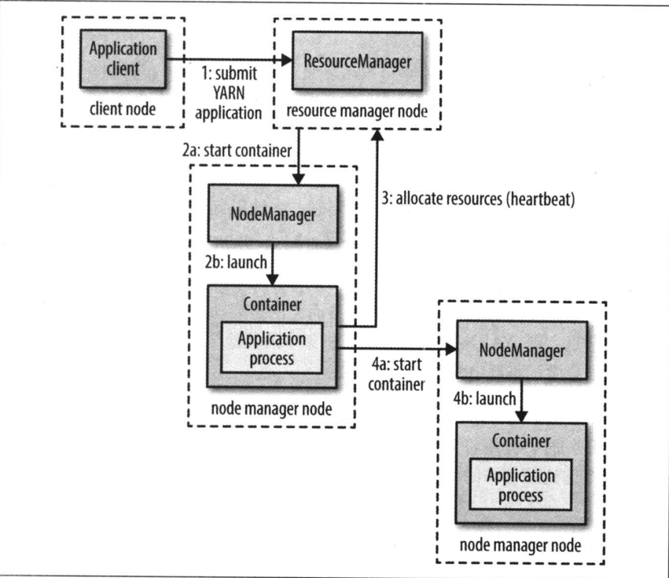
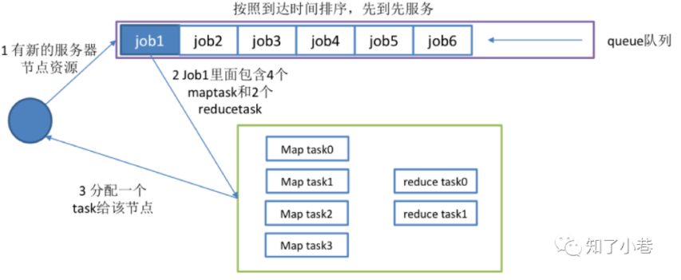
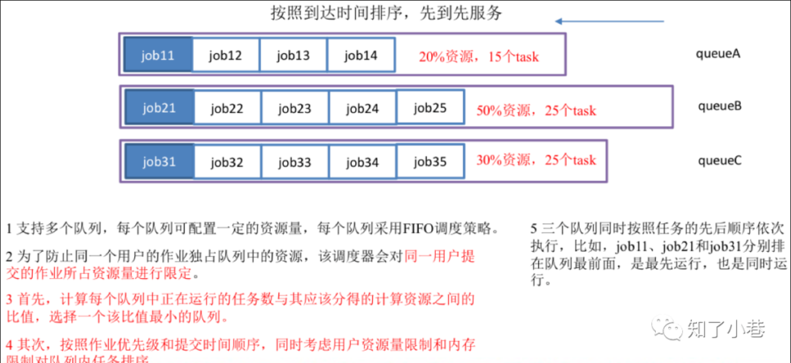
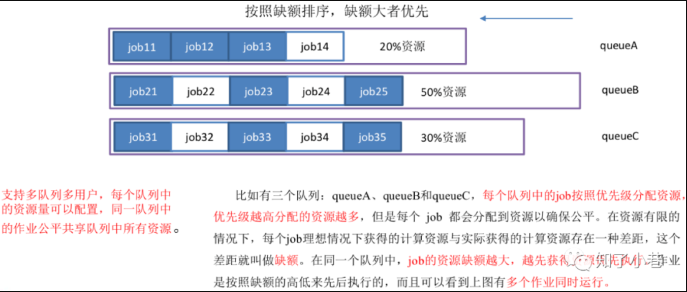

# YARN

> Apache YARN（Yet Another Resource Negotiator 的缩写）是 Hadoop 的集群资源管理系统。
> 
> 简单说，YARN 是一个资源调度平台，负责为运算程序提供服务器运算资源，相当于一个分布式的操作系统平台。

## YARN 应用运行机制

YARN 通过两类长期运行的守护进程提供自己的核心服务：管理集群上资源使用的资源管理器（resource manager）、运行在集群中所有节点上且能够启动和监控容器（container）的节点管理器（node manager）。容器用于执行特定应用程序的进程，每个容器都有资源限制（内存、CPU等）。一个容器可以是一个 Unix 进程，也可以是一个 Linux cgroup，取决于 YARN 的配置。



为了在 YARN 上运行一个应用，首先，客户端联系资源管理器，要求它运行一个 application master 进程（步骤1）。然后，资源管理器找到一个能够在容器中启动 application master 的节点管理器（步骤 2a 和 2b）。准确的说，application master 一旦运行起来后能够做些什么依赖于应用本身。有可能是在所处的容器中简单地运行一个计算，并将结果返回给客户端；或是向资源管理器请求更多的容器（步骤3），以用于运行一个分布式计算（步骤 4a 和 4b）。

## 资源调度器

> YARN 中有三种调度器可用：**FIFO调度器（FIFO Scheduler）**、**容量调度器（Capacity Scheduler）**和**公平调度器（Fair Scheduler）**。

### 先进先出调度器（FIFO）



FIFO 调度器将应用放置在一个队列中，然后按照提交的顺序（先进先出）运行应用。首先为队列中第一个应用的请求分配资源，第一个应用的请求被满足后再依次为队列中下一个应用服务。

FIFO 调度器的优点是，简单易懂，不需要任何配置，但是不适合共享集群。大的应用会占用集群中的所有资源，所以每个应用必须等待直到轮到自己运行。在一个共享集群中，更适合使用容器调度器或公平调度器。这两种调度器都允许长时间运行的作业能及时完成，同时也允许正在进行较小临时查询的用户能够在合理时间内得到返回结果。

### 容量调度器（Capacity Scheduler）



容器调度器允许多个组织共享一个 Hadoop 集群，每个组织可以分配到全部集群资源的一部分。每个组织被配置一个专门的队列，每个队列被配置为可以使用一定的集群资源。队列可以进一步按层次划分，这样每个组织内的不同用户能够共享该组织队列所分配的资源。在一个队列内，使用 FIFO 调度策略对应用进行调度。

### 公平调度器（Fair Scheduler）



公平调度器旨在为所有运行的应用公平分配资源。

资源在队列之间公平共享的流程：假设两个用户 A 和 B，分别拥有自己的队列，A 启动一个作业，在 B 没有需求时 A 会分配到全部可用资源；但 A 作业仍在运行时 B 启动一个作业，一段时间后，按照先前看到的方式，每个作业都用到了一半的集群资源。这时，如果 B 启动第二个作业且其他作业仍在运行，那么第二个作业将和 B 的其他作业共享资源，因此 B 的每个作业都将占用四分之一的集群资源，而 A 仍继续占用一半的集群资源。最终的结果就是资源在用户之间实现了公平共享。

### 配置调度器

通过查看 `yarn.resourcemanager.scheduler.class` 配置项来配置调度器，如配置公平调度器：

```xml
<property>
    <name>yarn.resourcemanager.scheduler.class</name>
    <value>org.apache.hadoop.yarn.server.resourcemanager.scheduler.capacity.CapacityScheduler</value>
    <description>The class to use as the resource scheduler.</description>
</property>
```
