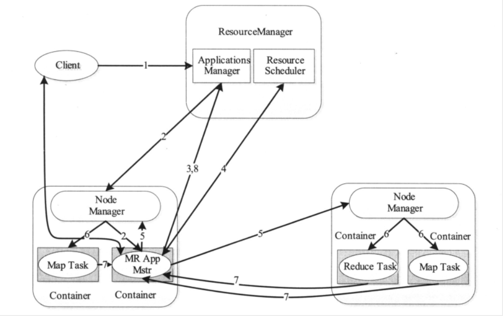

运行在YARN上的应用程序主要分为两类：短应用程序和长应用程序，其中，*短应用程序是指一定时间内（可能秒级、分钟级或者小时级，尽管天数级别或者更长时间的也存在，但非常少）可运行完成并正常退出的应用程序*，比如MapReduce作业、Tez DAG作业等；*长应用程序是指不出意外，永不终止运行的应用程序*，通常是一些服务，比如Storm Service、HBase Service（包括Hmaster和RegionServer两类服务）等，而它们本身作为一个框架提供了编程接口供用户使用。尽管这两类应用程序的作用不同，一类直接运行数据处理程序，一类用于部署服务（服务之上再运行数据处理程序），但运行在YARN上的流程是相同的。

当用户向YARN中提交一个应用程序后，YARN将分两个阶段运行该应用程序：第一个阶段是启动ApplicationMaster；第二个阶段是由ApplicationMaster创建应用程序，为它申请资源，并监控它的整个运行过程，直到运行完成。

如上图所示，YARN的工作流程分为以下几个步骤：

1. 用户向YARN提交应用程序，其中包括ApplicationMaster程序、启动ApplicationMaster的命令、用户程序等
2. ResourceManager为该应用程序分配第一个Container，并与对应的NodeManager通信，要求它在这个Container中启动应用程序的ApplicationMaster
3. ApplicationMaster首先向ResourceManager注册，这样用户可以直接通过ResourceManager查看应用程序的运行状态，然后它将为各个任务申请资源，并监控它的运行状态，直到运行结束，即重复步骤4~7
4. ApplicationMaster采用轮询的方式通过RPC协议向ResourceManager申请和领取资源
5. 一旦ApplicationMaster申请到资源后，便与对应的NodeManager通信，要求它启动任务
6. NodeManager为任务设置好运行环境（包括环境变量、JAR包、二进制程序等）后，将任务启动命令写到一个脚本中，并通过运行该脚本启动任务
7. 各个任务通过某个RPC协议向ApplicationMaster汇报自己的状态和进度，以让ApplicationMaster随时掌握各个任务的运行状态，从而可以在任务失败时重新启动任务
    > 在应用程序运行过程中，用户可随时通过RPC向ApplicationMaster查询应用程序的当前运行状态
8. 应用程序运行完成后，ApplicationMaster向ResourceManager注销并关闭自己