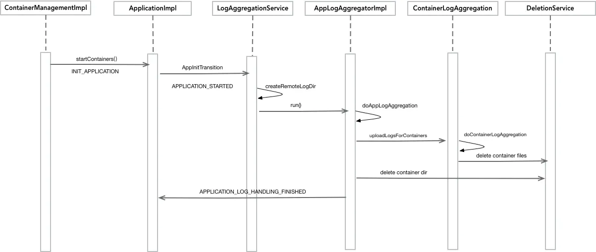

# Yarn 日志

## 服务类日志

ResourceManager、NodeManager 这类系统自带的服务输出的日志是存放在 `${YARN_LOG_DIR}`（默认 `${HADOOP_HOME}/logs`） 目录下。

日志文件命名一般如下：

- ResourceManager : `yarn-${USER}-resourcemanager-${hostname}.log`
- NodeManager : `yarn-${USER}-nodemanager-${hostname}.log`

其中${USER}是指启动 ResourceManager/NodeManager 进程的用户，${hostname} 是 ResourceManager/NodeManager 进程所在机器的 hostname

## 作业运行日志

作业运行在 Container 中产生日志，Container 日志包含 ApplicationMaster 日志和普通 Task 日志等信息，由配置 `yarn.nodemanager.log-dirs` 设定。

具体的应用日志在本地保存的位置为 `${yarn.nodemanager.log-dirs}/application_${appid}`，该目录下包含各容器的日志 `container_{$contid}`，每个容器目录都将包含该容器生成的 stderr，stdin 和 syslog 文件。

在 `yarn-site.xml` 中对 `yarn.nodemanager.log-dirs` 进行配置，该参数的默认值为 `${yarn.log.dir}/userlogs`。

> **`yarn.log.dir`**
> 
> `yarn.log.dir` 是一个属性，通过 -D 进行指定，在 `yarn-env.sh` 中，可看到如下脚本：
> 
> ```shell
> # default log directory and file
> if [ "$YARN_LOG_DIR" = "" ]; then
>   YARN_LOG_DIR="$HADOOP_YARN_HOME/logs"
>   ...
> fi
> 
> YARN_OPTS="$YARN_OPTS -Dyarn.log.dir=$YARN_LOG_DIR"
> ```

## 日志聚合

因运行在 Yarn 上的应用程序日志默认都是在本地存储的，散落在各节点上，不方便用户进行查看，为了解决这个痛点，yarn 为了方便用户，提供支持开启日志聚合功能。

日志聚合默认是关闭的，需要在 `yarn-site.xml` 进行开启，参数如下：

- `yarn.log-aggregation-enable`：是否开启日志聚合，默认值 false
- `yarn.nodemanager.remote-app-log-dir`：日志聚合的地址，默认为 /tmp/logs
- `yarn.nodemanager.remote-app-log-dir-suffix`：日志聚合的地址后缀，默认为 logs

> 注意事项：
>  
> `yarn logs -applicationId ${application}` 查看的也是聚合后的应用日志，而不是作业在本地的日志



## 日志清理

日志清理分为**本地清理**和**远程聚合清理**。

### 本地清理

- `yarn.nodemanager.log.retain-seconds`: 保存在本地节点的日志的留存时间, 默认值是 10800，单位：秒，即 3 小时。当开启日志聚合功能后，该配置无效。
- `yarn.nodemanager.delete.debug-delay-sec`：默认值为 0，表示在开启日志聚合功能的情况下，应用完成后，进行日志聚合，然后 NodeManager 的 DeletionService 立即删除应用的本地日志。如果想查看应用日志，可以将该属性值设置得足够大（例如，设置为 600 = 10 分钟）以允许查看这些日志。
- `yarn.nodemanager.delete.thread-count`: NodeManager 用于日志清理的线程数，默认值为 4。

### 远程聚合清理

- `yarn.log-aggregation.retain-seconds`: 在删除聚合日志之前保留聚合日志的时间。默认值是 -1，表示永久不删除日志。这意味着应用程序的日志聚合所占的空间会不断的增长，从而造成 HDFS 集群的资源过度使用。
- `yarn.log-aggregation.retain-check-interval-seconds`: 聚合日志保存检查间隔时间，确定多长时间去检查一次聚合日志的留存情况以执行日志的删除。如果设置为 0 或者负值，那这个值就会用聚合日志保存时间的 1/10 来自动配置，默认值是 -1。
    