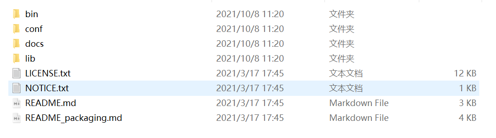
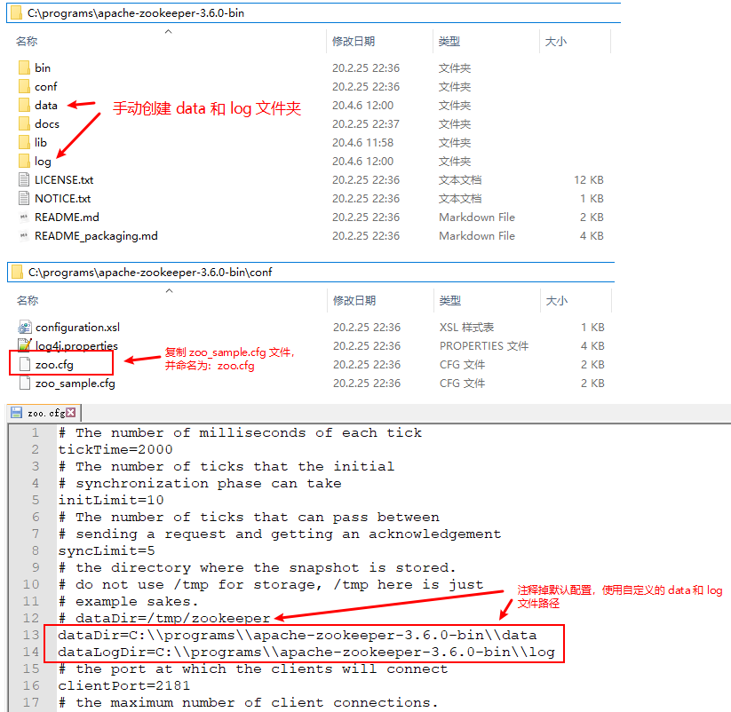
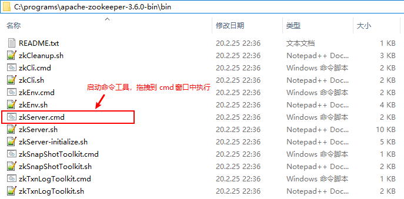
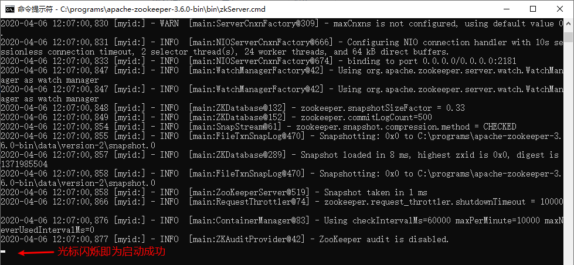
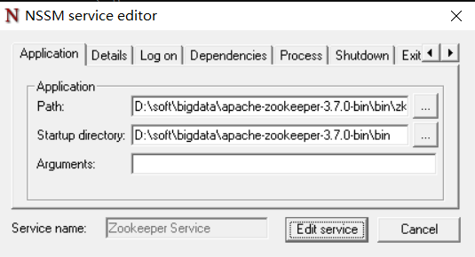

# Windows 环境安装

## 下载

官网地址：<https://zookeeper.apache.org/>

安装包下载地址：<https://zookeeper.apache.org/releases.html#download>

如果官网下载速度慢可以使用国内镜像下载地址：<http://mirrors.hust.edu.cn/apache/zookeeper/>

## 安装

将上述安装包放到指定的文件目录，并使用解压缩工具解压这个安装包：首选解压 gz 包之后得到 tar 包，继续解压 tar包得到 apache-zookeeper-3.6.0-bin 文件目录，进入该目录得到 apache-zookeeper-3.6.0-bin 目录结构如下：



在上述的文件目录中创建 data 和 log 文件夹，并复制 conf 文件夹中的 zoo_sample.cfg 文件名称为：zoo.cfg，使用文本编辑器打开该文件，并设置数据保存目录为刚才创建的 data 文件夹目录：



## 启动

在安装目录的 bin 目录下，将zkServer.cmd拖拽到 cmd 命令窗口中，回车执行即可启动 zookeeper：



启动过程没有异常信息提示，启动成功之后，光标不停闪烁：



只要这个 cmd 窗口不关闭，zookeeper 服务就会一直启用着。zookeeper 服务默认启动的是 2181 端口。

## ~~集成 zookeeper 到 windows 服务~~

下载的 Zookeeper 是 `.cmd` 的批处理命令运行的，默认没有提供以 windows 服务的方式运行的方案，因此可以下载 prunsrv 来作为 zookeeper 的服务管理。将 zookeeper 做成 windows 服务，避免每次关闭后，再启动还需要使用 cmd。

**下载 prunsrv**

下载地址：<http://archive.apache.org/dist/commons/daemon/binaries/windows/>

解压 zip 文件，复制 prunmgr.exe、prunsrv.exe 到 ZooKeeper 安装路径的 bin 目录下。注意：如果你的操作系统是 64 位的，则复制 amd64 目录下的 prunsrv.exe。

**编写脚本**

*安装服务脚本*

在 ZooKeeper 根目录下创建服务安装脚本：zkServiceInstall.bat

```bat
@echo off
CD /d %~dp0
SET ZK_HOME=%CD%
SET ZK_DATA_DIR=%ZK_HOME%\data
SET ZK_LOG_DIR=%ZK_HOME%\log
SET ZK_SERVICE_NAME=zookeeper
if not exist %ZK_DATA_DIR% mkdir %ZK_DATA_DIR%
if not exist %ZK_LOG_DIR% mkdir %ZK_LOG_DIR%
 
:: 安装ZooKeeper的Windows服务
%ZK_HOME%\bin\prunsrv.exe "//IS//%ZK_SERVICE_NAME%" ^
--DisplayName="%ZK_SERVICE_NAME%" ^
--Description="%ZK_SERVICE_NAME%" ^
--Startup=auto ^
--StartMode=exe ^
--StartPath=%ZK_HOME% ^
--StartImage=%ZK_HOME%\bin\zkServer.cmd ^
--StopPath=%ZK_HOME%\ ^
--StopImage=%ZK_HOME%\zkServerStop.bat ^
--StopMode=exe ^
--StopTimeout=5 ^
--LogPath=%ZK_LOG_DIR% ^
--LogPrefix=zookeeper-wrapper ^
--PidFile=zookeeper.pid ^
--LogLevel=Info ^
--StdOutput=auto ^
--StdError=auto
 
pause
```

*删除服务脚本*

在 ZooKeeper 根目录下创建服务卸载脚本：zkServiceRemove.bat

```bat
@echo off 

CD /d %~dp0
%CD%\bin\prunsrv.exe //DS//zookeeper
```

*停止服务脚本*

在 ZooKeeper 根目录下创建服务停止脚本：zkServerStop.bat

> 无法使用 net stop zookeeper 命令停止服务，只能暴力杀死进程来停止服务。

```bat
@echo off
 
setlocal
 
CD /d %~dp0
 
:: 以杀进程的方式停止ZooKeeper服务
SET /p zkPID=<%CD%\log\zookeeper.pid
taskkill /PID %zkPID% /T /F
 
endlocal
```

*脚本使用说明*

以上三个脚本必须以管理员身份运行，首先运行 zkServiceInstall.bat 文件，再 win + r 寻找 services.msc 服务，找到zookeeper服务右击启动服务，或者使用net start zookeeper启动服务。

停止服务，执行 zkServerStop.bat 文件。

如果想删除服务，必须先停止服务（执行 zkServerStop.bat 文件），才能删除服务，即执行 zkServiceRemove.bat 文件。

## 使用 nssm 服务注册方式

