# HTTP

通过发送请求获取服务器资源的Web浏览器等，都可称为客户端（client）。

Web使用一种名为**HTTP(HyperText Transfer Protocol，超文本传输协议)**的协议作为规范，完成从客户端到服务器端等一系列运作流程。而协议是指规则的规定。可以说，Web是建立在HTTP协议上通信的。

## TCP/IP

通常使用的网络（包括互联网）是在TCP/IP协议族的基础上运作的。而HTTP属于它内部的一个子集。

### TCP/IP协议族

TCP/IP是互联网相关的各类协议族的总称，包括：`IP`、`ICMP`、`IEEE 802.3`、`TCP`、`DNS`、`UDP`、`FTP`、**`HTTP`**、`SNMP`等等。。。

协议中存在各式各样的内容。从电缆的规格到IP地址的选定方法、寻找异地用户的方法、双方建立通信的顺序，以及Web页面显示需要处理的步骤，等等。

### TCP/IP的分层管理

TCP/IP协议族按层次分别分为以下4层：应用层、传输层、网络层和数据链路层。

TCP/IP协议族各层的作用如下：
- **应用层**：应用层决定了向用户提供应用服务时通信的活动。TCP/IP协议族内预存了各类通用的应用服务。比如：FTP(File Transfer Protocol，文件传输协议)和DNS(Domain Name System，域名系统)服务就是其中两类。**HTTP协议也处于该层。**
- **传输层**：传输层对上层应用层，提供处于网络连接中的两台计算机之间的数据传输。
  - 在传输层有两个性质不同的协议：TCP(Tansmission Control Protocol，传输控制协议)和UDP(User Data Protocol，用户数据报协议)。
- **网络层**：网络层用来处理在网络上流动的数据包。数据包是网络传输的最小数据单位。该层规定了通过怎样的路径（所谓的传输线路）到达对方计算机，并把数据包传送给对方。与对方计算机之间通过多台计算机计算机或网络设备进行传输时，网络层所起的作用就是在众多的选项内选择一条传输路线。
- **数据链路层**：用来处理连接网络的硬件部分。包括控制操作系统、硬件的设备驱动、NIC（网卡）及光纤等物理可见部分（还包括连接器等一切传输媒介）。硬件上的范畴均在链路层的作用范围之内。

### TCP/IP通信传输流

栗子：以HTTP来说明

1. 作为发送端的客户端在应用层（HTTP协议）发出一个Web请求；
2. 在传输层（TCP协议）把从应用层处收到的数据（HTTP请求报文）进行分割，并在各个报文上打上标记序号及端口号后转发给网络层；
3. 在网络层（IP协议），增加作为通信目的地的MAC地址后转发给链路层。这样一来，法网网络的通信请求就准备齐全了。
4. 接收端的服务器在链路层接收到数据，按序往上一层发送，一直到应用层，当传输到应用层，才能算真正接收到由客户端发送过来的HTTP请求。

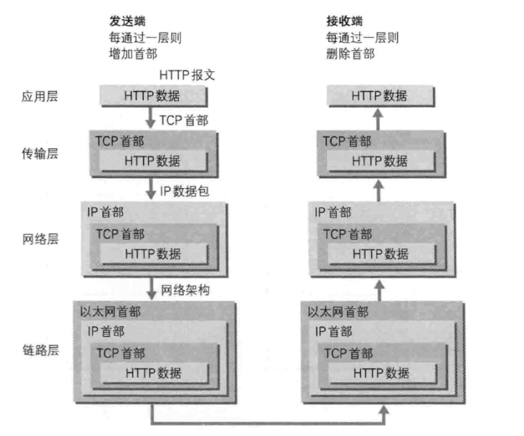

发送端在层与层之间传输数据时，每经过一层时必定会打上一个该层所属的首部信息。反之，接收端在层与层传输数据时，每经过一层时会把对应的首部消去。这种把数据信息包装起来的做法称为封装（encapsulate）。

## 与HTTP关系密切的协议：IP、TCP和DNS

HTTP协议的通信过程：

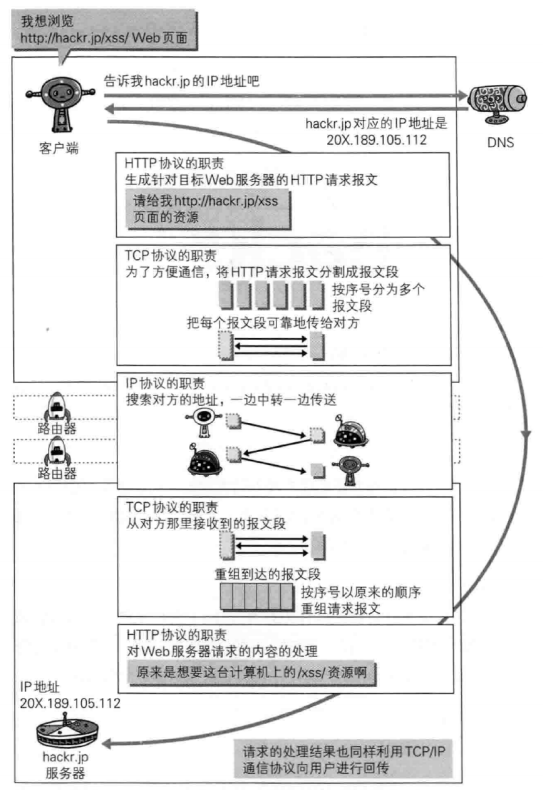

### IP协议

IP(Internet Protocol)网际协议位于网络层。

IP协议的作用是把各种数据包传送给对方。而要保证可传送，最重要的两个条件是`IP地址`和`MAC地址`；IP地址指明了节点被分配到的地址，MAC地址是指网卡所属的固定地址。IP之地可以和MAC地址进行配对。IP地址可换，但MAC地址基本上不会更改。

### TCP协议

TCP位于传输层，提供可靠的字节流服务；字节流服务(Byte Stream Service)是指为了方便传输，将大块数据分割成以报文段(segment)为单位的数据包进行管理。

TCP协议采用了**三次握手(three-way handshaking)策略**。握手过程中使用了TCP的标志（flag）- SYN(synchronize) 和 ACK（acknowledgement）

发送端首先发送一个带SYN标志的数据包给对方。接收端收到后，回传一个带有SYN/ACK标志的数据包以示传达确认信息。最后，发送端再回传一个带ACK标志的数据包，代表握手结束。若在握手过程中某个阶段莫名终端，TCP协议会再次以相同的顺序发送相同的数据包。

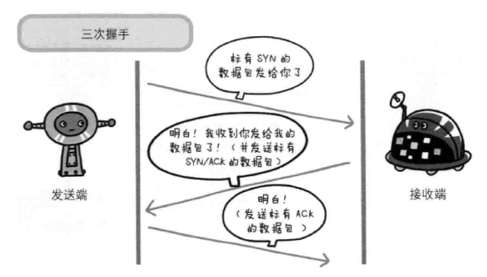

### DNS

DNS:`Domain Name System`，域名解析服务，DNS服务是和HTTP协议一样位于应用层的协议。它提供域名到IP地址之间的解析服务。

DNS作为将域名和IP地址相互映射的一个分布式数据库。DNS使用TCP和UDP端口53。当前，对于每一级域名长度的限制是63个字符，域名总长度则不能超过253个字符。

## URI、URL和URN

URI是一个用于**标识互联网资源名称的字符串**，该种标识允许用户对网络中（一般指万维网）的资源通过特定的协议进行交互操作。URI的最常见的形式是统一资源定位符（URL），经常指定为非正式的网址。更罕见的用法是统一资源名称（URN），其目的是通过提供一种途径。用于在特定的命名空间资源的标识，以补充网址。

通俗地说，**URL和URN是URI的子集，URI属于URL更高层次的抽象，一种字符串文本标准**。

三者之间的关系如下：


### URI-统一资源标识符

URI是`Uniform Resource Identifier`的缩写。URI是由某个协议方案表示的资源的定位标识符，协议方案是指访问资源所使用的协议类型；标准的URI协议方案有30种左右，包括http、ftp、mailto、telnet、file等。

URI的组成部分，一般由3部分组成：
1. 访问资源的系欸方案
2. 存放资源的主机名
3. 资源自身的名称，由路径表示，着重强调于资源

URI通用语法[部分]：
```
ftp://ftp.is.co.za/rfc/rfc1808.txt (also a URL because of the protocol)
http://www.ietf.org/rfc/rfc2396.txt (also a URL because of the protocol)
ldap://[2001:db8::7]/c=GB?objectClass?one (also a URL because of the protocol)
mailto:John.Doe@example.com (also a URL because of the protocol)
news:comp.infosystems.www.servers.unix (also a URL because of the protocol)
tel:+1-816-555-1212
telnet://192.0.2.16:80/ (also a URL because of the protocol)
urn:oasis:names:specification:docbook:dtd:xml:4.1.2
```

### URL-统一资源定位符

URL：`Uniform Resource Locator`

它是一种具体的URI，即URL可以用来标识一个资源，而且还指明了如何locate这个资源。

URL一般由三部组成：
1. 协议(或称为服务方式)
2. 存有该资源的主机IP地址(有时也包括端口号)
3. 主机资源的具体地址。如目录和文件名等

### URN-统一资源命名

URN是通过名字来标识资源，比如mailto:java-net@java.sun.com。

## HTTP协议

**HTTP协议用于客户端和服务器端之间的通信。**

在两台计算机之间使用HTTP协议通信时，在一条通信线路上必定有一端是**客户端**，另一端则是**服务器端**。

**HTTP协议规定，请求从客户端发出，最后服务器端相应该请求并返回。**换句话说，肯定是先从客户端开始建立通信的，服务器端在没有接收到请求之前不会发送响应。

HTTP是一种**无状态（statless）**协议。HTTP协议自身不对请求和响应之间的通信状态进行保存。也就是说在HTTP协议不对发送过的请求或响应做持久化处理。使用HTTP协议，每当有新的请求发送时，就会有对应的新响应产生。协议本身并不保留之前一切的请求或响应报文的信息。

**HTTP协议使用URI定位互联网上的资源。**

### HTTP方法

- GET：获取资源
- POST：传输实体主体
- PUT：传输文件
- HEAD：获取报文首部
- DELETE：删除文件
- OPTIONS：询问支持的方法
- TRACE：追踪路径
- CONNECT：要求用隧道协议连接代理

### 持久连接

持久连接（HTTP Persistent Connections，也称为HTTP keep-alive或HTTP connection reuse）的方法。持久连接的特点是只要任意一端没有明确的提出断开连接，则保持TCP连接状态。

传统连接图：

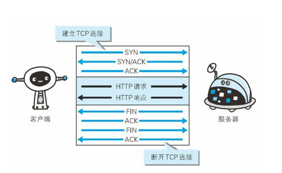

HTTP/1.1 协议里增加了 keep-alive的支持， 并且默认开启。连接图：

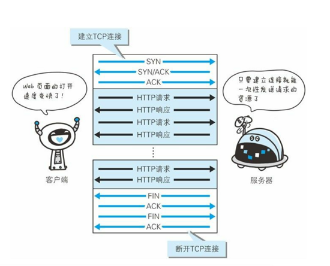

持久化连接的好处在于减少了TCP连接的重复建立和断开所造成的额外开销，减轻了服务器端的负载。也减少了连接的开销时间，使请求和响应能更快的结束，这样Web页面的显示速度得到了相应的提升。

## HTTP 报文

用于HTTP协议交互的信息被称为HTTP报文。请求端（客户端）的HTTP报文叫做请求报文，响应端（服务器端）的叫做响应报文。HTTP报文本身是由多行（CR+LF作换行符）数据构成的字符串文本。

HTTP报文大致分为报文首部和报文主体两块，两者由空行（CR+LF）来划分。通常，并不一定要有报文主体

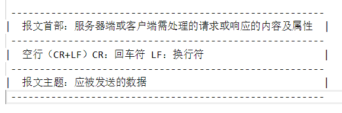

注：上图应是**报文主体**

HTTP报文的主体用于传输请求或响应的主体实体

### HTTP首部

HTTP协议的请求和响应报文中必定包含HTTP首部。首部内容为客户端和服务器分别处理请求和响应提供所需要的信息

#### 请求报文

在请求中，HTTP报文由方法、URI、HTTP版本、HTTP首部字段等部分构成。

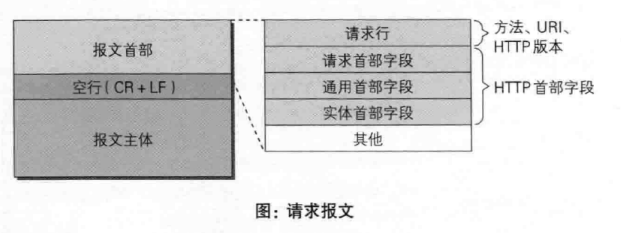

#### 响应报文

在响应中，HTTP报文由HTTP版本、状态码（数字和原因短句）、HTTP首部字段3部分构成。

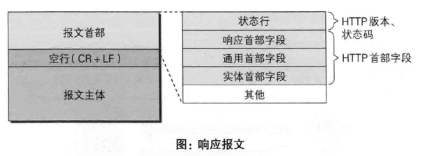

#### HTTP首部字段

注：因HTTP版本或扩展规范的变化，首部字段可支持的字段内容略有不同，以下主要涉及HTTP/1.1及常用的首部字段。

HTTP首部字段是构成HTTP报文的要素之一。在客户端与服务器之间以HTTP协议进行通信的过程中，无论是请求还是响应都会使用首部字段，它能起到传递额外重要信息的作用。

##### **HTTP首部字段结构**

HTTP首部字段的是由首部字段名和字段值构成的，中间用冒号":"分割。

> 首部字段名:字段值

##### **HTTP首部字段类型**

HTTP首部字段根据实际用途被分为以下4中类型：
- 通用首部字段：请求报文和响应报文两方都会使用的首部
- 请求首部字段：从客户端向服务器端发送请求报文时使用的首部。补充了请求的附件内容、客户端信息、相应内容相关优先级等信息
- 响应首部字段：从服务器端向客户端返回响应报文时使用的首部。补充了响应的附件内容，也会要求客户端附加二外的内容信息
- 实体首部字段：针对请求报文和响应报文的实体部分使用的首部。补充了资源内容更新时间等与实体有关的信息

##### **HTTP/1.1首部字段**

HTTP/1.1规范定义了如下47种首部字段

通用首部字段：

首部字段名|说明
----|---
[Cache-Control](#cache-control)|控制缓存的行为
[Connection](#connection)|逐跳首部、连接的管理
Data|创建报文的日期时间
Pragma|报文指令
Trailer|报文末端的首部一览
Transfer-Encoding|指定报文主体的传输编码方式
Upgrade|升级为其他协议
Via|代理服务器的相关信息
Warning|错误通知

请求首部字段：

首部字段名|说明
---|----
Accept|用户代理可处理的媒体类型
Accept-Charset|优先的字符集
Accept-Encoding|优先的内容编码
Accept-Language|优先的语言（自然语言）
Authorization|Web认证信息
Expect|期待服务器的特定行为
From|用户的电子邮箱地址
Host|请求资源所在服务器
If-Match|比较实体标记（ETag）
If-Modified-Since|比较资源的更新时间
If-None-Match|比较实体标记（与If-Match相反）
If-Range|资源未更新时发送实体Byte的范围请求
If-Unmodified-Since|比较资源的更新时间（与If-Modified-Since相反）
Max-Forwards|最大传输逐跳数
Proxy-Authorization|代理服务器要求客户端的认证信息
Range|实体的字节范围请求
[Referer](#referer)|对请求中URI的原始获取方
TE|传输编码的优先级
User-Agent|HTTP客户端程序的信息

响应首部字段：

首部字段名|说明
---|---
Accept-Ranges|是否接受字节范围请求
Age|推送资源创建经过时间
ETag|资源的匹配信息
Location|令客户端重定向至指定URI
Proxy-Authenticate|代理服务器对客户端的认证信息
Retry-After|对再次发起请求的时机要求
Server|HTTP服务器的安装信息
Vary|代理服务器缓存的管理信息
WWWW-Authenticate|服务器对客户端的认证信息

实体首部字段：

首部字段名|说明
---|----
Allow|资源可支持的HTTP方法
Content-Encoding|实体主体适用的编码方式
Content-Language|实体主体的自然语言
Content-Length|实体主体的大小（单位：字节）
Content-Location|替代对应的URI
Content-MD5|实体主体的报文摘要
Content-Range|实体主体的位置范围
Content-Type|实体主体的媒体类型
Expires|实体主体过期的日期时间
LAst-Modified|资源的最后修改日期时间

###### Cache-Control

通过指令就能控制缓存的工作机制，指令可选，多个指令通过","分割

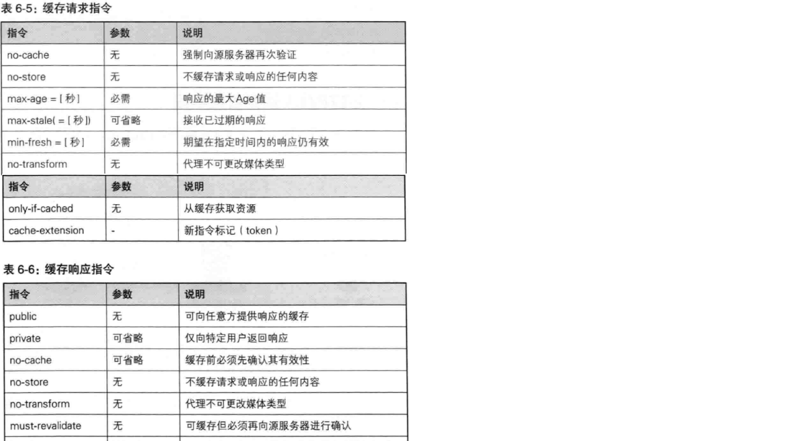

- **表示是否能缓存的指令**

- `public`:明确表示其他用户也可以利用缓存
- `private`:响应只以特定的用户作为对象
- `no-cache`：目的是为了防止从缓存中返回过期的资源

- **控制可执行缓存的对象的指令**

- `no-store`:表示请求（和对应的响应）或响应中包含机密信息。该指令规定缓存不能在本地存储请求或响应的任一部分。

- **指定缓存期限和认证的指令**

- `s-maxage`
- `max-age`
- `min-fresh`:要求缓存服务器返回至少还未过指定时间的缓存资源
- `max-stale`:可指示缓存资源，即使过期也照常接收
- `only-if-cached`:表示客户端仅在缓存服务器的本地缓存目标资源的情况下才会要求返回，即该指令缓存服务器不重新加载响应，也不会再次确认资源有效性
- `must-revalidate`:
- `proxy-revalidate`:
- `no-transform`:规定无论是在请求还是响应中，缓存都不能改变实体主体的媒体类型。这样做可防止缓存或代理压缩图片等类似操作

###### Connection

Connection首部字段具备如下两个作用：

- 控制不再转发给代理的首部字段
- 管理持久连接

###### Date

首部字段Date表明创建HTTP报文的日期和时间

###### Pragma

Pragma是HTTP/1.1之前版本的历史遗留字段，仅作为与HTTP/1.0的向后兼容而定义。

规范定义的形式唯一：`Pragma: no-cache`

该首部字段属于通用首部字段，但只用在客户端发送的请求中。客户端会要求所有的中间服务器不返回缓存的资源。

###### Trailer

###### Transfer-Encoding

首部字段Transfer-Encoding 规定了传输报文主体时采用的编码方式。

HTTP/1.1的传输编码方式仅对分块传输编码有效。

###### Upgrade

首部字段Upgrade用于检测HTTP协议及其他协议是否可使用更高的版本进行通信，其参数值可以用来制定一个完全不同的通信协议。

###### Via

###### Accept

示例：`Accept:text/html,application/xhtml+xml,application/xml`

Accept首部字段可通知服务器，用户代理能够处理的媒体类型及媒体类型的相对优先级。可使用"type/subtype"这种形式，一次指定多种媒体类型

- 文件文本：`text/html`、`text/plain`、`text/css`...
- 图片文件：`image/jpeg`、`image/gif`、`image/png`...
- 视频文件`video/mpeg`、`video/quicktime`...
- 应用程序使用的二进制文件：`application/octet-stream`、`application/zip`...

###### Accept-Charset

Accept-Charset首部字段可用来通知服务器，用户代理支持的字符集及字符集的相对优先级。

###### Accept-Encoding

示例：`Accept-Encoding：gzip，deflate`

Accept-Encoding首部字段用来告知服务器，用户代理支持的内容编码及内容编码的优先级顺序，可一次性制定多种内容编码

###### Accept-Language

示例：`Accept-Language:zh-ch,zh;q=0.7,en-us,en;q=0.3`

首部字段Accept-Language用来告知服务器，用户代理能够处理的自然语言集（指中文或英文等），以及自然语言集的相对优先级。可一次性制定多种自然语言集。

###### Authorization

首部字段Authorization是用来告知服务器，用户代理的认证信息（证书值）

###### Expect

客户端使用首部字段Expect来告知服务器，期望出现的某种特定行为。

###### Form

首部字段Form用来告知服务器使用用户代理的用户的电子邮件地址

###### Host

首部字段Host会告知服务器，请求的资源所处的互联网主机名和端口。Host首部字段在HTTP/1.1规范内是唯一一个必须被包含在请求内的首部字段。

###### If-xxx

形如If-xxx这种样式的请求首部字段，都可称为**条件请求**。服务器接收到附带条件的请求后，只有判定指定条件为真时，才会执行请求。

- **If-Match**

- **If-Modified-Since**

附带条件之一，If-Modified-Since首部字段，它会告知服务器若If-Modified-Since字段值早于资源的更新时间，则希望能处理该请求。而在指定If-Modified-Since字段值的日期时间之后，如果请求的资源都没有过更新，则返回状态码304 Not Modified的响应。

- **If-None-Match**

- **If-Range**

- **If-Unmodified-Since**

###### Max-Forwards

###### Referer

首部字段Referer会告知服务器请求的原始资源的URI。

###### User-Agent

首部字段User-Agent会将创建请求的浏览器和用户代理名称等信息传达给服务器。

###### Location

使用首部字段Location可以将响应接收方引导至某个与请求URI位置不同的资源。

基本上，该字段会配合3xx：Reditection的响应，提供重定向的URI

几乎所有的浏览器在接收到包含首部字段Location的响应后，都会强制性地尝试对已提示的重定向资源的访问。

###### Content-Encoding

首部字段Content-Encoding会告知客户端服务器对实体的主体部分选用的内容编码方式。内容编码是指在不丢失实体信息的前提下所进行的压缩。

主要采用一下4种内容编码方式：
- gzip
- compress
- deflate
- identity

###### Content-Language

示例：`Content-Lanuage:zh-CN`

首部字段Content-Language会告知客户端，实体主体使用的自然语言（指中文或英文等语言）

###### Content-Length

首部字段Content-Length表明了实体主题部门的大小（单位是字节）。

###### Content-Location

首部字段Content-Location给出与报文主体部分相对应的URI。Content-Location表示的是报文主体返回资源对应的URI。

###### Content-Type

示例：`Content-Type:text/html;charset=UTF-8`

首部字段Content-Type说明了实体主体内对象的媒体类型。字段值用`type/subtype`形式进行赋值。

###### Expires

首部字段Expires会将资源失效的日期告知客户端。缓存服务器在接收到含有首部字段Expires的响应后，会以缓存来应答请求，在Expires字段值制定的时间之前，响应的副本会一直被保存。当超过指定的时间后，缓存服务器在请求发送过来时，会转向源服务器请求的资源。

###### Last-Modified

首部字段Last-Modified指明资源最终修改的时间。

##### **非HTTP/1.1首部字段**

不限于RFC2616中定义的47中首部字段，还有Cookie、Set-Cookie和Content-Disposition等其他RFC中定义的首部字段

###### Cookie

为Cookie服务的首部字段

| 首部字段名 | 说明                           | 首部类型     |
|:----------:|------------------------------|----------|
| Set-Cookie | 开始状态管理所使用的Cookie信息 | 响应首部字段 |
|   Cookie   | 服务器接收到的Cookie信息       | 请求首部字段 |

### 发送多种数据的多部分对象集合

MIME(Multipurpose Internet Mail Extensions，多用途因特网络邮件扩展)机制，它允许邮件处理文本、图片、视频等多个不同类型的数据。在MIME扩展中会使用一种称为多部分对象集合（Multipart）的方法，来容纳多份不同类型的数据。

HTTP协议中也采纳了多部分对象集合，发送的一份报文主体可含有多类型实体。通常是在图片或文本文件等上传时使用。

多部分对象集合包含的对象如下：
- `multipart/form-data`:在Web表单文件上传时使用
- `multipart/byteranges`:状态码206（Partial Content，部分内容）响应报文包含了多个范围的内容时使用。

在HTTP报文中使用多部分对象集合时，需要在首部字段里加上Content-type。

## HTTP状态码

状态码的职责是**当客户端向服务器端发送请求时，描述返回的请求结果**。

状态码的类别：

状态码类别 | 类别                           | 原因短语
-----------|------------------------------|--------------
1xx        | Infomational（信息性状态码）     | 接受的请求正在处理
2xx        | Success（成功状态码）            | 请求正常处理完毕
3xx        | Redirection（重定向状态码）      | 需要进行附加操作以完成请求
4xx        | Client Error（客户端错误状态码） | 服务器无法处理请求
5xx        | Server Error（服务器错误状态码） | 服务器处理请求出错

注：**只要遵守状态码类别定义，即使改变RFC2626中定义的状态码，或服务器端自行创建状态码都没有问题**

### 1xx信息性

### 2xx成功

2xx的响应结果表明请求被正常处理了

- **200 Ok**：表示从客户端发来的请求在服务器端被正常处理了。
- **204 No Content**：该状态码代表服务器接收的请求已成功处理，但在返回的响应报文中不含实体的主体部分，也不允许返回任何实体的主体。
- **206 Partial Content**：该状态码表示客户端进行了范围请求，而服务器成功执行了这部分的GET请求。响应报文中包含由`Content-Range`指定范围的实体内容

### 3xx重定向

3xx响应结果表明浏览器需要执行某些特殊的处理以正确处理请求。

- **301 Moved Permanently**：永久性重定向，该状态码表示请求的资源已被分配了新的URI，以后应使用资源现在所指的URI。
- **302 Found**：临时性重定向。该状态码表示请求的资源已被分配了新的URI，希望用户（本次）能使用新的URI访问。
- **303 See Other**：该状态码表示由于请求对应的资源存在着另一个URI,应使用GET方法定向获取请求的资源。
- **304 Not Modified**：该状态码表示客户端发送附带条件的请求时，服务器允许请求访问资源，但未满足条件的情况。304状态码返回时，不包含任何响应的主体部分。
- **307 Temporary Redirect**：临时重定向。该状态码与 302 Found有着相同的含义。

### 4xx客户端错误

4xx的响应结果表明客户端是发生错误的原因所在。

- **400 Bad Request**：该状态码表示请求报文中存在语法错误。
- **401 Unauthorized**：该状态码表示发送的请求需要有通过HTTP认证（BASIC认证、DIGEST认证）的认证信息。若之前已进行过1次请求，则表示用户认证失败。
- **403 Forbidden**：该状态码表明对请求资源的访问被服务器拒绝
- **404 Not Found**：该状态码表明服务器上无法找到请求的资源，也可以在服务器端拒绝请求且不返回原因时使用。

### 5xx服务器错误

5xx的响应结果表明服务器本身发生错误

- **500 Internal Server Error**：该状态码表明服务器端在执行请求时发生了错误，也可能是Web应用存在的bug或某些临时的故障
- **503 Service Unavailable**：该状态码表明服务器暂时处于超负载或正在进行停机维护，现在无法处理请求。

## HTTPS

### HTTP的缺点

- **通信使用明文（不加密），内容可能会被窃听**
- **不验证通信方的身份，因此有可能遭遇伪装**
  - 无法确认请求发送至目标的Web服务器是否是按真实意图返回响应的那台服务器。有可能是已伪装的Web服务器
  - 无法确认相应返回到的客户端是否按真实意图接受响应的那个客户端。有可能已伪装的客户端
  - 无法确认正在通信的对方是否具备访问的权限。因为某些Web服务器上保存着重要的信息，只想发给特定用户通信的权限
  - 无法判定请求时来自何方、出自谁手
  - 即使是无意义的请求也会照单全收。无法阻止海量请求下的Dos攻击（Denial of Service，拒绝服务攻击）
- **无法证明报文的完整性，所以有可能已遭篡改**

通信的加密

HTTP协议中没有加密机制，但可以通过和SSL(Secure Socket Layer,安全套接层)或TLS(Transport Layer Security,安全层传输协议)的组合使用，加密HTTP通信内容。

用SSL建立安全通信线路之后，就可以在这条线路上进行HTTP通信了。在与SSL组合使用的HTTP被称为HTTPS(HTTP Secure,超文本传输安全协议)或HTTP over SSL。

查明对方的证书

SSL不仅提供加密处理，而且还使用了一种被称为证书的手段，可用于确定方。

证书由值得信任的第三方机构颁发，用以证明服务器和客户端是实际存在的。另外，伪造证书从技术角度来说是异常困难的意见事。所以只要能够确认通信方（服务器或客户端）持有的证书，即可判断通信方的真实意图。

### HTTPS组成

> HTTPS=HTTP+加密+认证+完整性保护


HTTPS并非是应用层的一种新协议。只是HTTP通信接口部分用SSL(Secure Socket Layer,安全套接层)和TLS(Transport Layer Security,安全层传输协议)协议替代而已。通常HTTP直接和TCP通信。当使用SSL时，则演变成先和SSL通信，再由SSL和TCP通信了。也就是说HTTPS其实就是身披SSL协议这层外壳的HTTP。

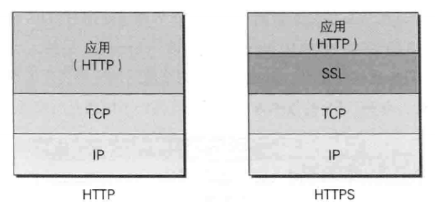

SSL是独立于HTTP的协议，所以不光是HTTP，其他运行在应用层的SMTP和Telnet等协议均可配合SSL协议使用。

SSL采用一种叫做公开密钥加密（Public-key cryptography）的加密处理方式。

HTTPS采用共享密钥加密和公开密钥加密两者并用的**混合加密机制**。SSL采用混合加密机制是因为非对称加密要比对称加密的方式更复杂，所以应该充分利用两者的优势。用非对称的方式来安全传输对称加密的密钥，而建立通信交换报文阶段就使用对称加密的方式。

数字证书认证机构（CA，Certificate Authority）和其相关机构颁发的公开密钥证书。数字证书认证机构处于客户端和服务器双方都可信赖的第三方机构的立场上。

HTTPS的安全通信机制：
1. 客户端通过发送Client Hello报文开始SSL通信。报文中包含客户端支持的SSL的指定版本、加密组件（Cipher Suite）列表（所使用的加密算法及密钥长度）
2. 服务器端收到后会与自身支持的做对比，如果不支持则连接断开，如果服务器可进行SSL通信时，会以Server Hello报文作为应答。和客户端一样，在报文中包含SSL版本以及加密组件。服务器的加密组件内容是从接收到的客户端加密组件内筛选出来的
3. 之后服务器发送Certificate报文。报文中包含公开密钥证书
4. 最后服务器发送Server Hello Done报文通知客户端，最初阶段的SSL握手协商部分结束
5. SSL第一次握手结束之后，客户端以Client Key Exchange报文作为回应。报文中包含通信加密中使用的一种被称为Pre-master secret的随机密码串。该报文已用步骤3中的公开密钥机型加密
6. 接着客户端继续发送Change Cipher Spec报文。该报文会提示服务器，在此报文之后的通信会采用Pre-master secret密钥加密
7. 客户端发送Finished报文。该报文包含至今全部报文的完整校验值。这次握手协商是否能够成功，要以服务器是否能够正确解密该报文作为判定标准
8. 服务器同样发送Change Cipher Spec报文
9. 服务器同样发送Finish报文
10. 服务器和客户端的Finish报文交换完毕之后，SSL连接就算建立完成。当然，通信会受到SSL的保护。从此处开始进行应用层协议的通信，即发送HTTP请求
11. 应用层协议通信，即发送HTTP响应
12. 最后由客户端断开连接。断开连接时，发送close_notify保温。这步之后再发送TCP FIN报文来关闭与TCP的通信。

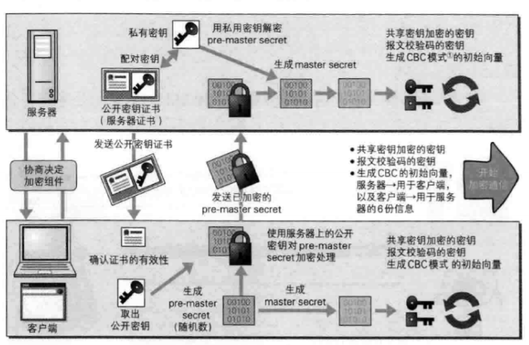

### HTTP和HTTPS的区别

1. HTTP的URL以`http://`开始，并且默认端口号为`80`；而HTTPS的URL以`https://`开始，并且默认端口为`443`。
2. HTTP协议运行在TCP之上，所有的传输内容都是明文，客户端和服务端都不需要对方的身份；HTTPS是运行在SSL/TLS之上的HTTP，所有的传输内容都会经过加密，加密采用的是对称加密，但对称加密的密钥用服务器方的证书进行了非对称加密。
    1. 对称加密：密钥是只有一个，加密解密也为同一个密码，并且加解密速度快，使用的典型的对称加密算法有DES、AES等；
    2. 非对称加密：首先密钥是成对出现（公钥无法推算出私钥，私钥也无法推出公钥），加密解密使用不同的密钥（公钥加密需要私钥解密，私钥加密需要公钥解密），相对对称加密而言速度较慢，使用典型的非对称加密算法有RSA、DSA等