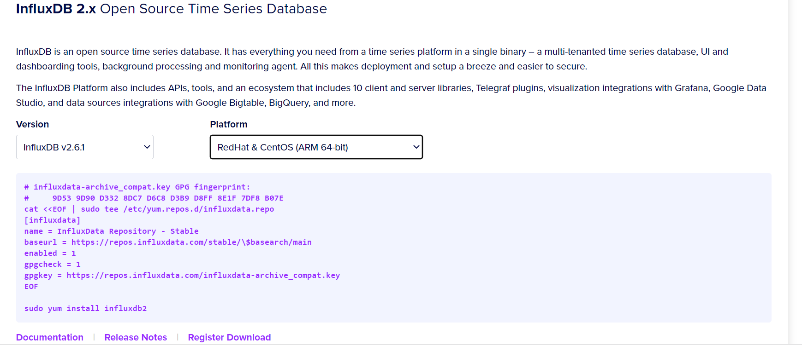

# InfluxDB 安装部署

> 官网下载地址：<https://portal.influxdata.com/downloads/>

## Windows 版本

1. 下载安装包
2. 解压直接执行exe文件
3. 执行 `show databases`, 客户端会连接默认的 db，显示对应数据库即代表连接成功

## RedHat & CentOS 版本

> 官网有详细安装步骤

**yum安装**



**tar包安装**

```sh
wget https://dl.influxdata.com/influxdb/releases/influxdb2-2.6.1-linux-arm64.tar.gz
tar xvfz influxdb2-2.6.1-linux-arm64.tar.gz
```

## 安装启动完成

登录地址：<http://127.0.0.1:8086/>

