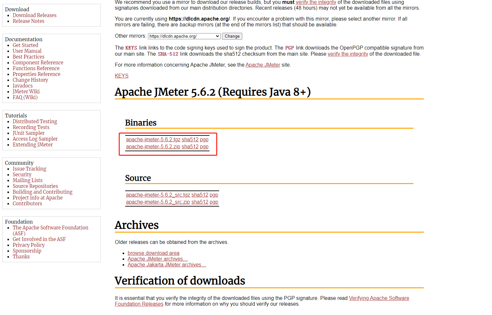

# 安装

> 官网地址：<https://jmeter.apache.org/>
>
> Github 地址：<https://github.com/apache/jmeter>

## 下载

> 下载地址：<https://jmeter.apache.org/download_jmeter.cgi>

## 安装

下载完成压缩包后进行解压即安装完成。

## 启动

进入 `bin` 目录下，Windows 系统运行 `jmeter.bat`，Unix 系统运行 `jmeter` 。

<!--

**Windows 系统**

jmeter.bat
run JMeter (in GUI mode by default)
jmeterw.cmd
run JMeter without the windows shell console (in GUI mode by default)
jmeter-n.cmd
drop a JMX file on this to run a CLI mode test
jmeter-n-r.cmd
drop a JMX file on this to run a CLI mode test remotely
jmeter-t.cmd
drop a JMX file on this to load it in GUI mode
jmeter-server.bat
start JMeter in server mode
mirror-server.cmd
runs the JMeter Mirror Server in CLI mode
shutdown.cmd
Run the Shutdown client to stop a CLI mode instance gracefully
stoptest.cmd
Run the Shutdown client to stop a CLI mode instance abruptly

-->