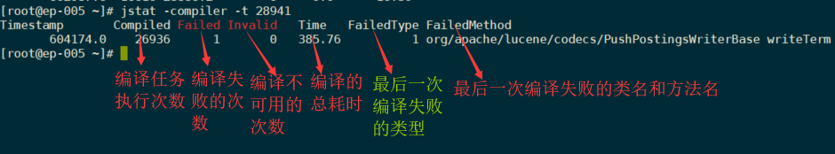
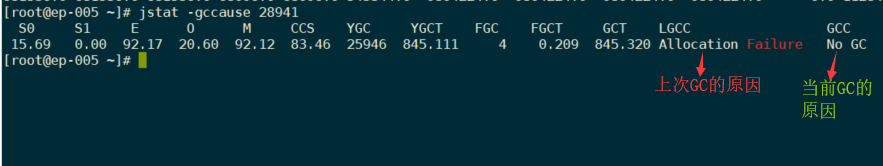
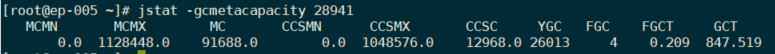

# jstat：虚拟机统计信息监视工具

> jstat(JVM Statistics Monitoring Tool) 是用于监视虚拟机各种运行状态信息的命令行工具。它可以显示本地或者远程虚拟机进程中的类装载、内存、垃圾收集、JIT 编译等运行数据，在没有 GUI 图形界面，只提供了纯文本控制台环境的服务器上，它将是运行期定位虚拟机性能问题的首选工具。
>
> jstat 命令格式为：
>
> ```sh
> jstat -<option> [-t] [-h<lines>] <vmid> [<interval> [<count>]]
> ```
>
> **选项 option 可以由以下值构成**
>
> |        选项         | 作用                                                         |
> | :-----------------: | ------------------------------------------------------------ |
> |      `-class`       | 监视类装载、卸载数量、总空间以及类装载所耗费的时间           |
> |     `-compiler`     | 显示 JIT 编译的相关信息                                      |
> |        `-gc`        | 显示与 GC 相关的堆信息                                       |
> |    `-gccapacity`    | 显示各个代的容量及使用情况                                   |
> |     `-gccause`      | 显示垃圾收集相关信息（同 -gcutil），同时显示最后一次或当前正在发生的垃圾收集的诱发原因 |
> |      `-gcnew`       | 显示新生代信息                                               |
> |  `-gcnewcapacity`   | 显示新生代大小与使用情况                                     |
> |      `-gcold`       | 显示老年代和永久代的信息                                     |
> |  `-gcoldcapacity`   | 显示老年代的大小                                             |
> |  `-gcmetacapacity`  | 显示元数据的大小                                             |
> |      `-gcutil`      | 显示垃圾收集信息                                             |
> | `-printcompilation` | 输出 JIT 编译的方法信息                                      |
>
> `-t` 参数可以在输出信息前加上一个 Timestamp 列，显示程序的运行时间
>
> `-h` 参数可以在周期性数据输出时，输出多少行数据后，跟着输出一个表头信息
>
> `interval` 参数用于指定输出统计数据的周期，单位为毫秒
>
> `count` 用于指定一共输出多少次数据

### 示例 1：查看 ClassLoader 的相关情况


### 示例 2：查看 JIT 编译的信息



### 示例 3：显示与 GC 相关的堆信息的输出


```txt
- S0C：s0 的大小
- S1C：s1 的大小
- S0U：s0 已使用的空间
- S1U：s1 已使用的空间
- EC：eden 区的大小
- EU：eden 区的使用空间
- OC：老年代大小
- OU：老年代已使用的空间
- MC：元数据区的大小
- MU：元数据区已使用的空间
- CCSC：
- CCSU：
- YGC：新生代 GC 的次数
- YGCT：新生代 GC 耗时
- FGC：Full GC 的次数
- FGCT：Full GC 耗时
- GCT：GC 总耗时
```

### 示例 4：显示各代的信息，与上例相比，还包含了各个代的最大值和最小值

`jstat -gccapacity 28941`


### 示例 5：显示最近一次 GC 的原因以及当前 GC 的原因



### 示例 6：查看新生代的一些详细的信息


### 示例 7：输出新生代各个区的大小信息


### 示例 8：老年代的 GC 情况


### 示例 9：老年代的容量信息


### ~~示例 10：展示永久代的使用情况~~

jvm 在 jdk1.8 后不存在永久代的信息了，不可用

### 示例 11：展示 GC 的回收信息


- S0：s0区使用的百分比
- S1：s1区使用的百分比
- E：eden区使用的百分比
- O：old区使用的百分比
- M：元数据区使用的百分比

### 示例 12：展示元数据区的使用情况

