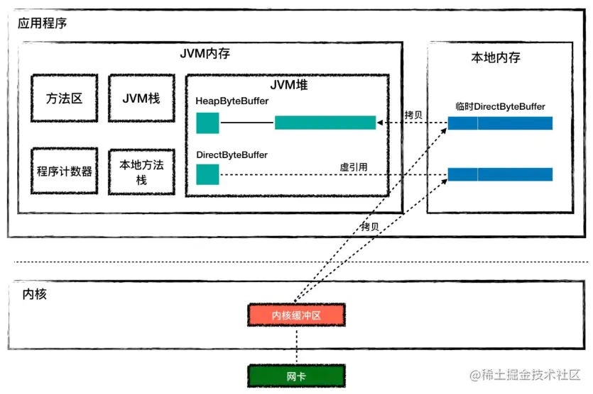

# 直接内存

直接内存（Direct Memory） 并不是虚拟机运行时数据区的一部分，也不是《Java虚拟机规范》中定义的内存区域。

<!--
直接内存是由本地内存分配的，因此直接内存受本机总内存大小的限制。
堆外内存：把内存对象分配在Java虚拟机堆以外的内存
堆外内存直接受操作系统管理（而不是虚拟机），这样做的结果就是能够在一定程度上减少垃圾回收（GC）对应用程序造成的影响。
-->

