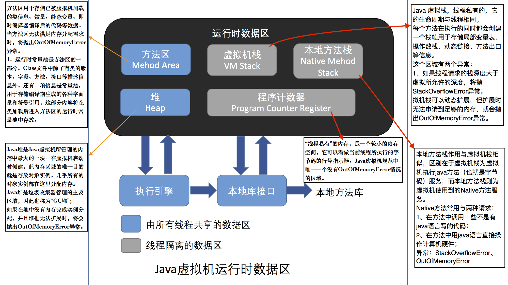

# 运行时数据区域

> JVM 在执行 Java 程序的过程中会把它所管理的内存划分为若干个不同的数据区域。

在 JDK7 下，JVM 所管理的内存将会包括以下几个运行时数据区域，如下图所示：

## 程序计数器

> 程序计数器（Program Counter Register）是一块较小的内存空间，它可以看作是当前线程所执行的字节码的行号指示器。

在虚拟机的概念模型里，字节码解释器工作时就是通过改变这个计数器的值来选取下一条需要执行的字节码指令，分支、循环、跳转、异常处理、线程恢复等基础功能都需要依赖这个计数器来完成。

由于 Java 虚拟机的多线程是通过线程轮流切换并分配处理器执行时间的方式来实现的，在任何一个确定的时刻，一个处理器都只会执行一条线程中的指令。因此，为了线程切换后能恢复到正确的执行位置，**每条线程都需要有一个独立的程序计数器，*各条线程之间计数器互不影响，独立存储*，称这类内存区域为“*线程私有*”的内存**。

如果线程正在执行的是一个 Java 方法，这个计数器记录的是正在执行的虚拟机字节码指令的地址；如果正在执行的是 Native 方法，这个计数器值则为空（Undefined）。

此内存区域是唯一一个在 Java 虚拟机规范中没有规定任何 OutOfMemoryError 情况的区域。

## Java 虚拟机栈

**与程序计数器一样，Java 虚拟机栈（Java Virtual Machine Stacks）也是线程私有的，它的生命周期与线程相同**。虚拟机栈描述的是 Java 方法执行的内存模型：每个方法在执行的同时都会创建一个**栈帧（Stack Frame）用于存储局部变量表、操作数栈、动态链接、方法出口等信息**。每一个方法从调用直到执行完成的过程，就对应着一个栈帧在虚拟机栈中入栈到出栈的过程。

局部变量表存放了编译期可知的各种基础数据类型（boolean、byte、char、short、int、float、long、double）、对象引用（reference 类型，它不等同于对象本身，可能是一个指向对象起始地址的引用指针，也可能是指向一个代表对象的句柄或其他与此对象相关的位置）和 returnAddress 类型（指向了一条字节码指令的地址）。

其中 64 位（8 个字节）长度的 long 和 double 类型的数据会占用 2 个局部变量空间（Slot），其余的数据类型只占用 1 个。

局部变量表所需的内存空间在编译期间完成分配，当进入一个方法时，这个方法需要在栈中分配多大的局部变量空间是完全确定的，在方法运行期间不会改变局部变量表的大小。

在 Java 虚拟机规范中，对这个区域规定了两种异常状况：

- 如果线程请求的栈深度大于虚拟机所允许的深度，将会抛出 StackOverflowError 异常；

- 如果虚拟机栈可以动态扩展，当扩展时无法申请到足够的内存时会抛出 OutOfMemoryError 异常。

## 本地方法栈

本地方法栈（Native Method Stack）与虚拟机栈所发挥的作用是非常相似的，它们之间的区别不过是虚拟机栈为虚拟机执行 Java 方法（也就是字节码）服务，而本地方法栈则为虚拟机使用到的 Native 方法服务。在虚拟机规范中对本地方法栈中方法使用的语言、使用方式与数据结构并没有强制规定，因此具体的虚拟机可以自由的实现它。甚至有的虚拟机（譬如 Sun HotSpot 虚拟机）直接就吧本地方法栈和虚拟机栈合二为一。与虚拟机栈一样，本地方法栈区域也会抛出 StackOverflowError 和 OutOfMemoryError 异常。

## Java 堆

> Java 堆是被所有线程共享的一块内存区域，在虚拟机启动时创建。此内存区域的唯一目的就是**存放对象实例**，几乎所有的对象实例都在这里分配内存。

Java 堆是垃圾收集器管理的主要区域，因此很多时候也被称做“GC 堆”（Garbage Collected Heap）。从内存回收的角度来看，由于现在收集器基本都是采用分代收集算法，所以 Java 堆还可以细分为：新生代和老年代；再细致一点的有 Eden 空间、From Survivor 空间、To Survivor 空间。

根据 Java 虚拟机规范的规定：Java 堆可以处于物理上不连续的内存空间中，只要逻辑上是连续的即可。在实现时，即可以实现成固定大小的，也可以是可扩展的，不过当前主流的虚拟机都是按照可扩展来实现的（通过 `-Xmx` 和 `-Xms` 控制）。如果在堆中没有内存完成实例分配，并且堆也无法再扩展时，将会抛出 OutOfMemoryError 异常。

## ~~方法区~~（JDK8 不存在这个区域了，改为元数据，要研究下）

> 方法区（Method Area）与 Java 堆一样，是各个线程共享的内存区域，它用于存储已被虚拟机加载的类信息、常量、静态变量、即时编译器编译后的代码等数据。

虽然 Java 虚拟机规范把方法区描述为堆的一个逻辑部分，但是它却有一个别名叫做 Non-Heap（非堆）。

## ~~运行时常量池~~

运行时常量池（Runtime Constant Pool）是方法区的一部分。

Class 文件中除了有类的版本、字段、方法、接口等描述信息外，还有一项信息是**常量池（Constant Pool Table），用于存放编译期生成的各种字面量和符号引用**，这部分内容（即Class常量池）将在类加载后存放到方法区的运行时常量池中。

Class常量池和运行时常量池的区别：
- Java 虚拟机对 Class 文件的每一部分（包括常量池）的格式都有严格的规定，每一个字节用于存储那种数据都必须符合规范上的要求，这样才会被虚拟机认可、装载和执行。但是对于运行时常量池，Java虚拟机规范没有做任何细节要求，不同的提供商实现的虚拟机可以按照自己的需要来实现这个内存区域。一般来说，除了保存 Class 文件中描述的符号引用外，还会把*翻译出来的直接引用*[???]也存储在运行时常量池中
- 运行时常量池相对于 Class 文件常量池的另一个重要特征是**具备动态性**，Java 语言并不要求常量一定只能在编译期产生，也就是并非预置入 Class 文件中常量池的内容才能进入方法区运行时常量池，运行期间也可能将新的常量放入池中，这种特性被开发人员利用的比较多的便是 String 类的 `intern()` 方法

因为运行时常量池是方法区的一部分，当运行时常量池无法申请到内存时会抛出 OutOfMemoryError 异常

## 直接内存

直接内存（Direct Memory）并不是虚拟机运行时数据区的一部分，也不是 Java 虚拟机规范中定义的内存区域，但也可能导致 OutOfMemoryError 异常。