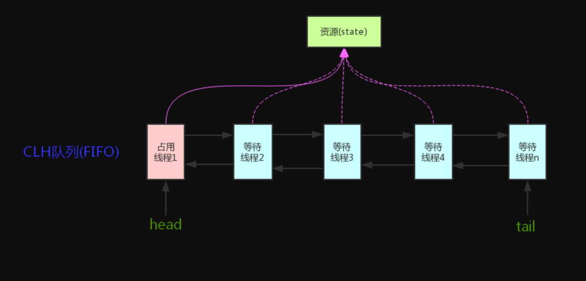
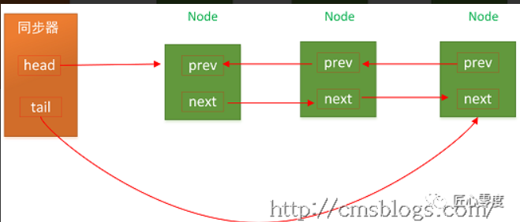
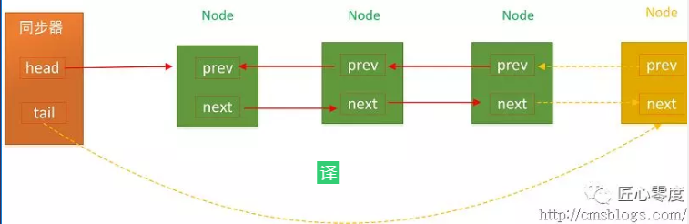
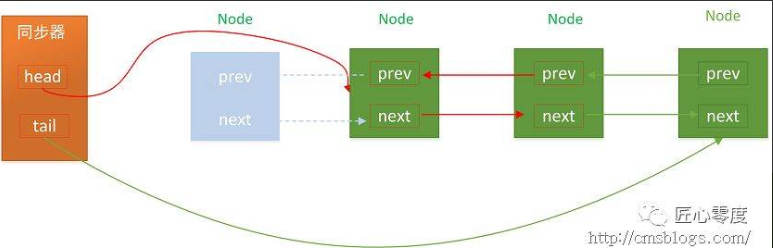
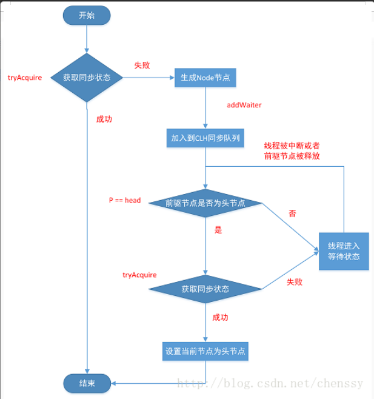
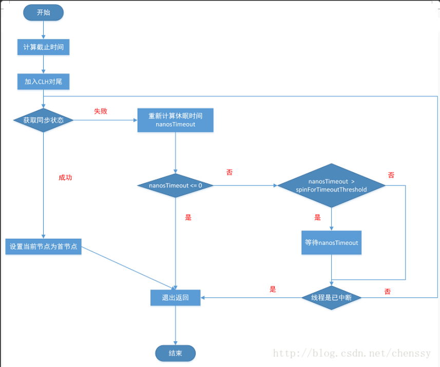
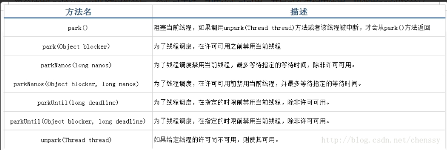

# AQS

- [AQS](#aqs)
  - [简介](#简介)
  - [AQS 原理](#aqs-原理)
  - [CLH同步队列](#clh同步队列)
  - [同步状态的获取与释放](#同步状态的获取与释放)
    - [独占式](#独占式)
    - [共享式](#共享式)
  - [阻塞和唤醒线程](#阻塞和唤醒线程)

## 简介

Java的内置锁一直都是备受争议的，在JDK1.6之前，synchronized这个重量级锁其性能一直都是较为低下，虽然在1.6后，进行大量的锁优化策略，但是与Lock相比，synchronized还是存在一些缺陷的，虽然synchronized提供了便捷性的隐式获取锁释放锁机制（基于JVM机制），但是它缺少了获取锁与释放锁的可操作性，可中断、超时获取锁，且它为独占式在高并发场景下性能大打折扣。

AQS：**AbstractQueuedSynchronizer**，即**队列同步器**。**它是构建锁或者其他同步组件的基础框架**（如ReentrantLook、ReentrantReadWriteLock、Semaphore等），JUC并发包的作者（**Doug Lea**）期望它能够成为实现大部分同步需求的基础。它是J.U.C(java.util.concurrent.locks)并发包中的核心基础组件。

AQS解决了实现同步器涉及到的大量细节问题，例如获取同步状态、FIFO同步队列。基于AQS来构建同步器可以带来很多好处。它不仅能够极大减少实现工作，而且不必处理在多个位置上发生的竞争问题。

在基于AQS构建的同步器中，只能在一个时刻发生阻塞，从而降低上下文切换的开销，提高吞吐量。同时在设计AQS时充分考虑了可伸缩性，因此J.U.C中所有基于AQS构建的同步器均可以获得这个优势。

## AQS 原理

**AQS核心思想是，如果被请求的共享资源空闲，则当前请求资源的线程设置为有效的工作线程，并且将共享资源设置为锁定状态。如果被请求的共享资源被占用，那么就需要一套线程阻塞等待以及被唤醒时锁分配的机制，这个机制AQS是用CLH队列锁实现的，即将暂时获取不到锁的线程加入到队列中。**

AQS原理图：


AQS使用一个**int成员变量state**来表示同步状态，当`state>0`时表示已经获取了锁，`state=0`时表示释放了锁，它提供了三个方法（`getState()`、`setState(int newState)`、`compareAndSetState(int expect,int update)`）来对同步状态state进行操作，当然AQS可以确保对state的操作是安全的。

```java
private volatile int state;//共享变量，使用volatile修饰保证线程可见性

//返回同步状态的当前值
protected final int getState() {  
    return state;
}
 // 设置同步状态的值
protected final void setState(int newState) { 
    state = newState;
}
//原子地（CAS操作）将同步状态值设置为给定值update如果当前同步状态的值等于expect（期望值）
protected final boolean compareAndSetState(int expect, int update) {
    return unsafe.compareAndSwapInt(this, stateOffset, expect, update);
}
```

AQS通过内置的FIFO同步队列来完成获取资源线程的排队工作，如果当前线程获取同步状态失败（锁）时，AQS则会将当前线程以及等待状态等信息构造成成一个节点（Node）并将其加入同步队列，同时会阻塞当前线程，当同步状态释放时，则会把节点中的线程唤醒，使其再次尝试获取同步状态。

AQS使用CAS对该同步状态进行原子操作实现对其值的修改。

- **AQS底层使用了模板方法模式**

同步器的设计是基于模板方法模式的，如果需要自定义同步器一般的方式是这样（模板方法模式很经典的一个应用）：

1. 使用者继承`AbstractQueuedSynchronizer`并重写指定的方法。（这些重写方法很简单，无非是对于共享资源state的获取和释放）
2. 将AQS组合在自定义同步组件的实现中，并调用其模板方法，而这些模板方法会调用使用者重写的方法。

> 模板方法模式是基于"继承"的，主要是为了在不改变模板结构的前提下在子类中重新定义模板中的内容以实现复用代码，举个栗子假如我们要去一个地方的步骤是：购票`buyTicket()`->安检`securityCheck()`->乘坐某某工具回家`ride()`->到达目的地`arrive()`。我们可能乘坐不同的交通工具回家比如飞机或者火车，所以除了`ride()`方法，其他方法的实现几乎相同。我们可以定义一个包含了这些方法的抽象类，然后用户根据自己的需要继承该抽象类然后修改 `ride()`方法。

- **AQS主要提供了如下一些方法**

- `getState()`:返回同步状态的当前值
- `setState(int newState)`:设置当前同步状态
- `compareAndSetState(int expect,int update)`:使用CAS设置当前状态，该方法能够保证状态设置的原子性
- `tryAcquire(int arg)`:独占式获取同步状态，获取同步状态成功后，其他线程需要等待该线程释放同步状态才能获取同步状态
- `tryRelease(int arg)`:独占式释放同步状态
- `tryAcquireShared(int arg)`:共享式获取同步状态，返回值大于等于0则表示获取成功，否则获取失败
- `tryReleaseShared(int arg)`:共享式释放同步状态
- `isHeldExclusively()`:当前同步器是否在独占式模式下被线程占用，一般该方法表示是否被当前线程所独占
- `acquire(int arg)`:独占式获取同步状态，如果当前线程获取同步状态成功，则由该方法返回，否则，将会进入同步队列等待，该方法将会调用可重写的`tryAcquire(int arg)`方法
- `acquireInterruptibly(int arg)`:与`acquire(int arg)`相同，但是该方法响应中断，当前线程为获取到同步状态而进入到同步队列中，如果当前线程被中断，则该方法会抛出InterruptedException异常并返回
- `tryAcquireNanos(int arg,long nanos)`:超时获取同步状态，如果当前线程在nanos时间内没有获取到同步状态，那么将会返回false，已经获取则返回true
- `acquireShared(int arg)`:共享式获取同步状态，如果当前线程未获取到同步状态，将会进入同步队列等待，与独占式的主要区别是在同一时刻可以有多个线程获取到同步状态
- `acquireSharedInterruptibly(int arg)`:共享式获取同步状态，响应中断
- `tryAcquireSharedNanos(int arg,long nanosTimeout)`:共享式获取同步状态，增加超时限制
- `release(int arg)`:独占式释放同步状态，该方法会在释放同步状态之后，将同步队列中第一个节点包含的线程唤醒
- `releaseShared(int arg)`:共享式释放同步状态

## CLH同步队列

**CLH（Craig,Landin,and Hagersten）队列**是一个**虚拟的双向队列（虚拟的双向队列即不存在队列实例，仅存在节点之间的关联关系）**，AQS依赖它来完成同步状态的管理，当前线程如果获取同步状态失败时，AQS则会将当前线程已经等待状态等信息构成一个节点(Node)并将其加入到CLH同步队列，同时会阻塞当前线程，当同步状态释放时，会把首节点唤醒（公平锁），使其再次尝试获取同步状态。

**在CLH同步队列中，一个节点表示一个线程，它保存着线程的引用（thread）、状态（waitStatus）、前驱结点（prev）、后续节点（next）**，其定义如下：

```java
static final class Node {    
    /** 共享 */    
    static final Node SHARED = new Node();    
    
    /** 独占 */    
    static final Node EXCLUSIVE = null;

    /**     
    * 因为超时或者中断，节点会被设置为取消状态，被取消的节点时不会参与到竞争中的，他会一直保持取消状态不会转变为其他状态；     
    */    
    static final int CANCELLED =  1;
    
    /**
    * 后继节点的线程处于等待状态，而当前节点的线程如果释放了同步状态或者被取消，将会通知后继节点，使后继节点的线程得以运行     
    */
    static final int SIGNAL    = -1;    
    
    /**     
    * 节点在等待队列中，节点线程等待在Condition上，当其他线程对Condition调用了signal()后，改节点将会从等待队列中转移到同步队列中，加入到同步状态的获取中     
    */    
    static final int CONDITION = -2;    
    
    /**     
    * 表示下一次共享式同步状态获取将会无条件地传播下去     
    */    
    static final int PROPAGATE = -3;    
    
    /** 等待状态 */    
    volatile int waitStatus;    
    
    /** 前驱节点 */    
    volatile Node prev;    
    
    /** 后继节点 */    
    volatile Node next;    
    
    /** 获取同步状态的线程 */    
    volatile Thread thread;    
    
    Node nextWaiter;    
    
    final boolean isShared() {
        return nextWaiter == SHARED;
    }    
    
    final Node predecessor() throws NullPointerException {
        Node p = prev;
        if (p == null)
            throw new NullPointerException();
        else
            return p;
    }

    Node() {    // Used to establish initial head or SHARED marker
    }

    Node(Thread thread, Node mode) {     // Used by addWaiter
        this.nextWaiter = mode;
        this.thread = thread;
    }

    Node(Thread thread, int waitStatus) { // Used by Condition
        this.waitStatus = waitStatus;
        this.thread = thread;
    }
}
```

CLH同步队列结构图如下：


- **入列**

CHL队列入列无非就是tail指向新节点、新节点的prev指向当前最后的节点，当前最后一个节点的next指向当前节点

```java
private Node addWaiter(Node mode) {
    Node node = new Node(Thread.currentThread(), mode);
    // Try the fast path of enq; backup to full enq on failure
    Node pred = tail;
    if (pred != null) {
        node.prev = pred;
        if (compareAndSetTail(pred, node)) {
            pred.next = node;
            return node;
        }
    }
    enq(node);
    return node;
}

private Node enq(final Node node) {
    for (;;) {
        Node t = tail;
        if (t == null) { // Must initialize
            if (compareAndSetHead(new Node()))
                tail = head;
        } else {
            node.prev = t;
            if (compareAndSetTail(t, node)) {
                t.next = node;
                return t;
            }
        }
    }
}
```

`addWaiter(Node node)`先通过快速尝试设置尾节点，如果失败，则调用`enq(Node node)`方法设置尾节点

在上面代码中，两个方法都是通过一个CAS方法`compareAndSetTail(Node expect, Node update)`来设置尾节点，该方法可以确保节点是线程安全添加的。在`enq(Node node)`方法中，AQS通过“死循环”的方式来保证节点可以正确添加，只有成功添加后，当前线程才会从该方法返回，否则会一直执行下去。

过程图如下：


- **出列**

CLH同步队列遵循FIFO，首节点的线程释放同步状态后，将会唤醒它的后续节点（next），而后续节点将会在获取同步状态成功时将自己设置为首节点，这个过程非常简单，head执行该节点并断开原首节点的next和当前节点的prev即可，注意在这个过程是不需要使用CAS来保证的，因为只有一个线程能够成功获取到同步状态。

过程图如下：


## 同步状态的获取与释放

AQS的设计模式采用的是**模板方法模式**，子类通过继承的方式，实现它的抽象方法来管理同步状态，对于子类不需要实现特别多逻辑，AQS提供了大量的模板方法来实现同步，主要是分为三类：**独占式获取和释放同步状态**、**共享式获取和释放同步状态**、**查询同步队列中的等待线程情况**。自定义子类使用AQS提供的模板方法就可以实现自己的同步语义。

### 独占式

**独占式(Exclusive)**，同一时刻仅有一个线程持有同步状态。

- **独占式同步状态获取**

`tryAcquire(int arg)`方法为AQS提供的模板方法，该方法为独占式获取同步状态，但是该方法对中断不敏感，也就是说由于线程获取同步状态失败加入到CLH同步队列中，后续对线程进行中断操作时，线程不会从同步队列中移除。代码如下：

```java
public final void acquire(int arg) {
    if (!tryAcquire(arg) &&
        acquireQueued(addWaiter(Node.EXCLUSIVE), arg))
        selfInterrupt();
}
```

各个方法定义如下：
1. tryAcquire：去尝试获取锁，获取成功则设置锁状态并返回true，否则返回false。该方法自定义同步组件自己实现，该方法必须要保证线程安全的获取同步状态。
2. addWaiter：如果tryAcquire返回FALSE（获取同步状态失败），则调用该方法将当前线程加入到CLH同步队列尾部。
3. acquireQueued：当前线程会根据公平性原则来进行阻塞等待（自旋）,直到获取锁为止；并且返回当前线程在等待过程中有没有中断过。
4. selfInterrupt：产生一个中断。

`acquireQueued`方法为一个自旋的过程，也就是说当前线程（Node）进入同步队列后，就会进入一个自旋的过程，每个节点都会自省地观察，当条件满足，获取到同步状态后，就可以从这个自旋过程中退出，否则会一直执行下去。如下：

```java
final boolean acquireQueued(final Node node, int arg) {
    boolean failed = true;
    try {
        //中断标志
        boolean interrupted = false;
        /*
        * 自旋过程，其实就是一个死循环而已
        */
        for (;;) {
            //当前线程的前驱节点
            final Node p = node.predecessor();
            //当前线程的前驱节点是头结点，且同步状态成功
            if (p == head && tryAcquire(arg)) {
                setHead(node);
                p.next = null; // help GC
                failed = false;
                return interrupted;
            }
            //获取失败，线程等待--具体后面介绍
            if (shouldParkAfterFailedAcquire(p, node) &&
                    parkAndCheckInterrupt())
                interrupted = true;
        }
    } finally {
        if (failed)
            cancelAcquire(node);
    }
}
```

从上面代码中可以看到，当前线程会一直尝试获取同步状态，当然前提是只有其前驱节点为头结点才能够尝试获取同步状态，理由：
1. 保持FIFO同步队列原则
2. 头节点释放同步状态后，将会唤醒其后继节点，后继节点被唤醒后需要检查自己是否为头节点

`acquire(int arg)`方法流程图如下：



- **独占式获取响应中断**

AQS提供了`acquire(int arg)`方法以供独占式获取同步状态，但是该方法对中断不响应，对线程进行中断操作后，该线程会依然位于CLH同步队列中等待着获取同步状态。为了响应中断，AQS提供了`acquireInterruptibly(int arg)`方法，该方法在等待获取同步状态时，如果当前线程被中断了，会立刻响应中断抛出异常InterruptedException。

```java
public final void acquireInterruptibly(int arg)
        throws InterruptedException {
    if (Thread.interrupted())
        throw new InterruptedException();
    if (!tryAcquire(arg))
        doAcquireInterruptibly(arg);
}
```

首先校验该线程是否已经中断了，如果是则抛出InterruptedException，否则执行`tryAcquire(int arg)`方法获取同步状态，如果获取成功，则直接返回，否则执行`doAcquireInterruptibly(int arg)`。`doAcquireInterruptibly(int arg)`定义如下：

```java
private void doAcquireInterruptibly(int arg)
    throws InterruptedException {
    final Node node = addWaiter(Node.EXCLUSIVE);
    boolean failed = true;
    try {
        for (;;) {
            final Node p = node.predecessor();
            if (p == head && tryAcquire(arg)) {
                setHead(node);
                p.next = null; // help GC
                failed = false;
                return;
            }
            if (shouldParkAfterFailedAcquire(p, node) &&
                parkAndCheckInterrupt())
                throw new InterruptedException();
        }
    } finally {
        if (failed)
            cancelAcquire(node);
    }
}
```

`doAcquireInterruptibly(int arg)`方法与`acquire(int arg)`方法仅有两个差别:
1. 方法声明抛出InterruptedException异常
2. 在中断方法处不再是使用interrupted标志，而是直接抛出InterruptedException异常。

- **独占式超时获取**

AQS除了提供上面两个方法外，还提供了一个增强版的方法：`tryAcquireNanos(int arg,long nanos)`。该方法为acquireInterruptibly方法的进一步增强，它除了响应中断外，还有超时控制。即如果当前线程没有在指定时间内获取同步状态，则会返回false，否则返回true。如下：

```java
public final boolean tryAcquireNanos(int arg, long nanosTimeout)
        throws InterruptedException {
    if (Thread.interrupted())
        throw new InterruptedException();
    return tryAcquire(arg) ||
        doAcquireNanos(arg, nanosTimeout);
}
```

`tryAcquireNanos(int arg, long nanosTimeout)`方法超时获取最终是在`doAcquireNanos(int arg, long nanosTimeout)`中实现的，如下：

```java
private boolean doAcquireNanos(int arg, long nanosTimeout)
        throws InterruptedException {
    //nanosTimeout <= 0
    if (nanosTimeout <= 0L)
        return false;
    //超时时间
    final long deadline = System.nanoTime() + nanosTimeout;
    //新增Node节点
    final Node node = addWaiter(Node.EXCLUSIVE);
    boolean failed = true;
    try {
        //自旋
        for (;;) {
            final Node p = node.predecessor();
            //获取同步状态成功
            if (p == head && tryAcquire(arg)) {
                setHead(node);
                p.next = null; // help GC
                failed = false;
                return true;
            }
            /*
            * 获取失败，做超时、中断判断
            */
            //重新计算需要休眠的时间
            nanosTimeout = deadline - System.nanoTime();
            //已经超时，返回false
            if (nanosTimeout <= 0L)
                return false;
            //如果没有超时，则等待nanosTimeout纳秒
            //注：该线程会直接从LockSupport.parkNanos中返回，
            //LockSupport为JUC提供的一个阻塞和唤醒的工具类，后面做详细介绍
            if (shouldParkAfterFailedAcquire(p, node) &&
                    nanosTimeout > spinForTimeoutThreshold)
                LockSupport.parkNanos(this, nanosTimeout);
            //线程是否已经中断了
            if (Thread.interrupted())
                throw new InterruptedException();
        }
    } finally {
        if (failed)
            cancelAcquire(node);
    }
}
```

针对超时控制，程序首先记录唤醒时间deadline ，`deadline = System.nanoTime() + nanosTimeout（时间间隔）`。如果获取同步状态失败，则需要计算出需要休眠的时间间隔`nanosTimeout（= deadline – System.nanoTime()）`，如果`nanosTimeout <= 0` 表示已经超时了，返回false，如果大于`spinForTimeoutThreshold（1000L）`则需要休眠nanosTimeout ，如果`nanosTimeout <= spinForTimeoutThreshold` ，就不需要休眠了，直接进入快速自旋的过程。原因在于 spinForTimeoutThreshold 已经非常小了，非常短的时间等待无法做到十分精确，如果这时再次进行超时等待，相反会让nanosTimeout 的超时从整体上面表现得不是那么精确，所以在超时非常短的场景中，AQS会进行无条件的快速自旋。

整个流程如下：



- **独占式同步状态释放**

当线程获取同步状态后，执行完相应逻辑后就需要释放同步状态。AQS提供了release(int arg)方法释放同步状态：

```java
public final boolean release(int arg) {
    if (tryRelease(arg)) {
        Node h = head;
        if (h != null && h.waitStatus != 0)
            unparkSuccessor(h);
        return true;
    }
    return false;
}
```

该方法同样是先调用自定义同步器自定义的`tryRelease(int arg)`方法来释放同步状态，释放成功后，会调用unparkSuccessor(Node node)方法唤醒后继节点。

- **总结**

> 在AQS中维护着一个FIFO的同步队列，当线程获取同步状态失败后，则会加入到这个CLH同步队列的对尾并一直保持着自旋。在CLH同步队列中的线程在自旋时会判断其前驱节点是否为首节点，如果为首节点则不断尝试获取同步状态，获取成功则退出CLH同步队列。当线程执行完逻辑后，会释放同步状态，释放后会唤醒其后继节点。

### 共享式

共享式与独占式的最主要区别在于同一时刻独占式只能有一个线程获取同步状态，而共享式在同一时刻可以有多个线程获取同步状态。例如读操作可以有多个线程同时进行，而写操作同一时刻只能有一个线程进行写操作，其他操作都会被阻塞。

- **共享式同步状态获取**

AQS提供`acquireShared(int arg)`方法共享式获取同步状态：

```java
public final void acquireShared(int arg) {
    if (tryAcquireShared(arg) < 0)
        //获取失败，自旋获取同步状态
        doAcquireShared(arg);
}
```

从上面程序可以看出，方法首先是调用`tryAcquireShared(int arg)`方法尝试获取同步状态，如果获取失败则调用`doAcquireShared(int arg`)自旋方式获取同步状态，共享式获取同步状态的标志是返回 `>= 0` 的值表示获取成功。自选式获取同步状态如下：

```java
private void doAcquireShared(int arg) {
    /共享式节点
    final Node node = addWaiter(Node.SHARED);
    boolean failed = true;
    try {
        boolean interrupted = false;
        for (;;) {
            //前驱节点
            final Node p = node.predecessor();
            //如果其前驱节点，获取同步状态
            if (p == head) {
                //尝试获取同步
                int r = tryAcquireShared(arg);
                if (r >= 0) {
                    setHeadAndPropagate(node, r);
                    p.next = null; // help GC
                    if (interrupted)
                        selfInterrupt();
                    failed = false;
                    return;
                }
            }
            if (shouldParkAfterFailedAcquire(p, node) &&
                    parkAndCheckInterrupt())
                interrupted = true;
        }
    } finally {
        if (failed)
            cancelAcquire(node);
    }
}
```

`tryAcquireShared(int arg)`方法尝试获取同步状态，返回值为int，当其 `>= 0` 时，表示能够获取到同步状态，这个时候就可以从自旋过程中退出。

`acquireShared(int arg)`方法不响应中断，与独占式相似，AQS也提供了响应中断、超时的方法，分别是：`acquireSharedInterruptibly(int arg)`、`tryAcquireSharedNanos(int arg,long nanos)`。

- **共享式同步状态释放**

获取同步状态后，需要调用`release(int arg)`方法释放同步状态，方法如下：

```java
public final boolean releaseShared(int arg) {
    if (tryReleaseShared(arg)) {
        doReleaseShared();
        return true;
    }
    return false;
}
```

因为可能会存在多个线程同时进行释放同步状态资源，所以需要确保同步状态安全地成功释放，一般都是通过CAS和循环来完成的。

## 阻塞和唤醒线程

在线程获取同步状态时如果获取失败，则加入CLH同步队列，通过通过自旋的方式不断获取同步状态，但是在自旋的过程中则需要判断当前线程是否需要阻塞，其主要方法在`acquireQueued()`：

```java
if (shouldParkAfterFailedAcquire(p, node) && parkAndCheckInterrupt())
    interrupted = true;
```

通过这段代码可以看到，在获取同步状态失败后，线程并不是立刻进行阻塞，需要检查该线程的状态，检查状态的方法为 `shouldParkAfterFailedAcquire(Node pred, Node node)` 方法，该方法主要靠前驱节点判断当前线程是否应该被阻塞，代码如下：

```java
private static boolean shouldParkAfterFailedAcquire(Node pred, Node node) {
    //前驱节点
    int ws = pred.waitStatus;
    //状态为signal，表示当前线程处于等待状态，直接放回true
    if (ws == Node.SIGNAL)
        return true;
    //前驱节点状态 > 0 ，则为Cancelled,表明该节点已经超时或者被中断了，需要从同步队列中取消
    if (ws > 0) {
        do {
            node.prev = pred = pred.prev;
        } while (pred.waitStatus > 0);
        pred.next = node;
    }
    //前驱节点状态为Condition、propagate
    else {
        compareAndSetWaitStatus(pred, ws, Node.SIGNAL);
    }
    return false;
}
```

这段代码主要检查当前线程是否需要被阻塞，具体规则如下：
1. 如果当前线程的前驱节点状态为SINNAL，则表明当前线程需要被阻塞，调用unpark()方法唤醒，直接返回true，当前线程阻塞
2. 如果当前线程的前驱节点状态为CANCELLED（ws > 0），则表明该线程的前驱节点已经等待超时或者被中断了，则需要从CLH队列中将该前驱节点删除掉，直到回溯到前驱节点状态 <= 0 ，返回false
3. 如果前驱节点非SINNAL，非CANCELLED，则通过CAS的方式将其前驱节点设置为SINNAL，返回false

如果 `shouldParkAfterFailedAcquire(Node pred, Node node)` 方法返回true，则调用`parkAndCheckInterrupt()`方法阻塞当前线程：

```java
private final boolean parkAndCheckInterrupt() {
    LockSupport.park(this);
    return Thread.interrupted();
}
```

`parkAndCheckInterrupt()` 方法主要是把当前线程挂起，从而阻塞住线程的调用栈，同时返回当前线程的中断状态。其内部则是调用LockSupport工具类的`park()`方法来阻塞该方法。

当线程释放同步状态后，则需要唤醒该线程的后继节点：

```java
public final boolean release(int arg) {
    if (tryRelease(arg)) {
        Node h = head;
        if (h != null && h.waitStatus != 0)
            //唤醒后继节点
            unparkSuccessor(h);
        return true;
    }
    return false;
}
```

调用`unparkSuccessor(Node node)`唤醒后继节点：

```java
private void unparkSuccessor(Node node) {
    //当前节点状态
    int ws = node.waitStatus;
    //当前状态 < 0 则设置为 0
    if (ws < 0)
        compareAndSetWaitStatus(node, ws, 0);

    //当前节点的后继节点
    Node s = node.next;
    //后继节点为null或者其状态 > 0 (超时或者被中断了)
    if (s == null || s.waitStatus > 0) {
        s = null;
        //从tail节点来找可用节点
        for (Node t = tail; t != null && t != node; t = t.prev)
            if (t.waitStatus <= 0)
                s = t;
    }
    //唤醒后继节点
    if (s != null)
        LockSupport.unpark(s.thread);
}
```

可能会存在当前线程的后继节点为null，超时、被中断的情况，如果遇到这种情况了，则需要跳过该节点，但是为何是从tail尾节点开始，而不是从node.next开始呢？原因在于node.next仍然可能会存在null或者取消了，所以采用tail回溯办法找第一个可用的线程。最后调用LockSupport的unpark(Thread thread)方法唤醒该线程。

- **LockSupport**

从上面我可以看到，当需要阻塞或者唤醒一个线程的时候，AQS都是使用LockSupport这个工具类来完成的。

> LockSupport是用来创建锁和其他同步类的基本线程阻塞原语

每个使用LockSupport的线程都会与一个许可关联，如果该许可可用，并且可在进程中使用，则调用park()将会立即返回，否则可能阻塞。如果许可尚不可用，则可以调用 unpark 使其可用。但是注意许可不可重入，也就是说只能调用一次park()方法，否则会一直阻塞。

LockSupport定义了一系列以park开头的方法来阻塞当前线程，unpark(Thread thread)方法来唤醒一个被阻塞的线程。如下：



park(Object blocker)方法的blocker参数，主要是用来标识当前线程在等待的对象，该对象主要用于问题排查和系统监控。

park方法和unpark(Thread thread)都是成对出现的，同时unpark必须要在park执行之后执行，当然并不是说没有不调用unpark线程就会一直阻塞，park有一个方法，它带了时间戳（parkNanos(long nanos)：为了线程调度禁用当前线程，最多等待指定的等待时间，除非许可可用）。

park()方法的源码如下：

```java
public static void park() {
    UNSAFE.park(false, 0L);
}
```

unpark(Thread thread)方法源码如下：

```java
public static void unpark(Thread thread) {
    if (thread != null)
        UNSAFE.unpark(thread);
}
```

从上面可以看出，其内部的实现都是通过UNSAFE（sun.misc.Unsafe UNSAFE）来实现的，其定义如下：

```java
public native void park(boolean var1, long var2);
public native void unpark(Object var1);
```

两个都是native本地方法。Unsafe 是一个比较危险的类，主要是用于执行低级别、不安全的方法集合。尽管这个类和所有的方法都是公开的（public），但是这个类的使用仍然受限，你无法在自己的java程序中直接使用该类，因为只有授信的代码才能获得该类的实例。