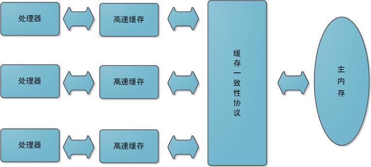
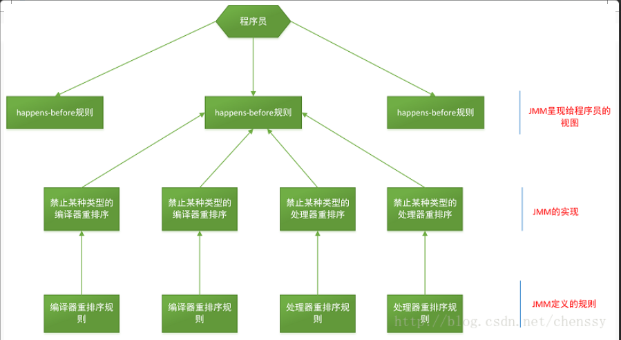
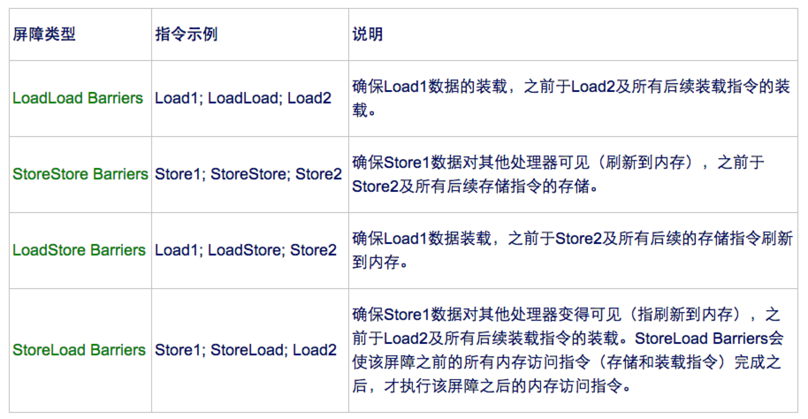

# Java 内存模型

## 硬件的效率与一致性

由于计算机的存储设备与处理器的运算能力之间有几个数量级的差距，所以现代计算机系统都不得不加入一层读写速度尽可能接近处理器运算速度的**高速缓存（cache）来作为内存与处理器之间的缓冲：将运算需要使用到的数据复制到缓存中，让运算能快速进行，当运算结束后再从缓存同步回内存之中没这样处理器就无需等待缓慢的内存读写了**。

基于高速缓存的存储交互很好地解决了处理器与内存的速度矛盾，但是引入了一个新的问题：**缓存一致性（Cache Coherence）**。在多处理器系统中，每个处理器都有自己的高速缓存，而他们又共享同一主存，如下图所示：

多个处理器运算任务都涉及同一块主存，需要一种协议可以保障数据的一致性，这类协议有`MSI`、`MESI`、`MOSI`及`Dragon Protocol`等。Java虚拟机内存模型中定义的内存访问操作与硬件的缓存访问操作是具有可比性的。

除此之外，为了使得处理器内部的运算单元能尽可能被充分利用，处理器可能会对输入代码进行乱序执行（Out-Of-Order Execution）优化，处理器会在计算之后将对乱序执行的代码进行结果重组，保证结果准确性。与处理器的乱序执行优化类似，**Java虚拟机的即时编译器中也有类似的指令重排序（Instruction Recorder）优化**。

## Java内存模型

Java虚拟机规范试图定义一种**Java内存模型（ JMM ）**，来屏蔽掉各种硬件和操作系统的内存访问差异，让Java程序在各种平台上都能达到一致的内存访问效果。简单来说，由于CPU执行指令的速度是很快的，但是内存访问的速度就慢了很多，相差的不是一个数量级，所以在CPU里加几层高速缓存。Java虚拟机是一个完整的计算机的一个模型，因此这个模型自然也包含一个内存模型——又称为**Java内存模型**。

### 主内存与工作内存

**Java内存模型的主要目标是定义程序中各个变量的访问规则，即在虚拟机中将变量存储到内存和从内存中取出变量这样底层细节**。此处的变量与Java编程时所说的变量不一样，指包括了实例字段、静态字段和构成数组对象的元素，但是不包括局部变量与方法参数，后者是线程私有的，不会被共享。

Java内存模型中规定了 **所有的变量都存储在主内存中，每条线程还有自己的工作内存**（可以与前面将的处理器的高速缓存类比），**线程的工作内存中保存了该线程使用到的变量到主内存副本拷贝，线程对变量的所有操作（读取、赋值）都必须在工作内存中进行，而不能直接读写主内存中的变量**。不同线程之间无法直接访问对方工作内存中的变量，线程间变量值的传递均需要在主内存来完成，线程、主内存和工作内存的交互关系如下图所示，和上图很类似。

注：**这里的主内存、工作内存与Java内存区域的Java堆、栈、方法区不是同一层次内存划分。**

### 内存间交互操作

关于主内存与工作内存之间的具体交互协议，即一个变量如何从主内存拷贝到工作内存、如何从工作内存同步到主内存之间的实现细节，Java内存模型定义了以下八种操作来完成：

- `lock（锁定）`：作用于主内存变量，把一个变量标识为一条线程独占状态。
- `unlock（解锁）`：作用于主内存变量，把一个处于锁定状态的变量释放出来，释放后的变量才可以被其他线程锁定。
- `read（读取）`：作用于主内存变量，把一个变量值从主内存传输到线程的工作内存中，以便随后的load动作使用
- `load（载入）`：作用于工作内存的变量，它把read操作从主内存中得到的变量值放入工作内存的变量副本中。
- `use（使用）`：作用于工作内存的变量，把工作内存中的一个变量值传递给执行引擎，每当虚拟机遇到一个需要使用变量的值的字节码指令时将会执行这个操作。
- `assign（赋值）`：作用于工作内存的变量，它把一个从执行引擎接收到的值赋值给工作内存的变量，每当虚拟机遇到一个给变量赋值的字节码指令时执行这个操作。
- `store（存储）`：作用于工作内存的变量，把工作内存中的一个变量的值传送到主内存中，以便随后的write的操作。
- `write（写入）`：作用于主内存的变量，它把store操作从工作内存中一个变量的值传送到主内存的变量中。

如果要把一个变量从主内存中复制到工作内存，就需要按顺序地执行`read`和`load`操作，如果把变量从工作内存中同步回主内存中，就要按顺序地执行`store`和`write`操作。Java内存模型只要求上述操作必须按顺序执行，而没有保证必须是连续执行。也就是`read`和`load`之间，`store`和`write`之间是可以插入其他指令的，如对主内存中的变量a、b进行访问时，可能的顺序是`read a`->`read b`->`load b`->`load a`。

Java内存模型还规定了在执行上述八种基本操作时，必须满足如下规则：

- 不允许read和load、store和write操作之一单独出现
- 不允许一个线程丢弃它的最近assign的操作，即变量在工作内存中改变了之后必须同步到主内存中。
- 不允许一个线程无原因地（没有发生过任何assign操作）把数据从工作内存同步回主内存中。
- 一个新的变量只能在主内存中诞生，不允许在工作内存中直接使用一个未被初始化（load或assign）的变量。即就是对一个变量实施use和store操作之前，必须先执行过了assign和load操作。
- 一个变量在同一时刻只允许一条线程对其进行lock操作，lock和unlock必须成对出现
- 如果对一个变量执行lock操作，将会清空工作内存中此变量的值，在执行引擎使用这个变量前需要重新执行load或assign操作初始化变量的值
- 如果一个变量事先没有被lock操作锁定，则不允许对它执行unlock操作；也不允许去unlock一个被其他线程锁定的变量。
- 对一个变量执行unlock操作之前，必须先把此变量同步到主内存中（执行store和write操作）。

### `happens-before` 原则

从JDK 5开始，JMM就是用happens-before的概念来阐述多线程之间的内存可见性

> 在JMM中，如果一个操作执行的结果需要对另一个操作可见，那么这两个操作之间必须存在happens-before关系。

happens-before原则定义如下：
1. 如果一个操作 `happens-before` 另一个操作，那么第一个操作的执行结果将对第二个操作可见，而且第一个操作的执行顺序排在第二个操作之前。
2. 两个操作之间存在happens-before关系，并不意味着一定要按照happens-before原则制定的顺序来执行。如果重排序之后的执行结果与按照happens-before关系来执行的结果一致，那么这种重排序并不非法。

happens-before原则规则：
1. 程序顺序规则：一个线程中的每个操作，happens-before于该线程中的任意后续操作
2. 监视器锁规则：对一个线程的解锁，happens-before于随后对这个线程的加锁
3. volatile变量规则： 对一个volatile域的写 happens-before 于后续对这个volatile域的读
4. 传递规则：如果`A happens-before B`,且`B happens-before C`,那么`A happens-before C`
5. 线程启动（`start()`）规则： 如果线程A执行操作`ThreadB.start()`(启动线程B),那么A线程的`ThreadB.start()` happens-before 于B中的任意操作
6. 线程中断（`interrupt()`）原则：对线程`interrupt()`方法的调用先行发生于被中断线程代码检测到中断事件的发生，可以通过`Thread.interrupted()`方法检测是否有中断发生
7. 线程终结（`join()`）原则：如果A执行`ThreadB.join()`并且成功返回，那么线程B中的任意操作 happens-before 于线程A从`ThreadB.join()`操作成功返回。
8. 对象终结（`finalize()`）原则：一个对象的初始化完成先行发生于它的`finalize()`方法的开始

happens-before原则的详细说明：
- 程序顺序规则：在一个线程里，所有的操作都是按顺序的，但是在JMM里其实只要执行结果一样，是允许重排序的，这边的happens-before强调的重点也是单线程执行结果的正确性，但是无法保证多线程也是如此。
- 监视器锁规则：就是在加锁之前，确定这个锁之前已经被释放了，才能继续加锁。
- volatile变量规则：它标志着volatile保证了线程的可见性。通俗点讲就是如果一个线程先去写一个volatile变量，然后另外一个线程再去读，那么写入操作一定是 `happens-before` 读操作之前。
- 传递规则：提现了happens-before原则具有传递性

上面八条是原生Java满足Happens-before关系的规则，但是可推导出其他满足happens-before的规则：
1. 将一个元素放入一个线程安全的队列的操作 happens-before 从队列中取出这个元素的操作
2. 将一个元素放入一个线程安全容器 happens-before 从容器中取出这个元素的操作
3. 在CountDownLatch上的倒数操作 happens-before `CountDownLatch#await()`
4. 释放Semaphore许可的操作 happens-before 获得许可操作
5. Future表示的任务的所有操作 happens-before `Future#get()`操作
6. 向Executeor提交一个Runnable或Callable的操作happens-before任务开始执行操作

> happens-before 原则是JMM中非常重要的原则，它是判断数据是否存在竞争、线程是否安全的主要一句，保证了多线程环境下的可见性

happens-before与JMM的关系图：

### 重排序

**在执行程序时为了提高性能，编译器和处理器经常会对指令进行重排序**。

进行重排序需要满足的两个条件：
1. 在单线程环境下不能改变程序运行的结果
2. 存在数据依赖关系的不允许重排序

重排序分成三种类型：
1. 编译器优化的重排序。编译器在不改变单线程程序语义放入前提下，可以重新安排语句的执行顺序。
2. 指令级并行的重排序。现代处理器采用了指令级并行技术来将多条指令重叠执行。如果不存在数据依赖性，处理器可以改变语句对应机器指令的执行顺序。
3. 内存系统的重排序。由于处理器使用缓存和读写缓冲区，这使得加载和存储操作看上去可能是在乱序执行。

从Java源代码到最终实际执行的指令序列，会经过下面三种重排序：

为了保证内存的可见性，Java编译器在生成指令序列的适当位置会插入内存屏障指令来禁止特定类型的处理器重排序。Java内存模型把内存屏障分为**LoadLoad**、**LoadStore**、**StoreLoad**和**StoreStore**四种：

- **`as-if-serial`语义**

**as-if-serial语义的意思是，所有的操作均可以为了优化而被重排序，但是必须要保证重排序后执行的结果不能被改变，编译器、runtime、处理器都必须遵守as-if-serial语义**。注意as-if-serial只保证单线程环境，多线程环境下无效。

注：**重排序不会影响单线程环境的执行结果，但是会破坏多线程的执行语义**