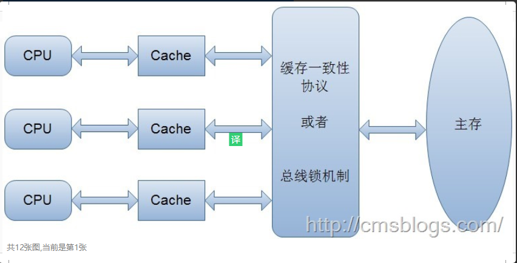

# volatile

volatile是轻量级的synchronized，因为它不会引起线程上下文的切换和调度。Java语言规范对volatile的定义如下：

> Java编程语言允许线程访问共享变量，为了确保共享变量能被准确和一致地更新，线程应该确保通过排他锁单独获得这个变量。

上面的定义通俗点讲就是说一个变量如果用volatile修饰了，则Java可以确保所有县城看到这个变量的值是一致的，如果某个线程对volatile修饰的共享变量进行更新，那么其他线程可以立刻看到更新后的数据，这就是线程的可见性。

## 内存模型相关概念

### 操作系统语义

计算机在运行程序时，每条指令都是在CPU中执行的，在执行过程中势必会涉及到数据的读写。我们知道程序运行的数据是存储在主存中，这时就会有一个问题，读写主存中的数据没有CPU中执行指令的速度快，如果任何的交互都需要与主存打交道则会大大影响效率，所以就有了CPU高速缓存。CPU高速缓存为某个CPU独有，只与在该CPU运行的线程有关。

有了CPU高速缓存虽然解决了效率问题，但是它会带来一个新的问题：数据一致性。在程序运行中，会将运行所需要的数据复制一份到CPU高速缓存中，在进行运算时CPU不再和主存打交道，而是直接从高速缓存中读写数据，只有当运行结束后才会将数据刷新到主存中。

假如有两个线程A、B都执行这个操作（i++），按照我们正常的逻辑思维主存中的i值应该=3，但事实是这样么？分析如下：

两个线程从主存中读取i的值（1）到各自的高速缓存中，然后线程A执行+1操作并将结果写入高速缓存中，最后写入主存中，此时主存i==2,线程B做同样的操作，主存中的i仍然=2。所以最终结果为2并不是3。这种现象就是缓存一致性问题。

解决缓存一致性方案有两种：
1. 通过在总线加LOCK#锁的方式
2. 通过缓存一致性协议

但是方案1存在一个问题，它是采用一种独占的方式来实现的，即总线加LOCK#锁的话，只能有一个CPU能够运行，其他CPU都得阻塞，效率较为低下。

第二种方案，缓存一致性协议（MESI协议）它确保每个缓存中使用的共享变量的副本是一致的。其核心思想如下：当某个CPU在写数据时，如果发现操作的变量是共享变量，则会通知其他CPU告知该变量的缓存是无效的，因此其他CPU在读取该变量时，发现其无效会重新从主存中加载数据。



### Java内存模型

- **原子性**

> 原子性：即一个操作或者多个操作，要么全部执行并且执行的过程不会被任何因素打断，要么就都不执行。

在Java中，对基础数据类型的变量和赋值操作都是原子性操作（注：**在32位的JDK环境下，对64位数据的读取不是原子性操作，如long、double**）。

要想在多线程环境下保证原子性，则可以通过锁、synchronized来进行操作。

> volatile是无法保证复合操作的原子性

- **可见性**

> 可见性是指当多个线程访问同一个变量时，一个线程修改了这个变量的值，其他线程能够立即看得到修改的值。

由上面可知，在多线程环境下，一个线程对共享变量的操作对其他线程是不可见的。

**Java提供了volatile来保证可见性**。

当一个变量被volatile修饰后，表示着线程本地内存无效，当一个线程修改共享变量后他会立即被更新到主内存中，当其他线程读取共享变量时，它会直接从主内存中读取。当然，synchronize和锁都可以保证可见性。

- **有序性**

> 有序性：即程序执行的顺序按照代码的先后顺序执行。

在Java内存模型中，为了效率是允许编译器和处理器对指令进行重排序，当然重排序它不会影响单线程的运行结果，但是对多线程会有影响。

## volatile原理

> volatile可以保证线程可见性且提供了一定的有序性，但是无法保证原子性。在JVM底层volatile是采用“内存屏障”来实现的。

Java语言包含两种内在同步机制：同步块（或方法）和volatile变量，这两种机制的提出都是为了实现代码线程的安全性。其中volatile变量的同步性比较差（但有时它更简单并且开销更低），而且其使用也更容易出错。

Java语言提供了一种稍弱的同步机制，即volatile变量，用来确保将变量的更新操作通知到其他线程。当把变量声明为volatile类型后，编译器与运行时都会注意到这个变量是共享的，因此不会将该变量上的操作与其他内存操作一起重排序。volatile变量不会被缓存在寄存器或者对其他处理器不可见的地方，因此在读取volatile类型的变量时总会返回最新写入的值。

在访问volatile变量时不会执行加锁操作，因此也就不会使执行线程阻塞，因此volatile变量是一种比synchronized关键字更轻量级的同步机制。

当对非 volatile 变量进行读写的时候，每个线程先从内存拷贝变量到CPU缓存中。如果计算机有多个CPU，每个线程可能在不同的CPU上被处理，这意味着每个线程可以拷贝到不同的 CPU cache 中。而声明变量是volatile的，JVM保证了每次读变量都从内存中读，跳过CPU cache这一步。

当一个变量定义为volatile之后，将具备两种特性：

1. 保证此变量对所有的线程的可见性，这里的可见性说的是当一个线程修改了变量的值，volatile保证了新值能立即同步到主内存，以及每次使用前立即从主内存刷新。但普通变量做不到这一点，普通变量的值在线程间传递均需要通过主内存来完成。
2. 禁止指令重排序优化。有volatile修饰的变量，赋值后多执行了一个“load addl $0x0, (%esp)”操作，这个操作相当于一个内存屏障（指令重排序后不能把后面的指令重排序到内存屏障之前的位置），只有一个CPU访问内存时，并不需要内存屏障；（什么是指令重排序：是指CPU采用了允许将多条指令不按程序规定的顺序分开发送给各相应电路单元处理）。

volatile性能：volatile的读性能消耗与普通变量几乎相同，但是写操作稍慢，因为它需要在本地代码中插入许多内存屏障指令来保证处理器不发生乱序执行。

## volatile的内存语义及其实现

在JMM中，线程之间的通信采用共享内存来实现的。volatile的内存语义是：

> 当写一个volatile变量时，JMM会把该线程对应的本地内存中的共享变量值立即刷新到主内存中。
> 
> 当读一个volatile变量时，JMM会把该线程对应的本地内存设置为无效，直接从主内存中读取共享变量

所以volatile的写内存语义是直接刷新到主内存中，读的内存语义是直接从主内存中读取。

为了实现volatile的内存语义JMM会限制重排序，其重排序规则如下：
1. 如果第一个操作为volatile读，则不管第二个操作是啥，都不能重排序。这个操作确保volatile读之后的操作不会被编译器重排序到volatile读之前；
2. 当第二个操作为volatile写是，则不管第一个操作是啥，都不能重排序。这个操作确保volatile写之前的操作不会被编译器重排序到volatile写之后；
3. 当第一个操作volatile写，第二操作为volatile读时，不能重排序。

volatile的底层实现是通过插入内存屏障，但是对于编译器来说，发现一个最优布置来最小化插入内存屏障的总数几乎是不可能的，所以JMM采用了保守策略。如下：
- 在每一个volatile写操作前面插入一个StoreStore屏障，StoreStore屏障可以保证在volatile写之前，其前面的所有普通写操作都已经刷新到主内存中。
- 在每一个volatile写操作后面插入一个StoreLoad屏障，StoreLoad屏障的作用是避免volatile写与后面可能有的volatile读/写操作重排序。
- 在每一个volatile读操作后面插入一个LoadLoad屏障，LoadLoad屏障用来禁止处理器把上面的volatile读与下面的普通读重排序。
- 在每一个volatile读操作后面插入一个LoadStore屏障，LoadStore屏障用来禁止处理器把上面的volatile读与下面的普通写重排序。

**栗子分析**

```java
public class VolatileTest {
    int i = 0;
    volatile boolean flag = false;
    public void write(){
        i = 2;
        flag = true;
    }

    public void read(){
        if(flag){
            System.out.println("---i = " + i);
        }
    }
}
```

上面例子的volatile指令的内存屏障图例：


volatile的内存屏障插入策略非常保守，其实在实际中，只要不改变volatile写-读得内存予以，编译器可以根据具体情况优化，省略不必要的屏障，如下：

```java
public class VolatileBarrierExample {
    int a = 0;
    volatile int v1 = 1;
    volatile int v2 = 2;

    void readAndWrite(){
        int i = v1;     //volatile读
        int j = v2;     //volatile读
        a = i + j;      //普通读
        v1 = i + 1;     //volatile写
        v2 = j * 2;     //volatile写
    }
}
```

没有优化的示例图如下：


分析上图有哪些内存屏障指令时多余的：
- ①：这个肯定要保留了
- ②：禁止下面所有的普通写与上面的volatile读重排序，但是由于存在第二个volatile读，那个普通的读根本无法越过第二个volatile读。所以可以省略。
- ③：下面已经不存在普通读了，可以省略。
- ④：保留
- ⑤：保留
- ⑥：下面跟着一个volatile写，所以可以省略
- ⑦：保留
- ⑧：保留

所以②、③、⑥可以省略，其示意图如下：
