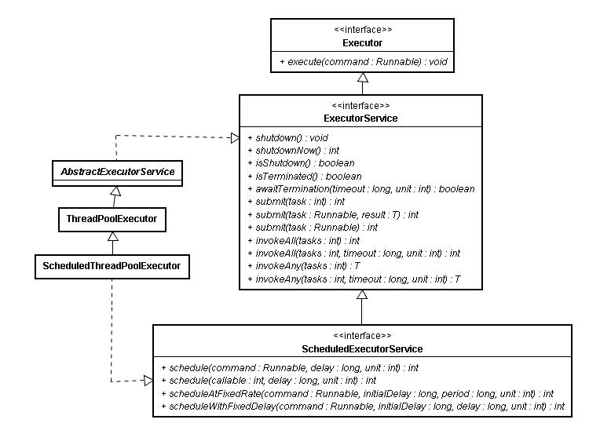
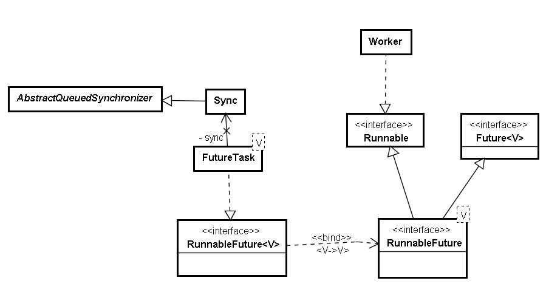
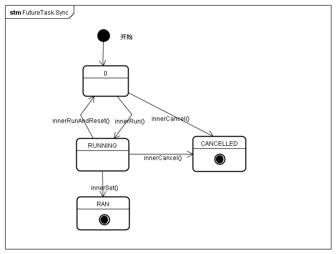

<!--
 * @Github       : https://github.com/superzhc/BigData-A-Question
 * @Author       : SUPERZHC
 * @CreateDate   : 2020-06-10 23:56:52
 * @LastEditTime : 2020-12-24 17:36:07
 * @Copyright 2020 SUPERZHC
-->
# Executor 框架

1.5 后引入的 Executor 框架的最大优点是把任务的提交和执行解耦。要执行任务的人只需把 Task 描述清楚，然后提交即可。这个 Task 是怎么被执行的，被谁执行的，什么时候执行的，提交的人就不用关心了。具体点讲，提交一个 Callable 对象给 ExecutorService（如最常用的线程池 ThreadPoolExecutor），将得到一个 Future 对象，调用 Future 对象的 get 方法等待执行结果就好了。经过这样的封装，对于使用者来说，提交任务获取结果的过程大大简化，调用者直接从提交的地方就可以等待获取执行结果。

## 简单示例

```java
// 一个有 7 个作业线程的线程池，老大的老大找到一个管 7 个人的小团队的老大
ExecutorService laodaA = Executors.newFixedThreadPool(7);
// 提交作业给老大，作业内容封装在 Callable 中，约定好了输出的类型是 String。
String outputs = laoda.submit(
            new Callable<String>() {
                public String call() throws Exception 
                {			                
                    return "I am a task, which submited by the so called laoda, and run by those anonymous workers";
                }
                // 提交后就等着结果吧，到底是手下 7 个作业中谁领到任务了，老大是不关心的。
            }).get();

System.out.println(outputs);
```

## 代码剖析

### 1、任务提交



从类图上可以看到，接口 ExecutorService 继承自 Executor。不像 Executor 中只定义了一个方法来执行任务，在 ExecutorService 中，正如其名字暗示的一样，定义了一个服务，定义了完整的线程池的行为，可以接受提交任务、执行任务、关闭服务。抽象类 AbstractExecutorService 类实现了 ExecutorService 接口，也实现了接口定义的默认行为。

AbstractExecutorService 任务提交的 submit 方法有三个实现。第一个接收一个 Runnable 的 Task，没有执行结果；第二个是两个参数：一个任务，一个执行结果；第三个一个 Callable，本身就包含执任务内容和执行结果。 submit 方法的返回结果是 Future 类型，调用该接口定义的 get 方法即可获得执行结果。 **`V get()` 方法的返回值类型 V 是在提交任务时就约定好了的。**

除了 submit 任务的方法外，作为对服务的管理，在 ExecutorService 接口中还定义了服务的关闭方法 shutdown 和 shutdownNow 方法，可以平缓或者立即关闭执行服务，实现该方法的子类根据自身特征支持该定义。在 ThreadPoolExecutor 中，维护了 RUNNING、SHUTDOWN、STOP、TERMINATED 四种状态来实现对线程池的管理。

通过查看 AbstractExecutorService 中代码提交部分，构造好一个 FutureTask 对象后，调用 `execute()` 方法执行任务。这个方法是顶级接口 Executor 中定义的最重要的方法。FutureTask 类型实现了 Runnable 接口，因此满足 Executor 中 `execute()` 方法的约定。同时比较有意思的是，该对象在 execute 执行后，就又作为 submit 方法的返回值返回，因为 FutureTask 同时又实现了 Future 接口，满足 Future 接口的约定。

```java
public <T> Future<T> submit(Callable<T> task) {
    if (task == null) throw new NullPointerException();
    RunnableFuture<T> ftask = newTaskFor(task);
    execute(ftask);
    return ftask;
}
```

submit 传入的参数都被封装成了 FutureTask 类型来 execute 的，对应前面三个不同的参数类型都会封装成 FutureTask。

```java
protected <T> RunnableFuture<T> newTaskFor(Callable<T> callable) {
    return new FutureTask<T>(callable);
}
```

Executor 接口中定义的 execute 方法的作用就是执行提交的任务，该方法在抽象类 AbstractExecutorService 中没有实现，留到子类中实现。我们观察下子类 ThreadPoolExecutor，使用最广泛的线程池如何来 execute 那些 submit 的任务的。这个方法看着比较简单，但是线程池什么时候创建新的作业线程来处理任务，什么时候只接收任务不创建作业线程，另外什么时候拒绝任务。线程池的接收任务、维护工作线程的策略都要在其中体现。

作为必要的预备知识，先补充下 ThreadPoolExecutor 有两个最重要的集合属性，分别是存储接收任务的任务队列和用来干活的作业集合。

```java 
// 任务队列
private final BlockingQueue<Runnable> workQueue;
// 作业线程集合
private final HashSet<Worker> workers = new HashSet<Worker>();
```

其中阻塞队列 workQueue 是来存储待执行的任务的，在构造线程池时可以选择满足该 BlockingQueue 接口定义的 SynchronousQueue、LinkedBlockingQueue 或者 DelayedWorkQueue 等不同阻塞队列来实现不同特征的线程池。

关注下 `execute(Runnable command)` 方法中调用到的 `addIfUnderCorePoolSize`，`workQueue.offer(command)` ， `ensureQueuedTaskHandled(command)`，`addIfUnderMaximumPoolSize(command)` 这几个操作。

因为前面说到的几个方法在里面即是操作，又返回一个布尔值，影响后面的逻辑，所以不大方便在方法体中为每条语句加注释来说明，需要大致关联起来看。所以首先需要把 execute 方法的主要逻辑说明下，再看其中各自方法的作用。

- 如果线程池的状态是 RUNNING，线程池的大小小于配置的核心线程数，说明还可以创建新线程，则启动新的线程执行这个任务。
- 如果线程池的状态是 RUNNING ，线程池的大小小于配置的最大线程数，并且任务队列已经满了，说明现有线程已经不能支持当前的任务了，并且线程池还有继续扩充的空间，就可以创建一个新的线程来处理提交的任务。
- 如果线程池的状态是 RUNNING，当前线程池的大小大于等于配置的核心线程数，说明根据配置当前的线程数已经够用，不用创建新线程，只需把任务加入任务队列即可。如果任务队列不满，则提交的任务在任务队列中等待处理；如果任务队列满了则需要考虑是否要扩展线程池的容量。
- 当线程池已经关闭或者上面的条件都不能满足时，则进行拒绝策略，拒绝策略在 RejectedExecutionHandler 接口中定义，可以有多种不同的实现。

上面其实也是对最主要思路的解析，详细展开可能还会更复杂。简单梳理下思路：构建线程池时定义了一个额定大小，当线程池内工作线程数小于额定大小，有新任务进来就创建新工作线程，如果超过该阈值，则一般就不创建了，只是把接收任务加到任务队列里面。但是如果任务队列里的任务实在太多了，那还是要申请额外的工作线程来帮忙。如果还是不够用就拒绝服务。这个场景其实也是每天我们工作中会碰到的场景。我们管人的老大，手里都有一定 HC（Head Count），当上面老大有活分下来，手里人不够，但是不超过 HC，我们就自己招人；如果超过了还是忙不过来，那就向上门老大申请借调人手来帮忙；如果还是干不完，那就没办法了，新任务咱就不接了。

```java 
public void execute(Runnable command) {
    if (command == null)
        throw new NullPointerException();
    if (poolSize >= corePoolSize || !addIfUnderCorePoolSize(command)) {
        if (runState == RUNNING && workQueue.offer(command)) {
            if (runState != RUNNING || poolSize == 0)
                ensureQueuedTaskHandled(command);
        }
        else if (!addIfUnderMaximumPoolSize(command))
            reject(command); // is shutdown or saturated
    }
}
```

addIfUnderCorePoolSize 方法检查如果当前线程池的大小小于配置的核心线程数，说明还可以创建新线程，则启动新的线程执行这个任务。

```java 
private boolean addIfUnderCorePoolSize(Runnable firstTask) {
    Thread t = null;
    // 如果当前线程池的大小小于配置的核心线程数，说明还可以创建新线程
        if (poolSize < corePoolSize && runState == RUNNING)
    // 则启动新的线程执行这个任务
            t = addThread(firstTask);        
    return t != null;
}
```

和上一个方法类似，addIfUnderMaximumPoolSize 检查如果线程池的大小小于配置的最大线程数，并且任务队列已经满了（就是 execute 方法试图把当前线程加入任务队列时不成功），说明现有线程已经不能支持当前的任务了，但线程池还有继续扩充的空间，就可以创建一个新的线程来处理提交的任务。

```java
private boolean addIfUnderMaximumPoolSize(Runnable firstTask) {
    // 如果线程池的大小小于配置的最大线程数，并且任务队列已经满了（就是 execute 方法中试图把当前线程加入任务队列 workQueue.offer(command) 时候不成功）, 说明现有线程已经不能支持当前的任务了，但线程池还有继续扩充的空间       
    if (poolSize < maximumPoolSize && runState == RUNNING)
    // 就可以创建一个新的线程来处理提交的任务
    t = addThread(firstTask);           
    return t != null;
}
```

在 ensureQueuedTaskHandled 方法中，判断如果当前状态不是 RUNING，则当前任务不加入到任务队列中，判断如果状态是停止，线程数小于允许的最大数，且任务队列还不空，则加入一个新的工作线程到线程池来帮助处理还未处理完的任务。

```java
private void ensureQueuedTaskHandled(Runnable command) {
    //  如果当前状态不是 RUNING，则当前任务不加入到任务队列中，判断如果状态是停止，线程数小于允许的最大数，且任务队列还不空
    if (state < STOP &&
            poolSize < Math.max(corePoolSize, 1) &&
            !workQueue.isEmpty())
        // 则加入一个新的工作线程到线程池来帮助处理还未处理完的任务
        t = addThread(null);
    if (reject)
        reject(command);
}
```

在前面方法中都会调用 adThread 方法创建一个工作线程，差别是创建的有些工作线程上面关联接收到的任务 firstTask，有些没有。该方法为当前接收到的任务 firstTask 创建 Worker，并将 Worker 添加到作业集合 HashSet workers 中，并启动作业。

```java 
private Thread addThread(Runnable firstTask) {
    // 为当前接收到的任务 firstTask 创建 Worker
    Worker w = new Worker(firstTask);
    Thread t = threadFactory.newThread(w);
    w.thread = t;
    // 将 Worker 添加到作业集合 HashSet<Worker> workers 中，并启动作业
    workers.add(w);
    t.start();
    return t;
}
```

至此，任务提交过程简单描述完毕，并介绍了任务提交后 ExecutorService 框架下线程池的主要应对逻辑，其实就是接收任务，根据需要创建或者维护管理线程。

### 2、任务执行

ThreadPoolExecutor 主要属性中有一个 HashSet workers 的集合，这个集合存储的就是线程池的工作队列的集合，队列的对象是 Worker 类型的工作线程，是 ThreadPoolExecutor 的一个内部类，实现了 Runnable 接口：

```java
private final class Worker implements Runnable

// Worker线程的run方法执行逻辑
public void run() {
    runWorker(this);
}

public void runWorker() {
    try {
        Runnable task = firstTask;
        // 循环从线程池的任务队列获取任务
        while (task != null || (task = getTask()) != null) {
        // 执行任务
            runTask(task);
            task = null;
        }
    } finally {
        workerDone(this);
    }
}
```

- getTask 方法是 ThreadPoolExecutor 提供给其内部类 Worker 的的方法。作用就是一个，从任务队列中取任务，源源不断地输出任务。

```java 
Runnable getTask() {
    for (;;) {
        // 从任务队列的头部取任务
        r = workQueue.take();
        return r;
    }
}
```

- `runTask(Runnable task)` 是工作线程 Worker 真正处理拿到的每个具体任务。

```java
private void runTask(Runnable task) {          
    // 调用任务的 run 方法，即在 Worker 线程中执行 Task 内定义内容。
    task.run();
}
```

需要注意的地方出现了，调用的其实是 task 的 run 方法。看下 FutureTask 的 run 方法做了什么事情。

这里插入一个 FutureTask 的类图。可以看到 FutureTask 实现了 RunnableFuture 接口，所以 FutureTask 即有 Runnable 接口的 run 方法来定义任务内容，也有 Future 接口中定义的 get、cancel 等方法来控制任务执行和获取执行结果。Runnable 接口自不用说，Future 接口的伟大设计，就是使得实现该接口的对象可以阻塞线程直到任务执行完毕，也可以取消任务执行，检测任务是执行完毕还是被取消了。想想在之前我们使用 Thread.join() 或者 Thread.join(long millis) 等待任务结束是多么苦涩啊。

FutureTask 内部定义了一个 Sync 的内部类，继承自 AQS，来维护任务状态。关于 AQS 的设计思路，可以参照参考 Doug Lea 大师的原著[ *The java*.*util*.*concurrent Synchronizer Framework*](http://gee.cs.oswego.edu/dl/papers/aqs.pdf)。



和其他的同步工具类一样，FutureTask 的主要工作内容也是委托给其定义的内部类 Sync 来完成。

```java 
public void run() {
    // 调用 Sync 的对应方法
    sync.innerRun();
}
```

`FutureTask.Sync.innerRun()`，这样做的目的就是为了维护任务执行的状态，只有当执行完后才能够获得任务执行结果。在该方法中，首先设置执行状态为 RUNNING 只有判断任务的状态是运行状态，才调用任务内封装的回调，并且在执行完成后设置回调的返回值到 FutureTask 的 result 变量上。在 FutureTask 中，innerRun 等每个“写”方法都会首先修改状态位，在后续会看到 innerGet 等“读”方法会先判断状态，然后才能决定后续的操作是否可以继续。下图是 FutureTask.Sync 中几个重要状态的流转情况，和其他的同步工具类一样，状态位使用的也是父类 AQS 的 state 属性。



```java 
void innerRun() {
    // 通过对 AQS 的状态位 state 的判断来判断任务的状态是运行状态，则调用任务内封装的回调，并且设置回调的返回值
    if (getState() == RUNNING) 
        innerSet(callable.call());   
}

void innerSet(V v) {
    for (;;) {
        int s = getState();
        // 设置运行状态为完成，并且把回调额执行结果设置给 result 变量
        if (compareAndSetState(s, RAN)) {
            result = v;
            releaseShared(0);
            done();
        return;
        }
    }
}
```

至此工作线程执行 Task 就结束了。提交的任务是由 Worker 工作线程执行，正是在该线程上调用 Task 中定义的任务内容，即封装的 Callable 回调，并设置执行结果。下面就是最重要的部分：调用者如何获取执行的结果。让你加班那么久，总得把成果交出来吧。老大在等，因为老大的老大在等！

### 3、 获取执行结果

获取执行结果这个过程只需调用 FutureTask 的 `get()` 方法即可。该方法是在 Future 接口中就定义的。get 方法的作用就是等待执行结果。（Waits if necessary for the computation to complete, and then retrieves its result.）Future 这个接口命名得真好，虽然是在未来，但是定义有一个 `get()` 方法，总是“可以掌控的未来，总是有收获的未来！”实现该接口的 FutureTask 也应该是这个意思，在未来要完成的任务，但是一样要有结果哦。

FutureTask 的 get 方法同样委托给 Sync 来执行。和该方法类似，还有一个 `V get(long timeout, TimeUnit unit)`，可以配置超时时间。

```java
public V get() throws InterruptedException, ExecutionException {
    return sync.innerGet();
}
```

在 Sync 的 innerGet 方法中，调用 AQS 父类定义的获取共享锁的方法 acquireSharedInterruptibly 来等待执行完成。如果执行完成了则可以继续执行后面的代码，返回 result 结果，否则如果还未完成，则阻塞线程等待执行完成。[ [bd2\] ](https://www.infoq.cn/article/executor-framework-thread-pool-task-execution-part-02?utm_source=related_read&utm_medium=article#_msocom_2)再大的老大要想获得结果也得等老子干完了才行！可以看到调用 FutureTask 的 get 方法，进而调用到该方法的一定是想要执行结果的线程，一般应该就是提交 Task 的线程，而这个任务的执行是在 Worker 的工作线程上，通过 AQS 来保证执行完毕才能获取执行结果。该方法中 acquireSharedInterruptibly 是 AQS 父类中定义的获取共享锁的方法，但是到底满足什么条件可以成功获取共享锁，这是 Sync 的 tryAcquireShared 方法内定义的。[ [bd3\] ](https://www.infoq.cn/article/executor-framework-thread-pool-task-execution-part-02?utm_source=related_read&utm_medium=article#_msocom_3)具体说来，innerIsDone 用来判断是否执行完毕，如果执行完毕则向下执行，返回 result 即可；如果判断未完成，则调用 AQS 的 doAcquireSharedInterruptibly 来挂起当前线程，一直到满足条件。这种思路在其他的几种同步工具类[ Semaphore ](http://docs.oracle.com/javase/7/docs/api/java/util/concurrent/Semaphore.html)、[ CountDownLatch ](http://docs.oracle.com/javase/7/docs/api/java/util/concurrent/CountDownLatch.html)、[ ReentrantLock ](http://docs.oracle.com/javase/7/docs/api/java/util/concurrent/locks/ReentrantLock.html)、[ ReentrantReadWriteLock ](http://docs.oracle.com/javase/7/docs/api/java/util/concurrent/locks/ReentrantReadWriteLock.html)也广泛使用。借助 AQS 框架，在获取锁时，先判断当前状态是否允许获取锁，若是允许则获取锁，否则获取不成功。获取不成功则会阻塞，进入阻塞队列。而释放锁时，一般会修改状态位，唤醒队列中的阻塞线程。每个同步工具类的自定义同步器都继承自 AQS 父类，是否可以获取锁根据同步类自身的功能要求覆盖 AQS 对应的 try 前缀方法，这些方法在 AQS 父类中都是只有定义没有内容。可以参照《[源码剖析 AQS 在几个同步工具类中的使用](http://www.idouba.net/sync-implementation-by-aqs/)》来详细了解。

```java
V innerGet() throws InterruptedException, ExecutionException {
    // 获得锁，表示执行完毕，才能获得后执行结果，否则阻塞等待执行完成再获取执行结果
    acquireSharedInterruptibly(0);
    return result;
}

protected int tryAcquireShared(int ignore) {
    return innerIsDone()? 1 : -1;
}
```

## Executor 的生命周期

由于 Executor 以异步的方式来执行任务，因此在任何时刻，之前提交任务的状态不是立即可见的。有些任务可能已经完成，有些可能正在运行，而其他任务可能在队列中等待执行。

为了解决执行服务的生命周期问题，Executor 扩展了 ExecutorService 接口，添加了一些用于生命周期管理的方法（同时还有一些用于任务提交的便利方法）。

ExecutorService 的生命周期有 3 种状态：运行、关闭和已终止。ExecutorService 在初始创建时处于运行状态。shutdown 方法将执行平缓的关闭过程：不再接受新的任务，同时等待已经提交的任务执行完成——包括那些还未开始执行的任务。shutdownNow 方法将执行粗暴的关闭过程：它将尝试取消所有运行中的任务，并且不再启动队列中尚未开始执行的任务。