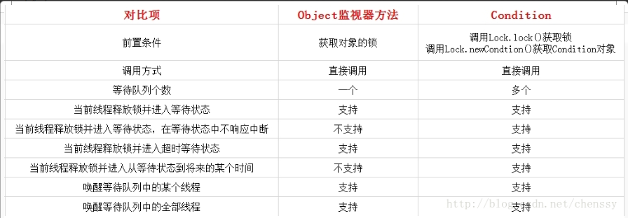

# Condition

在没有Lock之前，我们使用synchronized来控制同步，配合Object的wait()、notify()系列方法可以实现等待/通知模式。在Java SE5后，Java提供了Lock接口，相对于Synchronized而言，Lock提供了条件Condition，对线程的等待、唤醒操作更加详细和灵活。下图是Condition与Object的监视器方法的对比:


Condition提供了一系列的方法来对阻塞和唤醒线程：

- **await()**：造成当前线程在接到信号或被中断之前一直处于等待状态。
- **await(long time, TimeUnit unit)**：造成当前线程在接到信号、被中断或到达指定等待时间之前一直处于等待状态。
- **awaitNanos(long nanosTimeout)**：造成当前线程在接到信号、被中断或到达指定等待时间之前一直处于等待状态。返回值表示剩余时间，如果在nanosTimesout之前唤醒，那么返回值 = nanosTimeout – 消耗时间，如果返回值 <= 0 ,则可以认定它已经超时了。
- **awaitUninterruptibly()**：造成当前线程在接到信号之前一直处于等待状态。【注意：该方法对中断不敏感】。
- **awaitUntil(Date deadline)**：造成当前线程在接到信号、被中断或到达指定最后期限之前一直处于等待状态。如果没有到指定时间就被通知，则返回true，否则表示到了指定时间，返回返回false。
- **signal()**：唤醒一个等待线程。该线程从等待方法返回前必须获得与Condition相关的锁。
- **signal()All**：唤醒所有等待线程。能够从等待方法返回的线程必须获得与Condition相关的锁。

Condition是一种广义上的条件队列。他为线程提供了一种更为灵活的等待/通知模式，线程在调用await方法后执行挂起操作，直到线程等待的某个条件为真时才会被唤醒。Condition必须要配合锁一起使用，因为对共享状态变量的访问发生在多线程环境下。一个Condition的实例必须与一个Lock绑定，因此Condition一般都是作为Lock的内部实现。

## Condtion的实现

获取一个Condition必须要通过Lock的newCondition()方法。该方法定义在接口Lock下面，返回的结果是绑定到此 Lock 实例的新 Condition 实例。Condition为一个接口，其下仅有一个实现类ConditionObject，由于Condition的操作需要获取相关的锁，而AQS则是同步锁的实现基础，所以ConditionObject则定义为AQS的内部类。定义如下：

```java
public class ConditionObject implements Condition, java.io.Serializable {
}
```

- **等待队列**

每个Condition对象都包含着一个FIFO队列，该队列是Condition对象通知/等待功能的关键。在队列中每一个节点都包含着一个线程引用，该线程就是在该Condition对象上等待的线程。我们看Condition的定义就明白了：

```java
public class ConditionObject implements Condition, java.io.Serializable {
    private static final long serialVersionUID = 1173984872572414699L;

    //头节点
    private transient Node firstWaiter;
    //尾节点
    private transient Node lastWaiter;

    public ConditionObject() {
    }

    /** 省略方法 **/
}
```

从上面代码可以看出Condition拥有首节点（firstWaiter），尾节点（lastWaiter）。当前线程调用await()方法，将会以当前线程构造成一个节点（Node），并将节点加入到该队列的尾部。结构如下：


Node里面包含了当前线程的引用。Node定义与AQS的CLH同步队列的节点使用的都是同一个类（AbstractQueuedSynchronized.Node静态内部类）。

Condition的队列结构比CLH同步队列的结构简单些，新增过程较为简单只需要将原尾节点的nextWaiter指向新增节点，然后更新lastWaiter即可。

- **等待**

调用Condition的await()方法会使当前线程进入等待状态，同时会加入到Condition等待队列同时释放锁。当从await()方法返回时，当前线程一定是获取了Condition相关连的锁。

```java
public final void await() throws InterruptedException {
    // 当前线程中断
    if (Thread.interrupted())
        throw new InterruptedException();
    //当前线程加入等待队列
    Node node = addConditionWaiter();
    //释放锁
    long savedState = fullyRelease(node);
    int interruptMode = 0;
    /**
        * 检测此节点的线程是否在同步队上，如果不在，则说明该线程还不具备竞争锁的资格，则继续等待
        * 直到检测到此节点在同步队列上
        */
    while (!isOnSyncQueue(node)) {
        //线程挂起
        LockSupport.park(this);
        //如果已经中断了，则退出
        if ((interruptMode = checkInterruptWhileWaiting(node)) != 0)
            break;
    }
    //竞争同步状态
    if (acquireQueued(node, savedState) && interruptMode != THROW_IE)
        interruptMode = REINTERRUPT;
    //清理下条件队列中的不是在等待条件的节点
    if (node.nextWaiter != null) // clean up if cancelled
        unlinkCancelledWaiters();
    if (interruptMode != 0)
        reportInterruptAfterWait(interruptMode);
}
```

此段代码的逻辑是：首先将当前线程新建一个节点同时加入到条件队列中，然后释放当前线程持有的同步状态。然后则是不断检测该节点代表的线程释放出现在CLH同步队列中（收到signal信号之后就会在AQS队列中检测到），如果不存在则一直挂起，否则参与竞争同步状态。

加入条件队列（addConditionWaiter()）源码如下：

```java
private Node addConditionWaiter() {
    Node t = lastWaiter;    //尾节点
    //Node的节点状态如果不为CONDITION，则表示该节点不处于等待状态，需要清除节点
    if (t != null && t.waitStatus != Node.CONDITION) {
        //清除条件队列中所有状态不为Condition的节点
        unlinkCancelledWaiters();
        t = lastWaiter;
    }
    //当前线程新建节点，状态CONDITION
    Node node = new Node(Thread.currentThread(), Node.CONDITION);
    /**
        * 将该节点加入到条件队列中最后一个位置
        */
    if (t == null)
        firstWaiter = node;
    else
        t.nextWaiter = node;
    lastWaiter = node;
    return node;
}
```

该方法主要是将当前线程加入到Condition条件队列中。当然在加入到尾节点之前会清楚所有状态不为Condition的节点。

fullyRelease(Node node)，负责释放该线程持有的锁。

```java
final long fullyRelease(Node node) {
    boolean failed = true;
    try {
        //节点状态--其实就是持有锁的数量
        long savedState = getState();
        //释放锁
        if (release(savedState)) {
            failed = false;
            return savedState;
        } else {
            throw new IllegalMonitorStateException();
        }
    } finally {
        if (failed)
            node.waitStatus = Node.CANCELLED;
    }
}
```

isOnSyncQueue(Node node)：如果一个节点刚开始在条件队列上，现在在同步队列上获取锁则返回true

```java
final boolean isOnSyncQueue(Node node) {
    //状态为Condition，获取前驱节点为null，返回false
    if (node.waitStatus == Node.CONDITION || node.prev == null)
        return false;
    //后继节点不为null，肯定在CLH同步队列中
    if (node.next != null)
        return true;

    return findNodeFromTail(node);
}
```

unlinkCancelledWaiters()：负责将条件队列中状态不为Condition的节点删除

```java
private void unlinkCancelledWaiters() {
    Node t = firstWaiter;
    Node trail = null;
    while (t != null) {
        Node next = t.nextWaiter;
        if (t.waitStatus != Node.CONDITION) {
            t.nextWaiter = null;
            if (trail == null)
                firstWaiter = next;
            else
                trail.nextWaiter = next;
            if (next == null)
                lastWaiter = trail;
        }
        else
            trail = t;
        t = next;
    }
}
```

- **通知**

调用Condition的signal()方法，将会唤醒在等待队列中等待最长时间的节点（条件队列里的首节点），在唤醒节点前，会将节点移到CLH同步队列中。

```java
public final void signal() {
    //检测当前线程是否为拥有锁的独
    if (!isHeldExclusively())
        throw new IllegalMonitorStateException();
    //头节点，唤醒条件队列中的第一个节点
    Node first = firstWaiter;
    if (first != null)
        doSignal(first);    //唤醒
}
```

该方法首先会判断当前线程是否已经获得了锁，这是前置条件。然后唤醒条件队列中的头节点。

doSignal(Node first)：唤醒头节点

```java
private void doSignal(Node first) {
    do {
        //修改头结点，完成旧头结点的移出工作
        if ( (firstWaiter = first.nextWaiter) == null)
            lastWaiter = null;
        first.nextWaiter = null;
    } while (!transferForSignal(first) &&
            (first = firstWaiter) != null);
}
```

doSignal(Node first)主要是做两件事：1.修改头节点，2.调用transferForSignal(Node first) 方法将节点移动到CLH同步队列中。transferForSignal(Node first)源码如下：

```java
final boolean transferForSignal(Node node) {
    //将该节点从状态CONDITION改变为初始状态0,
    if (!compareAndSetWaitStatus(node, Node.CONDITION, 0))
        return false;

    //将节点加入到syn队列中去，返回的是syn队列中node节点前面的一个节点
    Node p = enq(node);
    int ws = p.waitStatus;
    //如果结点p的状态为cancel 或者修改waitStatus失败，则直接唤醒
    if (ws > 0 || !compareAndSetWaitStatus(p, ws, Node.SIGNAL))
        LockSupport.unpark(node.thread);
    return true;
}
```

整个通知的流程如下：
1. 判断当前线程是否已经获取了锁，如果没有获取则直接抛出异常，因为获取锁为通知的前置条件。
2. 如果线程已经获取了锁，则将唤醒条件队列的首节点
3. 唤醒首节点是先将条件队列中的头节点移出，然后调用AQS的enq(Node node)方法将其安全地移到CLH同步队列中
4. 最后判断如果该节点的同步状态是否为Cancel，或者修改状态为Signal失败时，则直接调用LockSupport唤醒该节点的线程。

- **总结**

一个线程获取锁后，通过调用Condition的await()方法，会将当前线程先加入到条件队列中，然后释放锁，最后通过isOnSyncQueue(Node node)方法不断自检看节点是否已经在CLH同步队列了，如果是则尝试获取锁，否则一直挂起。当线程调用signal()方法后，程序首先检查当前线程是否获取了锁，然后通过doSignal(Node first)方法唤醒CLH同步队列的首节点。被唤醒的线程，将从await()方法中的while循环中退出来，然后调用acquireQueued()方法竞争同步状态。

## Condition的应用

只知道原理，如果不知道使用那就坑爹了，下面是用Condition实现的生产者消费者问题：

```java
public class ConditionTest {
    private LinkedList<String> buffer;    //容器
    private int maxSize ;           //容器最大
    private Lock lock;
    private Condition fullCondition;
    private Condition notFullCondition;

    ConditionTest(int maxSize){
        this.maxSize = maxSize;
        buffer = new LinkedList<String>();
        lock = new ReentrantLock();
        fullCondition = lock.newCondition();
        notFullCondition = lock.newCondition();
    }

    public void set(String string) throws InterruptedException {
        lock.lock();    //获取锁
        try {
            while (maxSize == buffer.size()){
                notFullCondition.await();       //满了，添加的线程进入等待状态
            }

            buffer.add(string);
            fullCondition.signal();
        } finally {
            lock.unlock();      //记得释放锁
        }
    }

    public String get() throws InterruptedException {
        String string;
        lock.lock();
        try {
            while (buffer.size() == 0){
                fullCondition.await();
            }
            string = buffer.poll();
            notFullCondition.signal();
        } finally {
            lock.unlock();
        }
        return string;
    }
}
```