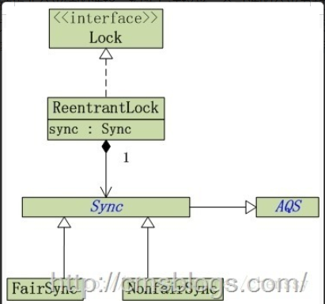

# ReentrantLock

ReentrantLock，可重入锁，是一种递归无阻塞的同步机制。它可以等同于synchronized的使用，但是ReentrantLock提供了比synchronized更强大、灵活的锁机制，可以减少锁发生的概率。

API介绍如下：

> 一个可重入的互斥锁定 Lock，它具有与使用 synchronized 方法和语句所访问的隐式监视器锁定相同的一些基本行为和语义，但功能更强大。ReentrantLock 将由最近成功获得锁定，并且还没有释放该锁定的线程所拥有。当锁定没有被另一个线程所拥有时，调用 lock 的线程将成功获取该锁定并返回。如果当前线程已经拥有该锁定，此方法将立即返回。可以使用 isHeldByCurrentThread() 和 getHoldCount() 方法来检查此情况是否发生。

ReentrantLock还提供了公平锁也非公平锁的选择，构造方法接受一个可选的公平参数（默认非公平锁），当设置为true时，表示公平锁，否则为非公平锁。公平锁与非公平锁的区别在于公平锁的锁获取是有顺序的。但是公平锁的效率往往没有非公平锁的效率高，在许多线程访问的情况下，公平锁表现出较低的吞吐量。



## 获取锁

我们一般都是这么使用ReentrantLock获取锁的：

```java
//非公平锁
ReentrantLock lock = new ReentrantLock();
lock.lock();

public void lock() {
    sync.lock();
}
```

Sync为ReentrantLock里面的一个内部类，它继承AQS（AbstractQueuedSynchronizer），它有两个子类：公平锁FairSync和非公平锁NonfairSync。

ReentrantLock里面大部分的功能都是委托给Sync来实现的，同时Sync内部定义了lock()抽象方法由其子类去实现，默认实现了nonfairTryAcquire(int acquires)方法，可以看出它是非公平锁的默认实现方式。下面我们看非公平锁的lock()方法：

```java
final void lock() {
    //尝试获取锁
    if (compareAndSetState(0, 1))
        setExclusiveOwnerThread(Thread.currentThread());
    else
        //获取失败，调用AQS的acquire(int arg)方法
        acquire(1);
}
```

首先会第一次尝试快速获取锁，如果获取失败，则调用acquire(int arg)方法，该方法定义在AQS中，如下：

```java
public final void acquire(int arg) {
    if (!tryAcquire(arg) &&
            acquireQueued(addWaiter(Node.EXCLUSIVE), arg))
        selfInterrupt();
}
```

这个方法首先调用tryAcquire(int arg)方法，在AQS中讲述过，tryAcquire(int arg)需要自定义同步组件提供实现，非公平锁实现如下：

```java
protected final boolean tryAcquire(int acquires) {
    return nonfairTryAcquire(acquires);
}

final boolean nonfairTryAcquire(int acquires) {
    //当前线程
    final Thread current = Thread.currentThread();
    //获取同步状态
    int c = getState();
    //state == 0,表示没有该锁处于空闲状态
    if (c == 0) {
        //获取锁成功，设置为当前线程所有
        if (compareAndSetState(0, acquires)) {
            setExclusiveOwnerThread(current);
            return true;
        }
    }
    //线程重入
    //判断锁持有的线程是否为当前线程
    else if (current == getExclusiveOwnerThread()) {
        int nextc = c + acquires;
        if (nextc < 0) // overflow
            throw new Error("Maximum lock count exceeded");
        setState(nextc);
        return true;
    }
    return false;
}
```

该方法主要逻辑：首先判断同步状态state == 0 ?，如果是表示该锁还没有被线程持有，直接通过CAS获取同步状态，如果成功返回true。如果state != 0，则判断当前线程是否为获取锁的线程，如果是则获取锁，成功返回true。成功获取锁的线程再次获取锁，这是增加了同步状态state。

## 释放锁

获取同步锁后，使用完毕则需要释放锁，ReentrantLock提供了unlock释放锁：

```java
public void unlock() {
    sync.release(1);
}
```

unlock内部使用Sync的release(int arg)释放锁，release(int arg)是在AQS中定义的：

```java
public final boolean release(int arg) {
    if (tryRelease(arg)) {
        Node h = head;
        if (h != null && h.waitStatus != 0)
            unparkSuccessor(h);
        return true;
    }
    return false;
}
```

与获取同步状态的acquire(int arg)方法相似，释放同步状态的tryRelease(int arg)同样是需要自定义同步组件自己实现：

```java
protected final boolean tryRelease(int releases) {
    //减掉releases
    int c = getState() - releases;
    //如果释放的不是持有锁的线程，抛出异常
    if (Thread.currentThread() != getExclusiveOwnerThread())
        throw new IllegalMonitorStateException();
    boolean free = false;
    //state == 0 表示已经释放完全了，其他线程可以获取同步状态了
    if (c == 0) {
        free = true;
        setExclusiveOwnerThread(null);
    }
    setState(c);
    return free;
}
```

只有当同步状态彻底释放后该方法才会返回true。当state == 0 时，则将锁持有线程设置为null，free= true，表示释放成功。

## 公平锁与非公平锁

公平锁与非公平锁的区别在于获取锁的时候是否按照FIFO的顺序来。释放锁不存在公平性和非公平性，上面以非公平锁为例，下面我们来看看公平锁的tryAcquire(int arg)：

```java
protected final boolean tryAcquire(int acquires) {
    final Thread current = Thread.currentThread();
    int c = getState();
    if (c == 0) {
        if (!hasQueuedPredecessors() &&
                compareAndSetState(0, acquires)) {
            setExclusiveOwnerThread(current);
            return true;
        }
    }
    else if (current == getExclusiveOwnerThread()) {
        int nextc = c + acquires;
        if (nextc < 0)
            throw new Error("Maximum lock count exceeded");
        setState(nextc);
        return true;
    }
    return false;
}
```

比较非公平锁和公平锁获取同步状态的过程，会发现两者唯一的区别就在于公平锁在获取同步状态时多了一个限制条件：hasQueuedPredecessors()，定义如下：

```java
public final boolean hasQueuedPredecessors() {
    Node t = tail;  //尾节点
    Node h = head;  //头节点
    Node s;

    //头节点 != 尾节点
    //同步队列第一个节点不为null
    //当前线程是同步队列第一个节点
    return h != t &&
            ((s = h.next) == null || s.thread != Thread.currentThread());
}
```

该方法主要做一件事情：主要是判断当前线程是否位于CLH同步队列中的第一个。如果是则返回true，否则返回false。

## synchronized 和 ReentrantLock

**① 两者都是可重入锁**

两者都是可重入锁。“可重入锁”概念是：自己可以再次获取自己的内部锁。比如一个线程获得了某个对象的锁，此时这个对象锁还没有释放，当其再次想要获取这个对象的锁的时候还是可以获取的，如果不可锁重入的话，就会造成死锁。同一个线程每次获取锁，锁的计数器都自增1，所以要等到锁的计数器下降为0时才能释放锁。

**② synchronized 依赖于 JVM 而 ReenTrantLock 依赖于 API**

synchronized 是依赖于 JVM 实现的，前面我们也讲到了 虚拟机团队在 JDK1.6 为 synchronized 关键字进行了很多优化，但是这些优化都是在虚拟机层面实现的，并没有直接暴露给我们。ReenTrantLock 是 JDK 层面实现的（也就是 API 层面，需要 lock() 和 unlock 方法配合 try/finally 语句块来完成），所以我们可以通过查看它的源代码，来看它是如何实现的。

**③ ReenTrantLock 比 synchronized 增加了一些高级功能**

相比synchronized，ReenTrantLock增加了一些高级功能。主要来说主要有三点：**①等待可中断；②可实现公平锁；③可实现选择性通知（锁可以绑定多个条件）**

- **ReenTrantLock提供了一种能够中断等待锁的线程的机制**，通过lock.lockInterruptibly()来实现这个机制。也就是说正在等待的线程可以选择放弃等待，改为处理其他事情。
- **ReenTrantLock可以指定是公平锁还是非公平锁。而synchronized只能是非公平锁。所谓的公平锁就是先等待的线程先获得锁。** ReenTrantLock默认情况是非公平的，可以通过 ReenTrantLock类的`ReentrantLock(boolean fair)`构造方法来制定是否是公平的。
- synchronized关键字与wait()和notify/notifyAll()方法相结合可以实现等待/通知机制，ReentrantLock类当然也可以实现，但是需要借助于Condition接口与newCondition() 方法。Condition是JDK1.5之后才有的，它具有很好的灵活性，比如可以实现多路通知功能也就是在一个Lock对象中可以创建多个Condition实例（即对象监视器），**线程对象可以注册在指定的Condition中，从而可以有选择性的进行线程通知，在调度线程上更加灵活。 在使用notify/notifyAll()方法进行通知时，被通知的线程是由 JVM 选择的，用ReentrantLock类结合Condition实例可以实现“选择性通知”** ，这个功能非常重要，而且是Condition接口默认提供的。而synchronized关键字就相当于整个Lock对象中只有一个Condition实例，所有的线程都注册在它一个身上。如果执行notifyAll()方法的话就会通知所有处于等待状态的线程这样会造成很大的效率问题，而Condition实例的signalAll()方法 只会唤醒注册在该Condition实例中的所有等待线程。

如果你想使用上述功能，那么选择ReenTrantLock是一个不错的选择。

**④ 性能已不是选择标准**

在JDK1.6之前，synchronized 的性能是比 ReenTrantLock 差很多。具体表示为：synchronized 关键字吞吐量岁线程数的增加，下降得非常严重。而ReenTrantLock 基本保持一个比较稳定的水平。我觉得这也侧面反映了， synchronized 关键字还有非常大的优化余地。后续的技术发展也证明了这一点，我们上面也讲了在 JDK1.6 之后 JVM 团队对 synchronized 关键字做了很多优化。**JDK1.6 之后，synchronized 和 ReenTrantLock 的性能基本是持平了。所以网上那些说因为性能才选择 ReenTrantLock 的文章都是错的！JDK1.6之后，性能已经不是选择synchronized和ReenTrantLock的影响因素了！而且虚拟机在未来的性能改进中会更偏向于原生的synchronized，所以还是提倡在synchronized能满足你的需求的情况下，优先考虑使用synchronized关键字来进行同步！优化后的synchronized和ReenTrantLock一样，在很多地方都是用到了CAS操作**。