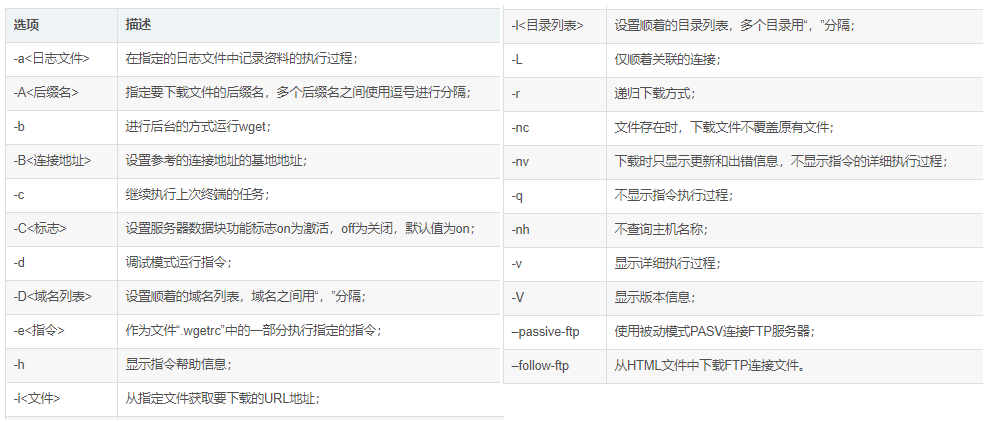

# HTTP 工具

## cUrl

## wget

wget 命令用来从指定的 URL 下载文件。wget 非常稳定，它在带宽很窄的情况下和不稳定网络中有很强的适应性，如果是由于网络的原因下载失败，wget 会不断的尝试，直到整个文件下载完毕。如果是服务器打断下载过程，它会再次联到服务器上从停止的地方继续下载。这对从那些限定了链接时间的服务器上下载大文件非常有用。

```bash
wget http://test.com/testfile.zip # 下载指定文件到当前文件夹
wget -O wordpress.zip http://test.com/download #指定保存名字
wget --limit-rate=300k http://www.linuxde.net/testfile.zip #限制下载速度
wget -c http://www.linuxde.net/testfile.zip #断点续传
wget -b http://www.linuxde.net/testfile.zip #后台下载

# 设置使用指定浏览器下载（伪装下载）
wget --user-agent="Mozilla/5.0 (Windows; U; Windows NT 6.1; en-US) AppleWebKit/534.16 (KHTML, like Gecko) Chrome/10.0.648.204 Safari/534.16" http://www.linuxde.net/testfile.zip

wget --spider url #测试下载
wget --tries=40 URL #设置重试次数为40
wget -i filelist.txt #从filelist.txt获取下载地址

# 镜像网站
# --miror开户镜像下载。
# -p下载所有为了html页面显示正常的文件。
# --convert-links下载后，转换成本地的链接。
# -P ./LOCAL保存所有文件和目录到本地指定目录
wget --mirror -p --convert-links -P ./LOCAL URL

wget --reject=gif ur #下载一个网站，但你不希望下载图片，可以使用这条命令
wget -o download.log URL #把下载信息存入日志文件
wget -Q5m -i filelist.txt #限制总下载文件大小
wget -r -A.pdf url #下载指定格式文件

# FTP下载
wget ftp-url
wget --ftp-user=USERNAME --ftp-password=PASSWORD url
```

